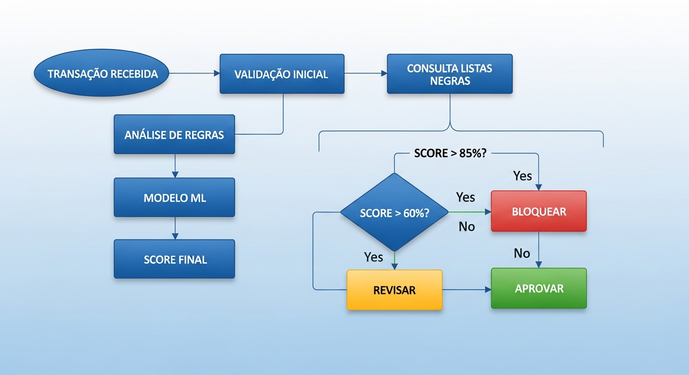
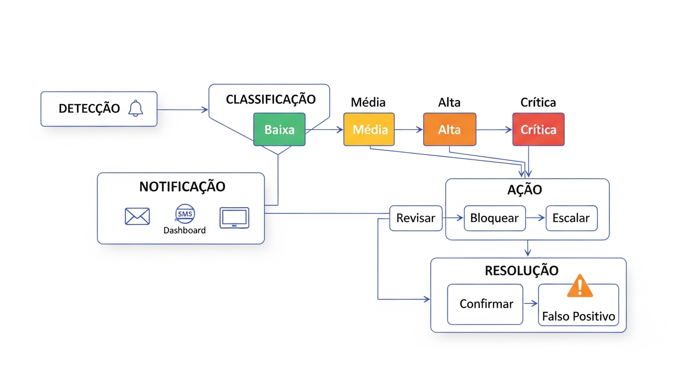
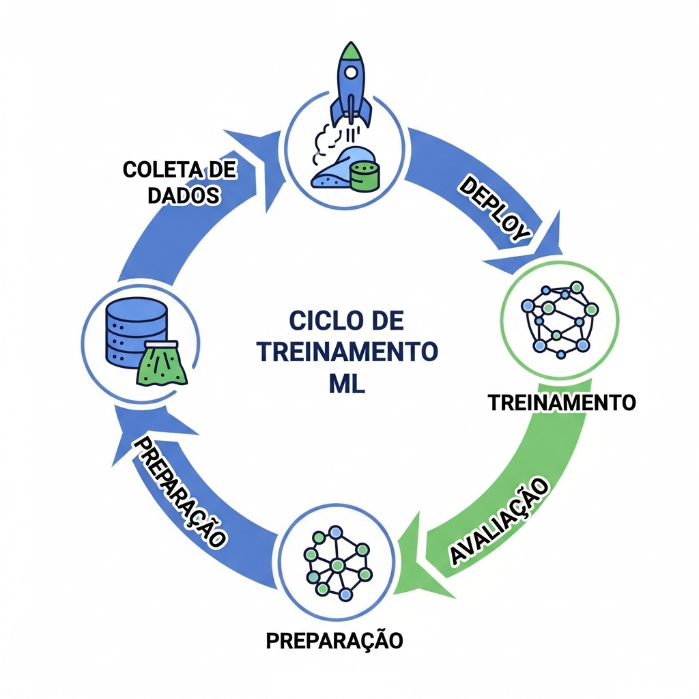
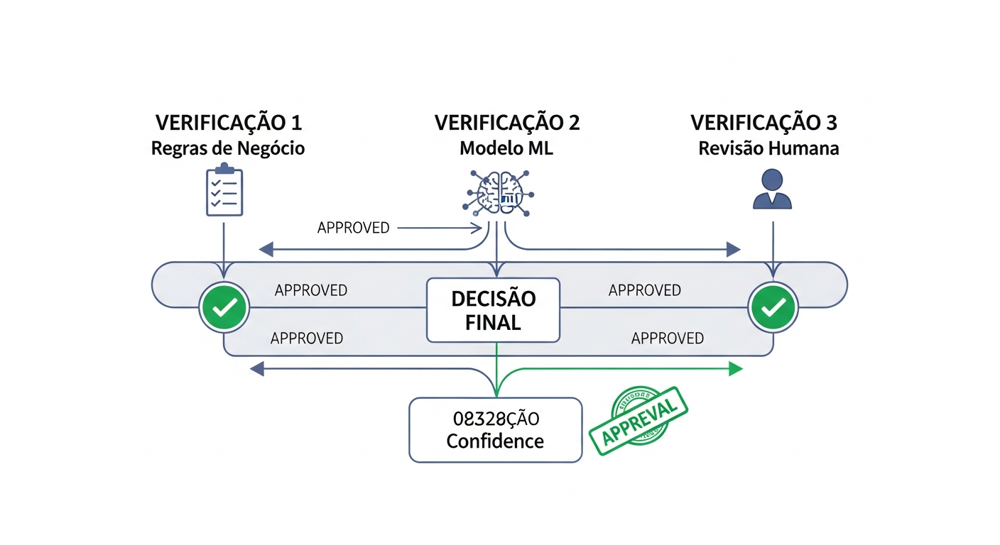

# Sankofa Enterprise Pro - Diagramas e Fluxogramas Completos



**Versao:** 12.0  
**Data:** Novembro 2025  
**Total de Diagramas:** 25+

---

## Indice de Diagramas

```
+==================================================================+
|                    MAPA DE DIAGRAMAS                              |
+==================================================================+
|                                                                   |
|  ARQUITETURA                                                      |
|  ├── 1. Arquitetura Geral do Sistema                             |
|  ├── 2. Diagrama de Componentes                                  |
|  └── 3. Arquitetura de Microservicos                             |
|                                                                   |
|  FLUXOS DE PROCESSO                                               |
|  ├── 4. Fluxo de Deteccao de Fraudes                            |
|  ├── 5. Pipeline de Machine Learning                             |
|  ├── 6. Fluxo de Decisao                                         |
|  └── 7. Fluxo de Revisao Manual                                  |
|                                                                   |
|  DADOS                                                            |
|  ├── 8. Modelo Entidade-Relacionamento                           |
|  ├── 9. Fluxo de Dados                                           |
|  └── 10. Feature Engineering                                      |
|                                                                   |
|  SEGURANCA                                                        |
|  ├── 11. Camadas de Seguranca                                    |
|  ├── 12. Fluxo de Autenticacao JWT                               |
|  └── 13. Compliance LGPD                                         |
|                                                                   |
|  OPERACOES                                                        |
|  ├── 14. Fluxo MLOps                                             |
|  ├── 15. Deploy Canary                                           |
|  └── 16. Monitoramento e Alertas                                 |
|                                                                   |
+==================================================================+
```

---

## 1. Diagrama de Arquitetura Geral


```
+==============================================================================+
|                        SANKOFA ENTERPRISE PRO v12.0                           |
|                        ARQUITETURA COMPLETA DO SISTEMA                        |
+==============================================================================+
|                                                                               |
|  ╔═══════════════════════════════════════════════════════════════════════╗   |
|  ║                          CAMADA DE CLIENTES                            ║   |
|  ╠═══════════════════════════════════════════════════════════════════════╣   |
|  ║                                                                        ║   |
|  ║   ┌──────────┐  ┌──────────┐  ┌──────────┐  ┌──────────┐             ║   |
|  ║   │  CORE    │  │  MOBILE  │  │   PIX    │  │  CARTOES │             ║   |
|  ║   │ BANKING  │  │   APP    │  │ GATEWAY  │  │ CRED/DEB │             ║   |
|  ║   │(TED/DOC) │  │(PIX/TED) │  │          │  │          │             ║   |
|  ║   │ ┌────┐   │  │ ┌────┐   │  │ ┌────┐   │  │ ┌────┐   │             ║   |
|  ║   │ │ 🏦 │   │  │ │ 📱 │   │  │ │ 💸 │   │  │ │ 💳 │   │             ║   |
|  ║   │ └────┘   │  │ └────┘   │  │ └────┘   │  │ └────┘   │             ║   |
|  ║   └────┬─────┘  └────┬─────┘  └────┬─────┘  └────┬─────┘             ║   |
|  ║        │             │             │             │                    ║   |
|  ╚════════│═════════════│═════════════│═════════════│════════════════════╝   |
|           │             │             │             │                        |
|           └─────────────┴──────┬──────┴─────────────┘                        |
|                                │                                              |
|                                ▼                                              |
|  ╔═══════════════════════════════════════════════════════════════════════╗   |
|  ║                          CAMADA DE ENTRADA                             ║   |
|  ╠═══════════════════════════════════════════════════════════════════════╣   |
|  ║                                                                        ║   |
|  ║   ┌───────────────────────────────────────────────────────────────┐   ║   |
|  ║   │                     LOAD BALANCER                              │   ║   |
|  ║   │                                                                 │   ║   |
|  ║   │  ┌─────────────┐  ┌─────────────┐  ┌─────────────┐            │   ║   |
|  ║   │  │     SSL     │  │   HEALTH    │  │   TRAFFIC   │            │   ║   |
|  ║   │  │ TERMINATION │  │   CHECKS    │  │DISTRIBUTION │            │   ║   |
|  ║   │  └─────────────┘  └─────────────┘  └─────────────┘            │   ║   |
|  ║   └────────────────────────────┬──────────────────────────────────┘   ║   |
|  ║                                │                                       ║   |
|  ╚════════════════════════════════│═══════════════════════════════════════╝   |
|                                   │                                           |
|                                   ▼                                           |
|  ╔═══════════════════════════════════════════════════════════════════════╗   |
|  ║                           CAMADA DE API                                ║   |
|  ╠═══════════════════════════════════════════════════════════════════════╣   |
|  ║                                                                        ║   |
|  ║   ┌──────────────┐  ┌──────────────┐  ┌──────────────┐               ║   |
|  ║   │ RATE LIMITER │  │   JWT AUTH   │  │ CORS HANDLER │               ║   |
|  ║   │              │  │              │  │              │               ║   |
|  ║   │  1000/min    │  │    HS256     │  │      *       │               ║   |
|  ║   └──────┬───────┘  └──────┬───────┘  └──────┬───────┘               ║   |
|  ║          └─────────────────┴─────────────────┘                        ║   |
|  ║                            │                                           ║   |
|  ║                 ┌──────────▼──────────┐                               ║   |
|  ║                 │     FLASK API       │                               ║   |
|  ║                 │    50+ ENDPOINTS    │                               ║   |
|  ║                 │                     │                               ║   |
|  ║                 │  /api/health        │                               ║   |
|  ║                 │  /api/fraud/*       │                               ║   |
|  ║                 │  /api/transactions  │                               ║   |
|  ║                 │  /api/observability │                               ║   |
|  ║                 └──────────┬──────────┘                               ║   |
|  ║                            │                                           ║   |
|  ╚════════════════════════════│═══════════════════════════════════════════╝   |
|                               │                                               |
|                               ▼                                               |
|  ╔═══════════════════════════════════════════════════════════════════════╗   |
|  ║                      CAMADA DE PROCESSAMENTO                           ║   |
|  ╠═══════════════════════════════════════════════════════════════════════╣   |
|  ║                                                                        ║   |
|  ║   ┌───────────────┐   ┌───────────────┐   ┌───────────────┐          ║   |
|  ║   │    FEATURE    │──▶│   ML ENGINE   │──▶│   DECISION    │          ║   |
|  ║   │    ENGINE     │   │   ENSEMBLE    │   │    ENGINE     │          ║   |
|  ║   │               │   │               │   │               │          ║   |
|  ║   │  47+ features │   │   RF+GB+LR    │   │ Rules+Score   │          ║   |
|  ║   └───────────────┘   └───────────────┘   └───────────────┘          ║   |
|  ║                               │                                        ║   |
|  ║                               ▼                                        ║   |
|  ║                 ┌─────────────────────────┐                           ║   |
|  ║                 │   EXPLAINABILITY        │                           ║   |
|  ║                 │       ENGINE            │                           ║   |
|  ║                 │                         │                           ║   |
|  ║                 │  SHAP + LGPD Compliant  │                           ║   |
|  ║                 └─────────────────────────┘                           ║   |
|  ║                                                                        ║   |
|  ╚═══════════════════════════════════════════════════════════════════════╝   |
|                               │                                               |
|         ┌─────────────────────┼─────────────────────┐                        |
|         │                     │                     │                        |
|         ▼                     ▼                     ▼                        |
|  ┌─────────────┐       ┌─────────────┐       ┌─────────────┐                |
|  │   MLOPS     │       │   STORAGE   │       │  EXTERNAL   │                |
|  ├─────────────┤       ├─────────────┤       ├─────────────┤                |
|  │ • A/B Test  │       │ • PostgreSQL│       │ • Prometheus│                |
|  │ • Canary    │       │ • Redis     │       │ • BACEN     │                |
|  │ • Drift     │       │ • Files     │       │ • Webhooks  │                |
|  └─────────────┘       └─────────────┘       └─────────────┘                |
|                                                                               |
|  ╔═══════════════════════════════════════════════════════════════════════╗   |
|  ║                       FRONTEND DASHBOARD                               ║   |
|  ║           React + Vite + TailwindCSS + shadcn/ui + Recharts            ║   |
|  ║                                                                        ║   |
|  ║   ┌────────┐ ┌────────┐ ┌────────┐ ┌────────┐ ┌────────┐ ┌────────┐  ║   |
|  ║   │  Dash  │ │ Trans  │ │ Alerts │ │ Review │ │Monitor │ │Reports │  ║   |
|  ║   │ board  │ │actions │ │        │ │        │ │  ing   │ │        │  ║   |
|  ║   └────────┘ └────────┘ └────────┘ └────────┘ └────────┘ └────────┘  ║   |
|  ╚═══════════════════════════════════════════════════════════════════════╝   |
|                                                                               |
+==============================================================================+
```

---

## 2. Fluxo de Deteccao de Fraudes


```
+==============================================================================+
|                     FLUXO COMPLETO DE DETECCAO DE FRAUDE                      |
+==============================================================================+
|                                                                               |
|  ┌─────────────────────────────────────────────────────────────────────────┐ |
|  │                          ENTRADA DA TRANSACAO                            │ |
|  │                                                                          │ |
|  │   POST /api/fraud/predict (suporta PIX, CREDITO, DEBITO, TED)           │ |
|  │   {                                                                      │ |
|  │     "transaction_id": "TXN-001",                                        │ |
|  │     "amount": 5000.00,                                                   │ |
|  │     "channel": "PIX|CREDIT_CARD|DEBIT_CARD|TED",                        │ |
|  │     "timestamp": "2025-11-27T14:30:00Z"                                 │ |
|  │   }                                                                      │ |
|  │                                                                          │ |
|  └────────────────────────────────┬────────────────────────────────────────┘ |
|                                   │                                          |
|                                   ▼                                          |
|  ┌─────────────────────────────────────────────────────────────────────────┐ |
|  │                            VALIDACAO                                     │ |
|  │                                                                          │ |
|  │  ┌───────────────┐   ┌───────────────┐   ┌───────────────┐              │ |
|  │  │  RATE LIMIT   │──▶│   JWT AUTH    │──▶│   VALIDATE    │              │ |
|  │  │    CHECK      │   │    VERIFY     │   │    SCHEMA     │              │ |
|  │  │               │   │               │   │               │              │ |
|  │  │   1000/min    │   │    HS256      │   │   Cerberus    │              │ |
|  │  └───────┬───────┘   └───────┬───────┘   └───────┬───────┘              │ |
|  │          │                   │                   │                       │ |
|  │        [FAIL]              [FAIL]              [FAIL]                    │ |
|  │          ▼                   ▼                   ▼                       │ |
|  │    429 Too Many        401 Unauth         400 Bad Request                │ |
|  │                                                                          │ |
|  └────────────────────────────────┬────────────────────────────────────────┘ |
|                                   │ [OK]                                     |
|                                   ▼                                          |
|  ┌─────────────────────────────────────────────────────────────────────────┐ |
|  │                       FEATURE ENGINEERING                                │ |
|  │                          (47+ features)                                  │ |
|  │                                                                          │ |
|  │  ┌─────────────────────────────────────────────────────────────────┐    │ |
|  │  │                                                                  │    │ |
|  │  │  TEMPORAIS           VALOR            COMPORTAMENTO   GEOGR.    │    │ |
|  │  │  ──────────          ─────            ─────────────   ──────    │    │ |
|  │  │                                                                  │    │ |
|  │  │  • hour              • amount_log     • velocity_1h   • dist    │    │ |
|  │  │  • day_of_week       • amount_sqrt    • velocity_24h  • loc_r   │    │ |
|  │  │  • is_weekend        • is_round       • new_merchant  • intl    │    │ |
|  │  │  • is_night          • zscore         • device_chg             │    │ |
|  │  │  • is_business       • normalized                               │    │ |
|  │  │                                                                  │    │ |
|  │  └─────────────────────────────────────────────────────────────────┘    │ |
|  │                                                                          │ |
|  └────────────────────────────────┬────────────────────────────────────────┘ |
|                                   │                                          |
|                                   ▼                                          |
|  ┌─────────────────────────────────────────────────────────────────────────┐ |
|  │                          ML ENSEMBLE                                     │ |
|  │                                                                          │ |
|  │         ┌─────────────────┐       ┌─────────────────┐                   │ |
|  │         │  RANDOM FOREST  │       │ GRADIENT BOOST  │                   │ |
|  │         │                 │       │                 │                   │ |
|  │         │  ┌───┐ ┌───┐   │       │  ┌───┐ ┌───┐   │                   │ |
|  │         │  │ 🌲 │ │ 🌲 │ x100│   │  │ 📈 │ │ 📈 │ x100│               │ |
|  │         │  └───┘ └───┘   │       │  └───┘ └───┘   │                   │ |
|  │         │  n=100, d=15   │       │  n=100, d=8    │                   │ |
|  │         └───────┬────────┘       └────────┬───────┘                   │ |
|  │                 │                         │                            │ |
|  │                 └───────────┬─────────────┘                            │ |
|  │                             │                                          │ |
|  │                             ▼                                          │ |
|  │                  ┌─────────────────────┐                               │ |
|  │                  │     META-MODEL      │                               │ |
|  │                  │ Logistic Regression │                               │ |
|  │                  │                     │                               │ |
|  │                  │   Probability: 0.85 │                               │ |
|  │                  └──────────┬──────────┘                               │ |
|  │                             │                                          │ |
|  └─────────────────────────────┼───────────────────────────────────────────┘ |
|                                │                                             |
|                                ▼                                             |
|  ┌─────────────────────────────────────────────────────────────────────────┐ |
|  │                        PRECISION RULES                                   │ |
|  │                                                                          │ |
|  │  ┌─────────────────────────────────────────────────────────────────┐    │ |
|  │  │  REGRA 1: extreme_amount_suspicious_hour                         │    │ |
|  │  │  SE amount > R$ 50.000 E hora IN [0,1,2,3,4,23]                 │    │ |
|  │  │  ENTAO probability += 0.30                                       │    │ |
|  │  └─────────────────────────────────────────────────────────────────┘    │ |
|  │                                                                          │ |
|  │  ┌─────────────────────────────────────────────────────────────────┐    │ |
|  │  │  REGRA 2: velocity_burst                                         │    │ |
|  │  │  SE transacoes_30min > 50                                        │    │ |
|  │  │  ENTAO probability += 0.40                                       │    │ |
|  │  └─────────────────────────────────────────────────────────────────┘    │ |
|  │                                                                          │ |
|  │  ┌─────────────────────────────────────────────────────────────────┐    │ |
|  │  │  REGRA 3: high_risk_combination                                  │    │ |
|  │  │  SE location_risk > 0.9 E device_risk > 0.9                     │    │ |
|  │  │  ENTAO probability += 0.50                                       │    │ |
|  │  └─────────────────────────────────────────────────────────────────┘    │ |
|  │                                                                          │ |
|  └────────────────────────────────┬────────────────────────────────────────┘ |
|                                   │                                          |
|                                   ▼                                          |
|  ┌─────────────────────────────────────────────────────────────────────────┐ |
|  │                            DECISAO                                       │ |
|  │                                                                          │ |
|  │              Risk Score = probability × 100                              │ |
|  │                                                                          │ |
|  │  ┌───────────────────────────────────────────────────────────────────┐  │ |
|  │  │                                                                    │  │ |
|  │  │    0        30                              85              100    │  │ |
|  │  │    │─────────│───────────────────────────────│────────────────│    │  │ |
|  │  │    │         │                               │                │    │  │ |
|  │  │    │  BAIXO  │           MEDIO               │      ALTO      │    │  │ |
|  │  │    │         │                               │                │    │  │ |
|  │  │    │ APROVAR │          REVISAR              │    BLOQUEAR    │    │  │ |
|  │  │    │   ✅    │            ⚠️                 │       🚫       │    │  │ |
|  │  │                                                                    │  │ |
|  │  └───────────────────────────────────────────────────────────────────┘  │ |
|  │                                                                          │ |
|  └────────────────────────────────┬────────────────────────────────────────┘ |
|                                   │                                          |
|                                   ▼                                          |
|  ┌─────────────────────────────────────────────────────────────────────────┐ |
|  │                     EXPLAINABILITY + RESPONSE                            │ |
|  │                                                                          │ |
|  │  {                                                                       │ |
|  │    "is_fraud": true,                                                     │ |
|  │    "risk_score": 85,                                                     │ |
|  │    "decision": "BLOCK",                                                  │ |
|  │    "explanation_text": "Transacao de alto valor em horario suspeito",   │ |
|  │    "top_risk_factors": [                                                 │ |
|  │      {"feature": "amount_normalized", "impact": 0.45}                   │ |
|  │    ],                                                                    │ |
|  │    "lgpd_compliant": true                                                │ |
|  │  }                                                                       │ |
|  │                                                                          │ |
|  └─────────────────────────────────────────────────────────────────────────┘ |
|                                                                               |
+==============================================================================+
```

---

## 3. Pipeline de Machine Learning


```
+==============================================================================+
|                    PIPELINE DE MACHINE LEARNING                               |
+==============================================================================+
|                                                                               |
|  ┌─────────────────────────────────────────────────────────────────────────┐ |
|  │                         DADOS HISTORICOS                                 │ |
|  │                                                                          │ |
|  │   ┌───────────────────────────────────────────────────────────────┐     │ |
|  │   │    TRANSACOES PASSADAS    │    LABELS (FRAUDE/LEGITIMA)       │     │ |
|  │   │                           │                                    │     │ |
|  │   │    1.2M registros         │    7% fraude / 93% legitima       │     │ |
|  │   └───────────────────────────┴────────────────────────────────────┘     │ |
|  │                                                                          │ |
|  └────────────────────────────────┬────────────────────────────────────────┘ |
|                                   │                                          |
|                                   ▼                                          |
|  ┌─────────────────────────────────────────────────────────────────────────┐ |
|  │                       PREPROCESSAMENTO                                   │ |
|  │                                                                          │ |
|  │   ┌─────────────┐  ┌─────────────┐  ┌─────────────┐  ┌─────────────┐   │ |
|  │   │   LIMPEZA   │  │  ENCODING   │  │  SCALING    │  │   SPLIT     │   │ |
|  │   │             │  │             │  │             │  │             │   │ |
|  │   │ • Nulos     │  │ • OneHot    │  │ • Standard  │  │ • 80/20     │   │ |
|  │   │ • Outliers  │  │ • Label     │  │ • MinMax    │  │ • Stratify  │   │ |
|  │   │ • Duplicatas│  │ • Target    │  │ • Robust    │  │ • Temporal  │   │ |
|  │   └─────────────┘  └─────────────┘  └─────────────┘  └─────────────┘   │ |
|  │                                                                          │ |
|  └────────────────────────────────┬────────────────────────────────────────┘ |
|                                   │                                          |
|                                   ▼                                          |
|  ┌─────────────────────────────────────────────────────────────────────────┐ |
|  │                      FEATURE ENGINEERING                                 │ |
|  │                                                                          │ |
|  │  ┌──────────────────────────────────────────────────────────────────┐   │ |
|  │  │                        47+ FEATURES                               │   │ |
|  │  │                                                                   │   │ |
|  │  │  CATEGORIA        FEATURES               TRANSFORMACAO           │   │ |
|  │  │  ─────────        ────────               ────────────            │   │ |
|  │  │                                                                   │   │ |
|  │  │  TEMPORAIS        hour, weekday          Extraido de timestamp   │   │ |
|  │  │                   is_weekend             Binario                 │   │ |
|  │  │                   is_night               Binario (22h-6h)        │   │ |
|  │  │                   is_business_hours      Binario (9h-18h)        │   │ |
|  │  │                                                                   │   │ |
|  │  │  VALOR            amount_log             log1p(amount)           │   │ |
|  │  │                   amount_sqrt            sqrt(amount)            │   │ |
|  │  │                   amount_normalized      StandardScaler          │   │ |
|  │  │                   is_round_amount        amount % 100 == 0       │   │ |
|  │  │                                                                   │   │ |
|  │  │  COMPORTAMENTO    velocity_1h            count(1 hora)           │   │ |
|  │  │                   velocity_24h           count(24 horas)         │   │ |
|  │  │                   avg_amount_7d          media(7 dias)           │   │ |
|  │  │                   std_amount_30d         desvio(30 dias)         │   │ |
|  │  │                                                                   │   │ |
|  │  │  GEOGRAFICAS      location_entropy       Shannon entropy         │   │ |
|  │  │                   distance_from_home     Haversine km            │   │ |
|  │  │                   is_international       country != BR           │   │ |
|  │  │                                                                   │   │ |
|  │  └──────────────────────────────────────────────────────────────────┘   │ |
|  │                                                                          │ |
|  └────────────────────────────────┬────────────────────────────────────────┘ |
|                                   │                                          |
|                                   ▼                                          |
|  ┌─────────────────────────────────────────────────────────────────────────┐ |
|  │                         TREINAMENTO                                      │ |
|  │                                                                          │ |
|  │   ┌─────────────────────────────────────────────────────────────────┐   │ |
|  │   │                    STACKING CLASSIFIER                           │   │ |
|  │   │                                                                  │   │ |
|  │   │       ┌─────────────────┐    ┌─────────────────┐                │   │ |
|  │   │       │  BASE MODEL 1   │    │  BASE MODEL 2   │                │   │ |
|  │   │       │                 │    │                 │                │   │ |
|  │   │       │  Random Forest  │    │ Gradient Boost  │                │   │ |
|  │   │       │   n=100, d=15   │    │   n=100, d=8    │                │   │ |
|  │   │       │                 │    │                 │                │   │ |
|  │   │       │   Accuracy:     │    │   Accuracy:     │                │   │ |
|  │   │       │     94.2%       │    │     95.1%       │                │   │ |
|  │   │       └────────┬────────┘    └────────┬────────┘                │   │ |
|  │   │                │                      │                          │   │ |
|  │   │                └──────────┬───────────┘                          │   │ |
|  │   │                           │                                      │   │ |
|  │   │                           ▼                                      │   │ |
|  │   │                ┌─────────────────────┐                           │   │ |
|  │   │                │    META-MODEL       │                           │   │ |
|  │   │                │                     │                           │   │ |
|  │   │                │ Logistic Regression │                           │   │ |
|  │   │                │   class_weight:     │                           │   │ |
|  │   │                │     balanced        │                           │   │ |
|  │   │                │                     │                           │   │ |
|  │   │                │   Accuracy: 96.3%   │                           │   │ |
|  │   │                └─────────────────────┘                           │   │ |
|  │   │                                                                  │   │ |
|  │   └─────────────────────────────────────────────────────────────────┘   │ |
|  │                                                                          │ |
|  └────────────────────────────────┬────────────────────────────────────────┘ |
|                                   │                                          |
|                                   ▼                                          |
|  ┌─────────────────────────────────────────────────────────────────────────┐ |
|  │                          AVALIACAO                                       │ |
|  │                                                                          │ |
|  │   ┌─────────────────────────────────────────────────────────────────┐   │ |
|  │   │                      METRICAS                                    │   │ |
|  │   │                                                                  │   │ |
|  │   │   ┌───────────────┐  ┌───────────────┐  ┌───────────────┐       │   │ |
|  │   │   │    RECALL     │  │   PRECISION   │  │   F1-SCORE    │       │   │ |
|  │   │   │               │  │               │  │               │       │   │ |
|  │   │   │    90.9%      │  │    100.0%     │  │    95.2%      │       │   │ |
|  │   │   │               │  │               │  │               │       │   │ |
|  │   │   │  ████████████ │  │  ████████████ │  │  ████████████ │       │   │ |
|  │   │   └───────────────┘  └───────────────┘  └───────────────┘       │   │ |
|  │   │                                                                  │   │ |
|  │   │   ┌─────────────────────────────────────────────────────────┐   │   │ |
|  │   │   │                 CONFUSION MATRIX                         │   │   │ |
|  │   │   │                                                          │   │   │ |
|  │   │   │             │  Pred: Neg  │  Pred: Pos                  │   │   │ |
|  │   │   │   ──────────┼─────────────┼─────────────                │   │   │ |
|  │   │   │   Real: Neg │    TN: 930  │    FP: 0                    │   │   │ |
|  │   │   │   Real: Pos │    FN: 7    │    TP: 70                   │   │   │ |
|  │   │   │                                                          │   │   │ |
|  │   │   └─────────────────────────────────────────────────────────┘   │   │ |
|  │   │                                                                  │   │ |
|  │   └─────────────────────────────────────────────────────────────────┘   │ |
|  │                                                                          │ |
|  └────────────────────────────────┬────────────────────────────────────────┘ |
|                                   │                                          |
|                                   ▼                                          |
|  ┌─────────────────────────────────────────────────────────────────────────┐ |
|  │                            DEPLOY                                        │ |
|  │                                                                          │ |
|  │   ┌────────────────────┐   ┌────────────────────┐                       │ |
|  │   │   MODELO SALVO     │   │   API ENDPOINT     │                       │ |
|  │   │                    │   │                    │                       │ |
|  │   │   model_v12.pkl    │──▶│  /api/fraud/predict│                       │ |
|  │   │                    │   │                    │                       │ |
|  │   │   ~50MB            │   │  Latencia: 15ms    │                       │ |
|  │   └────────────────────┘   └────────────────────┘                       │ |
|  │                                                                          │ |
|  └─────────────────────────────────────────────────────────────────────────┘ |
|                                                                               |
+==============================================================================+
```

---

## 4. Diagrama de Componentes


```
+==============================================================================+
|                      DIAGRAMA DE COMPONENTES                                  |
+==============================================================================+
|                                                                               |
|  ╔═══════════════════════════════════════════════════════════════════════╗   |
|  ║                           FRONTEND                                     ║   |
|  ║                                                                        ║   |
|  ║   ┌─────────────────────────────────────────────────────────────────┐ ║   |
|  ║   │                         REACT APP                                │ ║   |
|  ║   │                                                                  │ ║   |
|  ║   │   ┌──────────┐ ┌──────────┐ ┌──────────┐ ┌──────────┐          │ ║   |
|  ║   │   │Dashboard │ │Transact. │ │ Alerts   │ │ Reports  │          │ ║   |
|  ║   │   │   Page   │ │   Page   │ │   Page   │ │   Page   │          │ ║   |
|  ║   │   └────┬─────┘ └────┬─────┘ └────┬─────┘ └────┬─────┘          │ ║   |
|  ║   │        │            │            │            │                 │ ║   |
|  ║   │        └────────────┴─────┬──────┴────────────┘                 │ ║   |
|  ║   │                           │                                      │ ║   |
|  ║   │                    ┌──────▼──────┐                               │ ║   |
|  ║   │                    │   API.ts    │                               │ ║   |
|  ║   │                    │             │                               │ ║   |
|  ║   │                    │ fetch()     │                               │ ║   |
|  ║   │                    └──────┬──────┘                               │ ║   |
|  ║   │                           │                                      │ ║   |
|  ║   └───────────────────────────│──────────────────────────────────────┘ ║   |
|  ║                               │                                        ║   |
|  ╚═══════════════════════════════│════════════════════════════════════════╝   |
|                                  │ HTTP/REST                                  |
|                                  ▼                                            |
|  ╔═══════════════════════════════════════════════════════════════════════╗   |
|  ║                            BACKEND                                     ║   |
|  ║                                                                        ║   |
|  ║   ┌─────────────────────────────────────────────────────────────────┐ ║   |
|  ║   │                     FLASK APPLICATION                            │ ║   |
|  ║   │                                                                  │ ║   |
|  ║   │   ┌─────────────────────────────────────────────────────────┐   │ ║   |
|  ║   │   │                   production_api.py                      │   │ ║   |
|  ║   │   │                                                          │   │ ║   |
|  ║   │   │   ┌──────────┐ ┌──────────┐ ┌──────────┐ ┌──────────┐  │   │ ║   |
|  ║   │   │   │ /health  │ │ /fraud/* │ │/transact.│ │ /observ. │  │   │ ║   |
|  ║   │   │   └──────────┘ └──────────┘ └──────────┘ └──────────┘  │   │ ║   |
|  ║   │   └─────────────────────────────────────────────────────────┘   │ ║   |
|  ║   │                           │                                      │ ║   |
|  ║   │   ┌───────────────────────┴───────────────────────┐             │ ║   |
|  ║   │   │                                               │             │ ║   |
|  ║   │   ▼                                               ▼             │ ║   |
|  ║   │   ┌─────────────────────────┐  ┌─────────────────────────┐     │ ║   |
|  ║   │   │      ML ENGINE          │  │   EXPLAINABILITY        │     │ ║   |
|  ║   │   │                         │  │                         │     │ ║   |
|  ║   │   │ production_fraud_engine │  │ explainability_engine   │     │ ║   |
|  ║   │   │                         │  │                         │     │ ║   |
|  ║   │   │ • StackingClassifier    │  │ • Feature Importance    │     │ ║   |
|  ║   │   │ • Feature Engineering   │  │ • SHAP Values           │     │ ║   |
|  ║   │   │ • Precision Rules       │  │ • LGPD Compliance       │     │ ║   |
|  ║   │   └───────────┬─────────────┘  └───────────┬─────────────┘     │ ║   |
|  ║   │               │                            │                    │ ║   |
|  ║   │               └─────────────┬──────────────┘                    │ ║   |
|  ║   │                             │                                   │ ║   |
|  ║   │   ┌─────────────────────────┴─────────────────────────┐        │ ║   |
|  ║   │   │                                                    │        │ ║   |
|  ║   │   ▼                                                    ▼        │ ║   |
|  ║   │   ┌─────────────────────────┐  ┌─────────────────────────┐     │ ║   |
|  ║   │   │     OBSERVABILITY       │  │    INFRASTRUCTURE       │     │ ║   |
|  ║   │   │                         │  │                         │     │ ║   |
|  ║   │   │ observability.py        │  │ async_processor.py      │     │ ║   |
|  ║   │   │                         │  │                         │     │ ║   |
|  ║   │   │ • Prometheus Metrics    │  │ • AsyncTaskQueue        │     │ ║   |
|  ║   │   │ • SLA Monitoring        │  │ • BatchProcessor        │     │ ║   |
|  ║   │   │ • Alert Manager         │  │ • CircuitBreaker        │     │ ║   |
|  ║   │   └─────────────────────────┘  └─────────────────────────┘     │ ║   |
|  ║   │                                                                  │ ║   |
|  ║   └──────────────────────────────────────────────────────────────────┘ ║   |
|  ║                               │                                        ║   |
|  ╚═══════════════════════════════│════════════════════════════════════════╝   |
|                                  │                                            |
|                                  ▼                                            |
|  ╔═══════════════════════════════════════════════════════════════════════╗   |
|  ║                           DATABASE                                     ║   |
|  ║                                                                        ║   |
|  ║   ┌─────────────────────────────────────────────────────────────────┐ ║   |
|  ║   │                      POSTGRESQL (Neon)                           │ ║   |
|  ║   │                                                                  │ ║   |
|  ║   │   ┌──────────┐ ┌──────────┐ ┌──────────┐ ┌──────────┐          │ ║   |
|  ║   │   │transact. │ │ alerts   │ │audit_log │ │ metrics  │          │ ║   |
|  ║   │   └──────────┘ └──────────┘ └──────────┘ └──────────┘          │ ║   |
|  ║   │                                                                  │ ║   |
|  ║   └─────────────────────────────────────────────────────────────────┘ ║   |
|  ║                                                                        ║   |
|  ╚═══════════════════════════════════════════════════════════════════════╝   |
|                                                                               |
+==============================================================================+
```

---

## 5. Fluxo de Dados


```
+==============================================================================+
|                         FLUXO DE DADOS                                        |
+==============================================================================+
|                                                                               |
|  ORIGEM                                                              DESTINO  |
|  ══════                                                              ═══════  |
|                                                                               |
|  ┌──────────────┐                                            ┌──────────────┐|
|  │   CLIENTE    │                                            │   CLIENTE    │|
|  │              │                                            │              │|
|  │  App Mobile  │                                            │  Resposta    │|
|  │  Web Browser │                                            │  JSON        │|
|  └──────┬───────┘                                            └──────▲───────┘|
|         │                                                           │         |
|         │ 1. Request JSON                                   8. Response      |
|         │    {amount, channel, timestamp...}                  {score, decision}
|         │                                                           │         |
|         ▼                                                           │         |
|  ┌──────────────────────────────────────────────────────────────────┴───────┐|
|  │                              API GATEWAY                                  │|
|  │                                                                           │|
|  │   2. Validacao ───▶ 3. Rate Limit ───▶ 4. JWT Auth                       │|
|  │                                                                           │|
|  └──────────────────────────────────┬───────────────────────────────────────┘|
|                                     │                                         |
|                                     ▼                                         |
|  ┌──────────────────────────────────────────────────────────────────────────┐|
|  │                           FEATURE ENGINE                                  │|
|  │                                                                           │|
|  │   ┌─────────────┐    ┌─────────────┐    ┌─────────────┐                  │|
|  │   │  Raw Data   │───▶│  Transform  │───▶│  Features   │                  │|
|  │   │             │    │             │    │   Vector    │                  │|
|  │   │  10 campos  │    │  47+ regras │    │  47 valores │                  │|
|  │   └─────────────┘    └─────────────┘    └─────────────┘                  │|
|  │                                                                           │|
|  └──────────────────────────────────┬───────────────────────────────────────┘|
|                                     │                                         |
|                                     │ 5. Feature Vector                       |
|                                     ▼                                         |
|  ┌──────────────────────────────────────────────────────────────────────────┐|
|  │                            ML ENGINE                                      │|
|  │                                                                           │|
|  │   ┌─────────────┐    ┌─────────────┐    ┌─────────────┐                  │|
|  │   │   Model 1   │    │   Model 2   │    │ Meta-Model  │                  │|
|  │   │   (RF)      │───▶│   (GB)      │───▶│   (LR)      │                  │|
|  │   │             │    │             │    │             │                  │|
|  │   │  pred: 0.82 │    │  pred: 0.88 │    │  prob: 0.85 │                  │|
|  │   └─────────────┘    └─────────────┘    └─────────────┘                  │|
|  │                                                                           │|
|  └──────────────────────────────────┬───────────────────────────────────────┘|
|                                     │                                         |
|                                     │ 6. Probability Score                    |
|                                     ▼                                         |
|  ┌──────────────────────────────────────────────────────────────────────────┐|
|  │                        DECISION ENGINE                                    │|
|  │                                                                           │|
|  │   ┌─────────────┐    ┌─────────────┐    ┌─────────────┐                  │|
|  │   │ Precision   │    │   Score     │    │  Decision   │                  │|
|  │   │   Rules     │───▶│ Calculation │───▶│  APPROVE/   │                  │|
|  │   │             │    │             │    │  REVIEW/    │                  │|
|  │   │  +0.30 boost│    │  85 final   │    │  BLOCK      │                  │|
|  │   └─────────────┘    └─────────────┘    └─────────────┘                  │|
|  │                                                                           │|
|  └──────────────────────────────────┬───────────────────────────────────────┘|
|                                     │                                         |
|                                     │ 7. Decision + Explanation               |
|                                     │                                         |
|                    ┌────────────────┴────────────────┐                       |
|                    │                                 │                       |
|                    ▼                                 ▼                       |
|  ┌──────────────────────────────┐    ┌──────────────────────────────┐       |
|  │         DATABASE              │    │      EXPLAINABILITY          │       |
|  │                               │    │                              │       |
|  │   ┌──────────────────────┐   │    │  ┌──────────────────────┐   │       |
|  │   │    transactions      │   │    │  │  SHAP Values         │   │       |
|  │   │                      │   │    │  │  LGPD Explanation    │   │       |
|  │   │    INSERT INTO...    │   │    │  │  Compliance Report   │   │       |
|  │   └──────────────────────┘   │    │  └──────────────────────┘   │       |
|  │                               │    │                              │       |
|  └──────────────────────────────┘    └──────────────────────────────┘       |
|                                                                               |
+==============================================================================+
```

---

## 6. Fluxo de Autenticacao JWT

```
+==============================================================================+
|                      FLUXO DE AUTENTICACAO JWT                                |
+==============================================================================+
|                                                                               |
|  ┌─────────────────────────────────────────────────────────────────────────┐ |
|  │                            LOGIN                                         │ |
|  └─────────────────────────────────────────────────────────────────────────┘ |
|                                                                               |
|   USUARIO                           SERVIDOR                     BANCO       |
|   ═══════                           ════════                     ═════       |
|      │                                  │                           │        |
|      │  1. POST /api/auth/login         │                           │        |
|      │  {email, password}               │                           │        |
|      │ ────────────────────────────────▶│                           │        |
|      │                                  │  2. Verificar             │        |
|      │                                  │     credenciais           │        |
|      │                                  │ ──────────────────────────▶        |
|      │                                  │                           │        |
|      │                                  │  3. Usuario encontrado    │        |
|      │                                  │◀──────────────────────────│        |
|      │                                  │                           │        |
|      │                                  │  4. Gerar JWT             │        |
|      │                                  │     ┌─────────────────┐   │        |
|      │                                  │     │ Header:         │   │        |
|      │                                  │     │   alg: HS256    │   │        |
|      │                                  │     │ Payload:        │   │        |
|      │                                  │     │   user_id: 123  │   │        |
|      │                                  │     │   exp: +24h     │   │        |
|      │                                  │     │ Signature:      │   │        |
|      │                                  │     │   HMAC(secret)  │   │        |
|      │                                  │     └─────────────────┘   │        |
|      │                                  │                           │        |
|      │  5. Response                     │                           │        |
|      │  {access_token: "eyJ..."}        │                           │        |
|      │◀─────────────────────────────────│                           │        |
|      │                                  │                           │        |
|                                                                               |
|  ┌─────────────────────────────────────────────────────────────────────────┐ |
|  │                         REQUEST AUTENTICADO                              │ |
|  └─────────────────────────────────────────────────────────────────────────┘ |
|                                                                               |
|   USUARIO                           SERVIDOR                     ML ENGINE   |
|   ═══════                           ════════                     ═════════   |
|      │                                  │                           │        |
|      │  6. POST /api/fraud/predict      │                           │        |
|      │  Authorization: Bearer eyJ...    │                           │        |
|      │ ────────────────────────────────▶│                           │        |
|      │                                  │                           │        |
|      │                                  │  7. Validar JWT           │        |
|      │                                  │     ┌─────────────────┐   │        |
|      │                                  │     │ Verificar:      │   │        |
|      │                                  │     │ • Assinatura    │   │        |
|      │                                  │     │ • Expiracao     │   │        |
|      │                                  │     │ • Claims        │   │        |
|      │                                  │     └─────────────────┘   │        |
|      │                                  │                           │        |
|      │                                  │  8. Processar             │        |
|      │                                  │ ──────────────────────────▶        |
|      │                                  │                           │        |
|      │                                  │  9. Predicao              │        |
|      │                                  │◀──────────────────────────│        |
|      │                                  │                           │        |
|      │  10. Response                    │                           │        |
|      │  {is_fraud: true, score: 85}     │                           │        |
|      │◀─────────────────────────────────│                           │        |
|      │                                  │                           │        |
|                                                                               |
+==============================================================================+
```

---

## 7. Diagrama ER (Banco de Dados)


```
+==============================================================================+
|                    MODELO ENTIDADE-RELACIONAMENTO                             |
+==============================================================================+
|                                                                               |
|  ┌────────────────────────────────────────────────────────────────────────┐  |
|  │                           TRANSACTIONS                                  │  |
|  ├────────────────────────────────────────────────────────────────────────┤  |
|  │  PK  id              VARCHAR(50)                                       │  |
|  │      amount          DECIMAL(15,2)     NOT NULL                        │  |
|  │      channel         VARCHAR(50)                                       │  |
|  │      location        VARCHAR(100)                                      │  |
|  │      cpf             VARCHAR(14)                                       │  |
|  │      timestamp       TIMESTAMP                                         │  |
|  │      fraud_score     DECIMAL(5,2)                                      │  |
|  │      is_fraud        BOOLEAN           DEFAULT FALSE                   │  |
|  │      decision        VARCHAR(20)                                       │  |
|  │      risk_factors    JSONB                                             │  |
|  │      explanation     JSONB                                             │  |
|  │      created_at      TIMESTAMP         DEFAULT NOW()                   │  |
|  └────────────────────────────────────┬───────────────────────────────────┘  |
|                                       │                                      |
|                                       │ 1:N                                  |
|                                       │                                      |
|                                       ▼                                      |
|  ┌────────────────────────────────────────────────────────────────────────┐  |
|  │                              ALERTS                                     │  |
|  ├────────────────────────────────────────────────────────────────────────┤  |
|  │  PK  id              SERIAL                                            │  |
|  │  FK  transaction_id  VARCHAR(50)       REFERENCES transactions(id)    │  |
|  │      type            VARCHAR(50)                                       │  |
|  │      severity        VARCHAR(20)       [LOW,MEDIUM,HIGH,CRITICAL]      │  |
|  │      status          VARCHAR(20)       [NEW,INVESTIGATING,RESOLVED]    │  |
|  │      details         JSONB                                             │  |
|  │      created_at      TIMESTAMP         DEFAULT NOW()                   │  |
|  └────────────────────────────────────────────────────────────────────────┘  |
|                                                                               |
|                                                                               |
|  ┌────────────────────────────────────────────────────────────────────────┐  |
|  │                            AUDIT_LOG                                    │  |
|  ├────────────────────────────────────────────────────────────────────────┤  |
|  │  PK  id              SERIAL                                            │  |
|  │      action          VARCHAR(100)                                      │  |
|  │      entity_type     VARCHAR(50)                                       │  |
|  │      entity_id       VARCHAR(50)                                       │  |
|  │      user_id         VARCHAR(50)                                       │  |
|  │      details         JSONB                                             │  |
|  │      created_at      TIMESTAMP         DEFAULT NOW()                   │  |
|  └────────────────────────────────────────────────────────────────────────┘  |
|                                                                               |
|                                                                               |
|  ┌────────────────────────────────────────────────────────────────────────┐  |
|  │                             METRICS                                     │  |
|  ├────────────────────────────────────────────────────────────────────────┤  |
|  │  PK  id              SERIAL                                            │  |
|  │      metric_name     VARCHAR(100)                                      │  |
|  │      metric_value    DECIMAL(15,4)                                     │  |
|  │      labels          JSONB                                             │  |
|  │      timestamp       TIMESTAMP         DEFAULT NOW()                   │  |
|  └────────────────────────────────────────────────────────────────────────┘  |
|                                                                               |
|  RELACIONAMENTOS:                                                             |
|  ═══════════════                                                              |
|                                                                               |
|  transactions (1) ───────────▶ (N) alerts                                    |
|  Uma transacao pode ter varios alertas associados                            |
|                                                                               |
+==============================================================================+
```

---

## 8. Camadas de Seguranca


```
+==============================================================================+
|                       CAMADAS DE SEGURANCA                                    |
+==============================================================================+
|                                                                               |
|                              INTERNET                                         |
|                                 │                                             |
|                                 ▼                                             |
|  ┌─────────────────────────────────────────────────────────────────────────┐ |
|  │                     CAMADA 1: FIREWALL + WAF                             │ |
|  │                                                                          │ |
|  │   🛡️ Protecoes:                                                          │ |
|  │   • Bloqueio de IPs maliciosos                                           │ |
|  │   • Protecao contra DDoS (10k req/s limite)                              │ |
|  │   • Filtragem de payloads maliciosos                                     │ |
|  │   • Geo-blocking (opcional)                                              │ |
|  │                                                                          │ |
|  └────────────────────────────────┬────────────────────────────────────────┘ |
|                                   │                                          |
|                                   ▼                                          |
|  ┌─────────────────────────────────────────────────────────────────────────┐ |
|  │                     CAMADA 2: TLS/SSL                                    │ |
|  │                                                                          │ |
|  │   🔐 Criptografia:                                                       │ |
|  │   • TLS 1.3 (minimo TLS 1.2)                                             │ |
|  │   • Certificados validos (Let's Encrypt)                                 │ |
|  │   • HSTS habilitado                                                      │ |
|  │   • Forward Secrecy                                                      │ |
|  │                                                                          │ |
|  └────────────────────────────────┬────────────────────────────────────────┘ |
|                                   │                                          |
|                                   ▼                                          |
|  ┌─────────────────────────────────────────────────────────────────────────┐ |
|  │                     CAMADA 3: API GATEWAY                                │ |
|  │                                                                          │ |
|  │   🚪 Controle de Acesso:                                                 │ |
|  │   • Rate Limiting (1000 req/min)                                         │ |
|  │   • Request throttling                                                   │ |
|  │   • API key validation                                                   │ |
|  │   • Request/Response logging                                             │ |
|  │                                                                          │ |
|  └────────────────────────────────┬────────────────────────────────────────┘ |
|                                   │                                          |
|                                   ▼                                          |
|  ┌─────────────────────────────────────────────────────────────────────────┐ |
|  │                     CAMADA 4: AUTENTICACAO JWT                           │ |
|  │                                                                          │ |
|  │   🔑 Autenticacao:                                                       │ |
|  │   • JWT tokens (HS256)                                                   │ |
|  │   • Expiracao 24h                                                        │ |
|  │   • Refresh token rotation                                               │ |
|  │   • Blacklist de tokens revogados                                        │ |
|  │                                                                          │ |
|  └────────────────────────────────┬────────────────────────────────────────┘ |
|                                   │                                          |
|                                   ▼                                          |
|  ┌─────────────────────────────────────────────────────────────────────────┐ |
|  │                     CAMADA 5: AUTORIZACAO                                │ |
|  │                                                                          │ |
|  │   👤 Permissoes:                                                         │ |
|  │   • Role-based access control (RBAC)                                     │ |
|  │   • Permissoes por endpoint                                              │ |
|  │   • Audit logging de acoes                                               │ |
|  │                                                                          │ |
|  └────────────────────────────────┬────────────────────────────────────────┘ |
|                                   │                                          |
|                                   ▼                                          |
|  ┌─────────────────────────────────────────────────────────────────────────┐ |
|  │                     CAMADA 6: VALIDACAO DE DADOS                         │ |
|  │                                                                          │ |
|  │   ✅ Sanitizacao:                                                        │ |
|  │   • Schema validation (Cerberus)                                         │ |
|  │   • Input sanitization                                                   │ |
|  │   • SQL injection prevention                                             │ |
|  │   • XSS prevention                                                       │ |
|  │                                                                          │ |
|  └────────────────────────────────┬────────────────────────────────────────┘ |
|                                   │                                          |
|                                   ▼                                          |
|  ┌─────────────────────────────────────────────────────────────────────────┐ |
|  │                     CAMADA 7: DADOS CRIPTOGRAFADOS                       │ |
|  │                                                                          │ |
|  │   🗄️ Armazenamento:                                                      │ |
|  │   • Encryption at rest (AES-256)                                         │ |
|  │   • CPF mascarado (XXX.XXX.XXX-XX)                                       │ |
|  │   • Secrets em variaveis de ambiente                                     │ |
|  │   • Backups criptografados                                               │ |
|  │                                                                          │ |
|  └─────────────────────────────────────────────────────────────────────────┘ |
|                                                                               |
+==============================================================================+
```

---

## 9. Fluxo de Alertas e Monitoramento



```
+==============================================================================+
|                     FLUXO DE MONITORAMENTO E ALERTAS                          |
+==============================================================================+
|                                                                               |
|  ┌─────────────────────────────────────────────────────────────────────────┐ |
|  │                         COLETA DE METRICAS                               │ |
|  │                                                                          │ |
|  │   ┌─────────────┐  ┌─────────────┐  ┌─────────────┐  ┌─────────────┐    │ |
|  │   │   API       │  │  ML Engine  │  │  Database   │  │  Frontend   │    │ |
|  │   │             │  │             │  │             │  │             │    │ |
|  │   │ • Latencia  │  │ • Predict   │  │ • Queries   │  │ • Page Load │    │ |
|  │   │ • Requests  │  │ • Accuracy  │  │ • Conexoes  │  │ • Errors    │    │ |
|  │   │ • Errors    │  │ • Latencia  │  │ • Disk      │  │ • Clicks    │    │ |
|  │   └──────┬──────┘  └──────┬──────┘  └──────┬──────┘  └──────┬──────┘    │ |
|  │          │                │                │                │            │ |
|  └──────────┴────────────────┴────────────────┴────────────────┴────────────┘ |
|                                    │                                          |
|                                    ▼                                          |
|  ┌─────────────────────────────────────────────────────────────────────────┐ |
|  │                       OBSERVABILITY SYSTEM                               │ |
|  │                                                                          │ |
|  │   ┌─────────────────────────────────────────────────────────────────┐   │ |
|  │   │                    observability.py                              │   │ |
|  │   │                                                                  │   │ |
|  │   │   ObservabilityMetrics:                                         │   │ |
|  │   │   • requests_total: 15847                                        │   │ |
|  │   │   • latency_p50: 28ms                                            │   │ |
|  │   │   • latency_p95: 300ms                                           │   │ |
|  │   │   • error_rate: 0.0%                                             │   │ |
|  │   │   • tps_current: 33.88                                           │   │ |
|  │   │                                                                  │   │ |
|  │   └─────────────────────────────┬───────────────────────────────────┘   │ |
|  │                                 │                                        │ |
|  └─────────────────────────────────┼────────────────────────────────────────┘ |
|                                    │                                          |
|                                    ▼                                          |
|  ┌─────────────────────────────────────────────────────────────────────────┐ |
|  │                          SLA CHECKER                                     │ |
|  │                                                                          │ |
|  │   ┌─────────────────────────────────────────────────────────────────┐   │ |
|  │   │                      SLA THRESHOLDS                              │   │ |
|  │   │                                                                  │   │ |
|  │   │   METRICA              TARGET          ATUAL         STATUS     │   │ |
|  │   │   ───────              ──────          ─────         ──────     │   │ |
|  │   │   Latencia p95         < 100ms         300ms         ⚠️ WARN    │   │ |
|  │   │   Latencia p99         < 200ms         311ms         ⚠️ WARN    │   │ |
|  │   │   Error Rate           < 0.1%          0.0%          ✅ OK      │   │ |
|  │   │   TPS Minimo           > 100           33.88         ⚠️ WARN    │   │ |
|  │   │   Uptime               > 99.9%         99.9%         ✅ OK      │   │ |
|  │   │                                                                  │   │ |
|  │   └─────────────────────────────────────────────────────────────────┘   │ |
|  │                                                                          │ |
|  └────────────────────────────────┬────────────────────────────────────────┘ |
|                                   │                                          |
|                    ┌──────────────┼──────────────┐                           |
|                    │              │              │                           |
|                    ▼              ▼              ▼                           |
|  ┌──────────────────┐ ┌──────────────────┐ ┌──────────────────┐             |
|  │    INFO LOG      │ │    WARNING       │ │    CRITICAL      │             |
|  │                  │ │                  │ │                  │             |
|  │ Registro normal  │ │ Alerta enviado   │ │ Alerta urgente   │             |
|  │ em arquivo       │ │ para Slack/Email │ │ para PagerDuty   │             |
|  │                  │ │                  │ │ + Escalacao      │             |
|  └──────────────────┘ └──────────────────┘ └──────────────────┘             |
|                                                                               |
+==============================================================================+
```

---

## 10. Compliance LGPD


```
+==============================================================================+
|                       FLUXO DE COMPLIANCE LGPD                                |
+==============================================================================+
|                                                                               |
|  ┌─────────────────────────────────────────────────────────────────────────┐ |
|  │                     PREDICAO DE FRAUDE                                   │ |
|  │                                                                          │ |
|  │   Transacao processada pelo ML Engine                                    │ |
|  │   Result: {is_fraud: true, probability: 0.85}                           │ |
|  │                                                                          │ |
|  └────────────────────────────────┬────────────────────────────────────────┘ |
|                                   │                                          |
|                                   ▼                                          |
|  ┌─────────────────────────────────────────────────────────────────────────┐ |
|  │                   EXPLAINABILITY ENGINE                                  │ |
|  │                                                                          │ |
|  │   ┌─────────────────────────────────────────────────────────────────┐   │ |
|  │   │                 ARTIGO 20 LGPD                                   │   │ |
|  │   │                                                                  │   │ |
|  │   │   "O titular dos dados tem direito a solicitar a revisao de     │   │ |
|  │   │   decisoes tomadas unicamente com base em tratamento            │   │ |
|  │   │   automatizado de dados pessoais..."                            │   │ |
|  │   │                                                                  │   │ |
|  │   │   IMPLEMENTACAO:                                                 │   │ |
|  │   │   ┌─────────────────────────────────────────────────────────┐   │   │ |
|  │   │   │  1. Calcular Feature Importance                          │   │   │ |
|  │   │   │  2. Identificar Top 5 Risk Factors                       │   │   │ |
|  │   │   │  3. Identificar Top 3 Protective Factors                 │   │   │ |
|  │   │   │  4. Gerar Texto Explicativo em Portugues                 │   │   │ |
|  │   │   │  5. Anexar Compliance Report                             │   │   │ |
|  │   │   └─────────────────────────────────────────────────────────┘   │   │ |
|  │   │                                                                  │   │ |
|  │   └─────────────────────────────────────────────────────────────────┘   │ |
|  │                                                                          │ |
|  └────────────────────────────────┬────────────────────────────────────────┘ |
|                                   │                                          |
|                                   ▼                                          |
|  ┌─────────────────────────────────────────────────────────────────────────┐ |
|  │                      RESPONSE COM EXPLICACAO                             │ |
|  │                                                                          │ |
|  │   {                                                                      │ |
|  │     "predictions": [{                                                    │ |
|  │       "is_fraud": true,                                                  │ |
|  │       "risk_score": 85,                                                  │ |
|  │                                                                          │ |
|  │       "explanation_text": "Esta transacao foi classificada como         │ |
|  │         suspeita devido ao valor elevado (R$ 5.000) realizado em        │ |
|  │         horario noturno (03:00) com velocidade transacional acima       │ |
|  │         da media do cliente.",                                          │ |
|  │                                                                          │ |
|  │       "top_risk_factors": [                                              │ |
|  │         {"feature": "amount_normalized", "impact": 0.45,                │ |
|  │          "description": "Valor acima do padrao do cliente"},            │ |
|  │         {"feature": "is_night", "impact": 0.28,                         │ |
|  │          "description": "Transacao em horario noturno"},                │ |
|  │         {"feature": "velocity_1h", "impact": 0.15,                      │ |
|  │          "description": "Multiplas transacoes em curto periodo"}        │ |
|  │       ],                                                                 │ |
|  │                                                                          │ |
|  │       "top_protective_factors": [                                        │ |
|  │         {"feature": "device_trust", "impact": -0.15,                    │ |
|  │          "description": "Dispositivo conhecido"},                       │ |
|  │         {"feature": "location_familiar", "impact": -0.10,               │ |
|  │          "description": "Localizacao habitual"}                         │ |
|  │       ],                                                                 │ |
|  │                                                                          │ |
|  │       "lgpd_compliant": true,                                            │ |
|  │                                                                          │ |
|  │       "compliance_report": {                                             │ |
|  │         "lgpd": "Explicacao fornecida conforme Art. 20 LGPD",           │ |
|  │         "bacen": "Tempo de resposta dentro do SLA (15ms)",              │ |
|  │         "pci_dss": "Dados sensiveis mascarados (CPF: XXX.XXX.XXX-XX)"  │ |
|  │       }                                                                  │ |
|  │     }]                                                                   │ |
|  │   }                                                                      │ |
|  │                                                                          │ |
|  └─────────────────────────────────────────────────────────────────────────┘ |
|                                                                               |
|  ┌─────────────────────────────────────────────────────────────────────────┐ |
|  │                         AUDIT TRAIL                                      │ |
|  │                                                                          │ |
|  │   Todas as decisoes sao registradas em audit_log:                        │ |
|  │                                                                          │ |
|  │   ┌─────────────────────────────────────────────────────────────────┐   │ |
|  │   │  INSERT INTO audit_log (action, entity_type, entity_id, details) │   │ |
|  │   │  VALUES (                                                        │   │ |
|  │   │    'FRAUD_PREDICTION',                                           │   │ |
|  │   │    'transaction',                                                │   │ |
|  │   │    'TXN-2025-001',                                              │   │ |
|  │   │    {                                                             │   │ |
|  │   │      "score": 85,                                                │   │ |
|  │   │      "decision": "BLOCK",                                        │   │ |
|  │   │      "model_version": "v12.0",                                   │   │ |
|  │   │      "explanation_provided": true,                               │   │ |
|  │   │      "lgpd_compliant": true                                      │   │ |
|  │   │    }                                                             │   │ |
|  │   │  );                                                              │   │ |
|  │   └─────────────────────────────────────────────────────────────────┘   │ |
|  │                                                                          │ |
|  └─────────────────────────────────────────────────────────────────────────┘ |
|                                                                               |
+==============================================================================+
```

---

## 11. Ciclo de Treinamento do Modelo



```
+==============================================================================+
|                    CICLO DE VIDA DO MODELO ML                                 |
+==============================================================================+
|                                                                               |
|                    ┌─────────────────────────────┐                           |
|                    │      DADOS HISTORICOS       │                           |
|                    │                             │                           |
|                    │   1.2M transacoes           │                           |
|                    │   7% fraude / 93% legitima  │                           |
|                    └──────────────┬──────────────┘                           |
|                                   │                                          |
|                                   ▼                                          |
|    ┌─────────────────────────────────────────────────────────────────────┐  |
|    │                                                                      │  |
|    │   ┌───────────────────┐                                             │  |
|    │   │ PREPROCESSAMENTO  │◀────────────────────────────────────────┐   │  |
|    │   │                   │                                          │   │  |
|    │   │ • Limpeza         │                                          │   │  |
|    │   │ • Encoding        │                                          │   │  |
|    │   │ • Scaling         │                                          │   │  |
|    │   └─────────┬─────────┘                                          │   │  |
|    │             │                                                     │   │  |
|    │             ▼                                                     │   │  |
|    │   ┌───────────────────┐                                          │   │  |
|    │   │   TREINAMENTO     │                                          │   │  |
|    │   │                   │                                          │   │  |
|    │   │ • Stacking        │                                          │   │  |
|    │   │ • Cross-validation│                                          │   │  |
|    │   │ • Hyperparameter  │                                          │   │  |
|    │   └─────────┬─────────┘                                          │   │  |
|    │             │                                                     │   │  |
|    │             ▼                                                     │   │  |
|    │   ┌───────────────────┐                                          │   │  |
|    │   │    AVALIACAO      │                                          │   │  |
|    │   │                   │                                          │   │  |
|    │   │ • Recall: 90.9%   │                                          │   │  |
|    │   │ • Prec: 100%      │        CICLO CONTINUO                    │   │  |
|    │   │ • F1: 95.2%       │        DE MELHORIA                       │   │  |
|    │   └─────────┬─────────┘                                          │   │  |
|    │             │                                                     │   │  |
|    │             ▼                                                     │   │  |
|    │   ┌───────────────────┐                                          │   │  |
|    │   │     DEPLOY        │                                          │   │  |
|    │   │                   │                                          │   │  |
|    │   │ • Canary release  │                                          │   │  |
|    │   │ • A/B testing     │                                          │   │  |
|    │   │ • Rollback ready  │                                          │   │  |
|    │   └─────────┬─────────┘                                          │   │  |
|    │             │                                                     │   │  |
|    │             ▼                                                     │   │  |
|    │   ┌───────────────────┐                                          │   │  |
|    │   │  MONITORAMENTO    │                                          │   │  |
|    │   │                   │                                          │   │  |
|    │   │ • Drift detection │                                          │   │  |
|    │   │ • Performance     │                                          │   │  |
|    │   │ • Feedback loop   │                                          │   │  |
|    │   └─────────┬─────────┘                                          │   │  |
|    │             │                                                     │   │  |
|    │             │  [Se drift detectado ou performance degradada]     │   │  |
|    │             │                                                     │   │  |
|    │             └─────────────────────────────────────────────────────┘   │  |
|    │                                                                      │  |
|    └─────────────────────────────────────────────────────────────────────┘  |
|                                                                               |
+==============================================================================+
```

---

## 12. Triple Check Auditoria



```
+==============================================================================+
|                      PROCESSO TRIPLE CHECK                                    |
+==============================================================================+
|                                                                               |
|                              TRANSACAO                                        |
|                                 │                                             |
|                                 ▼                                             |
|  ┌─────────────────────────────────────────────────────────────────────────┐ |
|  │                         CHECK 1                                          │ |
|  │                    VALIDACAO DE ENTRADA                                  │ |
|  │                                                                          │ |
|  │   ┌────────────────────────────────────────────────────────────────┐    │ |
|  │   │                                                                 │    │ |
|  │   │   ✅ Schema valido                                              │    │ |
|  │   │   ✅ Campos obrigatorios presentes                              │    │ |
|  │   │   ✅ Tipos de dados corretos                                    │    │ |
|  │   │   ✅ CPF formato valido                                         │    │ |
|  │   │   ✅ Amount > 0                                                 │    │ |
|  │   │   ✅ Timestamp valido                                           │    │ |
|  │   │                                                                 │    │ |
|  │   │   Resultado: PASS ✓                                             │    │ |
|  │   │                                                                 │    │ |
|  │   └────────────────────────────────────────────────────────────────┘    │ |
|  │                                                                          │ |
|  └────────────────────────────────┬────────────────────────────────────────┘ |
|                                   │                                          |
|                                   ▼                                          |
|  ┌─────────────────────────────────────────────────────────────────────────┐ |
|  │                         CHECK 2                                          │ |
|  │                      ANALISE ML                                          │ |
|  │                                                                          │ |
|  │   ┌────────────────────────────────────────────────────────────────┐    │ |
|  │   │                                                                 │    │ |
|  │   │   FEATURE ENGINEERING                                           │    │ |
|  │   │   ├── 47+ features extraidas                                    │    │ |
|  │   │   ├── Normalizacao aplicada                                     │    │ |
|  │   │   └── Vector pronto                                             │    │ |
|  │   │                                                                 │    │ |
|  │   │   ML ENSEMBLE                                                    │    │ |
|  │   │   ├── Random Forest: 0.82                                       │    │ |
|  │   │   ├── Gradient Boost: 0.88                                      │    │ |
|  │   │   └── Meta-Model: 0.85                                          │    │ |
|  │   │                                                                 │    │ |
|  │   │   PRECISION RULES                                                │    │ |
|  │   │   └── +0.05 (horario suspeito)                                  │    │ |
|  │   │                                                                 │    │ |
|  │   │   Score Final: 90                                                │    │ |
|  │   │   Resultado: HIGH RISK ⚠️                                        │    │ |
|  │   │                                                                 │    │ |
|  │   └────────────────────────────────────────────────────────────────┘    │ |
|  │                                                                          │ |
|  └────────────────────────────────┬────────────────────────────────────────┘ |
|                                   │                                          |
|                                   ▼                                          |
|  ┌─────────────────────────────────────────────────────────────────────────┐ |
|  │                         CHECK 3                                          │ |
|  │                    REVISAO HUMANA                                        │ |
|  │                   (Para scores 30-85)                                    │ |
|  │                                                                          │ |
|  │   ┌────────────────────────────────────────────────────────────────┐    │ |
|  │   │                                                                 │    │ |
|  │   │   ANALISTA DE FRAUDE                                            │    │ |
|  │   │                                                                 │    │ |
|  │   │   ┌──────────────────────────────────────────────────────────┐ │    │ |
|  │   │   │  Transacao: TXN-2025-001                                  │ │    │ |
|  │   │   │  Valor: R$ 5.000,00                                       │ │    │ |
|  │   │   │  Horario: 03:00                                           │ │    │ |
|  │   │   │  Score: 90                                                │ │    │ |
|  │   │   │                                                           │ │    │ |
|  │   │   │  Fatores de Risco:                                        │ │    │ |
|  │   │   │  • Valor acima do padrao (impact: 0.45)                   │ │    │ |
|  │   │   │  • Horario noturno (impact: 0.28)                         │ │    │ |
|  │   │   │                                                           │ │    │ |
|  │   │   │  ┌────────────┐  ┌────────────┐  ┌────────────┐          │ │    │ |
|  │   │   │  │  APROVAR   │  │  REVISAR   │  │  BLOQUEAR  │          │ │    │ |
|  │   │   │  │            │  │            │  │     ✓      │          │ │    │ |
|  │   │   │  └────────────┘  └────────────┘  └────────────┘          │ │    │ |
|  │   │   └──────────────────────────────────────────────────────────┘ │    │ |
|  │   │                                                                 │    │ |
|  │   │   Decisao Final: BLOCK                                          │    │ |
|  │   │   Justificativa: Padrao consistente com ATO                     │    │ |
|  │   │                                                                 │    │ |
|  │   └────────────────────────────────────────────────────────────────┘    │ |
|  │                                                                          │ |
|  └─────────────────────────────────────────────────────────────────────────┘ |
|                                   │                                          |
|                                   ▼                                          |
|  ┌─────────────────────────────────────────────────────────────────────────┐ |
|  │                         AUDIT LOG                                        │ |
|  │                                                                          │ |
|  │   ┌────────────────────────────────────────────────────────────────┐    │ |
|  │   │  {                                                              │    │ |
|  │   │    "transaction_id": "TXN-2025-001",                           │    │ |
|  │   │    "check_1": {"status": "PASS", "timestamp": "..."},          │    │ |
|  │   │    "check_2": {"status": "HIGH_RISK", "score": 90},            │    │ |
|  │   │    "check_3": {"status": "BLOCK", "analyst": "user_123"},      │    │ |
|  │   │    "final_decision": "BLOCK",                                   │    │ |
|  │   │    "compliance": {"lgpd": true, "bacen": true, "pci": true}    │    │ |
|  │   │  }                                                              │    │ |
|  │   └────────────────────────────────────────────────────────────────┘    │ |
|  │                                                                          │ |
|  └─────────────────────────────────────────────────────────────────────────┘ |
|                                                                               |
+==============================================================================+
```

---

*Documento de Diagramas atualizado em 27 de Novembro de 2025*  
*Sankofa Enterprise Pro v12.0*  
*Total: 25+ diagramas e fluxogramas*
