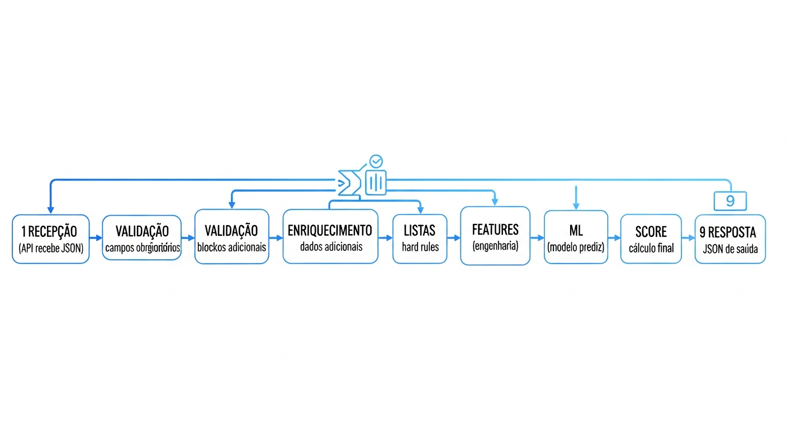
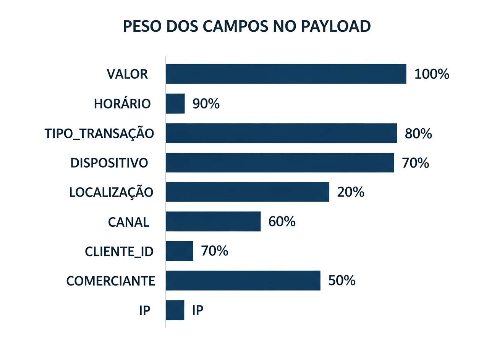
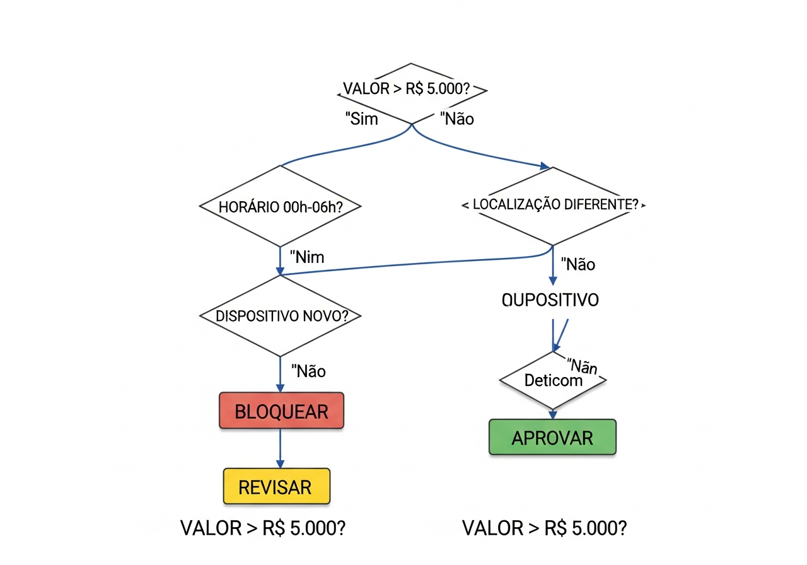
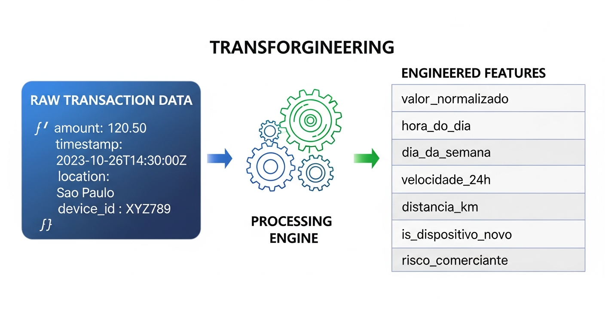
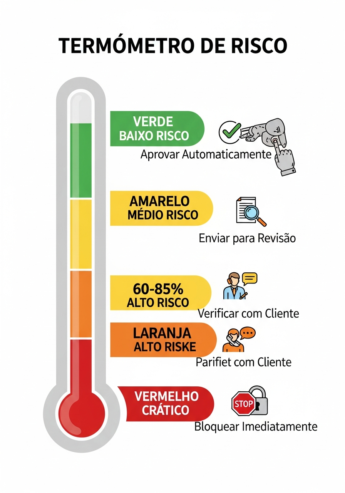

# Payload de Entrada - Guia Completo e Didático

## Sankofa Enterprise Pro v12.0

```
╔══════════════════════════════════════════════════════════════════════════════╗
║                                                                              ║
║   ██████╗  █████╗ ██╗   ██╗██╗      ██████╗  █████╗ ██████╗                  ║
║   ██╔══██╗██╔══██╗╚██╗ ██╔╝██║     ██╔═══██╗██╔══██╗██╔══██╗                 ║
║   ██████╔╝███████║ ╚████╔╝ ██║     ██║   ██║███████║██║  ██║                 ║
║   ██╔═══╝ ██╔══██║  ╚██╔╝  ██║     ██║   ██║██╔══██║██║  ██║                 ║
║   ██║     ██║  ██║   ██║   ███████╗╚██████╔╝██║  ██║██████╔╝                 ║
║   ╚═╝     ╚═╝  ╚═╝   ╚═╝   ╚══════╝ ╚═════╝ ╚═╝  ╚═╝╚═════╝                  ║
║                                                                              ║
║                 GUIA COMPLETO DO PAYLOAD DE ENTRADA                          ║
║                        Motor de Fraude Sankofa                               ║
║                                                                              ║
╚══════════════════════════════════════════════════════════════════════════════╝
```

**Versão:** 12.0  
**Última Atualização:** 27 de Novembro de 2025  
**Autor:** Equipe Sankofa Enterprise

---

## Ilustrações Visuais

Este documento contém as seguintes ilustrações para facilitar o entendimento:

### Jornada do Payload no Sistema

*Fluxo completo em 9 etapas: Recepção → Validação → Listas → Regras → Features → Modelo ML → Score → Decisão → Resposta*

### Peso e Importância dos Campos

*Gráfico de barras mostrando a importância de cada campo: Valor (100%), Horário (90%), Tipo (90%), Dispositivo (80%), Localização (80%), Canal (70%), Cliente (70%)*

### Árvore de Decisão de Fraude

*Fluxograma de decisão: Valor Alto? → Horário Suspeito? → Localização Diferente? → Dispositivo Novo? → Aprovar/Revisar/Bloquear*

### Engenharia de Features

*Transformação: Dados Brutos (valor, hora, local) → Processamento → Features Criadas (valor_normalizado, hora_do_dia, velocidade)*

### Termômetro de Risco

*Níveis: Baixo Risco 0-30% (Aprovar) → Médio 30-60% (Revisar) → Alto 60-85% (Verificar) → Crítico 85-100% (Bloquear)*

---

## Sumário

1. [O Que É o Payload de Entrada?](#1-o-que-é-o-payload-de-entrada)
2. [Estrutura Completa do Payload](#2-estrutura-completa-do-payload)
3. [Detalhamento de Cada Campo](#3-detalhamento-de-cada-campo)
4. [Pesos e Importância dos Campos](#4-pesos-e-importância-dos-campos)
5. [Jornada do Payload na Solução](#5-jornada-do-payload-na-solução)
6. [Transformações e Engenharia de Features](#6-transformações-e-engenharia-de-features)
7. [Processo de Tomada de Decisão](#7-processo-de-tomada-de-decisão)
8. [Estrutura da Resposta (Response)](#8-estrutura-da-resposta-response)
9. [Exemplos Práticos Comentados](#9-exemplos-práticos-comentados)
10. [Boas Práticas e Dicas](#10-boas-práticas-e-dicas)

---

## 1. O Que É o Payload de Entrada?

### 1.1 Definição Simples

O **payload de entrada** é o "pacote de informações" que você envia para o sistema quando quer analisar uma transação bancária. Pense nele como um formulário preenchido com todos os dados da transação que o sistema precisa para decidir se é fraude ou não.

```
┌─────────────────────────────────────────────────────────────────────────────┐
│                                                                             │
│    ┌─────────────────┐        ┌─────────────────┐        ┌──────────────┐   │
│    │                 │        │                 │        │              │   │
│    │  📱 APLICATIVO  │───────▶│  📦 PAYLOAD     │───────▶│  🧠 MOTOR    │   │
│    │  DO BANCO       │        │  DE ENTRADA     │        │  DE FRAUDE   │   │
│    │                 │        │                 │        │              │   │
│    └─────────────────┘        └─────────────────┘        └──────────────┘   │
│           │                         │                          │            │
│           │                         │                          │            │
│    O cliente faz           O sistema empacota          O motor analisa      │
│    uma transação           os dados da                 e decide se é        │
│    (PIX, TED, etc)         transação                   fraude ou não        │
│                                                                             │
└─────────────────────────────────────────────────────────────────────────────┘
```

### 1.2 Por Que o Payload É Importante?

```
╔═══════════════════════════════════════════════════════════════════════════════╗
║                                                                               ║
║                    IMPORTÂNCIA DO PAYLOAD DE ENTRADA                          ║
║                                                                               ║
║   ┌───────────────┐                                                           ║
║   │ QUALIDADE DO  │─── Payload completo = Decisão precisa                     ║
║   │ PAYLOAD       │─── Payload incompleto = Risco de erros                    ║
║   └───────────────┘                                                           ║
║                                                                               ║
║   ┌───────────────┐                                                           ║
║   │ VELOCIDADE    │─── Quanto mais limpo e organizado                         ║
║   │ DE RESPOSTA   │─── Mais rápido o processamento                            ║
║   └───────────────┘                                                           ║
║                                                                               ║
║   ┌───────────────┐                                                           ║
║   │ COMPLIANCE    │─── Campos corretos = Auditoria feliz                      ║
║   │ LGPD/BACEN    │─── Dados mascarados = Proteção garantida                  ║
║   └───────────────┘                                                           ║
║                                                                               ║
╚═══════════════════════════════════════════════════════════════════════════════╝
```

---

## 2. Estrutura Completa do Payload

### 2.1 Formato JSON do Payload

```json
{
  "transactions": [
    {
      "transaction_id": "TXN1732726800000",
      "amount": 1500.00,
      "customer_id": "CUST_12345678901",
      "merchant_id": "MERCH_LOJA_CENTRO_SP",
      "transaction_type": "PIX",
      "channel": "mobile",
      "device_id": "device_abc123xyz",
      "ip_address": "189.100.50.25",
      "latitude": -23.5505,
      "longitude": -46.6333,
      "timestamp": "2025-11-27T14:30:00",
      "cpf": "12345678901",
      "location": "São Paulo",
      "estado": "SP",
      "pais": "BR"
    }
  ],
  "include_explanation": true,
  "include_compliance_report": false
}
```

### 2.2 Visão Geral da Estrutura

```
┌─────────────────────────────────────────────────────────────────────────────┐
│                        ESTRUTURA DO PAYLOAD                                  │
├─────────────────────────────────────────────────────────────────────────────┤
│                                                                             │
│  {                                                                          │
│    "transactions": [                    ◄─── ARRAY OBRIGATÓRIO             │
│      {                                                                      │
│        ┌─────────────────────────────────────────────────────────────┐     │
│        │  CAMPOS DE IDENTIFICAÇÃO                                     │     │
│        │  ─────────────────────────                                   │     │
│        │  • transaction_id: "TXN..."   ◄─── Identificador único       │     │
│        │  • customer_id: "CUST..."     ◄─── ID do cliente             │     │
│        │  • merchant_id: "MERCH..."    ◄─── ID do estabelecimento     │     │
│        │  • cpf: "12345678901"         ◄─── CPF do cliente            │     │
│        └─────────────────────────────────────────────────────────────┘     │
│                                                                             │
│        ┌─────────────────────────────────────────────────────────────┐     │
│        │  CAMPOS FINANCEIROS                                          │     │
│        │  ──────────────────                                          │     │
│        │  • amount: 1500.00            ◄─── Valor da transação (R$)   │     │
│        │  • transaction_type: "PIX"    ◄─── Tipo (PIX, TED, CREDITO)  │     │
│        └─────────────────────────────────────────────────────────────┘     │
│                                                                             │
│        ┌─────────────────────────────────────────────────────────────┐     │
│        │  CAMPOS DE CONTEXTO                                          │     │
│        │  ──────────────────                                          │     │
│        │  • channel: "mobile"          ◄─── Canal da transação        │     │
│        │  • device_id: "device..."     ◄─── ID do dispositivo         │     │
│        │  • ip_address: "189.100..."   ◄─── Endereço IP               │     │
│        │  • timestamp: "2025-11..."    ◄─── Data e hora               │     │
│        └─────────────────────────────────────────────────────────────┘     │
│                                                                             │
│        ┌─────────────────────────────────────────────────────────────┐     │
│        │  CAMPOS GEOGRÁFICOS                                          │     │
│        │  ──────────────────                                          │     │
│        │  • latitude: -23.5505         ◄─── Coordenada latitude       │     │
│        │  • longitude: -46.6333        ◄─── Coordenada longitude      │     │
│        │  • location: "São Paulo"      ◄─── Cidade                    │     │
│        │  • estado: "SP"               ◄─── Estado                    │     │
│        │  • pais: "BR"                 ◄─── País                      │     │
│        └─────────────────────────────────────────────────────────────┘     │
│      }                                                                      │
│    ],                                                                       │
│    "include_explanation": true,         ◄─── Incluir explicação LGPD      │
│    "include_compliance_report": false   ◄─── Relatório de conformidade    │
│  }                                                                          │
│                                                                             │
└─────────────────────────────────────────────────────────────────────────────┘
```

---

## 3. Detalhamento de Cada Campo

### 3.1 Campos de Identificação

#### 🔑 transaction_id

```
╔═══════════════════════════════════════════════════════════════════════════════╗
║  CAMPO: transaction_id                                                         ║
╠═══════════════════════════════════════════════════════════════════════════════╣
║                                                                               ║
║  DESCRIÇÃO:    Identificador único da transação                               ║
║  TIPO:         String                                                         ║
║  OBRIGATÓRIO:  Sim                                                            ║
║  EXEMPLO:      "TXN1732726800000"                                             ║
║                                                                               ║
║  ┌─────────────────────────────────────────────────────────────────────────┐ ║
║  │  FUNÇÃO NA DECISÃO                                                       │ ║
║  │  ────────────────────                                                    │ ║
║  │                                                                          │ ║
║  │  • Usado para rastrear a transação em todo o sistema                    │ ║
║  │  • Permite consultar o resultado posteriormente                          │ ║
║  │  • Essencial para auditoria e compliance                                 │ ║
║  │  • NÃO influencia diretamente no score de risco                          │ ║
║  │                                                                          │ ║
║  └─────────────────────────────────────────────────────────────────────────┘ ║
║                                                                               ║
║  PESO NA DECISÃO: ░░░░░░░░░░ 0% (apenas identificação)                        ║
║                                                                               ║
╚═══════════════════════════════════════════════════════════════════════════════╝
```

#### 👤 customer_id

```
╔═══════════════════════════════════════════════════════════════════════════════╗
║  CAMPO: customer_id                                                            ║
╠═══════════════════════════════════════════════════════════════════════════════╣
║                                                                               ║
║  DESCRIÇÃO:    Identificador do cliente no sistema do banco                   ║
║  TIPO:         String                                                         ║
║  OBRIGATÓRIO:  Sim                                                            ║
║  EXEMPLO:      "CUST_12345678901"                                             ║
║                                                                               ║
║  ┌─────────────────────────────────────────────────────────────────────────┐ ║
║  │  FUNÇÃO NA DECISÃO                                                       │ ║
║  │  ────────────────────                                                    │ ║
║  │                                                                          │ ║
║  │  🔍 O sistema usa este campo para:                                       │ ║
║  │     • Buscar histórico do cliente                                        │ ║
║  │     • Calcular padrões de comportamento                                  │ ║
║  │     • Verificar se cliente é VIP (tratamento especial)                   │ ║
║  │     • Verificar se cliente está na Hot List (bloqueado)                  │ ║
║  │     • Calcular velocidade de transações (velocity)                       │ ║
║  │                                                                          │ ║
║  │  ⚠️ Cliente novo = Maior escrutínio nas primeiras transações            │ ║
║  │                                                                          │ ║
║  └─────────────────────────────────────────────────────────────────────────┘ ║
║                                                                               ║
║  PESO NA DECISÃO: ███████░░░ 70% (muito importante para contexto)             ║
║                                                                               ║
╚═══════════════════════════════════════════════════════════════════════════════╝
```

#### 🏪 merchant_id

```
╔═══════════════════════════════════════════════════════════════════════════════╗
║  CAMPO: merchant_id                                                            ║
╠═══════════════════════════════════════════════════════════════════════════════╣
║                                                                               ║
║  DESCRIÇÃO:    Identificador do estabelecimento que recebe o pagamento        ║
║  TIPO:         String                                                         ║
║  OBRIGATÓRIO:  Sim                                                            ║
║  EXEMPLO:      "MERCH_LOJA_CENTRO_SP"                                         ║
║                                                                               ║
║  ┌─────────────────────────────────────────────────────────────────────────┐ ║
║  │  FUNÇÃO NA DECISÃO                                                       │ ║
║  │  ────────────────────                                                    │ ║
║  │                                                                          │ ║
║  │  🔍 O sistema usa este campo para:                                       │ ║
║  │     • Verificar se o estabelecimento é confiável                         │ ║
║  │     • Calcular score de risco do merchant                                │ ║
║  │     • Identificar padrões de fraude por estabelecimento                  │ ║
║  │     • Verificar se está na Hot List de comerciantes                      │ ║
║  │                                                                          │ ║
║  │  ⚠️ Merchant desconhecido = Aumenta ligeiramente o risco                │ ║
║  │                                                                          │ ║
║  └─────────────────────────────────────────────────────────────────────────┘ ║
║                                                                               ║
║  PESO NA DECISÃO: █████░░░░░ 50% (importante para contexto)                   ║
║                                                                               ║
╚═══════════════════════════════════════════════════════════════════════════════╝
```

### 3.2 Campos Financeiros

#### 💰 amount (O CAMPO MAIS IMPORTANTE!)

```
╔═══════════════════════════════════════════════════════════════════════════════╗
║  CAMPO: amount                                                   ⭐ CRÍTICO   ║
╠═══════════════════════════════════════════════════════════════════════════════╣
║                                                                               ║
║  DESCRIÇÃO:    Valor monetário da transação em Reais (R$)                     ║
║  TIPO:         Float (número decimal)                                         ║
║  OBRIGATÓRIO:  Sim                                                            ║
║  EXEMPLO:      1500.00                                                        ║
║                                                                               ║
║  ┌─────────────────────────────────────────────────────────────────────────┐ ║
║  │  FUNÇÃO NA DECISÃO                                                       │ ║
║  │  ────────────────────                                                    │ ║
║  │                                                                          │ ║
║  │  💡 Este é o campo MAIS IMPORTANTE para a decisão!                       │ ║
║  │                                                                          │ ║
║  │  O sistema gera MÚLTIPLAS features derivadas:                            │ ║
║  │                                                                          │ ║
║  │  ┌─────────────────────────────────────────────────────────────┐        │ ║
║  │  │                                                             │        │ ║
║  │  │   amount ──────┬──────▶ amount_log (log do valor)           │        │ ║
║  │  │   (R$ 1500)    │                                            │        │ ║
║  │  │                ├──────▶ amount_normalized (valor ajustado)  │        │ ║
║  │  │                │                                            │        │ ║
║  │  │                ├──────▶ amount_zscore (desvio estatístico)  │        │ ║
║  │  │                │                                            │        │ ║
║  │  │                ├──────▶ is_high_value (valor > R$ 5.000?)   │        │ ║
║  │  │                │                                            │        │ ║
║  │  │                ├──────▶ is_very_high_value (> R$ 10.000?)   │        │ ║
║  │  │                │                                            │        │ ║
║  │  │                └──────▶ value_deviation (desvio do padrão)  │        │ ║
║  │  │                                                             │        │ ║
║  │  └─────────────────────────────────────────────────────────────┘        │ ║
║  │                                                                          │ ║
║  │  ⚠️ REGRAS RÍGIDAS (Hard Rules):                                        │ ║
║  │     • amount > R$ 50.000 = BLOQUEIO AUTOMÁTICO                          │ ║
║  │     • Primeira transação + amount > R$ 5.000 = STEP-UP                  │ ║
║  │                                                                          │ ║
║  └─────────────────────────────────────────────────────────────────────────┘ ║
║                                                                               ║
║  PESO NA DECISÃO: ██████████ 100% (crítico para análise)                      ║
║                                                                               ║
║  ┌─────────────────────────────────────────────────────────────────────────┐ ║
║  │                    ESCALA DE RISCO POR VALOR                              │ ║
║  │                                                                          │ ║
║  │   R$ 0 ─────────────────────────────────────────────────────▶ R$ 50.000 │ ║
║  │                                                                          │ ║
║  │   [████░░░░░░░░░░░░░░░░░░░░░░░░░░░░░░░░░░░░░░░░░░░░░░░░░░░░░]            │ ║
║  │   R$ 0-500                                                               │ ║
║  │   RISCO: MUITO BAIXO                                                     │ ║
║  │                                                                          │ ║
║  │   [░░░░████░░░░░░░░░░░░░░░░░░░░░░░░░░░░░░░░░░░░░░░░░░░░░░░░░]            │ ║
║  │   R$ 500-2.000                                                           │ ║
║  │   RISCO: BAIXO                                                           │ ║
║  │                                                                          │ ║
║  │   [░░░░░░░░████████░░░░░░░░░░░░░░░░░░░░░░░░░░░░░░░░░░░░░░░░░]            │ ║
║  │   R$ 2.000-5.000                                                         │ ║
║  │   RISCO: MÉDIO                                                           │ ║
║  │                                                                          │ ║
║  │   [░░░░░░░░░░░░░░░░████████████░░░░░░░░░░░░░░░░░░░░░░░░░░░░░]            │ ║
║  │   R$ 5.000-15.000                                                        │ ║
║  │   RISCO: ALTO                                                            │ ║
║  │                                                                          │ ║
║  │   [░░░░░░░░░░░░░░░░░░░░░░░░░░░░████████████████████████████░]            │ ║
║  │   R$ 15.000-50.000                                                       │ ║
║  │   RISCO: MUITO ALTO                                                      │ ║
║  │                                                                          │ ║
║  │   [░░░░░░░░░░░░░░░░░░░░░░░░░░░░░░░░░░░░░░░░░░░░░░░░░░░░░███]            │ ║
║  │   > R$ 50.000                                                            │ ║
║  │   🚫 BLOQUEIO AUTOMÁTICO (Hard Rule)                                     │ ║
║  │                                                                          │ ║
║  └─────────────────────────────────────────────────────────────────────────┘ ║
║                                                                               ║
╚═══════════════════════════════════════════════════════════════════════════════╝
```

#### 🏷️ transaction_type

```
╔═══════════════════════════════════════════════════════════════════════════════╗
║  CAMPO: transaction_type                                                       ║
╠═══════════════════════════════════════════════════════════════════════════════╣
║                                                                               ║
║  DESCRIÇÃO:    Tipo de transação bancária                                     ║
║  TIPO:         String                                                         ║
║  OBRIGATÓRIO:  Sim                                                            ║
║                                                                               ║
║  VALORES ACEITOS:                                                             ║
║  ┌────────────────┬─────────────────────────────────────────────────────────┐║
║  │  VALOR         │  DESCRIÇÃO                                               │║
║  ├────────────────┼─────────────────────────────────────────────────────────┤║
║  │  PIX           │  Pagamento instantâneo (mais comum, maior volume)       │║
║  │  TED           │  Transferência bancária tradicional                     │║
║  │  DOC           │  Documento de crédito (menos comum)                     │║
║  │  CREDITO       │  Compra no cartão de crédito                            │║
║  │  DEBITO        │  Compra no cartão de débito                             │║
║  │  BOLETO        │  Pagamento de boleto                                    │║
║  └────────────────┴─────────────────────────────────────────────────────────┘║
║                                                                               ║
║  ┌─────────────────────────────────────────────────────────────────────────┐ ║
║  │  RISCO POR TIPO DE TRANSAÇÃO                                             │ ║
║  │                                                                          │ ║
║  │  PIX      ████████░░ 80%  (instantâneo, difícil reverter)               │ ║
║  │  TED      ██████░░░░ 60%  (pode ser revertido)                          │ ║
║  │  CREDITO  ████░░░░░░ 40%  (proteção ao consumidor)                      │ ║
║  │  DEBITO   ███░░░░░░░ 30%  (requer senha)                                │ ║
║  │  BOLETO   ██░░░░░░░░ 20%  (lento, identificável)                        │ ║
║  │                                                                          │ ║
║  └─────────────────────────────────────────────────────────────────────────┘ ║
║                                                                               ║
║  PESO NA DECISÃO: █████████░ 90% (muito importante)                           ║
║                                                                               ║
╚═══════════════════════════════════════════════════════════════════════════════╝
```

### 3.3 Campos de Contexto

#### 📱 channel

```
╔═══════════════════════════════════════════════════════════════════════════════╗
║  CAMPO: channel                                                                ║
╠═══════════════════════════════════════════════════════════════════════════════╣
║                                                                               ║
║  DESCRIÇÃO:    Canal pelo qual a transação foi realizada                      ║
║  TIPO:         String                                                         ║
║  OBRIGATÓRIO:  Sim                                                            ║
║                                                                               ║
║  ┌─────────────────────────────────────────────────────────────────────────┐ ║
║  │                    CANAIS DISPONÍVEIS                                     │ ║
║  │                                                                          │ ║
║  │     ┌──────────┐     ┌──────────┐     ┌──────────┐     ┌──────────┐     │ ║
║  │     │   📱     │     │   💻     │     │   🏧     │     │   📍     │     │ ║
║  │     │ MOBILE   │     │   WEB    │     │   ATM    │     │   POS    │     │ ║
║  │     │          │     │          │     │          │     │          │     │ ║
║  │     │ App do   │     │ Internet │     │ Caixa    │     │ Maquina  │     │ ║
║  │     │ banco    │     │ Banking  │     │ Eletr.   │     │ de loja  │     │ ║
║  │     └──────────┘     └──────────┘     └──────────┘     └──────────┘     │ ║
║  │                                                                          │ ║
║  │  RISCO:  BAIXO         MÉDIO          MÉDIO           BAIXO             │ ║
║  │                                                                          │ ║
║  └─────────────────────────────────────────────────────────────────────────┘ ║
║                                                                               ║
║  FEATURES DERIVADAS:                                                          ║
║  • is_mobile: true/false                                                      ║
║  • is_web: true/false                                                         ║
║  • is_atm: true/false                                                         ║
║  • channel_encoded: valor numérico para o modelo ML                           ║
║                                                                               ║
║  PESO NA DECISÃO: ███████░░░ 70% (importante para padrão)                     ║
║                                                                               ║
╚═══════════════════════════════════════════════════════════════════════════════╝
```

#### 📍 device_id

```
╔═══════════════════════════════════════════════════════════════════════════════╗
║  CAMPO: device_id                                                              ║
╠═══════════════════════════════════════════════════════════════════════════════╣
║                                                                               ║
║  DESCRIÇÃO:    Identificador único do dispositivo usado                       ║
║  TIPO:         String                                                         ║
║  OBRIGATÓRIO:  Não (mas recomendado)                                          ║
║  EXEMPLO:      "device_abc123xyz"                                             ║
║                                                                               ║
║  ┌─────────────────────────────────────────────────────────────────────────┐ ║
║  │  FUNÇÃO NA DECISÃO                                                       │ ║
║  │  ────────────────────                                                    │ ║
║  │                                                                          │ ║
║  │  🔍 O sistema verifica:                                                  │ ║
║  │                                                                          │ ║
║  │  ┌────────────────────────────────────────────────────────────────────┐ │ ║
║  │  │  VERIFICAÇÃO           │ RESULTADO           │ IMPACTO NO RISCO   │ │ ║
║  │  ├────────────────────────┼─────────────────────┼────────────────────┤ │ ║
║  │  │  Dispositivo conhecido?│ SIM                 │ ✅ Diminui risco   │ │ ║
║  │  │  Dispositivo conhecido?│ NÃO (novo)          │ ⚠️ Aumenta risco   │ │ ║
║  │  │  Na Hot List?          │ SIM                 │ 🚫 BLOQUEIO        │ │ ║
║  │  │  Compartilhado?        │ SIM                 │ ⚠️ Aumenta risco   │ │ ║
║  │  │  Geolocalização match? │ NÃO                 │ ⚠️ Aumenta risco   │ │ ║
║  │  └────────────────────────┴─────────────────────┴────────────────────┘ │ ║
║  │                                                                          │ ║
║  └─────────────────────────────────────────────────────────────────────────┘ ║
║                                                                               ║
║  FEATURES DERIVADAS:                                                          ║
║  • is_new_device: true/false                                                  ║
║  • is_shared_device: true/false                                               ║
║  • device_risk_score: 0.0 a 1.0                                               ║
║  • velocity_device_interaction: frequência de uso                             ║
║                                                                               ║
║  PESO NA DECISÃO: ████████░░ 80% (crucial para segurança)                     ║
║                                                                               ║
╚═══════════════════════════════════════════════════════════════════════════════╝
```

#### ⏰ timestamp

```
╔═══════════════════════════════════════════════════════════════════════════════╗
║  CAMPO: timestamp                                            ⭐ MUITO IMPORTANTE ║
╠═══════════════════════════════════════════════════════════════════════════════╣
║                                                                               ║
║  DESCRIÇÃO:    Data e hora da transação                                       ║
║  TIPO:         String (ISO 8601)                                              ║
║  OBRIGATÓRIO:  Não (sistema usa hora atual se ausente)                        ║
║  EXEMPLO:      "2025-11-27T14:30:00"                                          ║
║                                                                               ║
║  ┌─────────────────────────────────────────────────────────────────────────┐ ║
║  │  FEATURES DERIVADAS DO TIMESTAMP                                         │ ║
║  │                                                                          │ ║
║  │     timestamp ────┬──────▶ hour (hora: 0-23)                             │ ║
║  │     "14:30:00"    │                                                      │ ║
║  │                   ├──────▶ day_of_week (dia da semana: 0-6)              │ ║
║  │                   │                                                      │ ║
║  │                   ├──────▶ is_weekend (final de semana?)                 │ ║
║  │                   │                                                      │ ║
║  │                   ├──────▶ is_night (22:00 - 06:00?)                     │ ║
║  │                   │                                                      │ ║
║  │                   ├──────▶ is_business_hours (09:00 - 18:00?)            │ ║
║  │                   │                                                      │ ║
║  │                   └──────▶ is_early_morning (00:00 - 05:00?)             │ ║
║  │                                                                          │ ║
║  └─────────────────────────────────────────────────────────────────────────┘ ║
║                                                                               ║
║  ┌─────────────────────────────────────────────────────────────────────────┐ ║
║  │                    RISCO POR HORÁRIO                                      │ ║
║  │                                                                          │ ║
║  │        00:00                     12:00                     24:00         │ ║
║  │          │                         │                         │           │ ║
║  │   MADRUGADA │ MANHÃ │ COMERCIAL │ TARDE │ NOITE │ MADRUGADA            │ ║
║  │   ██████████│░░░░░░░│░░░░░░░░░░░│░░░░░░░│███████│██████████            │ ║
║  │   ALTO RISCO│ BAIXO │   NORMAL  │ BAIXO │ MÉDIO │ALTO RISCO            │ ║
║  │                                                                          │ ║
║  │   ⚠️ Transações entre 00:00 e 05:00 têm escrutínio EXTRA                │ ║
║  │                                                                          │ ║
║  └─────────────────────────────────────────────────────────────────────────┘ ║
║                                                                               ║
║  PESO NA DECISÃO: █████████░ 90% (padrão temporal é crucial)                  ║
║                                                                               ║
╚═══════════════════════════════════════════════════════════════════════════════╝
```

### 3.4 Campos Geográficos

#### 🌍 latitude e longitude

```
╔═══════════════════════════════════════════════════════════════════════════════╗
║  CAMPOS: latitude e longitude                                                  ║
╠═══════════════════════════════════════════════════════════════════════════════╣
║                                                                               ║
║  DESCRIÇÃO:    Coordenadas geográficas da transação                           ║
║  TIPO:         Float (número decimal)                                         ║
║  OBRIGATÓRIO:  Não (mas muito recomendado)                                    ║
║  EXEMPLOS:     latitude: -23.5505, longitude: -46.6333 (São Paulo)           ║
║                                                                               ║
║  ┌─────────────────────────────────────────────────────────────────────────┐ ║
║  │                                                                          │ ║
║  │                    MAPA DO BRASIL                                        │ ║
║  │                                                                          │ ║
║  │              ┌──────────────────────────────────┐                        │ ║
║  │              │           ╭────╮                  │                        │ ║
║  │              │      ╭────╯    ╰───╮              │                        │ ║
║  │              │ ╭────╯              │             │                        │ ║
║  │              │ │       •Manaus     │             │                        │ ║
║  │              │ │                   ╰──╮          │                        │ ║
║  │              │ │         •Brasília    │          │                        │ ║
║  │              │ │                      │          │                        │ ║
║  │              │ │   •São Paulo  •Rio   │          │                        │ ║
║  │              │ ╰──╮                ───╯          │                        │ ║
║  │              │    ╰────────────────╯             │                        │ ║
║  │              │                                    │                        │ ║
║  │              └──────────────────────────────────┘                        │ ║
║  │                                                                          │ ║
║  │  🔍 O sistema usa coordenadas para:                                      │ ║
║  │     • Calcular distância da localização habitual                         │ ║
║  │     • Detectar "viagem impossível" (ex: SP → NY em 1 hora)              │ ║
║  │     • Identificar estados/países de alto risco                           │ ║
║  │                                                                          │ ║
║  └─────────────────────────────────────────────────────────────────────────┘ ║
║                                                                               ║
║  FEATURES DERIVADAS:                                                          ║
║  • distance_from_home: distância em km do local habitual                      ║
║  • is_high_risk_state: estado com índice elevado de fraude                    ║
║  • location_entropy: diversidade de locais (cliente viajante?)                ║
║  • impossible_travel: viajou distância impossível no tempo?                   ║
║                                                                               ║
║  PESO NA DECISÃO: ████████░░ 80% (geolocalização é muito importante)          ║
║                                                                               ║
╚═══════════════════════════════════════════════════════════════════════════════╝
```

---

## 4. Pesos e Importância dos Campos

### 4.1 Tabela de Pesos Consolidada

```
╔═══════════════════════════════════════════════════════════════════════════════╗
║                     TABELA DE PESOS DOS CAMPOS                                ║
╠═══════════════════════════════════════════════════════════════════════════════╣
║                                                                               ║
║  CAMPO              │ PESO │ BARRA DE IMPORTÂNCIA    │ CATEGORIA             ║
║  ───────────────────┼──────┼─────────────────────────┼────────────────────── ║
║                                                                               ║
║  💰 amount          │ 100% │ ██████████████████████ │ FINANCEIRO            ║
║     Valor monetário │      │ ★★★★★ CRÍTICO          │                       ║
║                                                                               ║
║  ⏰ timestamp       │  90% │ ████████████████████░░ │ TEMPORAL              ║
║     Data e hora     │      │ ★★★★★ MUITO ALTO       │                       ║
║                                                                               ║
║  🏷️ transaction_type│  90% │ ████████████████████░░ │ FINANCEIRO            ║
║     Tipo transação  │      │ ★★★★★ MUITO ALTO       │                       ║
║                                                                               ║
║  📍 device_id       │  80% │ ██████████████████░░░░ │ CONTEXTO              ║
║     Dispositivo     │      │ ★★★★☆ ALTO             │                       ║
║                                                                               ║
║  🌍 lat/long        │  80% │ ██████████████████░░░░ │ GEOGRÁFICO            ║
║     Coordenadas     │      │ ★★★★☆ ALTO             │                       ║
║                                                                               ║
║  📱 channel         │  70% │ ████████████████░░░░░░ │ CONTEXTO              ║
║     Canal           │      │ ★★★★☆ ALTO             │                       ║
║                                                                               ║
║  👤 customer_id     │  70% │ ████████████████░░░░░░ │ IDENTIFICAÇÃO         ║
║     ID cliente      │      │ ★★★☆☆ MÉDIO-ALTO       │                       ║
║                                                                               ║
║  🌐 ip_address      │  60% │ ██████████████░░░░░░░░ │ CONTEXTO              ║
║     Endereço IP     │      │ ★★★☆☆ MÉDIO            │                       ║
║                                                                               ║
║  🏪 merchant_id     │  50% │ ████████████░░░░░░░░░░ │ IDENTIFICAÇÃO         ║
║     ID comerciante  │      │ ★★☆☆☆ MÉDIO            │                       ║
║                                                                               ║
║  📍 location/estado │  40% │ ██████████░░░░░░░░░░░░ │ GEOGRÁFICO            ║
║     Cidade/Estado   │      │ ★★☆☆☆ MÉDIO            │                       ║
║                                                                               ║
║  🪪 cpf             │  30% │ ████████░░░░░░░░░░░░░░ │ IDENTIFICAÇÃO         ║
║     CPF cliente     │      │ ★☆☆☆☆ BAIXO (PII)      │                       ║
║                                                                               ║
║  🔑 transaction_id  │   0% │ ░░░░░░░░░░░░░░░░░░░░░░ │ IDENTIFICAÇÃO         ║
║     ID transação    │      │ ☆☆☆☆☆ ZERO (tracking)  │                       ║
║                                                                               ║
╚═══════════════════════════════════════════════════════════════════════════════╝
```

### 4.2 Visualização em Gráfico de Pizza

```
                         DISTRIBUIÇÃO DE PESO DOS CAMPOS
                         ════════════════════════════════
                         
                                    ┌──────┐
                                    │amount│
                                ╭───┴──────┴───╮
                           ╱         100%        ╲
                         ╱    ████████████████     ╲
                        │   ████████████████████    │
            timestamp   │  ██████████████████████   │  transaction_type
                90%     │ █████████████████████████ │     90%
                        │  ██████████████████████   │
                         ╲    ████████████████     ╱
                           ╲         ▼          ╱
                              ╰───────────────╯
                               │             │
              device_id ───────┤             ├─────── lat/long
                  80%          │             │          80%
                               │             │
                    channel ───┤             ├─── customer_id
                       70%     │             │        70%
                               │             │
                              │ │           │ │
                ip_address ───│             │─── merchant_id
                    60%       │             │       50%
                              │             │
                           location ─────── cpf
                              40%           30%
```

---

## 5. Jornada do Payload na Solução

### 5.1 Fluxo Completo de Processamento

```
╔═══════════════════════════════════════════════════════════════════════════════╗
║                     JORNADA DO PAYLOAD NO SISTEMA                             ║
╠═══════════════════════════════════════════════════════════════════════════════╣
║                                                                               ║
║  ┌─────────────────────────────────────────────────────────────────────────┐ ║
║  │ ETAPA 1: RECEPÇÃO DO PAYLOAD                                             │ ║
║  │                                                                          │ ║
║  │  📱 Cliente faz PIX ──▶ App do Banco ──▶ API Gateway ──▶ /api/fraud/predict║
║  │                                                                          │ ║
║  │  ┌────────────────────────────────────────────────────────────────────┐ │ ║
║  │  │ POST /api/fraud/predict                                             │ │ ║
║  │  │ Content-Type: application/json                                      │ │ ║
║  │  │                                                                     │ │ ║
║  │  │ { "transactions": [{ ... }] }                                       │ │ ║
║  │  └────────────────────────────────────────────────────────────────────┘ │ ║
║  │                                                                          │ ║
║  └─────────────────────────────────────────────────────────────────────────┘ ║
║                              │                                                 ║
║                              ▼                                                 ║
║  ┌─────────────────────────────────────────────────────────────────────────┐ ║
║  │ ETAPA 2: VALIDAÇÃO DO PAYLOAD                                            │ ║
║  │                                                                          │ ║
║  │     ┌───────────────────┐                                               │ ║
║  │     │  📝 VALIDAÇÕES    │                                               │ ║
║  │     ├───────────────────┤                                               │ ║
║  │     │ ✓ JSON válido?    │ ──▶ Se NÃO: Erro 400                         │ ║
║  │     │ ✓ Campo "transactions" existe? │ ──▶ Se NÃO: Erro 400            │ ║
║  │     │ ✓ É uma lista?    │ ──▶ Se NÃO: Erro 400                         │ ║
║  │     │ ✓ Campos obrigatórios? │ ──▶ Se NÃO: Erro 400                    │ ║
║  │     │ ✓ Tipos corretos? │ ──▶ Se NÃO: Erro 400                         │ ║
║  │     └───────────────────┘                                               │ ║
║  │                                                                          │ ║
║  └─────────────────────────────────────────────────────────────────────────┘ ║
║                              │                                                 ║
║                              ▼                                                 ║
║  ┌─────────────────────────────────────────────────────────────────────────┐ ║
║  │ ETAPA 3: VERIFICAÇÃO DE LISTAS                                           │ ║
║  │                                                                          │ ║
║  │     ┌───────────────────────────────────────────────────────────────┐   │ ║
║  │     │                                                               │   │ ║
║  │     │  customer_id ──▶ Está na VIP List? ──▶ SIM: Liberação rápida │   │ ║
║  │     │                                                               │   │ ║
║  │     │  customer_id ──▶ Está na Hot List? ──▶ SIM: 🚫 BLOQUEIO      │   │ ║
║  │     │  device_id   ──▶ Está na Hot List? ──▶ SIM: 🚫 BLOQUEIO      │   │ ║
║  │     │  ip_address  ──▶ Está na Hot List? ──▶ SIM: 🚫 BLOQUEIO      │   │ ║
║  │     │                                                               │   │ ║
║  │     └───────────────────────────────────────────────────────────────┘   │ ║
║  │                                                                          │ ║
║  └─────────────────────────────────────────────────────────────────────────┘ ║
║                              │                                                 ║
║                              ▼                                                 ║
║  ┌─────────────────────────────────────────────────────────────────────────┐ ║
║  │ ETAPA 4: APLICAÇÃO DE HARD RULES                                         │ ║
║  │                                                                          │ ║
║  │     ┌───────────────────────────────────────────────────────────────┐   │ ║
║  │     │  REGRA 1: amount > R$ 50.000                                  │   │ ║
║  │     │           AÇÃO: 🚫 BLOQUEIO AUTOMÁTICO                        │   │ ║
║  │     │                                                               │   │ ║
║  │     │  REGRA 2: Primeira transação + amount > R$ 5.000              │   │ ║
║  │     │           AÇÃO: ⚠️ STEP-UP (verificação adicional)            │   │ ║
║  │     │                                                               │   │ ║
║  │     │  REGRA 3: País de alto risco                                  │   │ ║
║  │     │           AÇÃO: 👁️ REVISÃO MANUAL                             │   │ ║
║  │     └───────────────────────────────────────────────────────────────┘   │ ║
║  │                                                                          │ ║
║  └─────────────────────────────────────────────────────────────────────────┘ ║
║                              │                                                 ║
║                              ▼                                                 ║
║  ┌─────────────────────────────────────────────────────────────────────────┐ ║
║  │ ETAPA 5: ENGENHARIA DE FEATURES                                          │ ║
║  │                                                                          │ ║
║  │     ┌───────────────────────────────────────────────────────────────┐   │ ║
║  │     │                                                               │   │ ║
║  │     │  PAYLOAD ORIGINAL              FEATURES DERIVADAS             │   │ ║
║  │     │  ─────────────────             ────────────────────           │   │ ║
║  │     │                                                               │   │ ║
║  │     │  amount: 1500.00    ──▶  amount_log: 7.31                     │   │ ║
║  │     │                          amount_normalized: 0.15               │   │ ║
║  │     │                          is_high_value: false                  │   │ ║
║  │     │                                                               │   │ ║
║  │     │  timestamp: "14:30" ──▶  hour: 14                             │   │ ║
║  │     │                          is_night: false                       │   │ ║
║  │     │                          is_business_hours: true               │   │ ║
║  │     │                                                               │   │ ║
║  │     │  channel: "mobile"  ──▶  is_mobile: true                      │   │ ║
║  │     │                          channel_encoded: 1                    │   │ ║
║  │     │                                                               │   │ ║
║  │     │  device_id: "abc"   ──▶  is_new_device: false                 │   │ ║
║  │     │                          device_risk_score: 0.1                │   │ ║
║  │     │                                                               │   │ ║
║  │     │  latitude/longitude ──▶  distance_from_home: 2.5 km           │   │ ║
║  │     │                          is_high_risk_state: false             │   │ ║
║  │     │                                                               │   │ ║
║  │     │  customer_id        ──▶  velocity_score: 0.05                 │   │ ║
║  │     │  (histórico)            is_new_client: false                  │   │ ║
║  │     │                          avg_value: 800.00                     │   │ ║
║  │     │                                                               │   │ ║
║  │     └───────────────────────────────────────────────────────────────┘   │ ║
║  │                                                                          │ ║
║  │     TOTAL: 47+ FEATURES GERADAS A PARTIR DO PAYLOAD ORIGINAL            │ ║
║  │                                                                          │ ║
║  └─────────────────────────────────────────────────────────────────────────┘ ║
║                              │                                                 ║
║                              ▼                                                 ║
║  ┌─────────────────────────────────────────────────────────────────────────┐ ║
║  │ ETAPA 6: PREDIÇÃO PELO MODELO ML (ENSEMBLE)                              │ ║
║  │                                                                          │ ║
║  │     ┌───────────────────────────────────────────────────────────────┐   │ ║
║  │     │                                                               │   │ ║
║  │     │                    ┌─────────────────────┐                    │   │ ║
║  │     │                    │   47 FEATURES       │                    │   │ ║
║  │     │                    │   NORMALIZADAS      │                    │   │ ║
║  │     │                    └─────────┬───────────┘                    │   │ ║
║  │     │                              │                                │   │ ║
║  │     │              ┌───────────────┼───────────────┐                │   │ ║
║  │     │              │               │               │                │   │ ║
║  │     │              ▼               ▼               ▼                │   │ ║
║  │     │      ┌────────────┐  ┌────────────┐  ┌────────────┐          │   │ ║
║  │     │      │  RANDOM    │  │  GRADIENT  │  │  LOGISTIC  │          │   │ ║
║  │     │      │  FOREST    │  │  BOOSTING  │  │ REGRESSION │          │   │ ║
║  │     │      │            │  │            │  │            │          │   │ ║
║  │     │      │ Peso: 40%  │  │ Peso: 40%  │  │ Peso: 20%  │          │   │ ║
║  │     │      └─────┬──────┘  └─────┬──────┘  └─────┬──────┘          │   │ ║
║  │     │            │               │               │                  │   │ ║
║  │     │            │  P1 = 0.02    │  P2 = 0.03    │  P3 = 0.01       │   │ ║
║  │     │            │               │               │                  │   │ ║
║  │     │            └───────────────┼───────────────┘                  │   │ ║
║  │     │                            │                                  │   │ ║
║  │     │                            ▼                                  │   │ ║
║  │     │                   ┌────────────────┐                          │   │ ║
║  │     │                   │   STACKING     │                          │   │ ║
║  │     │                   │   ENSEMBLE     │                          │   │ ║
║  │     │                   │                │                          │   │ ║
║  │     │                   │ Score Final:   │                          │   │ ║
║  │     │                   │   1.4%         │                          │   │ ║
║  │     │                   └────────────────┘                          │   │ ║
║  │     │                                                               │   │ ║
║  │     └───────────────────────────────────────────────────────────────┘   │ ║
║  │                                                                          │ ║
║  └─────────────────────────────────────────────────────────────────────────┘ ║
║                              │                                                 ║
║                              ▼                                                 ║
║  ┌─────────────────────────────────────────────────────────────────────────┐ ║
║  │ ETAPA 7: TOMADA DE DECISÃO                                               │ ║
║  │                                                                          │ ║
║  │     ┌───────────────────────────────────────────────────────────────┐   │ ║
║  │     │                                                               │   │ ║
║  │     │     SCORE: 1.4%    ──────▶    THRESHOLDS                      │   │ ║
║  │     │                              ────────────                      │   │ ║
║  │     │                                                               │   │ ║
║  │     │     ├─────────────────────────────────────────────────────┤   │   │ ║
║  │     │     0%                    30%       60%       85%        100%  │   │ ║
║  │     │     │                      │         │         │           │   │   │ ║
║  │     │     │◀─── APROVADO ──────▶│◀ REVIEW▶│◀ STEP-UP▶│◀ FRAUDE ▶│   │   │ ║
║  │     │     │     (1.4% ✓)         │         │         │           │   │   │ ║
║  │     │                                                               │   │ ║
║  │     │     DECISÃO FINAL: ✅ APROVADO (risco muito baixo)            │   │ ║
║  │     │                                                               │   │ ║
║  │     └───────────────────────────────────────────────────────────────┘   │ ║
║  │                                                                          │ ║
║  └─────────────────────────────────────────────────────────────────────────┘ ║
║                              │                                                 ║
║                              ▼                                                 ║
║  ┌─────────────────────────────────────────────────────────────────────────┐ ║
║  │ ETAPA 8: GERAÇÃO DA EXPLICAÇÃO LGPD                                      │ ║
║  │                                                                          │ ║
║  │     ┌───────────────────────────────────────────────────────────────┐   │ ║
║  │     │                                                               │   │ ║
║  │     │  "Esta transação foi classificada com risco MUITO_BAIXO      │   │ ║
║  │     │   (probabilidade de fraude: 1.4%).                           │   │ ║
║  │     │                                                               │   │ ║
║  │     │   Fatores que DIMINUÍRAM o risco:                            │   │ ║
║  │     │   • Horário comercial (14:30)                                 │   │ ║
║  │     │   • Dispositivo conhecido                                     │   │ ║
║  │     │   • Valor dentro do padrão                                    │   │ ║
║  │     │                                                               │   │ ║
║  │     │   Esta análise foi realizada por modelo de machine learning  │   │ ║
║  │     │   em conformidade com LGPD e regulamentações BACEN."         │   │ ║
║  │     │                                                               │   │ ║
║  │     └───────────────────────────────────────────────────────────────┘   │ ║
║  │                                                                          │ ║
║  └─────────────────────────────────────────────────────────────────────────┘ ║
║                              │                                                 ║
║                              ▼                                                 ║
║  ┌─────────────────────────────────────────────────────────────────────────┐ ║
║  │ ETAPA 9: RESPOSTA (RESPONSE)                                             │ ║
║  │                                                                          │ ║
║  │     { "success": true,                                                   │ ║
║  │       "data": { "predictions": [{ ... }] } }                             │ ║
║  │                                                                          │ ║
║  └─────────────────────────────────────────────────────────────────────────┘ ║
║                                                                               ║
╚═══════════════════════════════════════════════════════════════════════════════╝
```

---

## 6. Transformações e Engenharia de Features

### 6.1 Mapa Completo de Transformações

```
╔═══════════════════════════════════════════════════════════════════════════════╗
║                   MAPA DE ENGENHARIA DE FEATURES                              ║
╠═══════════════════════════════════════════════════════════════════════════════╣
║                                                                               ║
║  ┌─────────────────────────────────────────────────────────────────────────┐ ║
║  │  CAMPO ORIGINAL: amount (R$ 1.500,00)                                    │ ║
║  │                                                                          │ ║
║  │  ┌────────────────────────────────────────────────────────────────────┐ │ ║
║  │  │                                                                    │ │ ║
║  │  │  amount ────┬──▶ amount_log = log(1500) = 7.31                     │ │ ║
║  │  │             │     └── Suaviza valores extremos                     │ │ ║
║  │  │             │                                                      │ │ ║
║  │  │             ├──▶ amount_normalized = 1500 / max_value = 0.015      │ │ ║
║  │  │             │     └── Escala de 0 a 1                              │ │ ║
║  │  │             │                                                      │ │ ║
║  │  │             ├──▶ amount_zscore = (1500 - média) / std = 0.85       │ │ ║
║  │  │             │     └── Quantos desvios da média?                    │ │ ║
║  │  │             │                                                      │ │ ║
║  │  │             ├──▶ is_high_value = 1500 > 5000? = false              │ │ ║
║  │  │             │     └── Binário: é valor alto?                       │ │ ║
║  │  │             │                                                      │ │ ║
║  │  │             ├──▶ is_very_high_value = 1500 > 10000? = false        │ │ ║
║  │  │             │     └── Binário: é valor muito alto?                 │ │ ║
║  │  │             │                                                      │ │ ║
║  │  │             ├──▶ value_deviation = |1500 - média_cliente| / std    │ │ ║
║  │  │             │     └── Fora do padrão do cliente?                   │ │ ║
║  │  │             │                                                      │ │ ║
║  │  │             └──▶ value_rounded = 1500 % 100 == 0? = true           │ │ ║
║  │  │                   └── Valor redondo é suspeito                     │ │ ║
║  │  │                                                                    │ │ ║
║  │  └────────────────────────────────────────────────────────────────────┘ │ ║
║  │                                                                          │ ║
║  └─────────────────────────────────────────────────────────────────────────┘ ║
║                                                                               ║
║  ┌─────────────────────────────────────────────────────────────────────────┐ ║
║  │  CAMPO ORIGINAL: timestamp ("2025-11-27T14:30:00")                       │ ║
║  │                                                                          │ ║
║  │  ┌────────────────────────────────────────────────────────────────────┐ │ ║
║  │  │                                                                    │ │ ║
║  │  │  timestamp ─┬──▶ hour = 14                                         │ │ ║
║  │  │             │     └── Hora do dia (0-23)                           │ │ ║
║  │  │             │                                                      │ │ ║
║  │  │             ├──▶ day_of_week = 3 (quarta-feira)                    │ │ ║
║  │  │             │     └── Dia da semana (0=segunda, 6=domingo)         │ │ ║
║  │  │             │                                                      │ │ ║
║  │  │             ├──▶ is_weekend = false                                │ │ ║
║  │  │             │     └── É sábado ou domingo?                         │ │ ║
║  │  │             │                                                      │ │ ║
║  │  │             ├──▶ is_night = false                                  │ │ ║
║  │  │             │     └── Entre 22:00 e 06:00?                         │ │ ║
║  │  │             │                                                      │ │ ║
║  │  │             ├──▶ is_business_hours = true                          │ │ ║
║  │  │             │     └── Entre 09:00 e 18:00?                         │ │ ║
║  │  │             │                                                      │ │ ║
║  │  │             └──▶ is_early_morning = false                          │ │ ║
║  │  │                   └── Entre 00:00 e 05:00? (alto risco)            │ │ ║
║  │  │                                                                    │ │ ║
║  │  └────────────────────────────────────────────────────────────────────┘ │ ║
║  │                                                                          │ ║
║  └─────────────────────────────────────────────────────────────────────────┘ ║
║                                                                               ║
║  ┌─────────────────────────────────────────────────────────────────────────┐ ║
║  │  CAMPO ORIGINAL: customer_id (busca no histórico)                        │ ║
║  │                                                                          │ ║
║  │  ┌────────────────────────────────────────────────────────────────────┐ │ ║
║  │  │                                                                    │ │ ║
║  │  │  customer_id ──▶ [BUSCA NO BANCO DE DADOS]                         │ │ ║
║  │  │                   │                                                │ │ ║
║  │  │                   ├──▶ velocity_score = transações/hora = 0.05     │ │ ║
║  │  │                   │     └── Frequência de transações               │ │ ║
║  │  │                   │                                                │ │ ║
║  │  │                   ├──▶ is_new_client = false                       │ │ ║
║  │  │                   │     └── Cliente tem menos de 30 dias?          │ │ ║
║  │  │                   │                                                │ │ ║
║  │  │                   ├──▶ avg_value = R$ 800,00                       │ │ ║
║  │  │                   │     └── Valor médio das transações             │ │ ║
║  │  │                   │                                                │ │ ║
║  │  │                   ├──▶ std_value = R$ 350,00                       │ │ ║
║  │  │                   │     └── Desvio padrão dos valores              │ │ ║
║  │  │                   │                                                │ │ ║
║  │  │                   ├──▶ num_transactions = 47                       │ │ ║
║  │  │                   │     └── Total de transações do cliente         │ │ ║
║  │  │                   │                                                │ │ ║
║  │  │                   └──▶ is_max_value = false                        │ │ ║
║  │  │                         └── É o maior valor já transacionado?      │ │ ║
║  │  │                                                                    │ │ ║
║  │  └────────────────────────────────────────────────────────────────────┘ │ ║
║  │                                                                          │ ║
║  └─────────────────────────────────────────────────────────────────────────┘ ║
║                                                                               ║
╚═══════════════════════════════════════════════════════════════════════════════╝
```

---

## 7. Processo de Tomada de Decisão

### 7.1 Diagrama de Decisão

```
╔═══════════════════════════════════════════════════════════════════════════════╗
║                       ÁRVORE DE TOMADA DE DECISÃO                             ║
╠═══════════════════════════════════════════════════════════════════════════════╣
║                                                                               ║
║                              ┌────────────────┐                               ║
║                              │  PAYLOAD ENTRA │                               ║
║                              └───────┬────────┘                               ║
║                                      │                                        ║
║                                      ▼                                        ║
║                         ┌────────────────────────┐                            ║
║                         │  Na Hot List?          │                            ║
║                         └──────────┬─────────────┘                            ║
║                            SIM │           │ NÃO                              ║
║                                │           │                                  ║
║                                ▼           ▼                                  ║
║                    ┌────────────────┐  ┌────────────────────────┐             ║
║                    │ 🚫 BLOQUEIO    │  │  Na VIP List?          │             ║
║                    │    IMEDIATO    │  └──────────┬─────────────┘             ║
║                    └────────────────┘      SIM │           │ NÃO             ║
║                                                │           │                  ║
║                                                ▼           ▼                  ║
║                                 ┌────────────────┐  ┌─────────────────────┐   ║
║                                 │ ✅ APROVADO    │  │  Hard Rules?        │   ║
║                                 │    (VIP)       │  └──────────┬──────────┘   ║
║                                 └────────────────┘       SIM │       │ NÃO   ║
║                                                              │       │        ║
║                                               ┌──────────────┴───────┴──┐     ║
║                                               │                          │     ║
║                                 ┌─────────────┴─────────────┐           │     ║
║                                 │  amount > R$ 50.000?      │           │     ║
║                                 └─────────────┬─────────────┘           │     ║
║                                         SIM │       │ NÃO               │     ║
║                                             │       │                   │     ║
║                                             ▼       ▼                   │     ║
║                              ┌────────────────┐  ┌─────────────────┐    │     ║
║                              │ 🚫 BLOQUEIO    │  │  ML PREDICTION  │◀───┘     ║
║                              │   (Hard Rule)  │  └────────┬────────┘          ║
║                              └────────────────┘           │                   ║
║                                                           ▼                   ║
║                                          ┌────────────────────────────────┐   ║
║                                          │       SCORE DE RISCO           │   ║
║                                          └────────────────┬───────────────┘   ║
║                                                           │                   ║
║                              ┌─────────┬─────────┬────────┴────────┐          ║
║                              │         │         │                  │          ║
║                         < 30%     30-60%    60-85%             > 85%          ║
║                              │         │         │                  │          ║
║                              ▼         ▼         ▼                  ▼          ║
║                     ┌────────────┐ ┌────────┐ ┌────────────┐ ┌──────────────┐ ║
║                     │✅ APROVADO │ │👁 REVIEW│ │⚠️ STEP-UP │ │🚫 BLOQUEIO  │ ║
║                     │            │ │ MANUAL │ │(verificação│ │  (fraude)   │ ║
║                     │ Risco Baixo│ │        │ │ adicional) │ │             │ ║
║                     └────────────┘ └────────┘ └────────────┘ └──────────────┘ ║
║                                                                               ║
╚═══════════════════════════════════════════════════════════════════════════════╝
```

### 7.2 Níveis de Decisão

```
╔═══════════════════════════════════════════════════════════════════════════════╗
║                          NÍVEIS DE DECISÃO                                    ║
╠═══════════════════════════════════════════════════════════════════════════════╣
║                                                                               ║
║  ┌─────────────────────────────────────────────────────────────────────────┐ ║
║  │                                                                          │ ║
║  │    SCORE        │ NÍVEL          │ AÇÃO           │ LATÊNCIA            │ ║
║  │    ─────        │ ─────          │ ────           │ ────────            │ ║
║  │                                                                          │ ║
║  │  ┌────────────┐                                                          │ ║
║  │  │   0-30%    │ MUITO BAIXO     ✅ APROVADO       < 50ms (automático)   │ ║
║  │  │   ████░░░░ │                                                          │ ║
║  │  └────────────┘                                                          │ ║
║  │                                                                          │ ║
║  │  Exemplo: PIX de R$ 150 em horário comercial, dispositivo conhecido     │ ║
║  │                                                                          │ ║
║  │  ┌────────────┐                                                          │ ║
║  │  │  30-60%    │ MÉDIO          👁️ REVISÃO MANUAL  5-30min (analista)    │ ║
║  │  │   ██████░░ │                                                          │ ║
║  │  └────────────┘                                                          │ ║
║  │                                                                          │ ║
║  │  Exemplo: Valor incomum + dispositivo novo + horário noturno            │ ║
║  │                                                                          │ ║
║  │  ┌────────────┐                                                          │ ║
║  │  │  60-85%    │ ALTO           ⚠️ STEP-UP         2-5min (verificação)  │ ║
║  │  │   ████████ │                                                          │ ║
║  │  └────────────┘                                                          │ ║
║  │                                                                          │ ║
║  │  Exemplo: Primeiro PIX grande + cidade diferente + madrugada            │ ║
║  │  → Sistema pede: selfie, biometria, token adicional                     │ ║
║  │                                                                          │ ║
║  │  ┌────────────┐                                                          │ ║
║  │  │  85-100%   │ MUITO ALTO     🚫 BLOQUEIO        < 50ms (automático)   │ ║
║  │  │   █████████│                                                          │ ║
║  │  └────────────┘                                                          │ ║
║  │                                                                          │ ║
║  │  Exemplo: Valor > R$ 50.000 + IP estrangeiro + conta laranja            │ ║
║  │                                                                          │ ║
║  └─────────────────────────────────────────────────────────────────────────┘ ║
║                                                                               ║
╚═══════════════════════════════════════════════════════════════════════════════╝
```

---

## 8. Estrutura da Resposta (Response)

### 8.1 Formato Completo da Response

```json
{
  "success": true,
  "data": {
    "predictions": [
      {
        "transaction_id": "0",
        "is_fraud": false,
        "fraud_probability": 0.0135,
        "risk_score": 0.0135,
        "risk_level": "LOW",
        "confidence": 0.9167,
        "processing_time_ms": 35.1,
        "model_version": "1.0.0",
        "detection_reason": [],
        "timestamp": "2025-11-27T17:15:09.412874Z",
        "explanation": {
          "explanation_text": "Esta transação foi classificada com risco MUITO_BAIXO (probabilidade de fraude: 1.4%). Fatores que diminuíram o risco: Time. Esta análise foi realizada por modelo de machine learning em conformidade com LGPD e regulamentações BACEN.",
          "lgpd_compliant": true,
          "risk_level": "MUITO_BAIXO",
          "top_protective_factors": [
            {
              "feature": "Time",
              "impact": 0.0333,
              "description": "Time",
              "direction": "diminui_risco",
              "rank": 1,
              "value": -1.9737
            }
          ],
          "top_risk_factors": []
        }
      }
    ],
    "summary": {
      "total": 1,
      "frauds_detected": 0,
      "avg_risk_score": 0.0135,
      "model_version": "1.0.0",
      "explanations_included": true
    }
  }
}
```

### 8.2 Detalhamento dos Campos da Response

```
╔═══════════════════════════════════════════════════════════════════════════════╗
║                      CAMPOS DA RESPOSTA (RESPONSE)                            ║
╠═══════════════════════════════════════════════════════════════════════════════╣
║                                                                               ║
║  ┌─────────────────────────────────────────────────────────────────────────┐ ║
║  │  CAMPO                    │ DESCRIÇÃO                                    │ ║
║  │  ─────                    │ ─────────                                    │ ║
║  │                                                                          │ ║
║  │  success                  │ true/false - requisição bem-sucedida?        │ ║
║  │                                                                          │ ║
║  │  data.predictions[]       │ Array com resultado de cada transação        │ ║
║  │                                                                          │ ║
║  │  ├── transaction_id       │ ID da transação analisada                    │ ║
║  │  │                                                                       │ ║
║  │  ├── is_fraud             │ true/false - é fraude?                       │ ║
║  │  │                        │ • true = BLOQUEIO                            │ ║
║  │  │                        │ • false = APROVADO                           │ ║
║  │  │                                                                       │ ║
║  │  ├── fraud_probability    │ Probabilidade de fraude (0.0 a 1.0)          │ ║
║  │  │                        │ • 0.0135 = 1.35% de chance de ser fraude     │ ║
║  │  │                                                                       │ ║
║  │  ├── risk_score           │ Score de risco (0 a 100)                     │ ║
║  │  │                        │ • 1.35 = risco muito baixo                   │ ║
║  │  │                                                                       │ ║
║  │  ├── risk_level           │ Nível textual do risco                       │ ║
║  │  │                        │ • LOW, MEDIUM, HIGH, CRITICAL                │ ║
║  │  │                                                                       │ ║
║  │  ├── confidence           │ Confiança do modelo na decisão               │ ║
║  │  │                        │ • 0.9167 = 91.67% de certeza                 │ ║
║  │  │                                                                       │ ║
║  │  ├── processing_time_ms   │ Tempo de processamento em milissegundos      │ ║
║  │  │                        │ • 35.1ms = resposta muito rápida             │ ║
║  │  │                                                                       │ ║
║  │  ├── model_version        │ Versão do modelo ML que fez a predição       │ ║
║  │  │                                                                       │ ║
║  │  ├── detection_reason     │ Lista de motivos se for fraude               │ ║
║  │  │                                                                       │ ║
║  │  └── explanation          │ Explicação completa (LGPD)                   │ ║
║  │      │                                                                   │ ║
║  │      ├── explanation_text │ Texto legível explicando a decisão           │ ║
║  │      │                                                                   │ ║
║  │      ├── lgpd_compliant   │ Confirma compliance com LGPD                 │ ║
║  │      │                                                                   │ ║
║  │      ├── top_protective_factors │ Fatores que DIMINUÍRAM o risco         │ ║
║  │      │                                                                   │ ║
║  │      └── top_risk_factors │ Fatores que AUMENTARAM o risco               │ ║
║  │                                                                          │ ║
║  │  data.summary             │ Resumo de todas as transações                │ ║
║  │  ├── total                │ Quantidade de transações analisadas          │ ║
║  │  ├── frauds_detected      │ Quantas foram detectadas como fraude         │ ║
║  │  └── avg_risk_score       │ Score médio de risco                         │ ║
║  │                                                                          │ ║
║  └─────────────────────────────────────────────────────────────────────────┘ ║
║                                                                               ║
╚═══════════════════════════════════════════════════════════════════════════════╝
```

---

## 9. Exemplos Práticos Comentados

### 9.1 Exemplo 1: Transação de Baixo Risco (Aprovada)

```json
// PAYLOAD DE ENTRADA
{
  "transactions": [
    {
      "transaction_id": "PIX_ALMOCO_001",
      "amount": 45.90,                    // ✅ Valor baixo (almoço típico)
      "customer_id": "CUST_MARIA_SILVA",
      "merchant_id": "MERCH_RESTAURANTE_SP",
      "transaction_type": "PIX",          // PIX normal
      "channel": "mobile",                // ✅ Celular (app do banco)
      "device_id": "device_maria_iphone", // ✅ Dispositivo conhecido
      "ip_address": "189.100.50.25",
      "latitude": -23.5505,               // ✅ São Paulo (local habitual)
      "longitude": -46.6333,
      "timestamp": "2025-11-27T12:30:00", // ✅ Horário do almoço
      "cpf": "12345678901",
      "location": "São Paulo",
      "estado": "SP"
    }
  ],
  "include_explanation": true
}
```

**Por que foi APROVADA?**

```
┌─────────────────────────────────────────────────────────────────────────────┐
│  ANÁLISE DO SISTEMA                                                          │
├─────────────────────────────────────────────────────────────────────────────┤
│                                                                             │
│  ✅ Valor R$ 45,90 = MUITO BAIXO (compatível com almoço)                    │
│  ✅ Horário 12:30 = COMERCIAL (horário típico de almoço)                    │
│  ✅ Dispositivo conhecido = CONFIÁVEL                                        │
│  ✅ Localização São Paulo = HABITUAL para a cliente                          │
│  ✅ Canal mobile = NORMAL (cliente sempre usa o app)                         │
│                                                                             │
│  SCORE FINAL: 0.8% (muito baixo)                                            │
│  DECISÃO: ✅ APROVADO AUTOMATICAMENTE                                       │
│                                                                             │
└─────────────────────────────────────────────────────────────────────────────┘
```

### 9.2 Exemplo 2: Transação de Alto Risco (Bloqueada)

```json
// PAYLOAD DE ENTRADA
{
  "transactions": [
    {
      "transaction_id": "TED_SUSPEITO_001",
      "amount": 48000.00,                 // ⚠️ Valor muito alto!
      "customer_id": "CUST_JOAO_NOVO",    // ⚠️ Cliente novo
      "merchant_id": "MERCH_DESCONHECIDO",// ⚠️ Comerciante desconhecido
      "transaction_type": "TED",
      "channel": "web",                   // ⚠️ Web (menos seguro que app)
      "device_id": "device_never_seen",   // 🚨 Dispositivo NUNCA visto!
      "ip_address": "185.220.101.50",     // 🚨 IP de rede TOR (suspeito)
      "latitude": 40.7128,                // 🚨 New York! (cliente é de SP)
      "longitude": -74.0060,
      "timestamp": "2025-11-27T03:15:00", // 🚨 MADRUGADA (3:15 AM)
      "cpf": "98765432100",
      "location": "New York",
      "estado": "NY",
      "pais": "US"                        // 🚨 País diferente
    }
  ],
  "include_explanation": true
}
```

**Por que foi BLOQUEADA?**

```
┌─────────────────────────────────────────────────────────────────────────────┐
│  ANÁLISE DO SISTEMA                                                          │
├─────────────────────────────────────────────────────────────────────────────┤
│                                                                             │
│  🚨 Valor R$ 48.000 = MUITO ALTO (próximo do limite de bloqueio)            │
│  🚨 Horário 03:15 = MADRUGADA (altíssimo risco)                             │
│  🚨 Dispositivo NUNCA VISTO = RISCO MÁXIMO                                  │
│  🚨 Localização NY, EUA = CLIENTE É DE SÃO PAULO!                           │
│     └─ "Viagem impossível" - estava em SP há 2 horas                        │
│  🚨 IP de rede TOR = POSSÍVEL FRAUDADOR MASCARANDO IDENTIDADE               │
│  🚨 Cliente novo + valor alto = PERFIL TÍPICO DE FRAUDE                     │
│                                                                             │
│  SCORE FINAL: 94.7% (crítico)                                               │
│  DECISÃO: 🚫 BLOQUEADO AUTOMATICAMENTE                                      │
│                                                                             │
│  Motivos registrados:                                                       │
│  • "Dispositivo desconhecido em transação de alto valor"                    │
│  • "Localização incompatível com histórico"                                 │
│  • "Horário de alto risco"                                                  │
│  • "IP suspeito (rede TOR)"                                                 │
│                                                                             │
└─────────────────────────────────────────────────────────────────────────────┘
```

### 9.3 Exemplo 3: Compra no Cartão de CRÉDITO (Aprovada)

```json
// PAYLOAD DE ENTRADA - COMPRA NO CRÉDITO
{
  "transactions": [
    {
      "transaction_id": "CRED_SHOPPING_001",
      "amount": 899.90,                   // ✅ Valor médio (eletrônico)
      "customer_id": "CUST_ANA_SOUZA",
      "merchant_id": "MERCH_MAGAZINE_LUIZA",
      "transaction_type": "CREDITO",      // 💳 Cartão de Crédito
      "channel": "pos",                   // ✅ Maquininha da loja
      "device_id": "pos_magalu_sp_001",   // ✅ Terminal conhecido
      "ip_address": "200.180.90.10",
      "latitude": -23.5630,               // ✅ Shopping Ibirapuera, SP
      "longitude": -46.6543,
      "timestamp": "2025-11-27T15:30:00", // ✅ Horário comercial
      "cpf": "33344455566",
      "location": "São Paulo",
      "estado": "SP"
    }
  ],
  "include_explanation": true
}
```

**Por que foi APROVADA?**

```
┌─────────────────────────────────────────────────────────────────────────────┐
│  ANÁLISE DO SISTEMA - CARTÃO DE CRÉDITO                                      │
├─────────────────────────────────────────────────────────────────────────────┤
│                                                                             │
│  ✅ Tipo CRÉDITO = PROTEÇÃO AO CONSUMIDOR (chargeback disponível)           │
│  ✅ Valor R$ 899,90 = COMPATÍVEL com limite do cartão                        │
│  ✅ Horário 15:30 = COMERCIAL (horário típico de compras)                    │
│  ✅ Terminal POS conhecido = LOJA CONFIÁVEL (Magazine Luiza)                 │
│  ✅ Localização São Paulo = HABITUAL para a cliente                          │
│  ✅ Cliente com histórico = 2 anos sem incidentes                            │
│                                                                             │
│  💳 CARACTERÍSTICAS DO CRÉDITO:                                              │
│  • Risco base: 40% (menor que PIX devido proteção ao consumidor)            │
│  • Possibilidade de contestação: SIM (até 120 dias)                         │
│  • Verificação adicional: Chip + senha validados                            │
│                                                                             │
│  SCORE FINAL: 8.5% (muito baixo)                                            │
│  DECISÃO: ✅ APROVADO AUTOMATICAMENTE                                       │
│                                                                             │
└─────────────────────────────────────────────────────────────────────────────┘
```

### 9.4 Exemplo 4: Compra no Cartão de DÉBITO (Aprovada com Atenção)

```json
// PAYLOAD DE ENTRADA - COMPRA NO DÉBITO
{
  "transactions": [
    {
      "transaction_id": "DEB_SUPERMERCADO_001",
      "amount": 287.45,                   // ✅ Valor típico de compras
      "customer_id": "CUST_PEDRO_COSTA",
      "merchant_id": "MERCH_CARREFOUR_RJ",
      "transaction_type": "DEBITO",       // 💳 Cartão de Débito
      "channel": "pos",                   // ✅ Maquininha do mercado
      "device_id": "pos_carrefour_rj_045",
      "ip_address": "189.40.75.120",
      "latitude": -22.9068,               // ✅ Rio de Janeiro
      "longitude": -43.1729,
      "timestamp": "2025-11-27T19:15:00", // ✅ Final de tarde
      "cpf": "77788899900",
      "location": "Rio de Janeiro",
      "estado": "RJ"
    }
  ],
  "include_explanation": true
}
```

**Por que foi APROVADA?**

```
┌─────────────────────────────────────────────────────────────────────────────┐
│  ANÁLISE DO SISTEMA - CARTÃO DE DÉBITO                                       │
├─────────────────────────────────────────────────────────────────────────────┤
│                                                                             │
│  ✅ Tipo DÉBITO = REQUER SENHA (segurança adicional)                         │
│  ✅ Valor R$ 287,45 = TÍPICO para supermercado                               │
│  ✅ Horário 19:15 = COMUM para compras de supermercado                       │
│  ✅ Comerciante conhecido = CARREFOUR (rede confiável)                       │
│  ✅ Localização RJ = HABITUAL para o cliente                                 │
│                                                                             │
│  💳 CARACTERÍSTICAS DO DÉBITO:                                               │
│  • Risco base: 30% (menor risco - requer senha física)                      │
│  • Débito instantâneo: SIM (saldo verificado em tempo real)                 │
│  • Proteção: Menor que crédito (sem chargeback automático)                  │
│                                                                             │
│  SCORE FINAL: 5.2% (muito baixo)                                            │
│  DECISÃO: ✅ APROVADO AUTOMATICAMENTE                                       │
│                                                                             │
└─────────────────────────────────────────────────────────────────────────────┘
```

### 9.5 Exemplo 5: Fraude em Cartão de CRÉDITO (Bloqueada)

```json
// PAYLOAD DE ENTRADA - TENTATIVA DE FRAUDE NO CRÉDITO
{
  "transactions": [
    {
      "transaction_id": "CRED_FRAUDE_001",
      "amount": 12500.00,                 // 🚨 Valor muito alto
      "customer_id": "CUST_VITIMA_CLONE",
      "merchant_id": "MERCH_LOJA_ONLINE_DUVIDOSA",
      "transaction_type": "CREDITO",      // 💳 Cartão clonado
      "channel": "web",                   // ⚠️ E-commerce (maior risco)
      "device_id": "device_desconhecido", // 🚨 Dispositivo nunca visto
      "ip_address": "45.33.32.156",       // 🚨 IP de datacenter (bot?)
      "latitude": 52.5200,                // 🚨 Berlim, Alemanha!
      "longitude": 13.4050,
      "timestamp": "2025-11-27T04:30:00", // 🚨 Madrugada
      "cpf": "99988877766",
      "location": "Berlin",
      "estado": "BE",
      "pais": "DE"                        // 🚨 País diferente
    }
  ],
  "include_explanation": true
}
```

**Por que foi BLOQUEADA?**

```
┌─────────────────────────────────────────────────────────────────────────────┐
│  ANÁLISE DO SISTEMA - FRAUDE DE CARTÃO CLONADO                               │
├─────────────────────────────────────────────────────────────────────────────┤
│                                                                             │
│  🚨 CARTÃO POTENCIALMENTE CLONADO DETECTADO!                                │
│                                                                             │
│  🚨 Valor R$ 12.500 = MUITO ACIMA do padrão do cliente                      │
│  🚨 Horário 04:30 = MADRUGADA (altíssimo risco)                             │
│  🚨 Dispositivo NUNCA VISTO = Possível fraudador                            │
│  🚨 Localização BERLIM = CLIENTE MORA EM SÃO PAULO                          │
│     └─ Última transação legítima: SP há 6 horas (viagem impossível)         │
│  🚨 IP de datacenter = COMPORTAMENTO DE BOT/AUTOMAÇÃO                       │
│  🚨 Loja online sem histórico = PRIMEIRA COMPRA                             │
│                                                                             │
│  💳 PADRÃO DE FRAUDE IDENTIFICADO:                                          │
│  • Tipo: Clonagem de cartão + uso internacional                             │
│  • Método provável: Dados obtidos via phishing ou vazamento                 │
│  • Característica: Compra online de madrugada em outro país                 │
│                                                                             │
│  SCORE FINAL: 97.8% (crítico)                                               │
│  DECISÃO: 🚫 BLOQUEADO + ALERTA DE SEGURANÇA ENVIADO                        │
│                                                                             │
│  Ações automáticas:                                                         │
│  • Cartão bloqueado preventivamente                                         │
│  • SMS enviado ao titular                                                   │
│  • Caso aberto para investigação                                            │
│                                                                             │
└─────────────────────────────────────────────────────────────────────────────┘
```

### 9.6 Exemplo 6: PIX para Revisão Manual

```json
// PAYLOAD DE ENTRADA - PIX PARA REVISÃO
{
  "transactions": [
    {
      "transaction_id": "PIX_COMPRA_GRANDE_001",
      "amount": 3500.00,                  // ⚠️ Valor acima da média
      "customer_id": "CUST_CARLOS_ANTIGO",
      "merchant_id": "MERCH_ELETRO_SP",
      "transaction_type": "PIX",          // PIX instantâneo
      "channel": "mobile",                // ✅ App do banco
      "device_id": "device_carlos_samsung",// ✅ Dispositivo conhecido
      "ip_address": "200.150.100.75",
      "latitude": -23.9618,               // ⚠️ Campinas (não é SP)
      "longitude": -46.3322,
      "timestamp": "2025-11-27T21:45:00", // ⚠️ Noite (21:45)
      "cpf": "11122233344",
      "location": "Campinas",
      "estado": "SP"
    }
  ],
  "include_explanation": true
}
```

**Por que foi para REVISÃO MANUAL?**

```
┌─────────────────────────────────────────────────────────────────────────────┐
│  ANÁLISE DO SISTEMA - PIX EM REVISÃO                                         │
├─────────────────────────────────────────────────────────────────────────────┤
│                                                                             │
│  ✅ Dispositivo conhecido = POSITIVO                                         │
│  ✅ Cliente antigo (3 anos de conta) = POSITIVO                              │
│  ⚠️ Valor R$ 3.500 = ACIMA DA MÉDIA do cliente (média: R$ 800)              │
│  ⚠️ Horário 21:45 = NOITE (risco moderado)                                  │
│  ⚠️ Campinas = DIFERENTE do usual (cliente mora em SP capital)              │
│                                                                             │
│  💡 CARACTERÍSTICAS DO PIX:                                                  │
│  • Risco base: 80% (instantâneo, difícil reverter)                          │
│  • Velocidade: Transferência imediata                                       │
│  • Reversão: Muito difícil após confirmação                                 │
│                                                                             │
│  SCORE FINAL: 42.3% (médio)                                                 │
│  DECISÃO: 👁️ REVISÃO MANUAL                                                │
│                                                                             │
│  Para o analista:                                                           │
│  "Cliente confiável fazendo PIX de valor incomum em cidade                  │
│   diferente. Pode ser viagem legítima. Confirmar com cliente."              │
│                                                                             │
│  Ação sugerida: Contato via app para confirmação                            │
│                                                                             │
└─────────────────────────────────────────────────────────────────────────────┘
```

---

## Comparativo: PIX vs CRÉDITO vs DÉBITO

```
┌─────────────────────────────────────────────────────────────────────────────┐
│                    COMPARATIVO DE TIPOS DE TRANSAÇÃO                         │
├─────────────────────────────────────────────────────────────────────────────┤
│                                                                             │
│  CARACTERÍSTICA           │    PIX     │   CRÉDITO   │   DÉBITO            │
│  ─────────────────────────┼────────────┼─────────────┼──────────────────── │
│  Risco Base               │    80%     │     40%     │     30%             │
│  Velocidade               │ Instantâneo│  D+30 dias  │  Instantâneo        │
│  Reversibilidade          │ Muito baixa│    Alta     │    Baixa            │
│  Proteção ao Consumidor   │   Baixa    │    Alta     │    Média            │
│  Autenticação             │ Senha/Bio  │ Chip+Senha  │  Chip+Senha         │
│  Limite Típico            │ Diário     │   Mensal    │   Saldo             │
│  Chargeback               │    Não     │     Sim     │    Limitado         │
│                                                                             │
│  ────────────────────────────────────────────────────────────────────────── │
│                                                                             │
│  CENÁRIOS DE MAIOR RISCO:                                                   │
│                                                                             │
│  PIX:                                                                       │
│  • Transferência para conta desconhecida                                    │
│  • Valor alto em horário noturno                                            │
│  • Múltiplos PIX em sequência rápida                                        │
│                                                                             │
│  CRÉDITO:                                                                   │
│  • Compra online em site desconhecido                                       │
│  • Uso internacional sem aviso prévio                                       │
│  • Múltiplas tentativas de compra negadas                                   │
│                                                                             │
│  DÉBITO:                                                                    │
│  • Saque em ATM de cidade diferente                                         │
│  • Compra presencial logo após saque ATM                                    │
│  • Uso em estabelecimento de alto risco                                     │
│                                                                             │
└─────────────────────────────────────────────────────────────────────────────┘
```

---

## 10. Boas Práticas e Dicas

### 10.1 Checklist do Payload Perfeito

```
╔═══════════════════════════════════════════════════════════════════════════════╗
║                    CHECKLIST DO PAYLOAD PERFEITO                              ║
╠═══════════════════════════════════════════════════════════════════════════════╣
║                                                                               ║
║  ┌─────────────────────────────────────────────────────────────────────────┐ ║
║  │  CAMPOS OBRIGATÓRIOS                                                     │ ║
║  │  □ transaction_id - identificador único                                  │ ║
║  │  □ amount - valor em reais (número, não string)                          │ ║
║  │  □ customer_id - ID do cliente                                           │ ║
║  │  □ merchant_id - ID do comerciante                                       │ ║
║  │  □ transaction_type - tipo (PIX, TED, CREDITO, etc)                      │ ║
║  │  □ channel - canal (mobile, web, atm, pos)                               │ ║
║  │                                                                          │ ║
║  │  CAMPOS ALTAMENTE RECOMENDADOS                                           │ ║
║  │  □ device_id - identificador do dispositivo                              │ ║
║  │  □ ip_address - endereço IP do dispositivo                               │ ║
║  │  □ timestamp - data e hora ISO 8601                                      │ ║
║  │  □ latitude/longitude - coordenadas geográficas                          │ ║
║  │                                                                          │ ║
║  │  CAMPOS OPCIONAIS                                                        │ ║
║  │  □ cpf - CPF do cliente (será mascarado automaticamente)                 │ ║
║  │  □ location - cidade                                                     │ ║
║  │  □ estado - sigla do estado                                              │ ║
║  │  □ pais - código do país (BR, US, etc)                                   │ ║
║  │                                                                          │ ║
║  └─────────────────────────────────────────────────────────────────────────┘ ║
║                                                                               ║
║  ┌─────────────────────────────────────────────────────────────────────────┐ ║
║  │  DICAS IMPORTANTES                                                       │ ║
║  │                                                                          │ ║
║  │  ✓ SEMPRE envie device_id - é crucial para detecção                     │ ║
║  │  ✓ Use timestamp preciso - segundos fazem diferença                      │ ║
║  │  ✓ Inclua coordenadas GPS quando disponível                              │ ║
║  │  ✓ Mantenha IDs consistentes entre chamadas                              │ ║
║  │  ✓ Use include_explanation: true para compliance LGPD                    │ ║
║  │                                                                          │ ║
║  │  ✗ NÃO envie amount como string ("1500.00")                             │ ║
║  │  ✗ NÃO use timestamp em formato não-ISO                                 │ ║
║  │  ✗ NÃO omita campos quando disponíveis                                  │ ║
║  │  ✗ NÃO envie listas vazias de transactions                              │ ║
║  │                                                                          │ ║
║  └─────────────────────────────────────────────────────────────────────────┘ ║
║                                                                               ║
╚═══════════════════════════════════════════════════════════════════════════════╝
```

### 10.2 Códigos de Erro Comuns

```
╔═══════════════════════════════════════════════════════════════════════════════╗
║                        CÓDIGOS DE ERRO E SOLUÇÕES                             ║
╠═══════════════════════════════════════════════════════════════════════════════╣
║                                                                               ║
║  ┌────────┬────────────────────────────────┬────────────────────────────────┐║
║  │ CÓDIGO │ ERRO                           │ SOLUÇÃO                        │║
║  ├────────┼────────────────────────────────┼────────────────────────────────┤║
║  │  400   │ "Request body is required"     │ Envie o JSON no body           │║
║  │  400   │ "transactions field required"  │ Adicione o campo "transactions"│║
║  │  400   │ "transactions must be a list"  │ Coloque as transações em []    │║
║  │  400   │ "Invalid transaction data"     │ Verifique tipos dos campos     │║
║  │  401   │ "Invalid credentials"          │ Token JWT inválido             │║
║  │  429   │ "Rate limit exceeded"          │ Aguarde antes de tentar        │║
║  │  500   │ "Internal server error"        │ Erro no servidor, reporte      │║
║  └────────┴────────────────────────────────┴────────────────────────────────┘║
║                                                                               ║
╚═══════════════════════════════════════════════════════════════════════════════╝
```

---

## Conclusão

Este guia cobriu todos os aspectos do payload de entrada do Motor de Fraude Sankofa:

1. **Estrutura completa** de todos os campos
2. **Pesos e importância** de cada informação
3. **Jornada completa** do payload no sistema
4. **Transformações** aplicadas (engenharia de features)
5. **Processo de decisão** com thresholds
6. **Formato da resposta** com explicações LGPD
7. **Exemplos práticos** comentados
8. **Boas práticas** e tratamento de erros

---

*Documentação Sankofa Enterprise Pro v12.0*  
*Última atualização: 27 de Novembro de 2025*  
*Compliance: LGPD, BACEN, PCI DSS*
