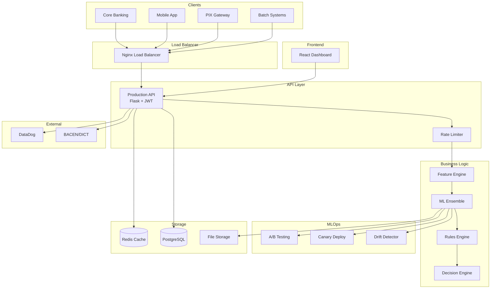
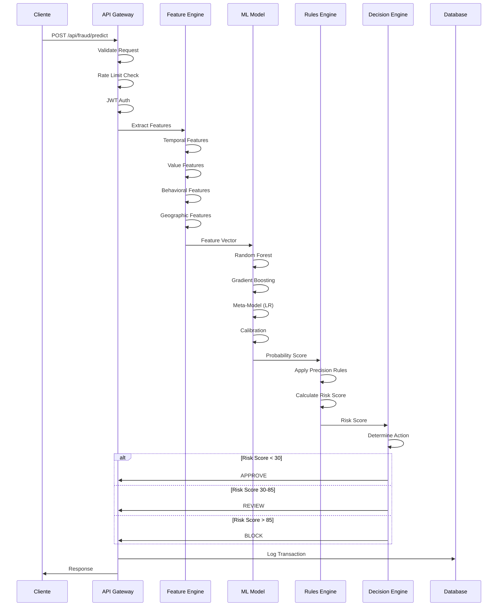
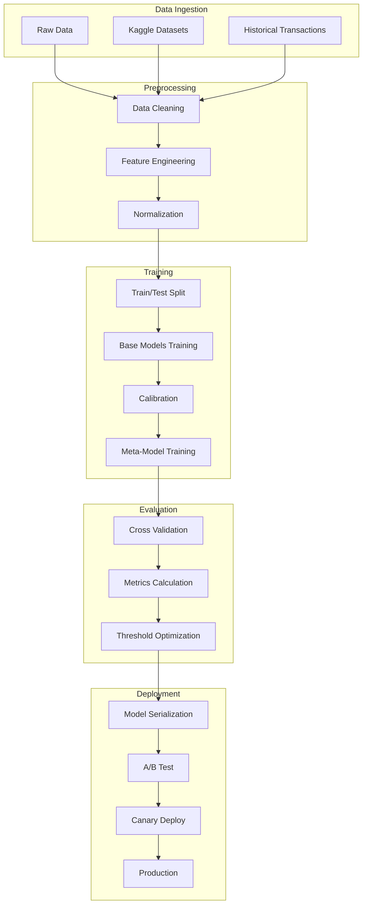
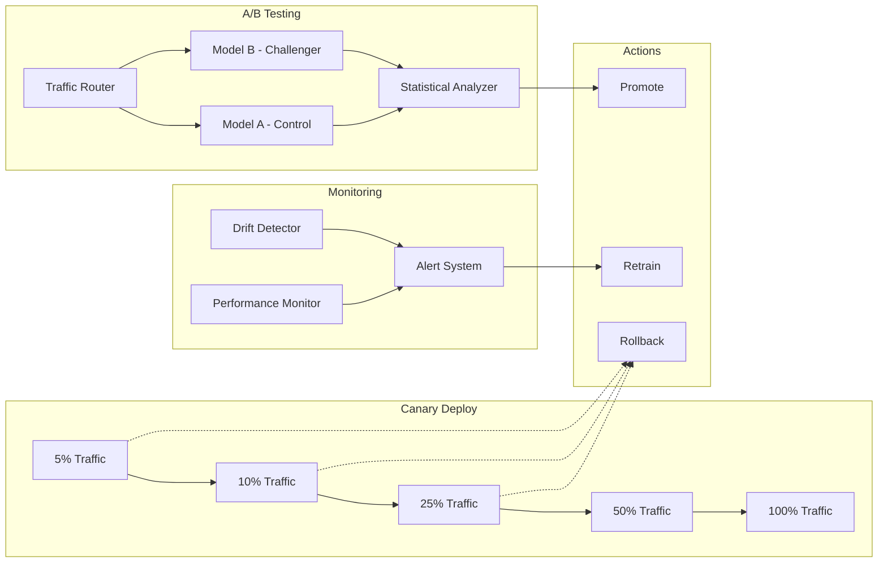
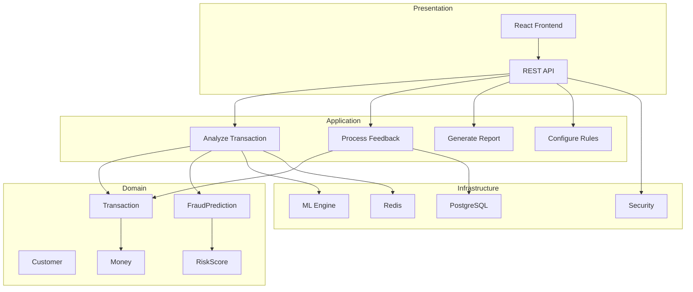
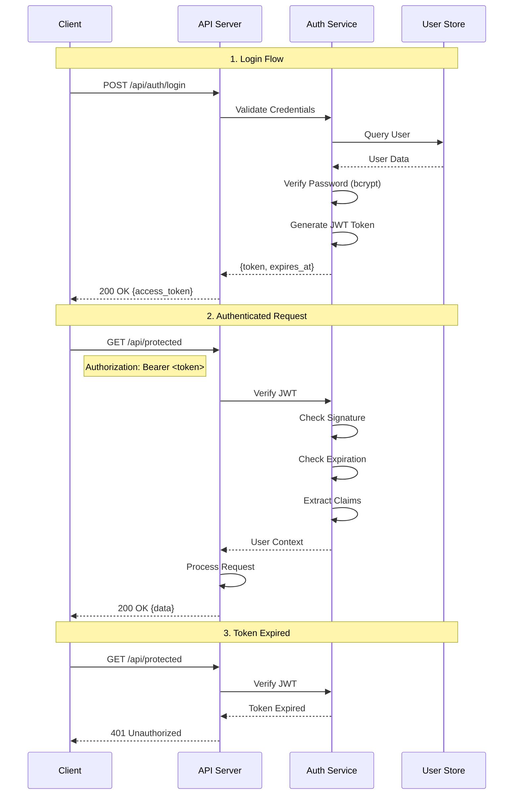

# Sankofa Enterprise Pro - Diagramas e Fluxogramas

**Versão:** 1.0.0  
**Data:** Novembro 2025

---

> **Nota:** Estes diagramas representam a arquitetura implementada e planejada.
> Componentes como Docker/Nginx/DataDog estão planejados para produção.
> O sistema atual opera com Flask API e armazenamento baseado em arquivos.

---

## Sumário

1. [Diagrama de Arquitetura Geral](#1-diagrama-de-arquitetura-geral)
2. [Fluxo de Detecção de Fraudes](#2-fluxo-de-detecção-de-fraudes)
3. [Pipeline de Machine Learning](#3-pipeline-de-machine-learning)
4. [Fluxo MLOps](#4-fluxo-mlops)
5. [Diagrama de Componentes](#5-diagrama-de-componentes)
6. [Fluxo de Autenticação JWT](#6-fluxo-de-autenticação-jwt)
7. [Arquitetura de Cache](#7-arquitetura-de-cache)
8. [Fluxo de Revisão Manual](#8-fluxo-de-revisão-manual)
9. [Diagrama de Deploy Canary](#9-diagrama-de-deploy-canary)
10. [Fluxo de Compliance](#10-fluxo-de-compliance)

---

## 1. Diagrama de Arquitetura Geral



### Diagrama ASCII - Arquitetura Geral

```
┌─────────────────────────────────────────────────────────────────────────────┐
│                        SANKOFA ENTERPRISE PRO                               │
│                      Arquitetura de Sistema                                  │
├─────────────────────────────────────────────────────────────────────────────┤
│                                                                              │
│  ┌─────────────────────────────────────────────────────────────────────┐    │
│  │                         CAMADA DE CLIENTES                           │    │
│  │  ┌──────────┐ ┌──────────┐ ┌──────────┐ ┌──────────┐                │    │
│  │  │  Core    │ │  Mobile  │ │   PIX    │ │  Batch   │                │    │
│  │  │ Banking  │ │   App    │ │ Gateway  │ │ Systems  │                │    │
│  │  └────┬─────┘ └────┬─────┘ └────┬─────┘ └────┬─────┘                │    │
│  └───────│────────────│────────────│────────────│───────────────────────┘    │
│          │            │            │            │                            │
│          └────────────┴─────┬──────┴────────────┘                            │
│                             │                                                │
│                             ▼                                                │
│  ┌─────────────────────────────────────────────────────────────────────┐    │
│  │                      LOAD BALANCER (Nginx)                           │    │
│  │                   • SSL Termination                                  │    │
│  │                   • Health Checks                                    │    │
│  │                   • Traffic Distribution                             │    │
│  └──────────────────────────┬──────────────────────────────────────────┘    │
│                             │                                                │
│                             ▼                                                │
│  ┌─────────────────────────────────────────────────────────────────────┐    │
│  │                        CAMADA DE API                                 │    │
│  │  ┌──────────────────┐  ┌──────────────────┐  ┌──────────────────┐   │    │
│  │  │   Rate Limiter   │  │   JWT Auth       │  │   CORS Handler   │   │    │
│  │  │   1000/min       │  │   HS256          │  │   *              │   │    │
│  │  └────────┬─────────┘  └────────┬─────────┘  └────────┬─────────┘   │    │
│  │           └──────────────────────┴──────────────────────┘            │    │
│  │                              │                                        │    │
│  │                    ┌─────────▼─────────┐                             │    │
│  │                    │   Flask API       │                             │    │
│  │                    │   30+ Endpoints   │                             │    │
│  │                    └─────────┬─────────┘                             │    │
│  └──────────────────────────────│───────────────────────────────────────┘    │
│                                 │                                            │
│                                 ▼                                            │
│  ┌─────────────────────────────────────────────────────────────────────┐    │
│  │                     CAMADA DE PROCESSAMENTO                          │    │
│  │                                                                      │    │
│  │  ┌───────────────┐    ┌───────────────┐    ┌───────────────┐        │    │
│  │  │   Feature     │───▶│   ML Engine   │───▶│   Decision    │        │    │
│  │  │   Engine      │    │   Ensemble    │    │   Engine      │        │    │
│  │  │   47+ feat    │    │   RF+GB+LR    │    │   Rules+Score │        │    │
│  │  └───────────────┘    └───────────────┘    └───────────────┘        │    │
│  │                                                                      │    │
│  └─────────────────────────────────────────────────────────────────────┘    │
│                                 │                                            │
│         ┌───────────────────────┼───────────────────────┐                   │
│         │                       │                       │                   │
│         ▼                       ▼                       ▼                   │
│  ┌─────────────┐         ┌─────────────┐         ┌─────────────┐           │
│  │   MLOPS     │         │   STORAGE   │         │  EXTERNAL   │           │
│  ├─────────────┤         ├─────────────┤         ├─────────────┤           │
│  │ • A/B Test  │         │ • Redis     │         │ • DataDog   │           │
│  │ • Canary    │         │ • PostgreSQL│         │ • BACEN     │           │
│  │ • Drift     │         │ • Files     │         │ • Webhooks  │           │
│  └─────────────┘         └─────────────┘         └─────────────┘           │
│                                                                              │
│  ┌─────────────────────────────────────────────────────────────────────┐    │
│  │                      FRONTEND DASHBOARD                              │    │
│  │         React + Vite + TailwindCSS + shadcn/ui + Recharts            │    │
│  └─────────────────────────────────────────────────────────────────────┘    │
│                                                                              │
└─────────────────────────────────────────────────────────────────────────────┘
```

---

## 2. Fluxo de Detecção de Fraudes



### Diagrama ASCII - Fluxo de Detecção

```
┌─────────────────────────────────────────────────────────────────────────────┐
│                     FLUXO DE DETECÇÃO DE FRAUDE                             │
├─────────────────────────────────────────────────────────────────────────────┤
│                                                                              │
│  ENTRADA                                                                     │
│  ═══════                                                                     │
│                                                                              │
│  ┌──────────────────────────────────────────────────────────────────────┐   │
│  │  POST /api/fraud/predict                                              │   │
│  │  {                                                                    │   │
│  │    "transaction_id": "TXN-001",                                       │   │
│  │    "amount": 5000.00,                                                 │   │
│  │    "channel": "PIX",                                                  │   │
│  │    "customer_id": "CUST-123",                                         │   │
│  │    "timestamp": "2025-11-27T14:30:00Z"                                │   │
│  │  }                                                                    │   │
│  └─────────────────────────────────┬────────────────────────────────────┘   │
│                                    │                                         │
│                                    ▼                                         │
│  VALIDAÇÃO                                                                   │
│  ═════════                                                                   │
│                                                                              │
│  ┌───────────────┐   ┌───────────────┐   ┌───────────────┐                 │
│  │  Rate Limit   │──▶│   JWT Auth    │──▶│   Validate    │                 │
│  │  Check        │   │   Verify      │   │   Schema      │                 │
│  └───────────────┘   └───────────────┘   └───────────────┘                 │
│         │                   │                   │                           │
│         │ [FAIL]            │ [FAIL]            │ [FAIL]                    │
│         ▼                   ▼                   ▼                           │
│    429 Too Many        401 Unauthorized    400 Bad Request                  │
│                                    │                                         │
│                                    ▼                                         │
│  FEATURE EXTRACTION (47+ features)                                           │
│  ══════════════════                                                          │
│                                                                              │
│  ┌──────────────────────────────────────────────────────────────────────┐   │
│  │                                                                       │   │
│  │  TEMPORAIS          VALOR             COMPORTAMENTO    GEOGRÁFICAS   │   │
│  │  ───────────        ─────             ─────────────    ───────────   │   │
│  │  • hour             • amount_log      • velocity_1h    • distance    │   │
│  │  • day_of_week      • amount_sq       • velocity_24h   • loc_risk    │   │
│  │  • is_weekend       • is_round        • new_merchant   • is_intl     │   │
│  │  • is_night         • amount_z        • device_change                │   │
│  │  • is_business      • normalized                                     │   │
│  │                                                                       │   │
│  └─────────────────────────────────┬────────────────────────────────────┘   │
│                                    │                                         │
│                                    ▼                                         │
│  ML ENSEMBLE                                                                 │
│  ══════════                                                                  │
│                                                                              │
│  ┌──────────────────────────────────────────────────────────────────────┐   │
│  │                                                                       │   │
│  │         ┌─────────────────┐       ┌─────────────────┐                │   │
│  │         │  Random Forest  │       │ Gradient Boost  │                │   │
│  │         │  n=100, d=15    │       │  n=100, d=8     │                │   │
│  │         └────────┬────────┘       └────────┬────────┘                │   │
│  │                  │                         │                          │   │
│  │                  └───────────┬─────────────┘                          │   │
│  │                              │                                        │   │
│  │                              ▼                                        │   │
│  │                   ┌─────────────────────┐                             │   │
│  │                   │    CALIBRATION      │                             │   │
│  │                   │   (Isotonic/Platt)  │                             │   │
│  │                   └──────────┬──────────┘                             │   │
│  │                              │                                        │   │
│  │                              ▼                                        │   │
│  │                   ┌─────────────────────┐                             │   │
│  │                   │    META-MODEL       │                             │   │
│  │                   │ Logistic Regression │                             │   │
│  │                   └──────────┬──────────┘                             │   │
│  │                              │                                        │   │
│  │                              ▼                                        │   │
│  │                    Probability: 0.85                                  │   │
│  │                                                                       │   │
│  └─────────────────────────────────┬────────────────────────────────────┘   │
│                                    │                                         │
│                                    ▼                                         │
│  PRECISION RULES                                                             │
│  ═══════════════                                                             │
│                                                                              │
│  ┌──────────────────────────────────────────────────────────────────────┐   │
│  │                                                                       │   │
│  │  ┌─────────────────────────────────────────────────────────────┐     │   │
│  │  │  Rule: extreme_amount_suspicious_hour                        │     │   │
│  │  │  IF amount > 50000 AND hour IN [0,1,2,3,4,23]               │     │   │
│  │  │  THEN probability += 0.30                                    │     │   │
│  │  └─────────────────────────────────────────────────────────────┘     │   │
│  │                                                                       │   │
│  │  ┌─────────────────────────────────────────────────────────────┐     │   │
│  │  │  Rule: velocity_burst                                        │     │   │
│  │  │  IF transactions_30min > 50                                  │     │   │
│  │  │  THEN probability += 0.40                                    │     │   │
│  │  └─────────────────────────────────────────────────────────────┘     │   │
│  │                                                                       │   │
│  │  ┌─────────────────────────────────────────────────────────────┐     │   │
│  │  │  Rule: high_risk_combination                                 │     │   │
│  │  │  IF location_risk > 0.9 AND device_risk > 0.9               │     │   │
│  │  │  THEN probability += 0.50                                    │     │   │
│  │  └─────────────────────────────────────────────────────────────┘     │   │
│  │                                                                       │   │
│  └─────────────────────────────────┬────────────────────────────────────┘   │
│                                    │                                         │
│                                    ▼                                         │
│  DECISION                                                                    │
│  ════════                                                                    │
│                                                                              │
│  ┌──────────────────────────────────────────────────────────────────────┐   │
│  │                                                                       │   │
│  │         Risk Score: probability × 100 = 85                           │   │
│  │                                                                       │   │
│  │         ┌─────────┬─────────┬─────────┬─────────┬─────────┐          │   │
│  │         │  0-30   │  31-50  │  51-70  │  71-85  │  86-100 │          │   │
│  │         │  LOW    │  MED-L  │  MEDIUM │  HIGH   │ CRITICAL│          │   │
│  │         │ APPROVE │ APPROVE │ MONITOR │ REVIEW  │  BLOCK  │          │   │
│  │         └─────────┴─────────┴─────────┴────┬────┴─────────┘          │   │
│  │                                            │                          │   │
│  │                                     ───────┴───────                   │   │
│  │                                     │   HIGH    │                     │   │
│  │                                     │  REVIEW   │                     │   │
│  │                                     └───────────┘                     │   │
│  │                                                                       │   │
│  └─────────────────────────────────┬────────────────────────────────────┘   │
│                                    │                                         │
│                                    ▼                                         │
│  RESPOSTA                                                                    │
│  ════════                                                                    │
│                                                                              │
│  ┌──────────────────────────────────────────────────────────────────────┐   │
│  │  {                                                                    │   │
│  │    "success": true,                                                   │   │
│  │    "prediction": {                                                    │   │
│  │      "transaction_id": "TXN-001",                                     │   │
│  │      "is_fraud": true,                                                │   │
│  │      "fraud_probability": 0.85,                                       │   │
│  │      "risk_score": 85.0,                                              │   │
│  │      "risk_level": "HIGH",                                            │   │
│  │      "confidence": 0.92,                                              │   │
│  │      "processing_time_ms": 8.5,                                       │   │
│  │      "model_version": "1.0.0",                                        │   │
│  │      "detection_reason": ["suspicious_hour", "high_amount"]           │   │
│  │    }                                                                  │   │
│  │  }                                                                    │   │
│  └──────────────────────────────────────────────────────────────────────┘   │
│                                                                              │
└─────────────────────────────────────────────────────────────────────────────┘
```

---

## 3. Pipeline de Machine Learning



### Diagrama ASCII - Pipeline ML

```
┌─────────────────────────────────────────────────────────────────────────────┐
│                          PIPELINE DE MACHINE LEARNING                        │
├─────────────────────────────────────────────────────────────────────────────┤
│                                                                              │
│  ┌───────────────────────────────────────────────────────────────────────┐  │
│  │                         1. DATA INGESTION                              │  │
│  │                                                                        │  │
│  │    ┌─────────────┐    ┌─────────────┐    ┌─────────────┐              │  │
│  │    │   Kaggle    │    │ Historical  │    │   Real-time │              │  │
│  │    │  Datasets   │    │Transactions │    │   Stream    │              │  │
│  │    │  (4+ sets)  │    │  (5 years)  │    │   (live)    │              │  │
│  │    └──────┬──────┘    └──────┬──────┘    └──────┬──────┘              │  │
│  │           └──────────────────┼──────────────────┘                      │  │
│  └──────────────────────────────│────────────────────────────────────────┘  │
│                                 │                                            │
│                                 ▼                                            │
│  ┌───────────────────────────────────────────────────────────────────────┐  │
│  │                       2. PREPROCESSING                                 │  │
│  │                                                                        │  │
│  │    ┌────────────────────────────────────────────────────────────┐     │  │
│  │    │  Data Cleaning                                              │     │  │
│  │    │  • Remove duplicates                                        │     │  │
│  │    │  • Handle missing values (median imputation)                │     │  │
│  │    │  • Outlier detection and treatment                          │     │  │
│  │    └───────────────────────────┬────────────────────────────────┘     │  │
│  │                                │                                       │  │
│  │    ┌────────────────────────────────────────────────────────────┐     │  │
│  │    │  Feature Engineering (47+ features)                         │     │  │
│  │    │  • Temporal: hour, day, weekend, night, business_hours     │     │  │
│  │    │  • Value: log, squared, zscore, normalized                  │     │  │
│  │    │  • Behavioral: velocity, patterns, anomalies                │     │  │
│  │    │  • Geographic: distance, risk_score, international          │     │  │
│  │    └───────────────────────────┬────────────────────────────────┘     │  │
│  │                                │                                       │  │
│  │    ┌────────────────────────────────────────────────────────────┐     │  │
│  │    │  Normalization                                              │     │  │
│  │    │  • StandardScaler (mean=0, std=1)                           │     │  │
│  │    │  • Save scaler for inference                                │     │  │
│  │    └───────────────────────────┬────────────────────────────────┘     │  │
│  └──────────────────────────────────────────────────────────────────────┘  │
│                                 │                                            │
│                                 ▼                                            │
│  ┌───────────────────────────────────────────────────────────────────────┐  │
│  │                         3. TRAINING                                    │  │
│  │                                                                        │  │
│  │    ┌────────────────────────────────────────────────────────────┐     │  │
│  │    │  Train/Test Split                                           │     │  │
│  │    │  • 80% Training / 20% Test                                  │     │  │
│  │    │  • Stratified by target (fraud/legit)                       │     │  │
│  │    └───────────────────────────┬────────────────────────────────┘     │  │
│  │                                │                                       │  │
│  │    ┌────────────────────────────────────────────────────────────┐     │  │
│  │    │  Base Models (Layer 0)                                      │     │  │
│  │    │                                                             │     │  │
│  │    │  ┌──────────────┐  ┌──────────────┐                        │     │  │
│  │    │  │Random Forest │  │Gradient Boost│                        │     │  │
│  │    │  │n=100, d=15   │  │n=100, d=8    │                        │     │  │
│  │    │  │balanced      │  │lr=0.1        │                        │     │  │
│  │    │  └──────┬───────┘  └──────┬───────┘                        │     │  │
│  │    └─────────│─────────────────│────────────────────────────────┘     │  │
│  │              │                 │                                       │  │
│  │    ┌─────────▼─────────────────▼────────────────────────────────┐     │  │
│  │    │  Probability Calibration                                    │     │  │
│  │    │  CalibratedClassifierCV(method='isotonic', cv=5)            │     │  │
│  │    └───────────────────────────┬────────────────────────────────┘     │  │
│  │                                │                                       │  │
│  │    ┌────────────────────────────────────────────────────────────┐     │  │
│  │    │  Meta-Model (Layer 1)                                       │     │  │
│  │    │  LogisticRegression(balanced, max_iter=1000)                │     │  │
│  │    │  Input: calibrated probabilities from base models           │     │  │
│  │    └───────────────────────────┬────────────────────────────────┘     │  │
│  └──────────────────────────────────────────────────────────────────────┘  │
│                                 │                                            │
│                                 ▼                                            │
│  ┌───────────────────────────────────────────────────────────────────────┐  │
│  │                        4. EVALUATION                                   │  │
│  │                                                                        │  │
│  │    ┌────────────────────────────────────────────────────────────┐     │  │
│  │    │  Cross-Validation (5-fold)                                  │     │  │
│  │    │  • Stratified K-Fold                                        │     │  │
│  │    │  • Consistency across folds                                 │     │  │
│  │    └────────────────────────────────────────────────────────────┘     │  │
│  │                                                                        │  │
│  │    ┌────────────────────────────────────────────────────────────┐     │  │
│  │    │  Metrics                                                    │     │  │
│  │    │  ┌──────────┬──────────┬──────────┬──────────┬──────────┐ │     │  │
│  │    │  │ Accuracy │Precision │  Recall  │ F1-Score │ ROC-AUC  │ │     │  │
│  │    │  │  99.9%   │  100%    │  96.7%   │  98.3%   │  99.8%   │ │     │  │
│  │    │  └──────────┴──────────┴──────────┴──────────┴──────────┘ │     │  │
│  │    └────────────────────────────────────────────────────────────┘     │  │
│  │                                                                        │  │
│  │    ┌────────────────────────────────────────────────────────────┐     │  │
│  │    │  Threshold Optimization                                     │     │  │
│  │    │  • F1-Score maximization                                    │     │  │
│  │    │  • Business constraints (FPR < 1%)                          │     │  │
│  │    │  • Optimal threshold: 0.5                                   │     │  │
│  │    └────────────────────────────────────────────────────────────┘     │  │
│  └───────────────────────────────────────────────────────────────────────┘  │
│                                 │                                            │
│                                 ▼                                            │
│  ┌───────────────────────────────────────────────────────────────────────┐  │
│  │                       5. DEPLOYMENT                                    │  │
│  │                                                                        │  │
│  │    ┌──────────────┐ ┌──────────────┐ ┌──────────────┐ ┌─────────────┐ │  │
│  │    │   Joblib     │ │   A/B Test   │ │    Canary    │ │  Production │ │  │
│  │    │ Serialization│─▶│   5% / 95%   │─▶│  5%→10%→25% │─▶│    100%     │ │  │
│  │    └──────────────┘ └──────────────┘ └──────────────┘ └─────────────┘ │  │
│  └───────────────────────────────────────────────────────────────────────┘  │
│                                                                              │
└─────────────────────────────────────────────────────────────────────────────┘
```

---

## 4. Fluxo MLOps



### Diagrama ASCII - MLOps

```
┌─────────────────────────────────────────────────────────────────────────────┐
│                              FLUXO MLOPS                                     │
├─────────────────────────────────────────────────────────────────────────────┤
│                                                                              │
│  ┌───────────────────────────────────────────────────────────────────────┐  │
│  │                      DRIFT DETECTION                                   │  │
│  │                                                                        │  │
│  │    Production       Baseline                                           │  │
│  │    Distribution     Distribution                                       │  │
│  │    ┌─────────┐      ┌─────────┐                                       │  │
│  │    │ █  █    │      │    █    │     Jensen-Shannon                    │  │
│  │    │ █  █ █  │  vs  │   ███   │  ─▶  Divergence                       │  │
│  │    │ █ ██ █  │      │  █████  │      = 0.15                           │  │
│  │    └─────────┘      └─────────┘                                       │  │
│  │                                                                        │  │
│  │    Severity Levels:                                                    │  │
│  │    ┌──────────┬──────────┬──────────┬──────────┐                      │  │
│  │    │   LOW    │  MEDIUM  │   HIGH   │ CRITICAL │                      │  │
│  │    │ PSI<0.1  │ PSI<0.25 │ PSI<0.5  │ PSI>=0.5 │                      │  │
│  │    │ Monitor  │Investigate│ Retrain │ URGENT!  │                      │  │
│  │    └──────────┴──────────┴──────────┴──────────┘                      │  │
│  └───────────────────────────────────────────────────────────────────────┘  │
│                                                                              │
│  ┌───────────────────────────────────────────────────────────────────────┐  │
│  │                       A/B TESTING                                      │  │
│  │                                                                        │  │
│  │                    ┌─────────────────┐                                 │  │
│  │    Request ──────▶ │  Traffic Router │                                 │  │
│  │                    │  (Hash-based)   │                                 │  │
│  │                    └────────┬────────┘                                 │  │
│  │                             │                                          │  │
│  │              ┌──────────────┼──────────────┐                          │  │
│  │              │              │              │                          │  │
│  │              ▼              ▼              ▼                          │  │
│  │       ┌───────────┐  ┌───────────┐  ┌───────────┐                    │  │
│  │       │  Model A  │  │  Model B  │  │  Model C  │                    │  │
│  │       │ (Control) │  │(Challenger│  │(Challenger│                    │  │
│  │       │   60%     │  │    20%    │  │    20%    │                    │  │
│  │       └─────┬─────┘  └─────┬─────┘  └─────┬─────┘                    │  │
│  │             │              │              │                          │  │
│  │             └──────────────┼──────────────┘                          │  │
│  │                            │                                          │  │
│  │                            ▼                                          │  │
│  │                 ┌─────────────────────┐                               │  │
│  │                 │ Statistical Analysis│                               │  │
│  │                 │ • Chi-square test   │                               │  │
│  │                 │ • p-value < 0.05    │                               │  │
│  │                 │ • Confidence: 95%   │                               │  │
│  │                 └─────────────────────┘                               │  │
│  │                                                                        │  │
│  │    Metrics Comparison:                                                 │  │
│  │    ┌──────────┬──────────┬──────────┬──────────┐                      │  │
│  │    │  Model   │ Accuracy │ Latency  │   FPR    │                      │  │
│  │    ├──────────┼──────────┼──────────┼──────────┤                      │  │
│  │    │ Model A  │  99.8%   │  8.5ms   │  0.3%    │                      │  │
│  │    │ Model B  │  99.9%   │  9.2ms   │  0.2%    │  ← Winner            │  │
│  │    │ Model C  │  99.7%   │  7.8ms   │  0.5%    │                      │  │
│  │    └──────────┴──────────┴──────────┴──────────┘                      │  │
│  └───────────────────────────────────────────────────────────────────────┘  │
│                                                                              │
│  ┌───────────────────────────────────────────────────────────────────────┐  │
│  │                      CANARY DEPLOYMENT                                 │  │
│  │                                                                        │  │
│  │    ┌─────┐   ┌─────┐   ┌─────┐   ┌─────┐   ┌─────┐                   │  │
│  │    │ 5%  │──▶│ 10% │──▶│ 25% │──▶│ 50% │──▶│100% │                   │  │
│  │    └──┬──┘   └──┬──┘   └──┬──┘   └──┬──┘   └─────┘                   │  │
│  │       │         │         │         │                                 │  │
│  │       ▼         ▼         ▼         ▼                                 │  │
│  │    Health    Health    Health    Health                               │  │
│  │    Check     Check     Check     Check                                │  │
│  │       │         │         │         │                                 │  │
│  │       ├─ PASS ──┼─ PASS ──┼─ PASS ──┼─ PASS ──▶ COMPLETE             │  │
│  │       │         │         │         │                                 │  │
│  │       └─ FAIL ──┴─ FAIL ──┴─ FAIL ──┴─ FAIL ──▶ ROLLBACK             │  │
│  │                                                                        │  │
│  │    Health Check Criteria:                                              │  │
│  │    ✓ Error Rate < 1%                                                   │  │
│  │    ✓ Latency P95 < 15ms                                                │  │
│  │    ✓ Accuracy > 99%                                                    │  │
│  │    ✓ FPR < 0.5%                                                        │  │
│  └───────────────────────────────────────────────────────────────────────┘  │
│                                                                              │
└─────────────────────────────────────────────────────────────────────────────┘
```

---

## 5. Diagrama de Componentes



---

## 6. Fluxo de Autenticação JWT



### Diagrama ASCII - JWT Flow

```
┌─────────────────────────────────────────────────────────────────────────────┐
│                        FLUXO DE AUTENTICAÇÃO JWT                            │
├─────────────────────────────────────────────────────────────────────────────┤
│                                                                              │
│  1. LOGIN                                                                    │
│  ════════                                                                    │
│                                                                              │
│  Client                      API Server                     User Store       │
│    │                            │                              │             │
│    │  POST /api/auth/login      │                              │             │
│    │  {username, password}      │                              │             │
│    │ ──────────────────────────▶│                              │             │
│    │                            │  Query User                  │             │
│    │                            │ ─────────────────────────────▶            │
│    │                            │                              │             │
│    │                            │  User Data                   │             │
│    │                            │ ◀─────────────────────────────            │
│    │                            │                              │             │
│    │                            │  ┌────────────────────┐      │             │
│    │                            │  │ Verify Password    │      │             │
│    │                            │  │ (bcrypt compare)   │      │             │
│    │                            │  └────────────────────┘      │             │
│    │                            │                              │             │
│    │                            │  ┌────────────────────┐      │             │
│    │                            │  │ Generate JWT       │      │             │
│    │                            │  │ ┌────────────────┐ │      │             │
│    │                            │  │ │ Header         │ │      │             │
│    │                            │  │ │ {alg: HS256}   │ │      │             │
│    │                            │  │ └────────────────┘ │      │             │
│    │                            │  │ ┌────────────────┐ │      │             │
│    │                            │  │ │ Payload        │ │      │             │
│    │                            │  │ │ {sub, role,    │ │      │             │
│    │                            │  │ │  exp, iat}     │ │      │             │
│    │                            │  │ └────────────────┘ │      │             │
│    │                            │  │ ┌────────────────┐ │      │             │
│    │                            │  │ │ Signature      │ │      │             │
│    │                            │  │ │ HMAC(secret)   │ │      │             │
│    │                            │  │ └────────────────┘ │      │             │
│    │                            │  └────────────────────┘      │             │
│    │                            │                              │             │
│    │  200 OK                    │                              │             │
│    │  {access_token: "xxx..."}  │                              │             │
│    │ ◀──────────────────────────│                              │             │
│                                                                              │
│  2. AUTHENTICATED REQUEST                                                    │
│  ═════════════════════════                                                   │
│                                                                              │
│  Client                      API Server                                      │
│    │                            │                                            │
│    │  GET /api/fraud/predict    │                                            │
│    │  Authorization: Bearer xxx │                                            │
│    │ ──────────────────────────▶│                                            │
│    │                            │                                            │
│    │                            │  ┌────────────────────┐                    │
│    │                            │  │ Verify Token       │                    │
│    │                            │  │ • Check signature  │                    │
│    │                            │  │ • Check expiration │                    │
│    │                            │  │ • Extract claims   │                    │
│    │                            │  └────────────────────┘                    │
│    │                            │                                            │
│    │                            │  ┌────────────────────┐                    │
│    │                            │  │ Set g.user =       │                    │
│    │                            │  │ {id, role, perms}  │                    │
│    │                            │  └────────────────────┘                    │
│    │                            │                                            │
│    │                            │  ┌────────────────────┐                    │
│    │                            │  │ Process Request    │                    │
│    │                            │  └────────────────────┘                    │
│    │                            │                                            │
│    │  200 OK {prediction}       │                                            │
│    │ ◀──────────────────────────│                                            │
│                                                                              │
│  3. ERROR SCENARIOS                                                          │
│  ══════════════════                                                          │
│                                                                              │
│  ┌──────────────────────┬────────────────────────────────────────┐          │
│  │  Scenario            │  Response                               │          │
│  ├──────────────────────┼────────────────────────────────────────┤          │
│  │  Missing token       │  401 {error: "Missing Authorization"}  │          │
│  │  Invalid signature   │  401 {error: "Invalid token"}          │          │
│  │  Expired token       │  401 {error: "Token expired"}          │          │
│  │  Invalid format      │  401 {error: "Invalid token format"}   │          │
│  │  Insufficient perms  │  403 {error: "Access denied"}          │          │
│  └──────────────────────┴────────────────────────────────────────┘          │
│                                                                              │
└─────────────────────────────────────────────────────────────────────────────┘
```

---

## 7. Arquitetura de Cache

```
┌─────────────────────────────────────────────────────────────────────────────┐
│                         ARQUITETURA DE CACHE                                │
├─────────────────────────────────────────────────────────────────────────────┤
│                                                                              │
│                              REQUEST                                         │
│                                 │                                            │
│                                 ▼                                            │
│                    ┌─────────────────────────┐                              │
│                    │       CACHE LAYER       │                              │
│                    │      (Cache Manager)    │                              │
│                    └────────────┬────────────┘                              │
│                                 │                                            │
│                                 ▼                                            │
│               ┌─────────────────────────────────────┐                       │
│               │          L1: IN-MEMORY              │                       │
│               │     ┌───────────────────────┐       │                       │
│               │     │   LRU Cache (1000)    │       │                       │
│               │     │   TTL: configurable   │       │                       │
│               │     │   Latency: <1ms       │       │                       │
│               │     └───────────────────────┘       │                       │
│               │                 │                   │                       │
│               │    HIT ─────────┤──────── MISS      │                       │
│               │     │           │           │       │                       │
│               │     ▼           │           ▼       │                       │
│               │  RETURN         │      CONTINUE     │                       │
│               └─────────────────│───────────────────┘                       │
│                                 │                                            │
│                                 ▼                                            │
│               ┌─────────────────────────────────────┐                       │
│               │          L2: REDIS                  │                       │
│               │     ┌───────────────────────┐       │                       │
│               │     │   Redis Cluster       │       │                       │
│               │     │   Pool: 100 conns     │       │                       │
│               │     │   Latency: 1-5ms      │       │                       │
│               │     └───────────────────────┘       │                       │
│               │                 │                   │                       │
│               │    HIT ─────────┤──────── MISS/DOWN │                       │
│               │     │           │           │       │                       │
│               │     ▼           │           ▼       │                       │
│               │  RETURN         │     ┌───────────┐ │                       │
│               │  + Populate L1  │     │ FALLBACK  │ │                       │
│               │                 │     │ In-memory │ │                       │
│               │                 │     └───────────┘ │                       │
│               └─────────────────│───────────────────┘                       │
│                                 │                                            │
│                                 ▼                                            │
│               ┌─────────────────────────────────────┐                       │
│               │          COMPUTATION                │                       │
│               │     ┌───────────────────────┐       │                       │
│               │     │   ML Model Inference  │       │                       │
│               │     │   Database Query      │       │                       │
│               │     │   API Call            │       │                       │
│               │     └───────────────────────┘       │                       │
│               │                 │                   │                       │
│               │                 ▼                   │                       │
│               │           STORE IN CACHE            │                       │
│               │           (L1 + L2)                 │                       │
│               └─────────────────────────────────────┘                       │
│                                                                              │
│  CACHE KEYS:                                                                 │
│  ┌─────────────────────────────────────────────────────────────────────┐    │
│  │  txn:{id}           │  Transaction data        │  TTL: 1h          │    │
│  │  user:{id}:profile  │  User profile            │  TTL: 30min       │    │
│  │  pred:{id}          │  Prediction result       │  TTL: 5min        │    │
│  │  metrics:current    │  Dashboard metrics       │  TTL: 1min        │    │
│  │  config:{name}      │  Configuration           │  TTL: 10min       │    │
│  └─────────────────────────────────────────────────────────────────────┘    │
│                                                                              │
└─────────────────────────────────────────────────────────────────────────────┘
```

---

## 8. Fluxo de Revisão Manual

```
┌─────────────────────────────────────────────────────────────────────────────┐
│                       FLUXO DE REVISÃO MANUAL (HITL)                        │
├─────────────────────────────────────────────────────────────────────────────┤
│                                                                              │
│  ┌───────────────────────────────────────────────────────────────────────┐  │
│  │                         ENTRADA NA FILA                                │  │
│  │                                                                        │  │
│  │    Transaction        Score: 82 (HIGH)                                 │  │
│  │    TXN-001           ─────────────────▶  REVIEW QUEUE                 │  │
│  │                      (auto-routing)     (priority sorted)              │  │
│  └───────────────────────────────────────────────────────────────────────┘  │
│                                 │                                            │
│                                 ▼                                            │
│  ┌───────────────────────────────────────────────────────────────────────┐  │
│  │                         FILA DE REVISÃO                                │  │
│  │                                                                        │  │
│  │    ┌─────────────────────────────────────────────────────────────┐    │  │
│  │    │  Priority   │ Transaction │ Score │ Time in Queue │ SLA    │    │  │
│  │    ├─────────────┼─────────────┼───────┼───────────────┼────────┤    │  │
│  │    │  CRITICAL   │  TXN-005    │  95   │  00:30        │  1min  │    │  │
│  │    │  HIGH       │  TXN-001    │  82   │  02:15        │  5min  │    │  │
│  │    │  HIGH       │  TXN-003    │  78   │  03:45        │  5min  │    │  │
│  │    │  MEDIUM     │  TXN-008    │  65   │  08:20        │ 15min  │    │  │
│  │    └─────────────┴─────────────┴───────┴───────────────┴────────┘    │  │
│  └───────────────────────────────────────────────────────────────────────┘  │
│                                 │                                            │
│                                 ▼                                            │
│  ┌───────────────────────────────────────────────────────────────────────┐  │
│  │                      ANÁLISE DO ANALISTA                               │  │
│  │                                                                        │  │
│  │   ┌─────────────────────────────────────────────────────────────────┐ │  │
│  │   │  INFORMAÇÕES DA TRANSAÇÃO                                       │ │  │
│  │   │                                                                  │ │  │
│  │   │  ID: TXN-001                Amount: R$ 15.000,00                 │ │  │
│  │   │  Canal: PIX                 Timestamp: 27/11/2025 03:45:00       │ │  │
│  │   │  Cliente: João Silva        Destino: Loja XYZ                    │ │  │
│  │   └─────────────────────────────────────────────────────────────────┘ │  │
│  │                                                                        │  │
│  │   ┌─────────────────────────────────────────────────────────────────┐ │  │
│  │   │  ANÁLISE DE RISCO                                                │ │  │
│  │   │                                                                  │ │  │
│  │   │  Score: 82/100 (HIGH)                                            │ │  │
│  │   │                                                                  │ │  │
│  │   │  Razões:                                                         │ │  │
│  │   │  ⚠ Horário incomum (03:45 - madrugada)                          │ │  │
│  │   │  ⚠ Valor acima da média do cliente (média: R$ 2.000)             │ │  │
│  │   │  ⚠ Novo destinatário                                             │ │  │
│  │   └─────────────────────────────────────────────────────────────────┘ │  │
│  │                                                                        │  │
│  │   ┌─────────────────────────────────────────────────────────────────┐ │  │
│  │   │  HISTÓRICO DO CLIENTE                                            │ │  │
│  │   │                                                                  │ │  │
│  │   │  Cliente desde: 2020       Transações: 342                       │ │  │
│  │   │  Média mensal: R$ 8.500    Fraudes anteriores: 0                 │ │  │
│  │   │  Últimas 5 transações: OK  Contestações: 1                       │ │  │
│  │   └─────────────────────────────────────────────────────────────────┘ │  │
│  │                                                                        │  │
│  └───────────────────────────────────────────────────────────────────────┘  │
│                                 │                                            │
│                                 ▼                                            │
│  ┌───────────────────────────────────────────────────────────────────────┐  │
│  │                           DECISÃO                                      │  │
│  │                                                                        │  │
│  │       ┌──────────────┐  ┌──────────────┐  ┌──────────────┐            │  │
│  │       │   APROVAR    │  │   BLOQUEAR   │  │   ESCALAR    │            │  │
│  │       │              │  │              │  │              │            │  │
│  │       │  ✓ Libera    │  │  ✗ Bloqueia  │  │  ⬆ Envia ao  │            │  │
│  │       │    transação │  │    transação │  │   supervisor │            │  │
│  │       │  ✓ Notifica  │  │  ✗ Notifica  │  │  ⬆ Mantém    │            │  │
│  │       │    cliente   │  │    cliente   │  │   pendente   │            │  │
│  │       │  ✓ Feedback  │  │  ✗ Registra  │  │              │            │  │
│  │       │    positivo  │  │    fraude    │  │              │            │  │
│  │       └──────────────┘  └──────────────┘  └──────────────┘            │  │
│  │                                                                        │  │
│  │       Justificativa: [____________________________________]            │  │
│  │                                                                        │  │
│  └───────────────────────────────────────────────────────────────────────┘  │
│                                 │                                            │
│                                 ▼                                            │
│  ┌───────────────────────────────────────────────────────────────────────┐  │
│  │                       REGISTRO E FEEDBACK                              │  │
│  │                                                                        │  │
│  │    ┌─────────────┐    ┌─────────────┐    ┌─────────────┐              │  │
│  │    │  Audit Log  │    │  Feedback   │    │  Metrics    │              │  │
│  │    │  (Compliance)│    │  Loop (ML)  │    │  Update     │              │  │
│  │    └─────────────┘    └─────────────┘    └─────────────┘              │  │
│  │                                                                        │  │
│  └───────────────────────────────────────────────────────────────────────┘  │
│                                                                              │
└─────────────────────────────────────────────────────────────────────────────┘
```

---

## 9. Diagrama de Deploy Canary

```
┌─────────────────────────────────────────────────────────────────────────────┐
│                        CANARY DEPLOYMENT FLOW                               │
├─────────────────────────────────────────────────────────────────────────────┤
│                                                                              │
│  CONFIGURAÇÃO INICIAL                                                        │
│  ════════════════════                                                        │
│                                                                              │
│  ┌──────────────────────────────────────────────────────────────────────┐   │
│  │  deployment_id: "deploy-2025-001"                                     │   │
│  │  current_version: "1.0.0"                                             │   │
│  │  canary_version: "1.1.0"                                              │   │
│  │  promotion_steps: [5%, 10%, 25%, 50%, 100%]                           │   │
│  │  step_duration: 10 minutes                                            │   │
│  │  rollback_threshold: error_rate > 5%                                  │   │
│  └──────────────────────────────────────────────────────────────────────┘   │
│                                                                              │
│  PROGRESSÃO DO DEPLOY                                                        │
│  ════════════════════                                                        │
│                                                                              │
│  ┌─────────────────────────────────────────────────────────────────────┐    │
│  │                                                                      │    │
│  │  STEP 1: 5%             STEP 2: 10%           STEP 3: 25%           │    │
│  │  ┌───────────────┐     ┌───────────────┐     ┌───────────────┐      │    │
│  │  │ ▓             │     │ ▓▓            │     │ ▓▓▓▓▓         │      │    │
│  │  │ ░░░░░░░░░░░░░░│     │ ░░░░░░░░░░░░░ │     │ ░░░░░░░░░░░░░ │      │    │
│  │  │ ░░░░░░░░░░░░░░│     │ ░░░░░░░░░░░░░ │     │ ░░░░░░░░░░░░░ │      │    │
│  │  │ ░░░░░░░░░░░░░░│     │ ░░░░░░░░░░░░░ │     │ ░░░░░░░░░░░░░ │      │    │
│  │  └───────────────┘     └───────────────┘     └───────────────┘      │    │
│  │                                                                      │    │
│  │  STEP 4: 50%           STEP 5: 100%                                 │    │
│  │  ┌───────────────┐     ┌───────────────┐                            │    │
│  │  │ ▓▓▓▓▓▓▓▓▓▓    │     │ ▓▓▓▓▓▓▓▓▓▓▓▓▓▓│                            │    │
│  │  │ ░░░░░░░░░░░░░ │     │ ▓▓▓▓▓▓▓▓▓▓▓▓▓▓│                            │    │
│  │  │ ░░░░░░░░░░░░░ │     │ ▓▓▓▓▓▓▓▓▓▓▓▓▓▓│                            │    │
│  │  │ ░░░░░░░░░░░░░ │     │ ▓▓▓▓▓▓▓▓▓▓▓▓▓▓│                            │    │
│  │  └───────────────┘     └───────────────┘                            │    │
│  │                                                                      │    │
│  │  ▓ = Canary (new)      ░ = Stable (current)                         │    │
│  │                                                                      │    │
│  └─────────────────────────────────────────────────────────────────────┘    │
│                                                                              │
│  HEALTH CHECKS EM CADA STEP                                                  │
│  ═══════════════════════════                                                 │
│                                                                              │
│  ┌──────────────────────────────────────────────────────────────────────┐   │
│  │                                                                       │   │
│  │   Metric          │  Threshold   │  Current  │  Status               │   │
│  │  ─────────────────┼──────────────┼───────────┼─────────────────      │   │
│  │   Error Rate      │  < 1%        │  0.3%     │  ✓ HEALTHY            │   │
│  │   Latency P95     │  < 15ms      │  9.2ms    │  ✓ HEALTHY            │   │
│  │   Accuracy        │  > 99%       │  99.8%    │  ✓ HEALTHY            │   │
│  │   False Positive  │  < 0.5%      │  0.2%     │  ✓ HEALTHY            │   │
│  │                                                                       │   │
│  │   Overall Status: HEALTHY - Proceed to next step                     │   │
│  │                                                                       │   │
│  └──────────────────────────────────────────────────────────────────────┘   │
│                                                                              │
│  CENÁRIOS DE ROLLBACK                                                        │
│  ════════════════════                                                        │
│                                                                              │
│  ┌──────────────────────────────────────────────────────────────────────┐   │
│  │                                                                       │   │
│  │   Trigger Condition                        │  Action                  │   │
│  │  ──────────────────────────────────────────┼────────────────────     │   │
│  │   Error Rate > 5%                          │  IMMEDIATE ROLLBACK     │   │
│  │   Latency P95 > 50ms                       │  IMMEDIATE ROLLBACK     │   │
│  │   3 consecutive failed health checks       │  IMMEDIATE ROLLBACK     │   │
│  │   Manual intervention                      │  IMMEDIATE ROLLBACK     │   │
│  │   Accuracy drop > 2%                       │  IMMEDIATE ROLLBACK     │   │
│  │                                                                       │   │
│  │   Rollback Process:                                                   │   │
│  │   1. Stop routing traffic to canary                                   │   │
│  │   2. Route 100% to stable version                                     │   │
│  │   3. Log rollback reason                                              │   │
│  │   4. Alert engineering team                                           │   │
│  │   5. Preserve canary metrics for analysis                             │   │
│  │                                                                       │   │
│  └──────────────────────────────────────────────────────────────────────┘   │
│                                                                              │
└─────────────────────────────────────────────────────────────────────────────┘
```

---

## 10. Fluxo de Compliance

```
┌─────────────────────────────────────────────────────────────────────────────┐
│                         FLUXO DE COMPLIANCE                                 │
├─────────────────────────────────────────────────────────────────────────────┤
│                                                                              │
│  ┌───────────────────────────────────────────────────────────────────────┐  │
│  │                            BACEN                                       │  │
│  │                                                                        │  │
│  │    Transação Suspeita                                                  │  │
│  │           │                                                            │  │
│  │           ▼                                                            │  │
│  │    ┌─────────────────┐    ┌─────────────────┐    ┌──────────────┐    │  │
│  │    │  Registro no    │───▶│  Exportação     │───▶│  DICT/SPI    │    │  │
│  │    │  Sistema Local  │    │  para BACEN     │    │  (BACEN)     │    │  │
│  │    └─────────────────┘    └─────────────────┘    └──────────────┘    │  │
│  │                                                                        │  │
│  │    Requisitos:                                                         │  │
│  │    ✓ Tempo de resposta PIX < 10s                                       │  │
│  │    ✓ Compartilhamento de dados de fraude                               │  │
│  │    ✓ Registro de transações suspeitas                                  │  │
│  │    ✓ Comunicação ao cliente                                            │  │
│  └───────────────────────────────────────────────────────────────────────┘  │
│                                                                              │
│  ┌───────────────────────────────────────────────────────────────────────┐  │
│  │                            LGPD                                        │  │
│  │                                                                        │  │
│  │    ┌─────────────────────────────────────────────────────────────┐    │  │
│  │    │                    DATA LIFECYCLE                            │    │  │
│  │    │                                                              │    │  │
│  │    │  COLETA ──▶ PROCESSAMENTO ──▶ ARMAZENAMENTO ──▶ DESCARTE    │    │  │
│  │    │    │              │                 │              │         │    │  │
│  │    │    ▼              ▼                 ▼              ▼         │    │  │
│  │    │  Consent      Purpose           Encryption     Retention     │    │  │
│  │    │  Check        Limitation        AES-256        Policy        │    │  │
│  │    │              (fraud only)                     (5 years)       │    │  │
│  │    └─────────────────────────────────────────────────────────────┘    │  │
│  │                                                                        │  │
│  │    Direitos do Titular:                                                │  │
│  │    ├─ Acesso: API GET /api/data-subject/{id}                          │  │
│  │    ├─ Correção: API PUT /api/data-subject/{id}                        │  │
│  │    ├─ Eliminação: Processo definido (respeitando retenção legal)       │  │
│  │    └─ Portabilidade: API GET /api/data-subject/{id}/export             │  │
│  └───────────────────────────────────────────────────────────────────────┘  │
│                                                                              │
│  ┌───────────────────────────────────────────────────────────────────────┐  │
│  │                           PCI-DSS                                      │  │
│  │                                                                        │  │
│  │    ┌─────────────────────────────────────────────────────────────┐    │  │
│  │    │                    SECURITY CONTROLS                         │    │  │
│  │    │                                                              │    │  │
│  │    │  ┌──────────┐  ┌──────────┐  ┌──────────┐  ┌──────────┐    │    │  │
│  │    │  │ Firewall │  │  Access  │  │ Encrypt  │  │  Monitor │    │    │  │
│  │    │  │  Rules   │  │  Control │  │  Data    │  │  & Log   │    │    │  │
│  │    │  │ (Req.1)  │  │ (Req.7-8)│  │ (Req.3-4)│  │ (Req.10) │    │    │  │
│  │    │  └──────────┘  └──────────┘  └──────────┘  └──────────┘    │    │  │
│  │    │                                                              │    │  │
│  │    │  ┌──────────┐  ┌──────────┐  ┌──────────┐  ┌──────────┐    │    │  │
│  │    │  │  Secure  │  │  Vuln    │  │  Pentest │  │  Policy  │    │    │  │
│  │    │  │  Config  │  │  Mgmt    │  │  Annual  │  │  Docs    │    │    │  │
│  │    │  │ (Req.2)  │  │ (Req.5-6)│  │ (Req.11) │  │ (Req.12) │    │    │  │
│  │    │  └──────────┘  └──────────┘  └──────────┘  └──────────┘    │    │  │
│  │    └─────────────────────────────────────────────────────────────┘    │  │
│  └───────────────────────────────────────────────────────────────────────┘  │
│                                                                              │
│  ┌───────────────────────────────────────────────────────────────────────┐  │
│  │                          AUDIT TRAIL                                   │  │
│  │                                                                        │  │
│  │    ┌─────────────────────────────────────────────────────────────┐    │  │
│  │    │  Event                │ Data Logged            │ Retention  │    │  │
│  │    ├───────────────────────┼────────────────────────┼────────────┤    │  │
│  │    │  Transaction Analysis │ ID, Score, Decision    │ 5 years    │    │  │
│  │    │  Manual Review        │ Analyst, Action, Time  │ 5 years    │    │  │
│  │    │  Config Change        │ User, Before, After    │ 5 years    │    │  │
│  │    │  Login/Logout         │ User, IP, Timestamp    │ 2 years    │    │  │
│  │    │  Data Access          │ User, Data, Purpose    │ 2 years    │    │  │
│  │    │  Model Deploy         │ Version, Metrics       │ 5 years    │    │  │
│  │    └─────────────────────────────────────────────────────────────┘    │  │
│  └───────────────────────────────────────────────────────────────────────┘  │
│                                                                              │
└─────────────────────────────────────────────────────────────────────────────┘
```

---

## Apêndice: Limitações dos Diagramas

### Componentes Planejados (Não Mostrados em Produção Atual)

Os seguintes diagramas incluem componentes planejados para produção futura:

| Componente | Diagrama | Status |
|-----------|----------|--------|
| Nginx Load Balancer | 1, 4, 5 | 📋 Planejado |
| Docker Containers | 1, 4, 5 | 📋 Planejado |
| DataDog Monitoring | 1, 12 | 📋 Planejado |
| PostgreSQL Primary | 1, 7 | ⚠️ Fallback JSON |
| Redis Primary Cache | 1, 7 | ⚠️ Fallback In-Memory |
| A/B Testing (Operacional) | 4, 6 | 📋 Conceitual |
| Canary Deploy (Automático) | 4, 9 | 📋 Conceitual |
| TLS 1.3 / AES-256 | Vários | 📋 Planejado |

### Como Interpretar

- **🟢 Verde/Implementado**: Funcionalidade pronta para uso
- **🟡 Amarelo/Parcial**: Funcionalidade básica implementada, melhorias em progresso
- **📋 Azul/Planejado**: Funcionalidade projetada mas não implementada
- **⚠️ Laranja/Fallback**: Sistema funciona com alternativa em desenvolvimento

### Diagramas Mais Confiáveis

Para ambiente atual (desenvolvimento):
- ✅ Diagrama 1 (Arquitetura sem Nginx/Docker)
- ✅ Diagrama 2 (Fluxo de Detecção - operacional)
- ✅ Diagrama 3 (Pipeline ML - operacional)
- ✅ Diagrama 6 (JWT - operacional)
- ✅ Diagrama 8 (Revisão Manual - operacional)

---

**Documento mantido por:** Equipe de Engenharia Sankofa  
**Última atualização:** Novembro 2025  
**Versão:** 1.0.0
