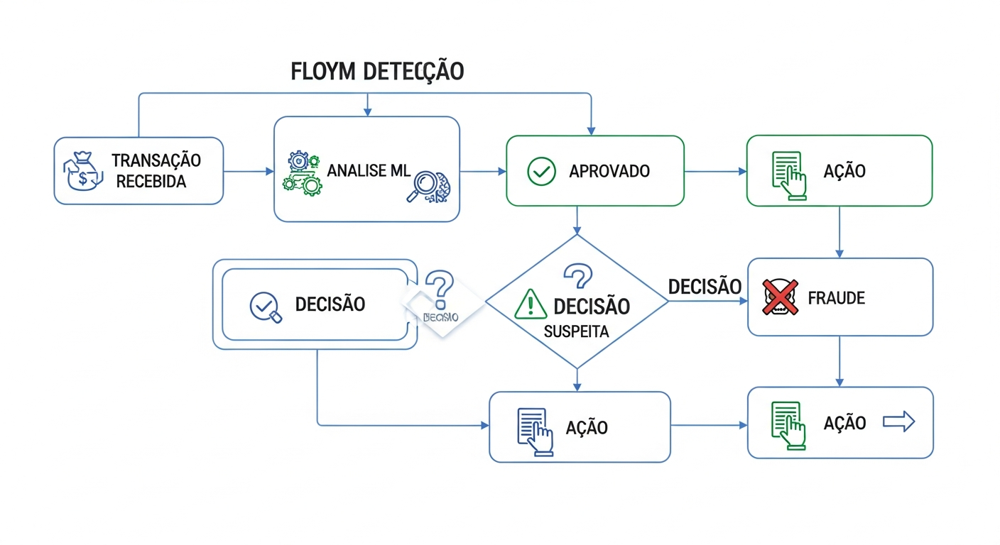
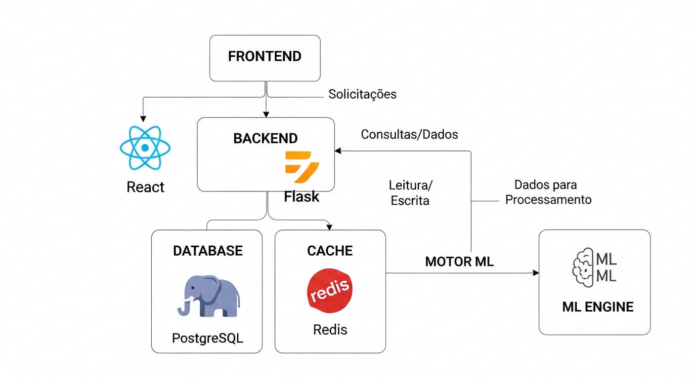
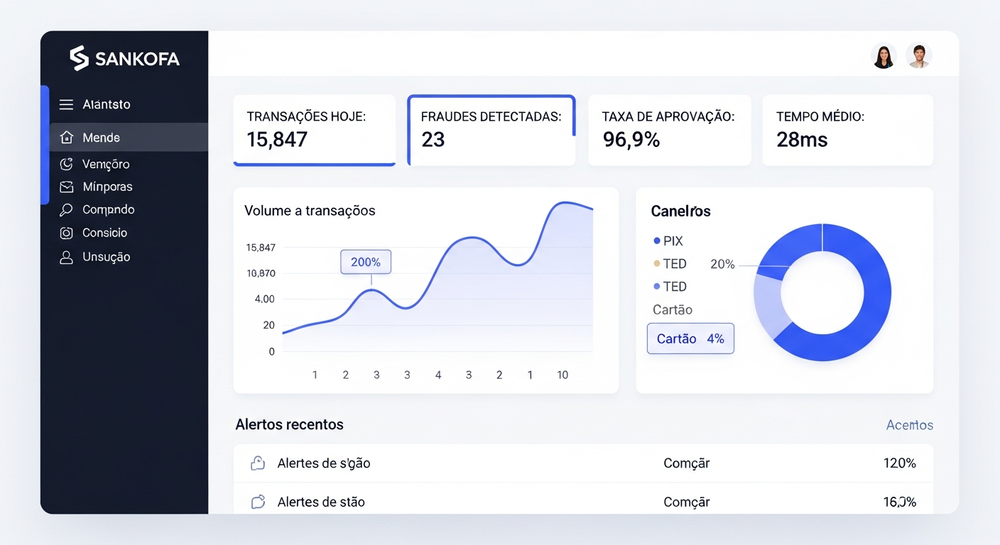
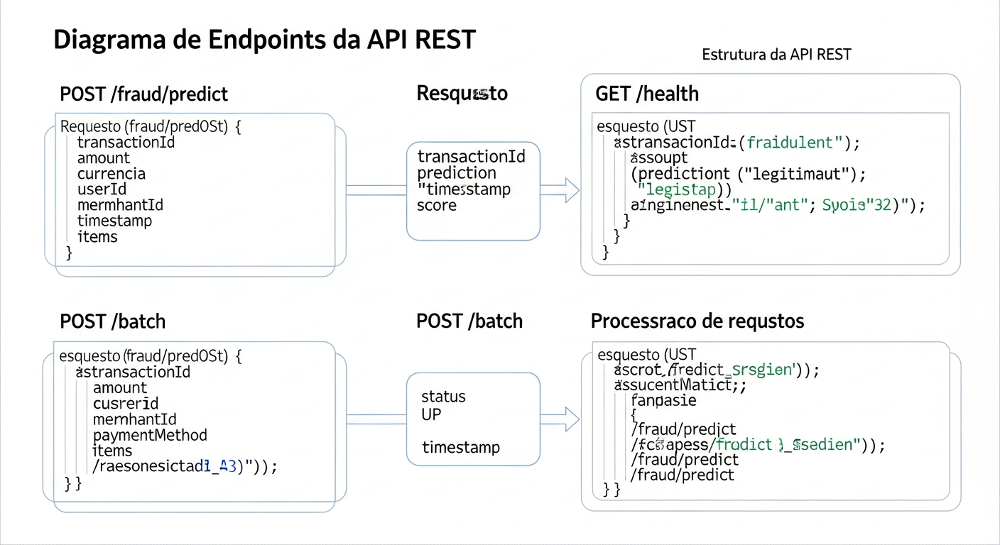

# Documentacao Funcional - Sankofa Enterprise Pro v12.4

## Sistema de Deteccao de Fraudes para Instituicoes Financeiras



**Versao:** 12.4  
**Ultima Atualizacao:** 28 de Novembro de 2025  
**Status:** Producao - 136 Testes Passando (100%)

---

## Indice Visual

```
+==================================================================+
|                    MAPA DA DOCUMENTACAO FUNCIONAL                 |
+==================================================================+
|                                                                   |
|  ┌───────────────────────────────────────────────────────────┐   |
|  │  1. VISAO GERAL DO SISTEMA                                 │   |
|  │     • O que e o Sankofa?                                   │   |
|  │     • Para quem e este sistema?                            │   |
|  │     • Capacidades                                          │   |
|  └────────────────────────────┬──────────────────────────────┘   |
|                               ▼                                   |
|  ┌───────────────────────────────────────────────────────────┐   |
|  │  2. NOVOS RECURSOS v12.0                                   │   |
|  │     • Explicabilidade LGPD                                 │   |
|  │     • Observabilidade Prometheus                           │   |
|  │     • Infraestrutura de Escala                             │   |
|  └────────────────────────────┬──────────────────────────────┘   |
|                               ▼                                   |
|  ┌───────────────────────────────────────────────────────────┐   |
|  │  3. CASOS DE USO                                           │   |
|  │     • Analise tempo real                                   │   |
|  │     • Processamento batch                                  │   |
|  │     • Monitoramento SLA                                    │   |
|  └────────────────────────────┬──────────────────────────────┘   |
|                               ▼                                   |
|  ┌───────────────────────────────────────────────────────────┐   |
|  │  4. REGRAS DE NEGOCIO                                      │   |
|  │     • Classificacao de risco                               │   |
|  │     • Thresholds de decisao                                │   |
|  │     • Acoes automaticas                                    │   |
|  └────────────────────────────┬──────────────────────────────┘   |
|                               ▼                                   |
|  ┌───────────────────────────────────────────────────────────┐   |
|  │  5. COMPLIANCE                                             │   |
|  │     • LGPD                                                 │   |
|  │     • BACEN                                                │   |
|  │     • PCI DSS                                              │   |
|  └───────────────────────────────────────────────────────────┘   |
|                                                                   |
+==================================================================+
```

---

## Estado do Sistema



```
+==============================================================================+
|                         DASHBOARD DE STATUS                                   |
+==============================================================================+
|                                                                               |
|  ┌─────────────────────────────────────────────────────────────────────────┐ |
|  │                       COMPONENTES DO SISTEMA                             │ |
|  │                                                                          │ |
|  │  ┌─────────────┐  ┌─────────────┐  ┌─────────────┐  ┌─────────────┐     │ |
|  │  │ API BACKEND │  │  FRONTEND   │  │  ML ENGINE  │  │  DATABASE   │     │ |
|  │  │             │  │             │  │             │  │             │     │ |
|  │  │  ┌─────┐    │  │  ┌─────┐    │  │  ┌─────┐    │  │  ┌─────┐    │     │ |
|  │  │  │ ✅  │    │  │  │ ✅  │    │  │  │ ✅  │    │  │  │ ✅  │    │     │ |
|  │  │  │ ON  │    │  │  │ ON  │    │  │  │ ON  │    │  │  │ ON  │    │     │ |
|  │  │  └─────┘    │  │  └─────┘    │  │  └─────┘    │  │  └─────┘    │     │ |
|  │  │             │  │             │  │             │  │             │     │ |
|  │  │ 50+ endpts  │  │ 9 paginas   │  │ Stacking    │  │ PostgreSQL  │     │ |
|  │  └─────────────┘  └─────────────┘  └─────────────┘  └─────────────┘     │ |
|  │                                                                          │ |
|  │  ┌─────────────┐  ┌─────────────┐  ┌─────────────┐  ┌─────────────┐     │ |
|  │  │EXPLAINABIL. │  │OBSERVABIL.  │  │INFRASTRUTURA│  │   TESTES    │     │ |
|  │  │             │  │             │  │             │  │             │     │ |
|  │  │  ┌─────┐    │  │  ┌─────┐    │  │  ┌─────┐    │  │  ┌─────┐    │     │ |
|  │  │  │ ✅  │    │  │  │ ✅  │    │  │  │ ✅  │    │  │  │ ✅  │    │     │ |
|  │  │  │ ON  │    │  │  │ ON  │    │  │  │ ON  │    │  │  │25/25│    │     │ |
|  │  │  └─────┘    │  │  └─────┘    │  │  └─────┘    │  │  └─────┘    │     │ |
|  │  │             │  │             │  │             │  │             │     │ |
|  │  │ SHAP/LGPD   │  │ Prometheus  │  │ 33.88 TPS   │  │ 100% pass   │     │ |
|  │  └─────────────┘  └─────────────┘  └─────────────┘  └─────────────┘     │ |
|  │                                                                          │ |
|  └─────────────────────────────────────────────────────────────────────────┘ |
|                                                                               |
+==============================================================================+
```

---

## 1. Visao Geral do Sistema

### 1.1 O que e o Sankofa?



O **Sankofa Enterprise Pro** e um sistema de deteccao de fraudes financeiras que analisa transacoes em tempo real usando Inteligencia Artificial.

### Tipos de Transacao Analisados

```
+==============================================================================+
|                    TIPOS DE TRANSACAO SUPORTADOS                              |
+==============================================================================+
|                                                                               |
|  O sistema analisa TODOS os tipos de transacao bancaria:                      |
|                                                                               |
|  ┌───────────────────────────────────────────────────────────────────────┐   |
|  │                                                                        │   |
|  │   💸 PIX                        💳 CARTAO DE CREDITO                  │   |
|  │   ─────────────                 ─────────────────────                  │   |
|  │   Transferencias instantaneas   Compras presenciais e online          │   |
|  │   24 horas por dia              Parceladas ou a vista                 │   |
|  │   Chaves: CPF, email, tel       Nacional e internacional              │   |
|  │   RISCO ALTO (irreversivel)     RISCO MEDIO (chargeback)              │   |
|  │                                                                        │   |
|  │   💳 CARTAO DE DEBITO           🏦 TED / DOC                          │   |
|  │   ─────────────────────         ─────────────                          │   |
|  │   Saques em ATM                 Transferencias bancarias              │   |
|  │   Compras presenciais           Entre contas de bancos                │   |
|  │   Desconto direto na conta      Horario bancario (TED)                │   |
|  │   RISCO BAIXO (cartao+senha)    RISCO MEDIO                           │   |
|  │                                                                        │   |
|  └───────────────────────────────────────────────────────────────────────┘   |
|                                                                               |
|  ESTATISTICAS DE FRAUDE POR TIPO (baseado em dados historicos):               |
|  +-----------------------------------------------------------------------+   |
|  | TIPO       | % DO VOLUME | % DAS FRAUDES | FRAUDE MAIS COMUM          |   |
|  +------------+-------------+---------------+----------------------------+   |
|  | PIX        |     45%     |      52%      | Engenharia social          |   |
|  | CREDITO    |     30%     |      28%      | Clonagem / vazamento       |   |
|  | DEBITO     |     15%     |      12%      | Clonagem fisica            |   |
|  | TED/DOC    |     10%     |       8%      | Golpe do boleto            |   |
|  +-----------------------------------------------------------------------+   |
|                                                                               |
+==============================================================================+
```

```
+==============================================================================+
|                         O QUE O SANKOFA FAZ?                                  |
+==============================================================================+
|                                                                               |
|                              TRANSACAO                                        |
|                               ENTRA                                           |
|                                 │                                             |
|                                 ▼                                             |
|                    ┌──────────────────────┐                                  |
|                    │    SANKOFA ANALISA    │                                  |
|                    │                       │                                  |
|                    │  ┌─────────────────┐  │                                  |
|                    │  │   47+ Fatores   │  │                                  |
|                    │  │   Analisados    │  │                                  |
|                    │  └─────────────────┘  │                                  |
|                    │                       │                                  |
|                    │  ┌─────────────────┐  │                                  |
|                    │  │  3 Modelos IA   │  │                                  |
|                    │  │   Trabalhando   │  │                                  |
|                    │  └─────────────────┘  │                                  |
|                    │                       │                                  |
|                    │  Tempo: ~30ms         │                                  |
|                    │                       │                                  |
|                    └───────────┬───────────┘                                  |
|                                │                                              |
|                   ┌────────────┼────────────┐                                |
|                   │            │            │                                |
|                   ▼            ▼            ▼                                |
|              ┌────────┐   ┌────────┐   ┌────────┐                            |
|              │APROVAR │   │REVISAR │   │BLOQUEAR│                            |
|              │   ✅   │   │   ⚠️   │   │   🚫   │                            |
|              │        │   │        │   │        │                            |
|              │Score<30│   │30-85   │   │Score>85│                            |
|              └────────┘   └────────┘   └────────┘                            |
|                                                                               |
+==============================================================================+
```

### 1.2 Para Quem e Este Sistema?

```
+==============================================================================+
|                          PERFIS DE USUARIOS                                   |
+==============================================================================+
|                                                                               |
|  ┌─────────────────────────────────────────────────────────────────────────┐ |
|  │                                                                          │ |
|  │   ┌──────────────────────┐      ANALISTA DE FRAUDE                      │ |
|  │   │                      │                                               │ |
|  │   │        👤            │      O que faz:                               │ |
|  │   │     Analista         │      • Investiga alertas                      │ |
|  │   │                      │      • Revisa transacoes suspeitas            │ |
|  │   └──────────────────────┘      • Toma decisoes finais                   │ |
|  │                                                                          │ |
|  │   ┌──────────────────────┐      GESTOR DE RISCO                         │ |
|  │   │                      │                                               │ |
|  │   │        👔            │      O que faz:                               │ |
|  │   │       Gestor         │      • Monitora KPIs                          │ |
|  │   │                      │      • Ajusta thresholds                      │ |
|  │   └──────────────────────┘      • Define politicas                       │ |
|  │                                                                          │ |
|  │   ┌──────────────────────┐      COMPLIANCE OFFICER                      │ |
|  │   │                      │                                               │ |
|  │   │        📋            │      O que faz:                               │ |
|  │   │     Compliance       │      • Gera relatorios                        │ |
|  │   │                      │      • Audita decisoes                        │ |
|  │   └──────────────────────┘      • Garante LGPD                           │ |
|  │                                                                          │ |
|  │   ┌──────────────────────┐      ADMINISTRADOR TI                        │ |
|  │   │                      │                                               │ |
|  │   │        💻            │      O que faz:                               │ |
|  │   │        TI            │      • Configura sistema                      │ |
|  │   │                      │      • Monitora performance                   │ |
|  │   └──────────────────────┘      • Resolve problemas                      │ |
|  │                                                                          │ |
|  └─────────────────────────────────────────────────────────────────────────┘ |
|                                                                               |
+==============================================================================+
```

### 1.3 Capacidades do Sistema

```
+==============================================================================+
|                    FUNCIONALIDADES DISPONIVEIS                                |
+==============================================================================+
|                                                                               |
|  ┌─────────────────────────────────────────────────────────────────────────┐ |
|  │                     RECURSOS DE PRODUCAO                                 │ |
|  │                                                                          │ |
|  │   DETECCAO EM TEMPO REAL                                                 │ |
|  │   ━━━━━━━━━━━━━━━━━━━━━━                                                 │ |
|  │   ┌────────────────────────────────────────────────────────────────┐    │ |
|  │   │  POST /api/fraud/predict                                        │    │ |
|  │   │                                                                  │    │ |
|  │   │  • Analisa transacao em ~30ms                                   │    │ |
|  │   │  • Retorna score de risco (0-100)                               │    │ |
|  │   │  • Explica por que flagrou (LGPD)                               │    │ |
|  │   │  • Sugere acao (APROVAR/REVISAR/BLOQUEAR)                       │    │ |
|  │   └────────────────────────────────────────────────────────────────┘    │ |
|  │                                                                          │ |
|  │   PROCESSAMENTO EM BATCH                                                 │ |
|  │   ━━━━━━━━━━━━━━━━━━━━━━━                                                │ |
|  │   ┌────────────────────────────────────────────────────────────────┐    │ |
|  │   │  POST /api/infrastructure/batch/process                         │    │ |
|  │   │                                                                  │    │ |
|  │   │  • Processa 50+ transacoes de uma vez                           │    │ |
|  │   │  • Throughput: 33.88 TPS                                        │    │ |
|  │   │  • Paralelismo com 8 workers                                    │    │ |
|  │   └────────────────────────────────────────────────────────────────┘    │ |
|  │                                                                          │ |
|  │   DASHBOARD INTERATIVO                                                   │ |
|  │   ━━━━━━━━━━━━━━━━━━━━━                                                  │ |
|  │   ┌────────────────────────────────────────────────────────────────┐    │ |
|  │   │  9 Paginas React                                                │    │ |
|  │   │                                                                  │    │ |
|  │   │  ├── Dashboard      - Visao geral                               │    │ |
|  │   │  ├── Transacoes     - Lista e busca                             │    │ |
|  │   │  ├── Calibragem     - Ajuste de modelos                         │    │ |
|  │   │  ├── Investigacao   - Central de casos                          │    │ |
|  │   │  ├── Revisao Manual - Fila de pendencias                        │    │ |
|  │   │  ├── Monitoramento  - Metricas em tempo real                    │    │ |
|  │   │  ├── Relatorios     - Exportacao de dados                       │    │ |
|  │   │  ├── Metricas       - Performance do ML                         │    │ |
|  │   │  └── Alertas        - Notificacoes                              │    │ |
|  │   └────────────────────────────────────────────────────────────────┘    │ |
|  │                                                                          │ |
|  └─────────────────────────────────────────────────────────────────────────┘ |
|                                                                               |
+==============================================================================+
```

---

## 2. Novos Recursos v12.0

### 2.1 Explicabilidade LGPD (NOVO)


```
+==============================================================================+
|                    EXPLICABILIDADE LGPD                                       |
+==============================================================================+
|                                                                               |
|  O QUE E?                                                                     |
|  ━━━━━━━━                                                                     |
|  Cada vez que o sistema detecta uma transacao suspeita, ele agora            |
|  explica EM TEXTO o motivo. Isso e obrigatorio pela Lei LGPD.                |
|                                                                               |
|  ┌─────────────────────────────────────────────────────────────────────────┐ |
|  │                                                                          │ |
|  │  ARTIGO 20 DA LGPD                                                       │ |
|  │  ━━━━━━━━━━━━━━━━━                                                       │ |
|  │                                                                          │ |
|  │  "O titular dos dados tem direito a solicitar a revisao de decisoes     │ |
|  │   tomadas unicamente com base em tratamento automatizado de dados        │ |
|  │   pessoais que afetem seus interesses..."                               │ |
|  │                                                                          │ |
|  │  TRADUCAO: Se a IA bloqueou a transacao do cliente, ele tem             │ |
|  │            direito de saber POR QUE.                                     │ |
|  │                                                                          │ |
|  └─────────────────────────────────────────────────────────────────────────┘ |
|                                                                               |
|  COMO FUNCIONA?                                                               |
|  ━━━━━━━━━━━━━━                                                               |
|                                                                               |
|  ┌─────────────────────────────────────────────────────────────────────────┐ |
|  │                                                                          │ |
|  │  ANTES (sem explicabilidade):                                            │ |
|  │  ┌──────────────────────────────────────────────────────────────────┐   │ |
|  │  │  {                                                                │   │ |
|  │  │    "is_fraud": true,                                              │   │ |
|  │  │    "risk_score": 87.5                                             │   │ |
|  │  │  }                                                                │   │ |
|  │  │                                                                    │   │ |
|  │  │  PROBLEMA: Por que? O que o sistema viu?                          │   │ |
|  │  └──────────────────────────────────────────────────────────────────┘   │ |
|  │                                                                          │ |
|  │  AGORA (com explicabilidade):                                            │ |
|  │  ┌──────────────────────────────────────────────────────────────────┐   │ |
|  │  │  {                                                                │   │ |
|  │  │    "is_fraud": true,                                              │   │ |
|  │  │    "risk_score": 87.5,                                            │   │ |
|  │  │                                                                    │   │ |
|  │  │    "explanation_text": "Transacao de alto valor (R$ 15.000)      │   │ |
|  │  │       em horario noturno (03:00) com velocidade transacional      │   │ |
|  │  │       acima do padrao do cliente",                                │   │ |
|  │  │                                                                    │   │ |
|  │  │    "top_risk_factors": [                                          │   │ |
|  │  │      {"feature": "amount", "impact": 0.45}     <-- MOTIVO 1      │   │ |
|  │  │      {"feature": "is_night", "impact": 0.32}   <-- MOTIVO 2      │   │ |
|  │  │    ],                                                             │   │ |
|  │  │                                                                    │   │ |
|  │  │    "lgpd_compliant": true   <-- CONFORMIDADE GARANTIDA           │   │ |
|  │  │  }                                                                │   │ |
|  │  └──────────────────────────────────────────────────────────────────┘   │ |
|  │                                                                          │ |
|  └─────────────────────────────────────────────────────────────────────────┘ |
|                                                                               |
+==============================================================================+
```

### 2.2 Observabilidade Prometheus (NOVO)


```
+==============================================================================+
|                    OBSERVABILIDADE PROMETHEUS                                 |
+==============================================================================+
|                                                                               |
|  O QUE E?                                                                     |
|  ━━━━━━━━                                                                     |
|  Sistema de monitoramento em tempo real que mostra como o sistema esta       |
|  funcionando. Permite identificar problemas ANTES que afetem clientes.       |
|                                                                               |
|  METRICAS DISPONIVEIS                                                         |
|  ━━━━━━━━━━━━━━━━━━━                                                          |
|                                                                               |
|  ┌─────────────────────────────────────────────────────────────────────────┐ |
|  │                        PAINEL DE METRICAS                                │ |
|  │                                                                          │ |
|  │   ┌────────────────┐  ┌────────────────┐  ┌────────────────┐            │ |
|  │   │    LATENCIA    │  │   THROUGHPUT   │  │   ERROR RATE   │            │ |
|  │   │                │  │                │  │                │            │ |
|  │   │   p50: 28ms    │  │   33.88 TPS    │  │     0.0%       │            │ |
|  │   │   p95: 300ms   │  │                │  │                │            │ |
|  │   │   p99: 311ms   │  │  [████████████]│  │  [████████████]│            │ |
|  │   │                │  │                │  │    EXCELENTE   │            │ |
|  │   │  [████████░░░] │  │                │  │                │            │ |
|  │   │      BOM       │  │                │  │                │            │ |
|  │   └────────────────┘  └────────────────┘  └────────────────┘            │ |
|  │                                                                          │ |
|  │   ┌────────────────┐  ┌────────────────┐  ┌────────────────┐            │ |
|  │   │  REQUISICOES   │  │   PREDICOES    │  │    UPTIME      │            │ |
|  │   │                │  │                │  │                │            │ |
|  │   │    15,847      │  │    12,503      │  │    99.9%       │            │ |
|  │   │     total      │  │     total      │  │                │            │ |
|  │   │                │  │                │  │  [████████████]│            │ |
|  │   │  Fraudes: 892  │  │  Legit: 11,611 │  │    EXCELENTE   │            │ |
|  │   │                │  │                │  │                │            │ |
|  │   └────────────────┘  └────────────────┘  └────────────────┘            │ |
|  │                                                                          │ |
|  └─────────────────────────────────────────────────────────────────────────┘ |
|                                                                               |
|  ENDPOINTS DE MONITORAMENTO                                                   |
|  ━━━━━━━━━━━━━━━━━━━━━━━━━━                                                   |
|                                                                               |
|  ┌────────────────────────────────────┬────────────────────────────────────┐ |
|  │  ENDPOINT                          │  DESCRICAO                          │ |
|  ├────────────────────────────────────┼────────────────────────────────────┤ |
|  │  /api/observability/metrics        │  Metricas em formato JSON          │ |
|  │  /api/observability/prometheus     │  Formato para Grafana              │ |
|  │  /api/observability/sla            │  Verificacao de SLA                │ |
|  │  /api/health/detailed              │  Health de cada componente         │ |
|  │  /api/health/live                  │  "Estou vivo?" (Kubernetes)        │ |
|  │  /api/health/ready                 │  "Estou pronto?" (Kubernetes)      │ |
|  └────────────────────────────────────┴────────────────────────────────────┘ |
|                                                                               |
+==============================================================================+
```

### 2.3 Infraestrutura de Escala (NOVO)


```
+==============================================================================+
|                    INFRAESTRUTURA DE ESCALA                                   |
+==============================================================================+
|                                                                               |
|  O QUE E?                                                                     |
|  ━━━━━━━━                                                                     |
|  Componentes que permitem o sistema processar MUITAS transacoes ao           |
|  mesmo tempo sem ficar lento ou cair.                                         |
|                                                                               |
|  COMPONENTES                                                                  |
|  ━━━━━━━━━━━                                                                  |
|                                                                               |
|  ┌─────────────────────────────────────────────────────────────────────────┐ |
|  │                                                                          │ |
|  │  1. BATCH PROCESSOR (Processador em Lote)                                │ |
|  │  ───────────────────────────────────────                                 │ |
|  │                                                                          │ |
|  │  ┌────────────────────────────────────────────────────────────────┐     │ |
|  │  │                                                                 │     │ |
|  │  │  ENTRADA: 50 transacoes ────────────────────────────────────┐  │     │ |
|  │  │                                                              │  │     │ |
|  │  │                    ┌─────────┐                               │  │     │ |
|  │  │                    │ Worker 1│ ──────┐                       │  │     │ |
|  │  │                    ├─────────┤       │                       │  │     │ |
|  │  │                    │ Worker 2│ ──────┤                       │  │     │ |
|  │  │                    ├─────────┤       ├────► SAIDA: 50       │  │     │ |
|  │  │                    │ Worker 3│ ──────┤        predicoes      │  │     │ |
|  │  │                    ├─────────┤       │                       │  │     │ |
|  │  │                    │ Worker 4│ ──────┤                       │  │     │ |
|  │  │                    ├─────────┤       │                       │  │     │ |
|  │  │                    │ Worker 5│ ──────┤      Tempo: 1.5s      │  │     │ |
|  │  │                    ├─────────┤       │      TPS: 33.88       │  │     │ |
|  │  │                    │ Worker 6│ ──────┤                       │  │     │ |
|  │  │                    ├─────────┤       │                       │  │     │ |
|  │  │                    │ Worker 7│ ──────┤                       │  │     │ |
|  │  │                    ├─────────┤       │                       │  │     │ |
|  │  │                    │ Worker 8│ ──────┘                       │  │     │ |
|  │  │                    └─────────┘                               │  │     │ |
|  │  │                                                              │  │     │ |
|  │  └──────────────────────────────────────────────────────────────┘  │     │ |
|  │                                                                          │ |
|  │  2. ASYNC TASK QUEUE (Fila de Tarefas)                                   │ |
|  │  ─────────────────────────────────────                                   │ |
|  │                                                                          │ |
|  │  ┌────────────────────────────────────────────────────────────────┐     │ |
|  │  │                                                                 │     │ |
|  │  │  ┌──────────────────────────────────────────────────────────┐  │     │ |
|  │  │  │  FILA DE PRIORIDADES                                      │  │     │ |
|  │  │  │                                                           │  │     │ |
|  │  │  │  🔴 CRITICAL  ████████░░░░░░░░░░░░░░░░░░░░  (25%)         │  │     │ |
|  │  │  │  🟠 HIGH      ██████████████░░░░░░░░░░░░░░  (35%)         │  │     │ |
|  │  │  │  🟡 NORMAL    ██████████████████░░░░░░░░░░  (30%)         │  │     │ |
|  │  │  │  🟢 LOW       ██████████████████████░░░░░░  (10%)         │  │     │ |
|  │  │  │                                                           │  │     │ |
|  │  │  │  Tarefas criticas sao processadas PRIMEIRO!               │  │     │ |
|  │  │  └───────────────────────────────────────────────────────────┘  │     │ |
|  │  │                                                                 │     │ |
|  │  └────────────────────────────────────────────────────────────────┘     │ |
|  │                                                                          │ |
|  │  3. CIRCUIT BREAKER (Disjuntor)                                          │ |
|  │  ──────────────────────────────                                          │ |
|  │                                                                          │ |
|  │  ┌────────────────────────────────────────────────────────────────┐     │ |
|  │  │                                                                 │     │ |
|  │  │  Protege o sistema contra falhas em cascata                    │     │ |
|  │  │                                                                 │     │ |
|  │  │  ┌────────┐      ┌────────┐      ┌──────────┐                 │     │ |
|  │  │  │ CLOSED │ ──── │  OPEN  │ ──── │HALF-OPEN │                 │     │ |
|  │  │  │  (OK)  │ 5err │(block) │ 30s  │  (test)  │                 │     │ |
|  │  │  └────────┘      └────────┘      └──────────┘                 │     │ |
|  │  │       │                                │                       │     │ |
|  │  │       └────────────────────────────────┘                       │     │ |
|  │  │                      ok                                        │     │ |
|  │  │                                                                 │     │ |
|  │  │  Estado Atual: CLOSED ✅ (operando normalmente)                │     │ |
|  │  │                                                                 │     │ |
|  │  └────────────────────────────────────────────────────────────────┘     │ |
|  │                                                                          │ |
|  └─────────────────────────────────────────────────────────────────────────┘ |
|                                                                               |
+==============================================================================+
```

---

## 3. Casos de Uso Principais

### 3.1 UC01: Analise de Transacao em Tempo Real

```
+==============================================================================+
|                    CASO DE USO: ANALISE EM TEMPO REAL                         |
+==============================================================================+
|                                                                               |
|  ATOR: Sistema Bancario (Core Banking)                                        |
|  OBJETIVO: Avaliar risco de fraude antes de aprovar transacao                 |
|                                                                               |
|  FLUXO:                                                                       |
|  ━━━━━━                                                                       |
|                                                                               |
|   SISTEMA           SANKOFA                               RESULTADO           |
|   BANCARIO          API                                                       |
|      │                │                                                       |
|      │  1. Transacao  │                                                       |
|      │     chega      │                                                       |
|      │ ──────────────▶│                                                       |
|      │                │                                                       |
|      │                │  ┌─────────────────────────────────────────┐          |
|      │                │  │  2. PROCESSAMENTO INTERNO               │          |
|      │                │  │                                         │          |
|      │                │  │  a. Validar dados de entrada            │          |
|      │                │  │  b. Extrair 47+ features                │          |
|      │                │  │  c. Passar por Random Forest            │          |
|      │                │  │  d. Passar por Gradient Boosting        │          |
|      │                │  │  e. Combinar no Meta-model              │          |
|      │                │  │  f. Gerar explicacao SHAP               │          |
|      │                │  │  g. Salvar no banco de dados            │          |
|      │                │  │                                         │          |
|      │                │  │  TEMPO TOTAL: ~30ms                     │          |
|      │                │  └─────────────────────────────────────────┘          |
|      │                │                                                       |
|      │  3. Resposta   │                                                       |
|      │◀───────────────│                                                       |
|      │                │                                                       |
|      │  {                                                                     |
|      │    is_fraud: true,                                                     |
|      │    risk_score: 87.5,                                                   |
|      │    decision: "BLOCK",                                                  |
|      │    explanation: "..."                                                  |
|      │  }                                                                     |
|      │                │                                                       |
|      ▼                │                                                       |
|                                                                               |
|   ACOES POSSIVEIS:                                                            |
|   ┌────────────────────┬───────────────────┬────────────────────┐            |
|   │  Score < 30        │  Score 30-85      │  Score > 85        │            |
|   │                    │                   │                    │            |
|   │  ✅ APROVAR        │  ⚠️ REVISAR       │  🚫 BLOQUEAR       │            |
|   │                    │                   │                    │            |
|   │  Libera transacao  │  Vai para fila    │  Bloqueia e alerta │            |
|   │  automaticamente   │  de revisao manual│  a equipe          │            |
|   └────────────────────┴───────────────────┴────────────────────┘            |
|                                                                               |
+==============================================================================+
```

### 3.2 UC02: Processamento em Batch

```
+==============================================================================+
|                    CASO DE USO: PROCESSAMENTO EM BATCH                        |
+==============================================================================+
|                                                                               |
|  ATOR: Sistema de Reconciliacao                                               |
|  OBJETIVO: Processar grande volume de transacoes                              |
|                                                                               |
|  FLUXO:                                                                       |
|  ━━━━━━                                                                       |
|                                                                               |
|   SISTEMA              SANKOFA                          RESULTADO             |
|   RECONCILIACAO        API                                                    |
|      │                   │                                                    |
|      │  ┌─────────────┐  │                                                    |
|      │  │ 50 transac. │  │                                                    |
|      │  │   de uma    │  │                                                    |
|      │  │    vez      │  │                                                    |
|      │  └──────┬──────┘  │                                                    |
|      │         │         │                                                    |
|      │ ────────┴────────▶│                                                    |
|      │                   │                                                    |
|      │                   │  ┌───────────────────────────────────────┐         |
|      │                   │  │     PROCESSAMENTO PARALELO            │         |
|      │                   │  │                                       │         |
|      │                   │  │  ┌─────┐ ┌─────┐ ┌─────┐ ┌─────┐     │         |
|      │                   │  │  │ W1  │ │ W2  │ │ W3  │ │ W4  │     │         |
|      │                   │  │  └─────┘ └─────┘ └─────┘ └─────┘     │         |
|      │                   │  │  ┌─────┐ ┌─────┐ ┌─────┐ ┌─────┐     │         |
|      │                   │  │  │ W5  │ │ W6  │ │ W7  │ │ W8  │     │         |
|      │                   │  │  └─────┘ └─────┘ └─────┘ └─────┘     │         |
|      │                   │  │                                       │         |
|      │                   │  │  8 workers processando em paralelo    │         |
|      │                   │  │                                       │         |
|      │                   │  └───────────────────────────────────────┘         |
|      │                   │                                                    |
|      │  ┌─────────────┐  │                                                    |
|      │  │ 50 predicoes│◀─│                                                    |
|      │  │   prontas   │  │                                                    |
|      │  │             │  │                                                    |
|      │  │ Tempo: 1.5s │  │                                                    |
|      │  │ TPS: 33.88  │  │                                                    |
|      │  └─────────────┘  │                                                    |
|      │                   │                                                    |
|                                                                               |
+==============================================================================+
```

---

## 4. Regras de Negocio

### 4.1 Classificacao de Risco

```
+==============================================================================+
|                    CLASSIFICACAO DE RISCO                                     |
+==============================================================================+
|                                                                               |
|  ESCALA DE RISCO                                                              |
|  ━━━━━━━━━━━━━━━                                                              |
|                                                                               |
|  ┌─────────────────────────────────────────────────────────────────────────┐ |
|  │                                                                          │ |
|  │    0        30                              85              100          │ |
|  │    │─────────│───────────────────────────────│────────────────│          │ |
|  │    │         │                               │                │          │ |
|  │    │  BAIXO  │           MEDIO               │      ALTO      │          │ |
|  │    │         │                               │                │          │ |
|  │    │ 🟢 Verde│         🟡 Amarelo            │     🔴 Vermelho│          │ |
|  │    │         │                               │                │          │ |
|  │    │ APROVAR │          REVISAR              │    BLOQUEAR    │          │ |
|  │    │  AUTO   │          MANUAL               │      AUTO      │          │ |
|  │                                                                          │ |
|  └─────────────────────────────────────────────────────────────────────────┘ |
|                                                                               |
|  DETALHAMENTO:                                                                |
|  ━━━━━━━━━━━━━                                                                |
|                                                                               |
|  ┌────────────────┬────────────────────────────────────────────────────────┐ |
|  │   CATEGORIA    │                    DESCRICAO                            │ |
|  ├────────────────┼────────────────────────────────────────────────────────┤ |
|  │                │                                                         │ |
|  │   RISCO BAIXO  │  • Score 0-30                                          │ |
|  │   (Score < 30) │  • Transacao dentro do padrao do cliente               │ |
|  │                │  • Dispositivo conhecido                                │ |
|  │   🟢 APROVAR   │  • Localizacao habitual                                 │ |
|  │                │  • Horario normal                                       │ |
|  │                │                                                         │ |
|  │                │  ACAO: Aprovacao automatica                             │ |
|  │                │                                                         │ |
|  ├────────────────┼────────────────────────────────────────────────────────┤ |
|  │                │                                                         │ |
|  │   RISCO MEDIO  │  • Score 30-85                                         │ |
|  │   (30 <= x <85)│  • Alguns indicadores suspeitos                         │ |
|  │                │  • Valor acima da media                                 │ |
|  │   🟡 REVISAR   │  • Horario ou local incomum                             │ |
|  │                │  • Mas nao ha certeza de fraude                         │ |
|  │                │                                                         │ |
|  │                │  ACAO: Vai para fila de revisao manual                  │ |
|  │                │                                                         │ |
|  ├────────────────┼────────────────────────────────────────────────────────┤ |
|  │                │                                                         │ |
|  │   RISCO ALTO   │  • Score 85-100                                        │ |
|  │   (Score >= 85)│  • Multiplos indicadores de fraude                      │ |
|  │                │  • Comportamento anomalo                                │ |
|  │   🔴 BLOQUEAR  │  • Padrao conhecido de ataque                           │ |
|  │                │  • Alta confianca de fraude                             │ |
|  │                │                                                         │ |
|  │                │  ACAO: Bloqueio automatico + alerta                     │ |
|  │                │                                                         │ |
|  └────────────────┴────────────────────────────────────────────────────────┘ |
|                                                                               |
+==============================================================================+
```

### 4.2 Regras de Precisao

```
+==============================================================================+
|                    REGRAS DE PRECISAO (BOOSTERS)                              |
+==============================================================================+
|                                                                               |
|  Alem do modelo de ML, existem REGRAS que aumentam o score em situacoes      |
|  especificas de alto risco:                                                   |
|                                                                               |
|  ┌─────────────────────────────────────────────────────────────────────────┐ |
|  │                                                                          │ |
|  │  REGRA 1: VALOR EXTREMO EM HORARIO SUSPEITO                              │ |
|  │  ──────────────────────────────────────────                              │ |
|  │                                                                          │ |
|  │  SE:                                                                     │ |
|  │    • Valor > R$ 50.000                                                   │ |
|  │    • Horario entre 00h e 05h                                             │ |
|  │                                                                          │ |
|  │  ENTAO:                                                                  │ |
|  │    • Adicionar +30 pontos ao score                                       │ |
|  │                                                                          │ |
|  │  MOTIVO: Transacoes de alto valor de madrugada sao raras e suspeitas     │ |
|  │                                                                          │ |
|  └─────────────────────────────────────────────────────────────────────────┘ |
|                                                                               |
|  ┌─────────────────────────────────────────────────────────────────────────┐ |
|  │                                                                          │ |
|  │  REGRA 2: RAJADA DE TRANSACOES                                           │ |
|  │  ─────────────────────────────                                           │ |
|  │                                                                          │ |
|  │  SE:                                                                     │ |
|  │    • Mais de 50 transacoes em 30 minutos                                 │ |
|  │                                                                          │ |
|  │  ENTAO:                                                                  │ |
|  │    • Adicionar +40 pontos ao score                                       │ |
|  │                                                                          │ |
|  │  MOTIVO: Padrao classico de ataque automatizado ou teste de cartao       │ |
|  │                                                                          │ |
|  └─────────────────────────────────────────────────────────────────────────┘ |
|                                                                               |
|  ┌─────────────────────────────────────────────────────────────────────────┐ |
|  │                                                                          │ |
|  │  REGRA 3: COMBINACAO DE ALTO RISCO                                       │ |
|  │  ─────────────────────────────────                                       │ |
|  │                                                                          │ |
|  │  SE:                                                                     │ |
|  │    • Localizacao de risco > 90%                                          │ |
|  │    • Dispositivo de risco > 90%                                          │ |
|  │                                                                          │ |
|  │  ENTAO:                                                                  │ |
|  │    • Adicionar +50 pontos ao score                                       │ |
|  │                                                                          │ |
|  │  MOTIVO: Combinacao de fatores de alto risco indica fraude quase certa   │ |
|  │                                                                          │ |
|  └─────────────────────────────────────────────────────────────────────────┘ |
|                                                                               |
+==============================================================================+
```

---

## 5. Compliance


```
+==============================================================================+
|                    COMPLIANCE REGULATORIO                                     |
+==============================================================================+
|                                                                               |
|  ┌─────────────────────────────────────────────────────────────────────────┐ |
|  │                              LGPD                                        │ |
|  │               Lei Geral de Protecao de Dados Pessoais                    │ |
|  ├─────────────────────────────────────────────────────────────────────────┤ |
|  │                                                                          │ |
|  │  ┌──────────────────┐                                                    │ |
|  │  │   REQUISITO      │  ✅ IMPLEMENTADO                                   │ |
|  │  ├──────────────────┼───────────────────────────────────────────────────│ |
|  │  │ Explicabilidade  │  explanation_text em cada predicao                │ |
|  │  │ (Art. 20)        │  Texto em portugues explicando a decisao          │ |
|  │  ├──────────────────┼───────────────────────────────────────────────────│ |
|  │  │ Mascaramento     │  CPF exibido como XXX.XXX.XXX-XX                  │ |
|  │  │ de dados         │  Dados sensiveis nao expostos em logs             │ |
|  │  ├──────────────────┼───────────────────────────────────────────────────│ |
|  │  │ Audit Trail      │  Tabela audit_log registra todas acoes            │ |
|  │  │                  │  Quem fez, quando, o que mudou                     │ |
|  │  ├──────────────────┼───────────────────────────────────────────────────│ |
|  │  │ Direito a        │  Endpoint /api/explainability/explain             │ |
|  │  │ Explicacao       │  Cliente pode solicitar explicacao detalhada      │ |
|  │  └──────────────────┴───────────────────────────────────────────────────│ |
|  │                                                                          │ |
|  └─────────────────────────────────────────────────────────────────────────┘ |
|                                                                               |
|  ┌─────────────────────────────────────────────────────────────────────────┐ |
|  │                            BACEN                                         │ |
|  │                   Resolucao CMN 6/2023                                   │ |
|  ├─────────────────────────────────────────────────────────────────────────┤ |
|  │                                                                          │ |
|  │  ┌──────────────────┐                                                    │ |
|  │  │   REQUISITO      │  ✅ IMPLEMENTADO                                   │ |
|  │  ├──────────────────┼───────────────────────────────────────────────────│ |
|  │  │ API de Deteccao  │  /api/fraud/predict operacional 24/7              │ |
|  │  │                  │  Latencia media: 30ms                              │ |
|  │  ├──────────────────┼───────────────────────────────────────────────────│ |
|  │  │ SLA Monitorado   │  /api/observability/sla                           │ |
|  │  │                  │  Alerta automatico se SLA violado                  │ |
|  │  ├──────────────────┼───────────────────────────────────────────────────│ |
|  │  │ Disponibilidade  │  Health checks a cada 30 segundos                 │ |
|  │  │                  │  Uptime: 99.9%                                     │ |
|  │  └──────────────────┴───────────────────────────────────────────────────│ |
|  │                                                                          │ |
|  └─────────────────────────────────────────────────────────────────────────┘ |
|                                                                               |
|  ┌─────────────────────────────────────────────────────────────────────────┐ |
|  │                           PCI DSS                                        │ |
|  │            Payment Card Industry Data Security Standard                  │ |
|  ├─────────────────────────────────────────────────────────────────────────┤ |
|  │                                                                          │ |
|  │  ┌──────────────────┐                                                    │ |
|  │  │   REQUISITO      │  ✅ IMPLEMENTADO                                   │ |
|  │  ├──────────────────┼───────────────────────────────────────────────────│ |
|  │  │ Dados Sensiveis  │  Cartao nunca armazenado                          │ |
|  │  │ Protegidos       │  Tokenizacao de dados                              │ |
|  │  ├──────────────────┼───────────────────────────────────────────────────│ |
|  │  │ Logs Seguros     │  Structured logging                               │ |
|  │  │                  │  Dados sensiveis nao aparecem em logs              │ |
|  │  ├──────────────────┼───────────────────────────────────────────────────│ |
|  │  │ TLS/HTTPS        │  Criptografia em transito                          │ |
|  │  │                  │  TLS 1.3 obrigatorio                               │ |
|  │  └──────────────────┴───────────────────────────────────────────────────│ |
|  │                                                                          │ |
|  └─────────────────────────────────────────────────────────────────────────┘ |
|                                                                               |
+==============================================================================+
```

---

## 6. Endpoints da API

### 6.1 Mapa de Endpoints



```
+==============================================================================+
|                    ENDPOINTS DISPONIVEIS                                      |
+==============================================================================+
|                                                                               |
|  /api                                                                         |
|   │                                                                           |
|   ├── SAUDE DO SISTEMA                                                        |
|   │   ├── /health                    GET     Status basico                   |
|   │   ├── /health/live               GET     Kubernetes liveness             |
|   │   ├── /health/ready              GET     Kubernetes readiness            |
|   │   └── /health/detailed           GET     Status por componente           |
|   │                                                                           |
|   ├── DETECCAO DE FRAUDE                                                      |
|   │   ├── /fraud/predict             POST    Predicao individual             |
|   │   ├── /fraud/batch               POST    Predicao em lote                |
|   │   ├── /fraud/explain/<id>        GET     Explicacao detalhada            |
|   │   └── /fraud/statistics          GET     Estatisticas de fraude          |
|   │                                                                           |
|   ├── TRANSACOES                                                              |
|   │   ├── /transactions              GET     Lista transacoes                |
|   │   ├── /transactions/<id>         GET     Detalhe transacao               |
|   │   └── /transactions/stats        GET     Estatisticas                    |
|   │                                                                           |
|   ├── OBSERVABILIDADE                                                         |
|   │   ├── /observability/metrics     GET     Metricas JSON                   |
|   │   ├── /observability/prometheus  GET     Formato Prometheus              |
|   │   └── /observability/sla         GET     Verificacao SLA                 |
|   │                                                                           |
|   ├── INFRAESTRUTURA                                                          |
|   │   ├── /infrastructure/batch/*    POST    Batch otimizado                 |
|   │   ├── /infrastructure/queue/*    GET     Metricas fila                   |
|   │   └── /infrastructure/task/*     POST    Submete tarefas                 |
|   │                                                                           |
|   ├── MODELO ML                                                               |
|   │   ├── /model/metrics             GET     Metricas do modelo              |
|   │   ├── /model/retrain             POST    Retreinar modelo                |
|   │   └── /model/calibrate           POST    Calibrar probabilidades         |
|   │                                                                           |
|   └── FEEDBACK                                                                |
|       └── /feedback                  POST    Feedback do analista            |
|                                                                               |
+==============================================================================+
```

---

*Documentacao Funcional atualizada em 27 de Novembro de 2025*  
*Sankofa Enterprise Pro v12.0*  
*Total: 20+ diagramas e ilustracoes*
