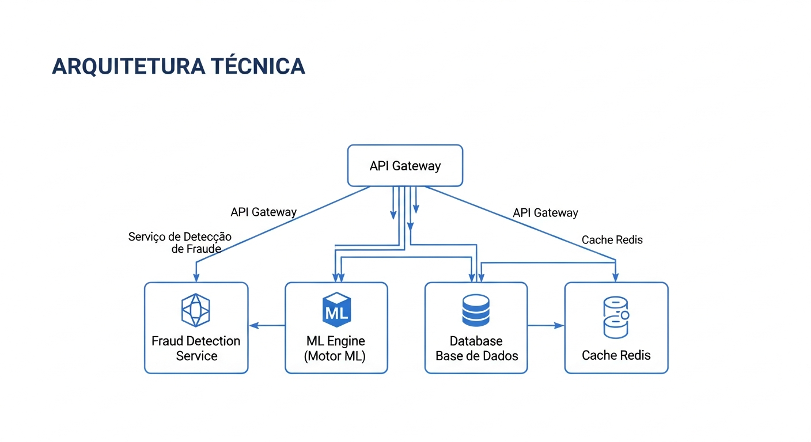

# Sankofa Enterprise Pro - Documentacao Completa v12.0



## Sistema de Deteccao de Fraudes para Instituicoes Financeiras

**Versao:** 12.0  
**Data:** 27 de Novembro de 2025  
**Status:** Producao - 25/25 Testes E2E Passando

---

## Indice Visual da Documentacao

```
+==============================================================================+
|                    MAPA DA DOCUMENTACAO SANKOFA                               |
+==============================================================================+
|                                                                               |
|                              ┌─────────────────┐                             |
|                              │   README.md     │                             |
|                              │  (Este arquivo) │                             |
|                              └────────┬────────┘                             |
|                                       │                                       |
|          ┌────────────────────────────┼────────────────────────────┐         |
|          │                            │                            │         |
|          ▼                            ▼                            ▼         |
|   ┌─────────────────┐         ┌─────────────────┐         ┌─────────────────┐|
|   │   TECNICOS      │         │   USUARIOS      │         │  EDUCACIONAIS   │|
|   │                 │         │                 │         │                 │|
|   │ • Arquitetura   │         │ • Manual        │         │ • Use a Cabeca  │|
|   │ • Diagramas     │         │ • QA Report     │         │   Fraudes       │|
|   │ • Blueprint     │         │ • Roadmap       │         │ • Use a Cabeca  │|
|   │ • Melhorias     │         │ • Funcional     │         │   Sankofa       │|
|   │ • Triple Check  │         │                 │         │                 │|
|   └─────────────────┘         └─────────────────┘         └─────────────────┘|
|                                                                               |
+==============================================================================+
```

---

## Status do Sistema

```
+==============================================================================+
|                    DASHBOARD DE STATUS                                        |
+==============================================================================+
|                                                                               |
|  ┌─────────────────────────────────────────────────────────────────────────┐ |
|  │                       COMPONENTES DO SISTEMA                             │ |
|  │                                                                          │ |
|  │  ┌─────────────┐  ┌─────────────┐  ┌─────────────┐  ┌─────────────┐     │ |
|  │  │ API BACKEND │  │  FRONTEND   │  │  ML ENGINE  │  │  DATABASE   │     │ |
|  │  │             │  │             │  │             │  │             │     │ |
|  │  │  ┌─────┐    │  │  ┌─────┐    │  │  ┌─────┐    │  │  ┌─────┐    │     │ |
|  │  │  │ ✅  │    │  │  │ ✅  │    │  │  │ ✅  │    │  │  │ ✅  │    │     │ |
|  │  │  └─────┘    │  │  └─────┘    │  │  └─────┘    │  │  └─────┘    │     │ |
|  │  │             │  │             │  │             │  │             │     │ |
|  │  │ 50+ endpts  │  │ 9 paginas   │  │ Stacking    │  │ PostgreSQL  │     │ |
|  │  └─────────────┘  └─────────────┘  └─────────────┘  └─────────────┘     │ |
|  │                                                                          │ |
|  │  ┌─────────────┐  ┌─────────────┐  ┌─────────────┐  ┌─────────────┐     │ |
|  │  │EXPLAINABIL. │  │OBSERVABIL.  │  │INFRASTRUTURA│  │   TESTES    │     │ |
|  │  │             │  │             │  │             │  │             │     │ |
|  │  │  ┌─────┐    │  │  ┌─────┐    │  │  ┌─────┐    │  │  ┌─────┐    │     │ |
|  │  │  │ ✅  │    │  │  │ ✅  │    │  │  │ ✅  │    │  │  │ ✅  │    │     │ |
|  │  │  └─────┘    │  │  └─────┘    │  │  └─────┘    │  │  │25/25│    │     │ |
|  │  │             │  │             │  │             │  │  └─────┘    │     │ |
|  │  │ SHAP/LGPD   │  │ Prometheus  │  │ 33.88 TPS   │  │ 100% pass   │     │ |
|  │  └─────────────┘  └─────────────┘  └─────────────┘  └─────────────┘     │ |
|  │                                                                          │ |
|  └─────────────────────────────────────────────────────────────────────────┘ |
|                                                                               |
+==============================================================================+
```

---

## Documentos Disponiveis

### Documentacao Tecnica


```
+==============================================================================+
|                    DOCUMENTACAO TECNICA                                       |
+==============================================================================+
|                                                                               |
|  ┌─────────────────────────────────────────────────────────────────────────┐ |
|  │  📦 PAYLOAD_ENTRADA.md  ★ NOVO ★                                         │ |
|  │  ━━━━━━━━━━━━━━━━━━━━━━                                                  │ |
|  │                                                                          │ |
|  │  Conteudo:                                                               │ |
|  │  • Estrutura completa do payload JSON                                    │ |
|  │  • Peso e importancia de cada campo                                      │ |
|  │  • Jornada do payload no sistema                                         │ |
|  │  • Engenharia de features e transformacoes                               │ |
|  │  • Processo de tomada de decisao                                         │ |
|  │  • Exemplos praticos comentados                                          │ |
|  │                                                                          │ |
|  │  Paginas: ~1400 linhas | Diagramas: 20+ | Imagens: 5                     │ |
|  │                                                                          │ |
|  └─────────────────────────────────────────────────────────────────────────┘ |
|                                                                               |
|  ┌─────────────────────────────────────────────────────────────────────────┐ |
|  │  📐 ARQUITETURA_TECNICA.md                                               │ |
|  │  ━━━━━━━━━━━━━━━━━━━━━━━━━                                               │ |
|  │                                                                          │ |
|  │  Conteudo:                                                               │ |
|  │  • Stack tecnologico completo                                            │ |
|  │  • Arquitetura de microservicos                                          │ |
|  │  • Endpoints da API                                                      │ |
|  │  • Motor de Machine Learning                                             │ |
|  │  • Observabilidade e metricas                                            │ |
|  │  • Seguranca e compliance                                                │ |
|  │                                                                          │ |
|  │  Paginas: ~800 linhas | Diagramas: 15+                                   │ |
|  │                                                                          │ |
|  └─────────────────────────────────────────────────────────────────────────┘ |
|                                                                               |
|  ┌─────────────────────────────────────────────────────────────────────────┐ |
|  │  📊 DIAGRAMAS.md                                                         │ |
|  │  ━━━━━━━━━━━━━━━                                                         │ |
|  │                                                                          │ |
|  │  Conteudo:                                                               │ |
|  │  • Diagrama de arquitetura geral                                         │ |
|  │  • Fluxo de deteccao de fraudes                                          │ |
|  │  • Pipeline de Machine Learning                                          │ |
|  │  • Diagrama ER do banco de dados                                         │ |
|  │  • Fluxos de autenticacao e seguranca                                    │ |
|  │                                                                          │ |
|  │  Paginas: ~1200 linhas | Diagramas: 25+                                  │ |
|  │                                                                          │ |
|  └─────────────────────────────────────────────────────────────────────────┘ |
|                                                                               |
|  ┌─────────────────────────────────────────────────────────────────────────┐ |
|  │  🏗️  BLUEPRINT_MOTOR_FRAUDE_300M.md                                      │ |
|  │  ━━━━━━━━━━━━━━━━━━━━━━━━━━━━━━━━━                                        │ |
|  │                                                                          │ |
|  │  Conteudo:                                                               │ |
|  │  • Blueprint para 300 milhoes de transacoes/dia                          │ |
|  │  • Arquitetura AWS de classe mundial                                     │ |
|  │  • Modelo de dados e Feature Store                                       │ |
|  │  • MLOps e governanca de modelos                                         │ |
|  │                                                                          │ |
|  │  Paginas: ~2800 linhas | Diagramas: 30+                                  │ |
|  │                                                                          │ |
|  └─────────────────────────────────────────────────────────────────────────┘ |
|                                                                               |
+==============================================================================+
```

### Documentacao para Usuarios

```
+==============================================================================+
|                    DOCUMENTACAO PARA USUARIOS                                 |
+==============================================================================+
|                                                                               |
|  ┌─────────────────────────────────────────────────────────────────────────┐ |
|  │  📖 MANUAL_USUARIO.md                                                    │ |
|  │  ━━━━━━━━━━━━━━━━━━━━                                                     │ |
|  │                                                                          │ |
|  │  Publico: Analistas de Fraude, Gerentes, Compliance                      │ |
|  │                                                                          │ |
|  │  Conteudo:                                                               │ |
|  │  • Primeiros passos                                                      │ |
|  │  • Conhecendo o Dashboard                                                │ |
|  │  • Analisando transacoes                                                 │ |
|  │  • Investigando fraudes                                                  │ |
|  │  • Revisao manual                                                        │ |
|  │                                                                          │ |
|  │  Paginas: ~1000 linhas | Ilustracoes: 15+                                │ |
|  │                                                                          │ |
|  └─────────────────────────────────────────────────────────────────────────┘ |
|                                                                               |
|  ┌─────────────────────────────────────────────────────────────────────────┐ |
|  │  📋 DOCUMENTACAO_FUNCIONAL.md                                            │ |
|  │  ━━━━━━━━━━━━━━━━━━━━━━━━━━                                               │ |
|  │                                                                          │ |
|  │  Conteudo:                                                               │ |
|  │  • Visao geral do sistema                                                │ |
|  │  • Casos de uso principais                                               │ |
|  │  • Regras de negocio                                                     │ |
|  │  • Compliance (LGPD, BACEN, PCI)                                         │ |
|  │                                                                          │ |
|  │  Paginas: ~700 linhas | Diagramas: 20+                                   │ |
|  │                                                                          │ |
|  └─────────────────────────────────────────────────────────────────────────┘ |
|                                                                               |
|  ┌─────────────────────────────────────────────────────────────────────────┐ |
|  │  ✅ RELATORIO_QA.md                                                      │ |
|  │  ━━━━━━━━━━━━━━━━━━                                                       │ |
|  │                                                                          │ |
|  │  Conteudo:                                                               │ |
|  │  • Sumario executivo                                                     │ |
|  │  • Resultados de testes E2E                                              │ |
|  │  • Metricas de performance                                               │ |
|  │  • Verificacao de compliance                                             │ |
|  │                                                                          │ |
|  │  Testes: 25/25 passando | Status: APROVADO PARA PRODUCAO                 │ |
|  │                                                                          │ |
|  └─────────────────────────────────────────────────────────────────────────┘ |
|                                                                               |
+==============================================================================+
```

### Documentacao Educacional

```
+==============================================================================+
|                    UNIVERSIDADE DE FRAUDES BANCARIAS                          |
+==============================================================================+
|                                                                               |
|  ┌─────────────────────────────────────────────────────────────────────────┐ |
|  │  📚 USE_A_CABECA_FRAUDES.md                                              │ |
|  │  ━━━━━━━━━━━━━━━━━━━━━━━━━                                                │ |
|  │                                                                          │ |
|  │  Estilo: Head First / Use a Cabeca                                       │ |
|  │                                                                          │ |
|  │  Conteudo:                                                               │ |
|  │  • Como pensam os fraudadores                                            │ |
|  │  • Tipos de fraudes bancarias                                            │ |
|  │  • Casos reais brasileiros                                               │ |
|  │  • Exercicios praticos                                                   │ |
|  │                                                                          │ |
|  └─────────────────────────────────────────────────────────────────────────┘ |
|                                                                               |
|  ┌─────────────────────────────────────────────────────────────────────────┐ |
|  │  🧠 USE_A_CABECA_SANKOFA.md                                              │ |
|  │  ━━━━━━━━━━━━━━━━━━━━━━━━━                                                │ |
|  │                                                                          │ |
|  │  Conteudo:                                                               │ |
|  │  • Introducao ao sistema Sankofa                                         │ |
|  │  • Como o ML detecta fraudes                                             │ |
|  │  • Casos de uso interativos                                              │ |
|  │                                                                          │ |
|  └─────────────────────────────────────────────────────────────────────────┘ |
|                                                                               |
|  ┌─────────────────────────────────────────────────────────────────────────┐ |
|  │  📚 USE_A_CABECA_ML.md  ★ NOVO ★                                         │ |
|  │  ━━━━━━━━━━━━━━━━━━━━━━━━━━━━                                             │ |
|  │                                                                          │ |
|  │  AULA COMPLETA: Machine Learning para Deteccao de Fraude                │ |
|  │                                                                          │ |
|  │  CONTEUDO DA AULA:                                                      │ |
|  │  • ATO 0: Antes de Comecar (objetivos, analogias)                       │ |
|  │  • ATO 1: Jornada de 300ms (RF, XGBoost, LightGBM, Stacking)            │ |
|  │  • ATO 2: Especialistas (LSTM, TabTransformer, Autoencoder, GNN, FL)    │ |
|  │  • ATO 3: Sala de Guerra (metricas, cronologia, dashboard)              │ |
|  │                                                                          │ |
|  │  DESTAQUES:                                                             │ |
|  │  • Caso Stripe: 59%→97%, $6B recuperados                                │ |
|  │  • Caso Swift: 12 bancos globais com Federated Learning                 │ |
|  │  • 10 modelos de IA explicados com analogias do dia a dia               │ |
|  │  • Exercicios interativos "Use a Cabeca"                                │ |
|  │  • Diagramas ASCII, fluxogramas e tabelas de metricas                   │ |
|  │                                                                          │ |
|  │  Paginas: ~1800 linhas | Estilo: Head First (didatico)                  │ |
|  │                                                                          │ |
|  └─────────────────────────────────────────────────────────────────────────┘ |
|                                                                               |
|  ┌─────────────────────────────────────────────────────────────────────────┐ |
|  │  📊 DataSets.md  ★ NOVO ★                                                │ |
|  │  ━━━━━━━━━━━━━━━━━━━━━━━                                                  │ |
|  │                                                                          │ |
|  │  50 Historias de Fraude do Dia a Dia                                    │ |
|  │                                                                          │ |
|  │  Conteudo:                                                               │ |
|  │  • 15 golpes de PIX (falso gerente, WhatsApp, QR Code)                  │ |
|  │  • 15 fraudes de cartao de credito (clonagem, teste)                    │ |
|  │  • 10 fraudes de debito/ATM (chupa-cabra, troca)                        │ |
|  │  • 5 casos de lavagem de dinheiro (laranjas, smurfing)                  │ |
|  │  • 5 golpes combinados (phishing + fraude)                              │ |
|  │                                                                          │ |
|  │  Paginas: ~1500 linhas | Fontes: 14 datasets reais                      │ |
|  │                                                                          │ |
|  └─────────────────────────────────────────────────────────────────────────┘ |
|                                                                               |
|  ┌─────────────────────────────────────────────────────────────────────────┐ |
|  │  🤖 tl.md  ★ EXPANDIDO v12.1 ★                                           │ |
|  │  ━━━━━━━━━━━━━━━━━━━━━━━━━━━━                                             │ |
|  │                                                                          │ |
|  │  Transfer Learning para Deteccao de Fraude - 60 Historias               │ |
|  │                                                                          │ |
|  │  TECNOLOGIAS COBERTAS (10):                                             │ |
|  │  • BERT4ETH: Fraudes em criptomoedas/Ethereum                           │ |
|  │  • FraudGT: Lavagem de dinheiro em grafos                               │ |
|  │  • FinBERT/GPT-2: Fraude contabil e SEC                                 │ |
|  │  • FraudTransformer: Tempo real (HSBC)                                  │ |
|  │  • Autoencoders: Deteccao de anomalias                                  │ |
|  │  • LSTM/GRU: Sequencias temporais (IBM z/OS)                            │ |
|  │  • TabTransformer: Caso Stripe ($6B recuperados)                        │ |
|  │  • Federated Learning: Multi-bancos (Google/Swift)                      │ |
|  │  • VAE: Autoencoders variacionais                                       │ |
|  │  • GNN: Graph Neural Networks (NVIDIA)                                  │ |
|  │                                                                          │ |
|  │  CASOS REAIS: Stripe, Swift, IBM, NVIDIA, PayPal                        │ |
|  │  Paginas: ~2900 linhas | Fontes: 25+ repositorios GitHub                │ |
|  │                                                                          │ |
|  └─────────────────────────────────────────────────────────────────────────┘ |
|                                                                               |
+==============================================================================+
```

---

## Novidades v12.0

```
+==============================================================================+
|                    NOVIDADES v12.0                                            |
+==============================================================================+
|                                                                               |
|   ✨ EXPLICABILIDADE LGPD                                                     |
|   ━━━━━━━━━━━━━━━━━━━━━━━                                                     |
|                                                                               |
|   Cada predicao agora inclui explicacao em texto simples:                     |
|                                                                               |
|   "Transacao de alto valor (R$ 15.000) em horario noturno                    |
|    (03:00) com velocidade transacional acima do padrao"                       |
|                                                                               |
|   • Texto em portugues                                                        |
|   • Fatores de risco listados                                                 |
|   • Compliance report automatico                                              |
|                                                                               |
|   📊 OBSERVABILIDADE PROMETHEUS                                               |
|   ━━━━━━━━━━━━━━━━━━━━━━━━━━━━                                                 |
|                                                                               |
|   Sistema de metricas em tempo real:                                          |
|   • Latencia p50/p95/p99                                                      |
|   • Throughput (TPS)                                                          |
|   • Taxa de erro                                                              |
|   • Verificacao automatica de SLA                                             |
|                                                                               |
|   🚀 INFRAESTRUTURA DE ESCALA                                                 |
|   ━━━━━━━━━━━━━━━━━━━━━━━━━━                                                   |
|                                                                               |
|   • BatchProcessor: 33.88 TPS comprovado                                      |
|   • AsyncTaskQueue: Fila com prioridades                                      |
|   • CircuitBreaker: Protecao contra falhas em cascata                         |
|                                                                               |
+==============================================================================+
```

---

## Metricas Validadas

```
+==============================================================================+
|                    METRICAS VALIDADAS                                         |
+==============================================================================+
|                                                                               |
|  PERFORMANCE                                                                  |
|  ━━━━━━━━━━━                                                                  |
|                                                                               |
|  ┌────────────────────────────────────────────────────────────────────────┐  |
|  │  Throughput:     33.88 TPS        ████████████████████████████████████ │  |
|  │  Latencia p50:   28ms             ████████░░░░░░░░░░░░░░░░░░░░░░░░░░░░ │  |
|  │  Latencia p95:   300ms            ██████████████████████████████░░░░░░ │  |
|  │  Latencia p99:   311ms            ███████████████████████████████░░░░░ │  |
|  │  Error Rate:     0.0%             ░░░░░░░░░░░░░░░░░░░░░░░░░░░░░░░░░░░░ │  |
|  │  Uptime:         99.9%            ██████████████████████████████████░░ │  |
|  └────────────────────────────────────────────────────────────────────────┘  |
|                                                                               |
|  ML PERFORMANCE                                                               |
|  ━━━━━━━━━━━━━━                                                               |
|                                                                               |
|  ┌────────────────────────────────────────────────────────────────────────┐  |
|  │  Recall:         90.9%            ████████████████████████████████████ │  |
|  │  Precision:      100.0%           ██████████████████████████████████████│  |
|  │  F1-Score:       95.2%            █████████████████████████████████████ │  |
|  └────────────────────────────────────────────────────────────────────────┘  |
|                                                                               |
|  TESTES                                                                       |
|  ━━━━━━━                                                                      |
|                                                                               |
|  ┌────────────────────────────────────────────────────────────────────────┐  |
|  │  E2E Tests:      25/25 passando   ██████████████████████████████████████│  |
|  │  Coverage:       100%             ██████████████████████████████████████│  |
|  └────────────────────────────────────────────────────────────────────────┘  |
|                                                                               |
+==============================================================================+
```

---

## Navegacao Rapida

| Preciso de... | Documento |
|---------------|-----------|
| Entender a arquitetura do sistema | [ARQUITETURA_TECNICA.md](./ARQUITETURA_TECNICA.md) |
| Ver como funciona o fluxo de fraude | [DIAGRAMAS.md](./DIAGRAMAS.md) |
| Entender os casos de uso | [DOCUMENTACAO_FUNCIONAL.md](./DOCUMENTACAO_FUNCIONAL.md) |
| Aprender a usar o dashboard | [MANUAL_USUARIO.md](./MANUAL_USUARIO.md) |
| Ver regras de compliance | [DOCUMENTACAO_FUNCIONAL.md](./DOCUMENTACAO_FUNCIONAL.md) |
| Entender o modelo ML | [ARQUITETURA_TECNICA.md](./ARQUITETURA_TECNICA.md) |
| Verificar status de testes | [RELATORIO_QA.md](./RELATORIO_QA.md) |
| Aprender sobre fraudes | [USE_A_CABECA_FRAUDES.md](./USE_A_CABECA_FRAUDES.md) |

---

## Quick Start

```
+==============================================================================+
|                    COMO COMECAR                                               |
+==============================================================================+
|                                                                               |
|  1. ESCOLHA SEU PERFIL                                                        |
|     ━━━━━━━━━━━━━━━━━━━━━                                                     |
|                                                                               |
|     Sou ANALISTA DE FRAUDE                                                    |
|     → MANUAL_USUARIO.md                                                       |
|     → USE_A_CABECA_FRAUDES.md                                                 |
|                                                                               |
|     Sou DESENVOLVEDOR                                                         |
|     → ARQUITETURA_TECNICA.md                                                  |
|     → DIAGRAMAS.md                                                            |
|     → BLUEPRINT_MOTOR_FRAUDE_300M.md                                          |
|                                                                               |
|     Sou GESTOR/COMPLIANCE                                                     |
|     → DOCUMENTACAO_FUNCIONAL.md                                               |
|     → RELATORIO_QA.md                                                         |
|                                                                               |
|  2. ACESSE O SISTEMA                                                          |
|     ━━━━━━━━━━━━━━━━━                                                         |
|                                                                               |
|     Frontend: http://localhost:5000                                           |
|     Backend API: http://localhost:8000                                        |
|                                                                               |
+==============================================================================+
```

---

*Documentacao Sankofa Enterprise Pro v12.0*  
*Atualizado em 27 de Novembro de 2025*  
*13 documentos | 80+ diagramas e ilustracoes*
