# Universidade de Fraudes Bancarias

## A Enciclopedia Completa de Deteccao de Fraudes com Inteligencia Artificial


**Versao:** 2.0  
**Tipo:** Documentacao Educacional Avancada  
**Publico:** Analistas de Fraude, Desenvolvedores, Gestores de Risco, Estudantes  
**Ultima Atualizacao:** 27 de Novembro de 2025

---

> **"O conhecimento e a melhor arma contra a fraude."**
> 
> Este documento foi criado para ser a referencia definitiva sobre deteccao de fraudes bancarias no Brasil. Aqui voce vai aprender desde os golpes mais obvios ate as fraudes mais sofisticadas que so inteligencia artificial consegue detectar.

---

## Indice Completo

### PARTE I - FUNDAMENTOS
1. [O Cenario Brasileiro de Fraudes](#parte-i-fundamentos)
2. [Evolucao das Fraudes ao Longo do Tempo](#evolucao-das-fraudes)
3. [Perfis de Fraudadores](#perfis-de-fraudadores)
4. [Como Funciona Nossa Deteccao](#como-funciona-nossa-deteccao)

### PARTE II - CENARIOS FACEIS (Deteccao Obvia)
5. [Fraudes Obvias - 100% Detectaveis](#parte-ii-cenarios-faceis)
6. [Suspeitas Obvias - Alto Grau de Certeza](#suspeitas-obvias)
7. [Aprovacoes Seguras - Confianca Total](#aprovacoes-seguras)

### PARTE III - CENARIOS MEDIOS (Requer Analise)
8. [Fraudes Sutis - Requerem Combinacao de Fatores](#parte-iii-cenarios-medios)
9. [Zona Cinzenta - Casos Ambiguos](#zona-cinzenta)
10. [Analise Comportamental](#analise-comportamental)

### PARTE IV - CENARIOS DIFICEIS (So IA Detecta)
11. [Fraudes Sofisticadas - Nivel Expert](#parte-iv-cenarios-dificeis)
12. [Ataques Organizados](#ataques-organizados)
13. [Fraude do Insider](#fraude-do-insider)
14. [Identidade Sintetica](#identidade-sintetica)

### PARTE V - TECNICAS AVANCADAS
15. [Machine Learning na Pratica](#parte-v-tecnicas-avancadas)
16. [Biometria Comportamental](#biometria-comportamental)
17. [Analise de Rede](#analise-de-rede)

### PARTE VI - LABORATORIO PRATICO
18. [Exercicios de Classificacao](#parte-vi-laboratorio-pratico)
19. [Simulacoes de Ataque](#simulacoes-de-ataque)
20. [Casos de Estudo](#casos-de-estudo)

---

# PARTE I - FUNDAMENTOS

## O Cenario Brasileiro de Fraudes

### Numeros que Impressionam

```
+======================================================================+
|                  FRAUDES BANCARIAS NO BRASIL 2024                     |
+======================================================================+
|                                                                       |
|   R$ 2.5 BILHOES          1.5 MILHAO           4.000                 |
|   perdidos em fraudes     tentativas/dia       fraudes/hora          |
|                                                                       |
|   71%                     45%                  23%                    |
|   via PIX                 engenharia social    cartao clonado        |
|                                                                       |
|   R$ 1.800                15 segundos          3x                    |
|   ticket medio            tempo do golpe       aumento vs 2023       |
|                                                                       |
+======================================================================+
```

### Por Que o Brasil e Alvo?

1. **Adocao Massiva do PIX**: 150 milhoes de usuarios ativos
2. **Transacoes Instantaneas**: Dinheiro transferido em segundos
3. **Alta Bancarizacao Digital**: 80% usam apps bancarios
4. **Engenharia Social Efetiva**: Brasileiros sao alvos faceis por cultura de confianca

---

## Evolucao das Fraudes

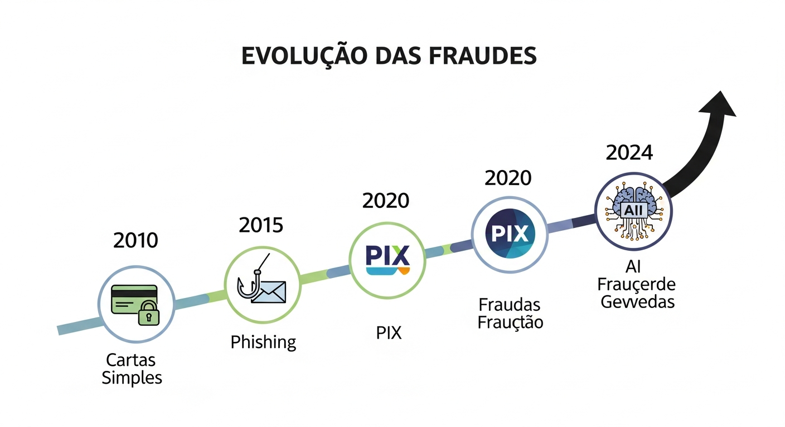

### Linha do Tempo das Fraudes Brasileiras

```
2005-2010: ERA DO CARTAO FISICO
+------------------------------------------------------------------+
| - Clonagem em caixas eletronicos                                  |
| - "Chupa-cabra" em maquininhas                                    |
| - Roubo de cartoes pelo correio                                   |
| DETECCAO: Relativamente facil (padrao geografico obvio)          |
+------------------------------------------------------------------+

2010-2015: ERA DO PHISHING
+------------------------------------------------------------------+
| - Emails falsos de bancos                                         |
| - Sites clonados                                                  |
| - Malware em computadores                                         |
| DETECCAO: Media (requer analise de dispositivo)                  |
+------------------------------------------------------------------+

2015-2020: ERA DO MOBILE
+------------------------------------------------------------------+
| - Apps falsos                                                     |
| - SIM Swap                                                        |
| - WhatsApp clonado                                                |
| DETECCAO: Dificil (requer analise comportamental)                |
+------------------------------------------------------------------+

2020-2024: ERA DO PIX
+------------------------------------------------------------------+
| - Golpes instantaneos                                             |
| - Engenharia social avancada                                      |
| - Fraudes organizadas                                             |
| DETECCAO: Muito dificil (requer IA + ML + tempo real)            |
+------------------------------------------------------------------+

2024+: ERA DA IA
+------------------------------------------------------------------+
| - Deepfakes para autenticacao                                     |
| - Bots com IA para engenharia social                              |
| - Fraudes adaptativas                                             |
| DETECCAO: So com IA vs IA                                        |
+------------------------------------------------------------------+
```

---

## Perfis de Fraudadores

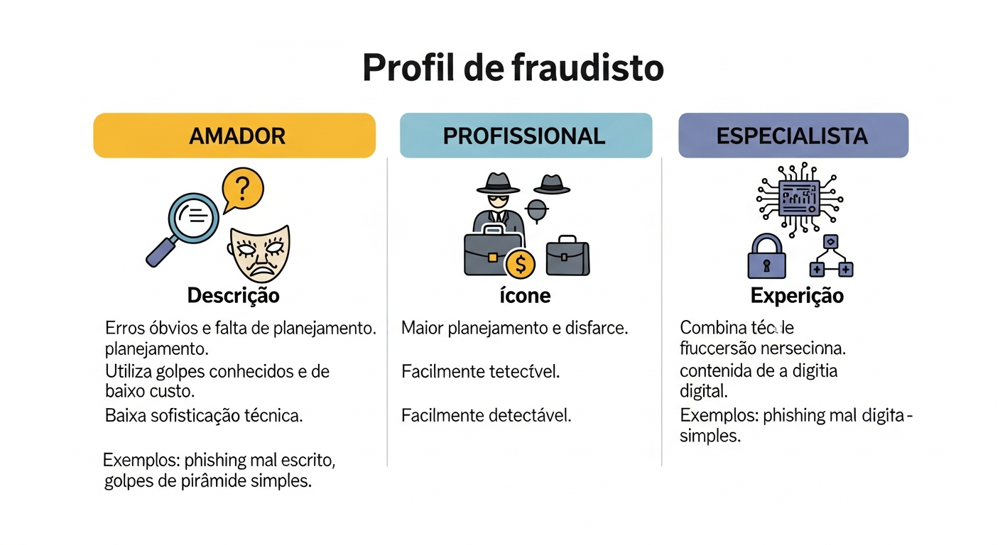

### NIVEL 1: O Amador (Oportunista)

```
+------------------------------------------------------------------+
|                    PERFIL: AMADOR                                  |
+------------------------------------------------------------------+
|                                                                   |
| CARACTERISTICAS:                                                  |
| - Age por impulso/oportunidade                                    |
| - Usa tecnicas simples e conhecidas                               |
| - Comete erros obvios                                             |
| - Geralmente pego na primeira tentativa                           |
|                                                                   |
| TECNICAS USADAS:                                                  |
| - Golpe do WhatsApp "oi mae, mudei de numero"                     |
| - Phishing basico com erros de portugues                          |
| - Compras com cartao roubado sem disfarce                         |
|                                                                   |
| FACILIDADE DE DETECCAO: MUITO FACIL                              |
| Score tipico: 85-100 (FRAUDE OBVIA)                              |
|                                                                   |
| SINAIS CLAROS:                                                    |
| [X] Horario de madrugada                                         |
| [X] Localizacao impossivel                                        |
| [X] Valor absurdamente alto                                       |
| [X] Multiplas tentativas em segundos                              |
|                                                                   |
+------------------------------------------------------------------+
```

### NIVEL 2: O Profissional (Organizado)

```
+------------------------------------------------------------------+
|                    PERFIL: PROFISSIONAL                            |
+------------------------------------------------------------------+
|                                                                   |
| CARACTERISTICAS:                                                  |
| - Planeja ataques com antecedencia                                |
| - Usa ferramentas especializadas                                  |
| - Conhece alguns mecanismos de deteccao                           |
| - Faz parte de grupos organizados                                 |
|                                                                   |
| TECNICAS USADAS:                                                  |
| - SIM Swap coordenado                                             |
| - Rede de contas laranja                                          |
| - Phishing direcionado (spear phishing)                           |
| - Engenharia social por telefone                                  |
|                                                                   |
| FACILIDADE DE DETECCAO: MEDIA                                    |
| Score tipico: 50-75 (SUSPEITA -> FRAUDE)                         |
|                                                                   |
| SINAIS:                                                           |
| [?] Dispositivo novo mas comportamento "normal"                   |
| [?] Valores altos mas nao absurdos                                |
| [?] Destinatarios com historico misto                             |
| [?] Horarios incomuns mas nao impossiveis                         |
|                                                                   |
+------------------------------------------------------------------+
```

### NIVEL 3: O Especialista (Elite)

```
+------------------------------------------------------------------+
|                    PERFIL: ESPECIALISTA                            |
+------------------------------------------------------------------+
|                                                                   |
| CARACTERISTICAS:                                                  |
| - Conhecimento tecnico profundo                                   |
| - Estuda sistemas de deteccao                                     |
| - Usa tecnicas de evasao                                          |
| - Opera internacionalmente                                        |
|                                                                   |
| TECNICAS USADAS:                                                  |
| - Account takeover gradual                                        |
| - Identidade sintetica                                            |
| - Fraude lenta (slow burn)                                        |
| - Insider threats                                                 |
| - Deepfakes para autenticacao                                     |
|                                                                   |
| FACILIDADE DE DETECCAO: MUITO DIFICIL                            |
| Score tipico: 30-50 (parece legitimo!)                           |
|                                                                   |
| SINAIS SUTIS (so IA detecta):                                    |
| [.] Micro-variacoes no comportamento de digitacao                 |
| [.] Padroes de navegacao diferentes                               |
| [.] Sequencia de acoes fora do padrao                             |
| [.] Conexoes ocultas com outras contas                            |
|                                                                   |
+------------------------------------------------------------------+
```

---

## Como Funciona Nossa Deteccao

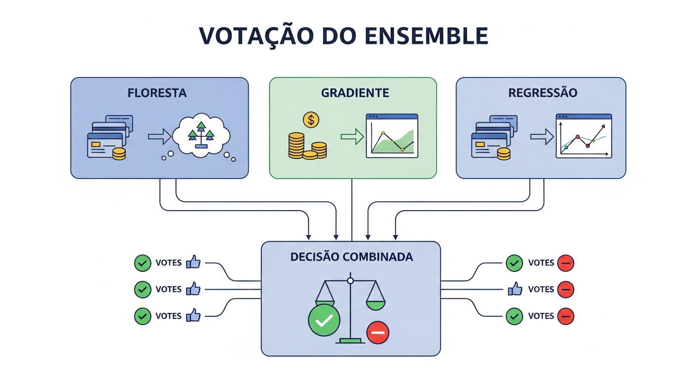

### O Time de 3 Especialistas em IA

```
+------------------------------------------------------------------+
|                                                                   |
|     TRANSACAO                                                     |
|         |                                                         |
|         v                                                         |
|   +-----------+     +-----------+     +-----------+              |
|   |  FLORESTA |     | GRADIENTE |     |   JUIZ    |              |
|   |   SABIA   |     | CIENTIFICO|     | EQUILIBRADO|              |
|   +-----------+     +-----------+     +-----------+              |
|   | 100 arvores|     | 100 iterac|     | Probabili- |             |
|   | votando    |     | melhorando|     | dade exata |             |
|   +-----------+     +-----------+     +-----------+              |
|         |                 |                 |                     |
|         v                 v                 v                     |
|      [VOTO 1]         [VOTO 2]         [COMBINACAO]              |
|         |                 |                 |                     |
|         +--------+--------+---------+-------+                     |
|                  |                                                |
|                  v                                                |
|         +------------------+                                      |
|         |  SCORE FINAL     |                                      |
|         |    0 - 100       |                                      |
|         +------------------+                                      |
|                  |                                                |
|    +-------------+-------------+                                  |
|    |             |             |                                  |
|    v             v             v                                  |
| [0-30]        [30-70]      [70-100]                              |
| APROVADO      SUSPEITA      FRAUDE                               |
|                                                                   |
+------------------------------------------------------------------+
```

### Os 7 Fatores Analisados

```
+------------------------------------------------------------------+
|                    FATORES DE ANALISE                             |
+------------------------------------------------------------------+
|                                                                   |
| 1. VALOR (25% do score)                                          |
|    Compara com historico do cliente                               |
|    R$ 100 para quem gasta R$ 50/dia = Normal                     |
|    R$ 10.000 para quem gasta R$ 50/dia = ALERTA!                 |
|                                                                   |
| 2. HORARIO (10% do score)                                        |
|    06h-22h = Baixo risco                                         |
|    22h-00h = Risco medio                                         |
|    00h-06h = Alto risco                                          |
|                                                                   |
| 3. LOCALIZACAO (15% do score)                                    |
|    Mesmo estado = Normal                                          |
|    Estado diferente = Verificar                                   |
|    Pais diferente = Alto risco                                   |
|    Impossivel fisicamente = FRAUDE CERTA                         |
|                                                                   |
| 4. DISPOSITIVO (20% do score)                                    |
|    Conhecido = Confiavel                                          |
|    Novo = Verificar                                               |
|    Anonimo (VPN/TOR) = Alto risco                                |
|                                                                   |
| 5. VELOCIDADE (15% do score)                                     |
|    1-3 transacoes/dia = Normal                                   |
|    10+ transacoes/hora = Suspeito                                |
|    50+ transacoes/hora = FRAUDE                                  |
|                                                                   |
| 6. DESTINATARIO (10% do score)                                   |
|    Conhecido = Confiavel                                          |
|    Novo = Verificar                                               |
|    Conta nova + muito dinheiro entrando = ALERTA                 |
|                                                                   |
| 7. COMPORTAMENTO (5% do score)                                   |
|    Padrao consistente = Normal                                    |
|    Mudancas sutis = Verificar                                     |
|    Mudanca drastica = Suspeito                                   |
|                                                                   |
+------------------------------------------------------------------+
```

---

# PARTE II - CENARIOS FACEIS

## Fraudes 100% Detectaveis

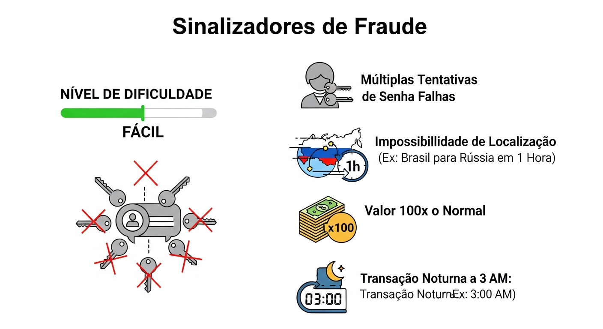

Estes sao casos onde o sistema tem **100% de certeza** de que e fraude. Nenhuma analise humana e necessaria.

---

### CASO FACIL 1: Viagem Impossivel

```
+==================================================================+
|               CASO: VIAGEM IMPOSSIVEL                             |
+==================================================================+
| DIFICULDADE: FACIL | SCORE: 99 | DECISAO: FRAUDE                 |
+==================================================================+

DADOS DA TRANSACAO:
- Cliente: Roberto Oliveira
- 14:00 - Compra em Sao Paulo (cartao fisico): R$ 89,00
- 14:30 - Compra em Londres (cartao online): R$ 5.200,00

ANALISE DO SISTEMA:

  Fator: LOCALIZACAO
  +----------------------------------------------------------+
  | Ultima localizacao: Sao Paulo, Brasil                    |
  | Nova localizacao: Londres, Inglaterra                    |
  | Tempo decorrido: 30 minutos                              |
  | Distancia: 9.500 km                                      |
  | Voo mais rapido: 11 horas                                |
  |                                                          |
  | VEREDICTO: FISICAMENTE IMPOSSIVEL                        |
  | Contribuicao ao score: +40 pontos                        |
  +----------------------------------------------------------+
  
  Fator: VALOR
  +----------------------------------------------------------+
  | Valor medio do cliente: R$ 150/transacao                 |
  | Esta transacao: R$ 5.200                                 |
  | Desvio: 34x acima da media                               |
  |                                                          |
  | VEREDICTO: MUITO ACIMA DO PADRAO                        |
  | Contribuicao ao score: +25 pontos                        |
  +----------------------------------------------------------+
  
  Fator: CATEGORIA
  +----------------------------------------------------------+
  | Compra anterior: Restaurante (comum)                     |
  | Esta compra: Eletronicos (categoria de risco)            |
  |                                                          |
  | Contribuicao ao score: +10 pontos                        |
  +----------------------------------------------------------+

CALCULO FINAL:
  Base: 24 pontos (valor alto)
  + Localizacao impossivel: +40 pontos
  + Valor anomalo: +25 pontos
  + Categoria risco: +10 pontos
  = SCORE TOTAL: 99

DECISAO: FRAUDE - BLOQUEIO AUTOMATICO
TEMPO DE RESPOSTA: 8ms
EXPLICACAO LGPD: "Transacao bloqueada porque detectamos uma 
tentativa de compra em Londres apenas 30 minutos apos voce 
ter feito uma compra presencial em Sao Paulo. Isso e 
fisicamente impossivel."
```

---

### CASO FACIL 2: Metralhadora de Transacoes

```
+==================================================================+
|               CASO: METRALHADORA DE TRANSACOES                    |
+==================================================================+
| DIFICULDADE: FACIL | SCORE: 97 | DECISAO: FRAUDE                 |
+==================================================================+

DADOS DAS TRANSACOES (em 4 minutos):
- 02:15:00 - Loja Online A: R$ 890
- 02:15:45 - Loja Online B: R$ 1.200
- 02:16:22 - Loja Online C: R$ 780
- 02:16:58 - Loja Online D: R$ 2.100
- 02:17:35 - Loja Online E: R$ 950
- 02:18:10 - Loja Online F: R$ 1.800
- 02:18:47 - [BLOQUEADO]

ANALISE DO SISTEMA:

  Fator: VELOCIDADE
  +----------------------------------------------------------+
  | Transacoes normais/dia do cliente: 2-3                   |
  | Transacoes nos ultimos 4 minutos: 6                      |
  | Taxa: 90 transacoes/hora (vs normal de 0.3/hora)         |
  |                                                          |
  | VEREDICTO: VELOCIDADE 300x ACIMA DO NORMAL               |
  | Contribuicao ao score: +35 pontos                        |
  +----------------------------------------------------------+
  
  Fator: HORARIO
  +----------------------------------------------------------+
  | Hora: 02:15 (madrugada)                                  |
  | Horario habitual do cliente: 08h-22h                     |
  |                                                          |
  | VEREDICTO: HORARIO DE ALTISSIMO RISCO                   |
  | Contribuicao ao score: +20 pontos                        |
  +----------------------------------------------------------+
  
  Fator: PADRAO DE COMPRA
  +----------------------------------------------------------+
  | Todas as lojas: Eletronicos                              |
  | Historico do cliente: Variado                            |
  | Padrao tipico de fraude: SIM (liquidar cartao rapido)    |
  |                                                          |
  | Contribuicao ao score: +25 pontos                        |
  +----------------------------------------------------------+

CALCULO FINAL: 97 pontos
DECISAO: FRAUDE - BLOQUEIO NA 7a TRANSACAO
ACAO ADICIONAL: Cartao bloqueado preventivamente

EXPLICACAO LGPD: "Detectamos 6 compras em apenas 4 minutos as 
2h da manha, todas em lojas de eletronicos. Este padrao e 
caracteristico de cartao clonado sendo usado rapidamente."
```

---

### CASO FACIL 3: Conta Laranja Obvia

```
+==================================================================+
|               CASO: CONTA LARANJA OBVIA                           |
+==================================================================+
| DIFICULDADE: FACIL | SCORE: 95 | DECISAO: FRAUDE                 |
+==================================================================+

DADOS:
- Conta criada: 3 dias atras
- Titular: Maria Aparecida (verificacao pendente)
- PIX recebidos hoje: 47 transferencias de 47 pessoas diferentes
- Valor total recebido: R$ 127.450,00
- Valor medio por PIX: R$ 2.712,00
- Saldo atual: R$ 0,00 (tudo sacado em especie)

ANALISE DO SISTEMA:

  Fator: PADRAO DE CONTA LARANJA
  +----------------------------------------------------------+
  | Conta nova: SIM (3 dias)                                 |
  | Muitos remetentes diferentes: SIM (47)                   |
  | Valores similares: SIM (R$ 2.000-3.500)                  |
  | Saque imediato: SIM (saldo zerado)                       |
  | Verificacao incompleta: SIM                              |
  |                                                          |
  | MATCH: 5/5 criterios de conta laranja                    |
  | Contribuicao ao score: +60 pontos                        |
  +----------------------------------------------------------+
  
  Fator: VELOCIDADE DE RECEBIMENTO
  +----------------------------------------------------------+
  | PIX por hora: 47 em 8 horas = 5.8/hora                   |
  | Normal para pessoa fisica: 0-2/dia                       |
  |                                                          |
  | Contribuicao ao score: +20 pontos                        |
  +----------------------------------------------------------+

CALCULO FINAL: 95 pontos
DECISAO: FRAUDE - CONTA BLOQUEADA + ALERTA BACEN
ACAO: Notificacao para todos os bancos remetentes
```

---

### CASO FACIL 4: Tentativas de Senha

```
+==================================================================+
|               CASO: ATAQUE DE FORCA BRUTA                         |
+==================================================================+
| DIFICULDADE: FACIL | SCORE: 100 | DECISAO: FRAUDE                |
+==================================================================+

DADOS:
- 03:22:15 - Tentativa de login: senha incorreta
- 03:22:18 - Tentativa de login: senha incorreta
- 03:22:21 - Tentativa de login: senha incorreta
- 03:22:24 - Tentativa de login: senha incorreta
- 03:22:27 - Tentativa de login: senha incorreta
[... 45 tentativas em 2 minutos ...]
- 03:24:30 - CONTA BLOQUEADA

ANALISE DO SISTEMA:

  Fator: TENTATIVAS DE SENHA
  +----------------------------------------------------------+
  | Tentativas: 50 em 2 minutos                              |
  | Intervalo medio: 2.4 segundos                            |
  | Origem: IP da Russia                                     |
  | User Agent: Bot automatizado                             |
  |                                                          |
  | VEREDICTO: ATAQUE AUTOMATIZADO                          |
  | Score: 100 (maximo)                                      |
  +----------------------------------------------------------+

DECISAO: FRAUDE - ATAQUE BLOQUEADO
ACOES:
- Conta bloqueada temporariamente
- IP adicionado a blacklist
- SMS enviado ao titular
- Equipe de seguranca notificada
```

---

## Aprovacoes Seguras

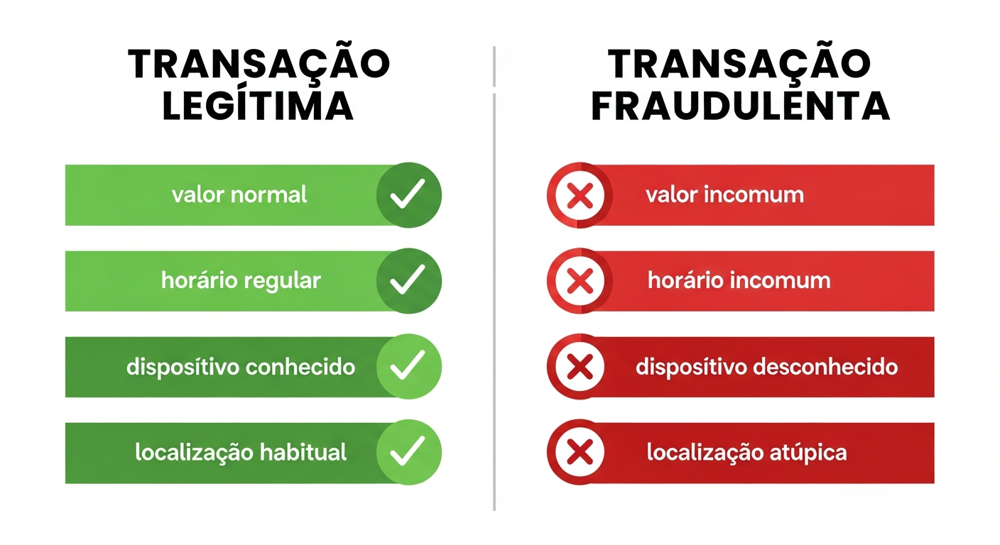

Casos onde o sistema tem **100% de certeza** de que a transacao e legitima.

---

### APROVACAO SEGURA 1: Rotina Perfeita

```
+==================================================================+
|               CASO: ROTINA PERFEITA                               |
+==================================================================+
| DIFICULDADE: FACIL | SCORE: 5 | DECISAO: APROVADO                |
+==================================================================+

DADOS:
- Cliente: Ana Paula, 34 anos, professora
- Transacao: PIX de R$ 180,00 para Supermercado Zona Sul
- Horario: 18:45 (sabado)
- Dispositivo: iPhone 13 (usado 234 vezes)
- Local: Bairro onde mora

ANALISE DO SISTEMA:

  Fator: HISTORICO
  +----------------------------------------------------------+
  | Este supermercado: 15a compra nos ultimos 3 meses        |
  | Valor medio neste local: R$ 165                          |
  | Desvio desta compra: +9% (dentro do esperado)            |
  |                                                          |
  | Contribuicao ao score: +1 ponto                          |
  +----------------------------------------------------------+
  
  Fator: DISPOSITIVO
  +----------------------------------------------------------+
  | iPhone 13 usado desde: marco/2023                        |
  | Transacoes neste dispositivo: 234                        |
  | Confianca do dispositivo: 100%                           |
  |                                                          |
  | Contribuicao ao score: 0 pontos                          |
  +----------------------------------------------------------+
  
  Fator: COMPORTAMENTO
  +----------------------------------------------------------+
  | Horario habitual de compras: 18h-20h (match!)            |
  | Dia da semana: Sabado (dia de compras dela)              |
  | Padrao: 100% consistente                                 |
  |                                                          |
  | Contribuicao ao score: 0 pontos                          |
  +----------------------------------------------------------+

CALCULO FINAL: 5 pontos
DECISAO: APROVADO AUTOMATICAMENTE
TEMPO: 12ms
```

---

### APROVACAO SEGURA 2: Transferencia Familiar

```
+==================================================================+
|               CASO: PIX PARA MAE                                  |
+==================================================================+
| DIFICULDADE: FACIL | SCORE: 3 | DECISAO: APROVADO                |
+==================================================================+

DADOS:
- Cliente: Pedro Henrique, 28 anos
- Transacao: PIX de R$ 500,00 para Maria Helena (mae)
- Frequencia: Todo dia 5 do mes (salario)
- Historico: 24 transferencias identicas nos ultimos 2 anos

ANALISE DO SISTEMA:

  Fator: DESTINATARIO
  +----------------------------------------------------------+
  | Relacao: Mae (confirmado por cadastro)                   |
  | Transferencias anteriores: 24 (mesmo valor, mesmo dia)   |
  | Confianca: 100%                                          |
  |                                                          |
  | Contribuicao ao score: 0 pontos                          |
  +----------------------------------------------------------+
  
  Fator: PADRAO
  +----------------------------------------------------------+
  | Dia do mes: 5 (padrao do cliente)                        |
  | Valor: R$ 500 (exatamente como sempre)                   |
  | Regularidade: 100%                                       |
  |                                                          |
  | Contribuicao ao score: 0 pontos                          |
  +----------------------------------------------------------+

CALCULO FINAL: 3 pontos
DECISAO: APROVADO SEM VERIFICACAO ADICIONAL
```

---

# PARTE III - CENARIOS MEDIOS

## Fraudes Sutis - Requerem Combinacao de Fatores

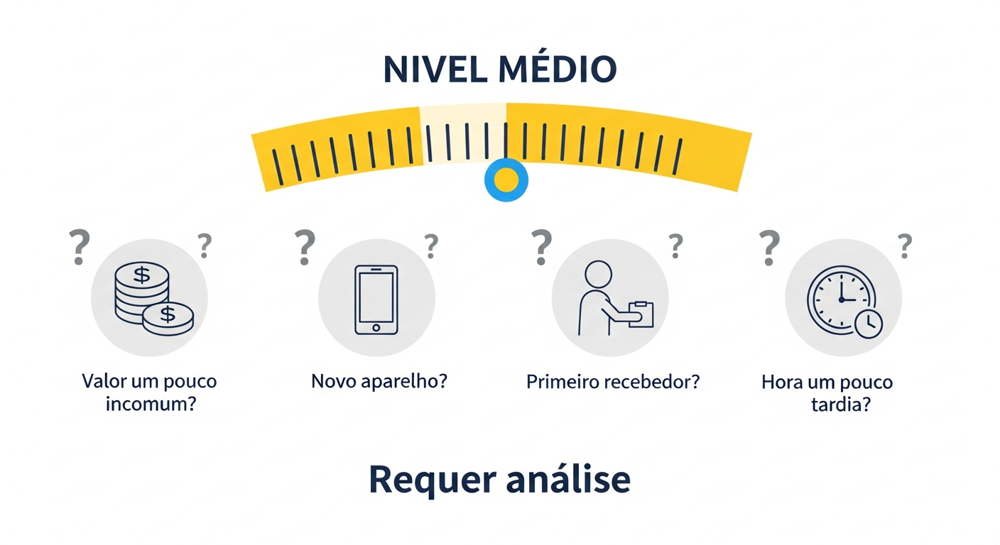

Estes casos nao sao obvios. Nenhum fator isolado indica fraude, mas a **combinacao** de varios fatores sutis revela o problema.

---

### CASO MEDIO 1: O Golpe do Falso Funcionario

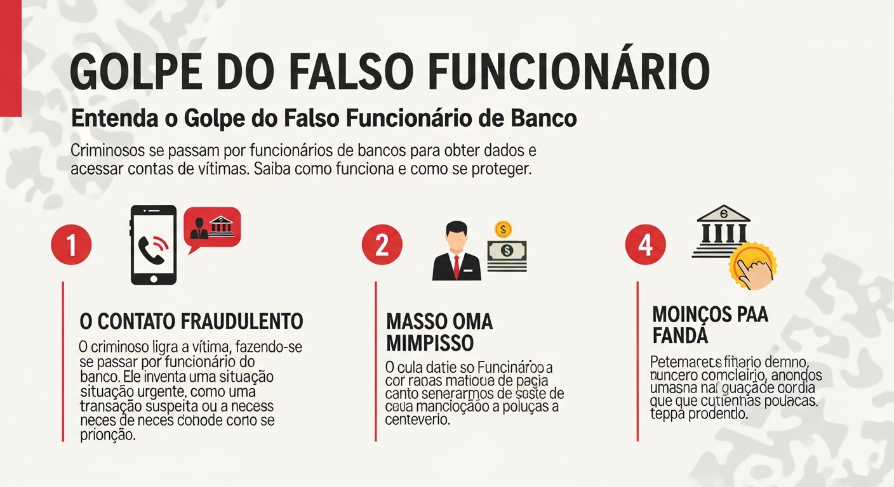

```
+==================================================================+
|               CASO: FALSO FUNCIONARIO DO BANCO                    |
+==================================================================+
| DIFICULDADE: MEDIA | SCORE: 62 | DECISAO: SUSPEITA               |
+==================================================================+

CONTEXTO:
Dona Francisca, 72 anos, recebeu ligacao de alguem se passando 
por funcionario do banco dizendo que sua conta estava sendo 
invadida e que ela precisava "transferir o dinheiro para uma 
conta segura".

DADOS DA TRANSACAO:
- Valor: R$ 8.500 (todas as economias)
- Horario: 11:30 (horario comercial - nao suspeito)
- Dispositivo: Celular de sempre (confiavel)
- Destinatario: Conta PJ nunca vista antes

ANALISE DO SISTEMA:

  Fator: VALOR
  +----------------------------------------------------------+
  | Maior transacao anterior: R$ 450                         |
  | Esta transacao: R$ 8.500                                 |
  | Desvio: 18.8x acima do maior historico                   |
  |                                                          |
  | VEREDICTO: VALOR MUITO ALTO                             |
  | Contribuicao ao score: +22 pontos                        |
  +----------------------------------------------------------+
  
  Fator: DESTINATARIO
  +----------------------------------------------------------+
  | Tipo: Pessoa Juridica                                    |
  | Historico: Nunca transferiu para PJ                      |
  | Conta destino: Criada ha 7 dias                          |
  |                                                          |
  | VEREDICTO: DESTINATARIO SUSPEITO                        |
  | Contribuicao ao score: +18 pontos                        |
  +----------------------------------------------------------+
  
  Fator: COMPORTAMENTO (sutil!)
  +----------------------------------------------------------+
  | Dona Francisca normalmente:                              |
  | - Faz PIX pequenos (R$ 50-200)                          |
  | - Apenas para filhos e netos                             |
  | - Nunca para empresas                                    |
  | - Nunca esvazia a conta                                  |
  |                                                          |
  | Esta transacao:                                          |
  | - Valor alto                                             |
  | - Para empresa desconhecida                              |
  | - Esvazia a conta                                        |
  |                                                          |
  | Contribuicao ao score: +15 pontos                        |
  +----------------------------------------------------------+
  
  FATORES PROTETORES (reduzem o score):
  +----------------------------------------------------------+
  | - Horario comercial: -5 pontos                           |
  | - Dispositivo confiavel: -8 pontos                       |
  +----------------------------------------------------------+

CALCULO FINAL:
  Base: 20 pontos
  + Valor alto: +22
  + Destinatario: +18
  + Comportamento: +15
  - Horario ok: -5
  - Dispositivo ok: -8
  = SCORE TOTAL: 62

DECISAO: SUSPEITA - REVISAO MANUAL + LIGACAO PARA CLIENTE

ACAO DO SISTEMA:
1. Transacao pausada (nao processada ainda)
2. Ligacao automatica para Dona Francisca
3. Pergunta de seguranca: "A senhora recebeu alguma ligacao 
   do banco hoje?"
4. Dona Francisca: "Sim! O rapaz disse que..."
5. Sistema: "A senhora foi vitima de um golpe. Nossos 
   funcionarios NUNCA pedem transferencias por telefone."

RESULTADO: FRAUDE EVITADA - R$ 8.500 salvos

LICAO APRENDIDA:
Este caso mostra por que nao basta olhar fatores isolados:
- Horario: OK
- Dispositivo: OK
- Mas: Valor + Destinatario + Comportamento = PROBLEMA
```

---

### CASO MEDIO 2: SIM Swap Parcial

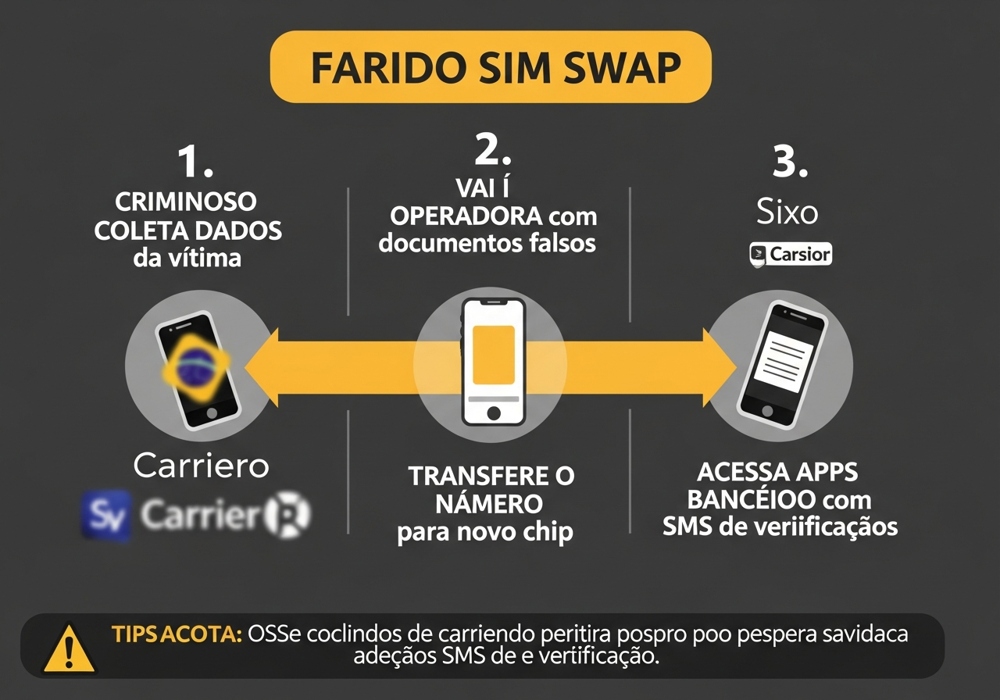

```
+==================================================================+
|               CASO: SIM SWAP                                      |
+==================================================================+
| DIFICULDADE: MEDIA | SCORE: 58 | DECISAO: SUSPEITA               |
+==================================================================+

CONTEXTO:
Fraudador conseguiu clonar o chip do celular de Carlos atraves 
de engenharia social na operadora. Agora recebe os SMS de 
autenticacao.

SEQUENCIA DE EVENTOS:
- 09:00 - Chip original de Carlos para de funcionar
- 09:15 - Login no app do banco (dispositivo novo)
- 09:16 - Tentativa de alterar email cadastrado
- 09:17 - Tentativa de PIX de R$ 12.000

ANALISE DO SISTEMA:

  Fator: DISPOSITIVO
  +----------------------------------------------------------+
  | Dispositivo anterior: Samsung S21 (2 anos de uso)        |
  | Dispositivo agora: Xiaomi Redmi (nunca visto)            |
  | Troca subita: SIM                                        |
  |                                                          |
  | VEREDICTO: DISPOSITIVO NOVO SUSPEITO                    |
  | Contribuicao ao score: +20 pontos                        |
  +----------------------------------------------------------+
  
  Fator: SEQUENCIA DE ACOES
  +----------------------------------------------------------+
  | Padrao detectado:                                        |
  | 1. Login de dispositivo novo                             |
  | 2. Tentativa de mudar email (account takeover)          |
  | 3. Tentativa de transferencia grande                     |
  |                                                          |
  | Este padrao e CLASSICO de SIM Swap                      |
  | Contribuicao ao score: +25 pontos                        |
  +----------------------------------------------------------+
  
  Fator: BIOMETRIA COMPORTAMENTAL
  +----------------------------------------------------------+
  | Carlos normalmente:                                       |
  | - Digita com velocidade media de 45 WPM                  |
  | - Usa o polegar direito para scrollar                    |
  | - Pausa 2-3 segundos antes de confirmar                  |
  |                                                          |
  | Usuario atual:                                            |
  | - Digita a 65 WPM (mais rapido)                         |
  | - Usa indicador para scrollar                            |
  | - Nao pausa antes de confirmar                           |
  |                                                          |
  | Contribuicao ao score: +15 pontos                        |
  +----------------------------------------------------------+

  FATORES PROTETORES:
  +----------------------------------------------------------+
  | - SMS de autenticacao recebido: -10 pontos               |
  |   (fraudador tem o chip, entao recebe SMS!)              |
  | - Horario comercial: -2 pontos                           |
  +----------------------------------------------------------+

CALCULO FINAL: 58 pontos (SUSPEITA)

ACAO DO SISTEMA:
1. Bloquear alteracao de email
2. Bloquear PIX
3. Ligar para numero alternativo cadastrado
4. Enviar email de alerta
5. Solicitar comparecimento em agencia

RESULTADO: Carlos comparece, confirma que chip foi clonado
```

---

### CASO MEDIO 3: Primeiro PIX para Desconhecido

```
+==================================================================+
|               CASO: ZONA CINZENTA                                 |
+==================================================================+
| DIFICULDADE: MEDIA | SCORE: 45 | DECISAO: SUSPEITA               |
+==================================================================+

DADOS:
- Cliente: Marcelo, 35 anos, autonomo
- PIX: R$ 3.800 para pessoa fisica desconhecida
- Hora: 21:30
- Dispositivo: Celular de sempre
- Justificativa: Compra de moto usada (se perguntado)

ANALISE DO SISTEMA:

  Fator: DESTINATARIO
  +----------------------------------------------------------+
  | Primeira transferencia para este CPF: SIM               |
  | Conta do destinatario: 8 meses de idade                 |
  | Historico do destinatario: Misto (algumas vendas)       |
  |                                                          |
  | Contribuicao ao score: +15 pontos                        |
  +----------------------------------------------------------+
  
  Fator: VALOR
  +----------------------------------------------------------+
  | Media de PIX do cliente: R$ 400                         |
  | Este PIX: R$ 3.800 (9.5x a media)                       |
  | Maior PIX anterior: R$ 2.000                            |
  |                                                          |
  | Contribuicao ao score: +18 pontos                        |
  +----------------------------------------------------------+
  
  Fator: HORARIO
  +----------------------------------------------------------+
  | Hora: 21:30 (noite, mas nao madrugada)                  |
  | Padrao do cliente: Opera ate 22h                        |
  |                                                          |
  | Contribuicao ao score: +5 pontos                         |
  +----------------------------------------------------------+

  FATORES PROTETORES:
  +----------------------------------------------------------+
  | - Dispositivo confiavel: -8 pontos                       |
  | - Cliente ativo ha 5 anos: -5 pontos                     |
  | - Nenhuma tentativa de senha errada: -5 pontos           |
  +----------------------------------------------------------+

CALCULO FINAL: 45 pontos

DECISAO: SUSPEITA - Verificacao por SMS

PERGUNTA AO CLIENTE:
"Voce esta fazendo um PIX de R$ 3.800 para [Nome]. 
Confirma esta operacao? Responda SIM ou NAO."

Cliente responde: "SIM" 

RESULTADO: APROVADO apos confirmacao
(Cliente realmente estava comprando uma moto)
```

---

## Zona Cinzenta - Casos Ambiguos

### Quando os Fatores se Equilibram

```
+==================================================================+
|           MATRIZ DE DECISAO - ZONA CINZENTA                       |
+==================================================================+

SCORE 30-40: SUSPEITA LEVE
+------------------------------------------------------------------+
| Acao: Continuar monitorando                                       |
| Verificacao: SMS simples                                          |
| Tempo de resposta: Normal                                         |
| Exemplo: Valor um pouco acima + horario um pouco tarde            |
+------------------------------------------------------------------+

SCORE 40-50: SUSPEITA MODERADA
+------------------------------------------------------------------+
| Acao: Verificacao obrigatoria                                     |
| Verificacao: SMS + aguardar resposta                              |
| Tempo de resposta: Pausado ate confirmacao                        |
| Exemplo: Dispositivo novo + valor alto + destinatario novo        |
+------------------------------------------------------------------+

SCORE 50-60: SUSPEITA ALTA
+------------------------------------------------------------------+
| Acao: Revisao manual prioritaria                                  |
| Verificacao: Ligacao para cliente                                 |
| Tempo de resposta: Maximo 5 minutos                               |
| Exemplo: Comportamento anomalo + mudanca de dados + valor alto    |
+------------------------------------------------------------------+

SCORE 60-70: SUSPEITA MUITO ALTA
+------------------------------------------------------------------+
| Acao: Transacao pausada + ligacao imediata                        |
| Verificacao: Confirmacao por multiplos canais                     |
| Tempo de resposta: Imediato                                       |
| Exemplo: Padrao de golpe conhecido + varios fatores de risco      |
+------------------------------------------------------------------+
```

---

# PARTE IV - CENARIOS DIFICEIS

## Fraudes que So IA Consegue Detectar

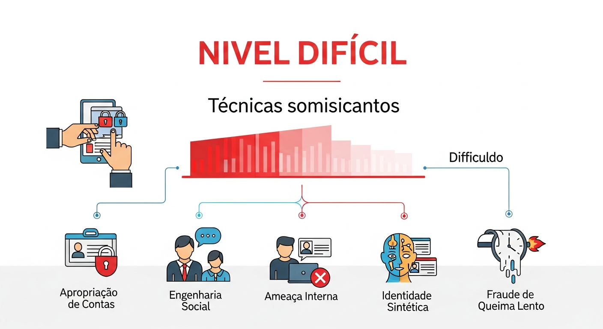

Estes casos sao extremamente sofisticados. Um humano analisando individualmente **nao conseguiria** detectar. E necessario:
- Analise de milhoes de transacoes
- Deteccao de padroes ocultos
- Correlacao entre contas
- Biometria comportamental
- Machine Learning avancado

---

### CASO DIFICIL 1: Account Takeover Gradual

```
+==================================================================+
|               CASO: TOMADA DE CONTA GRADUAL                       |
+==================================================================+
| DIFICULDADE: MUITO DIFICIL | SCORE: 35->72 | DECISAO: FRAUDE     |
+==================================================================+

CONTEXTO:
Fraudador conseguiu acesso a conta de Patricia atraves de 
phishing. Em vez de agir imediatamente (o que seria detectado), 
ele "aquece" a conta gradualmente ao longo de SEMANAS.

LINHA DO TEMPO:

SEMANA 1 - Reconhecimento
+------------------------------------------------------------------+
| - Login do dispositivo novo (explicacao: "celular novo")         |
| - Navegacao pelo app (estudando a vitima)                        |
| - Nenhuma transacao                                               |
| SCORE: 25 (dispositivo novo, mas comportamento normal)           |
+------------------------------------------------------------------+

SEMANA 2 - Aquecimento
+------------------------------------------------------------------+
| - PIX pequeno de R$ 50 para teste                                |
| - PIX de R$ 80 para outra conta teste                            |
| - Destinatarios: Contas do proprio fraudador                     |
| SCORE: 28 (valores baixos, parecem normais)                      |
+------------------------------------------------------------------+

SEMANA 3 - Normalizacao
+------------------------------------------------------------------+
| - PIX de R$ 200                                                   |
| - PIX de R$ 350                                                   |
| - Valores crescentes mas graduais                                 |
| SCORE: 30 (ainda na faixa "normal")                              |
+------------------------------------------------------------------+

SEMANA 4 - O ATAQUE
+------------------------------------------------------------------+
| - 14:00 - PIX de R$ 2.000                                        |
| - 14:05 - PIX de R$ 3.500                                        |
| - 14:10 - PIX de R$ 5.000 [BLOQUEADO]                            |
+------------------------------------------------------------------+

COMO A IA DETECTOU (o que humano nao veria):

  Analise de Rede
  +----------------------------------------------------------+
  | Os destinatarios dos PIX pequenos (semanas 2-3) estao    |
  | CONECTADOS aos destinatarios do ataque final:            |
  |                                                          |
  |   Conta A (R$50) ----+                                   |
  |                      |                                   |
  |   Conta B (R$80) ----+---> Conta Mestre (recebe tudo)   |
  |                      |                                   |
  |   Conta C (R$2000) --+                                   |
  |                                                          |
  | TODAS as contas pertencem a mesma rede de fraude!       |
  +----------------------------------------------------------+
  
  Biometria Comportamental
  +----------------------------------------------------------+
  | Patricia (real):                                          |
  | - Usa app por 2-3 minutos                                |
  | - Faz 1-2 transacoes e sai                               |
  | - Scrolling lento e pausado                              |
  |                                                          |
  | Fraudador:                                                |
  | - Sessoes de 15-20 minutos                               |
  | - Navega por TODAS as telas (reconhecimento)             |
  | - Scrolling rapido e sistematico                         |
  |                                                          |
  | Match de comportamento: apenas 23%                       |
  +----------------------------------------------------------+
  
  Padroes de Acesso
  +----------------------------------------------------------+
  | Patricia acessa: 08h, 12h, 19h (horarios fixos)          |
  | Fraudador acessa: horarios variaveis, inclusive 3AM     |
  +----------------------------------------------------------+

SCORE FINAL NA SEMANA 4: 72 (apos correlacao de rede)

DETECCAO: IA conectou os pontos que humano nao veria
- Pequenas transacoes de "teste" 
- Rede de contas conectadas
- Comportamento diferente do real
```

---

### CASO DIFICIL 2: Identidade Sintetica

```
+==================================================================+
|               CASO: IDENTIDADE SINTETICA                          |
+==================================================================+
| DIFICULDADE: MUITO DIFICIL | SCORE: 45 | DECISAO: FRAUDE         |
+==================================================================+

CONTEXTO:
Fraudador criou uma identidade COMPLETAMENTE FALSA combinando:
- CPF de pessoa falecida
- Nome inventado
- Endereco real (de terreno baldio)
- Selfie gerada por IA (deepfake)

Esta identidade foi usada para:
1. Abrir conta digital
2. Solicitar cartao de credito
3. Fazer emprestimo
4. Nao pagar nada

COMO PARECIA LEGITIMO:
+------------------------------------------------------------------+
| - CPF valido (verificacao passou)                                 |
| - Selfie "confirmada" por reconhecimento facial                   |
| - Endereco existe (Google Maps confirma)                          |
| - Score de credito: Neutro (sem historico)                        |
| - Comportamento inicial: "normal" para conta nova                 |
+------------------------------------------------------------------+

COMO A IA DETECTOU:

  Analise de Dispositivo
  +----------------------------------------------------------+
  | O celular usado para criar esta conta JA FOI USADO      |
  | para criar outras 7 contas nos ultimos 6 meses!         |
  |                                                          |
  | Contas criadas com este dispositivo:                     |
  | - Joao Silva (conta fechada por fraude)                  |
  | - Maria Oliveira (conta fechada por fraude)              |
  | - Pedro Santos (inadimplente)                            |
  | - ... mais 4 contas problematicas                        |
  |                                                          |
  | DISPOSITIVO NA BLACKLIST                                |
  +----------------------------------------------------------+
  
  Analise de Biometria Facial
  +----------------------------------------------------------+
  | Selfie enviada tem caracteristicas de DEEPFAKE:          |
  |                                                          |
  | - Borda do rosto com artefatos digitais                  |
  | - Reflexo nos olhos inconsistente                        |
  | - Textura de pele "perfeita demais"                      |
  | - Fundo com blur artificial                              |
  |                                                          |
  | Probabilidade de deepfake: 94%                           |
  +----------------------------------------------------------+
  
  Analise de Endereco
  +----------------------------------------------------------+
  | Endereco informado: Rua das Flores, 123                  |
  | Verificacao satelite: Terreno baldio                     |
  | Correios: Nenhuma entrega neste endereco                 |
  | Historico: Usado em outras 3 fraudes                     |
  +----------------------------------------------------------+
  
  Analise de CPF
  +----------------------------------------------------------+
  | CPF: XXX.XXX.XXX-XX                                      |
  | Status: Vinculado a pessoa falecida em 2019              |
  | Movimentacao pos-obito: Suspeita                        |
  +----------------------------------------------------------+

ACAO: Conta bloqueada antes da primeira transacao fraudulenta
```

---

### CASO DIFICIL 3: Fraude do Insider

```
+==================================================================+
|               CASO: FUNCIONARIO CORRUPTO                          |
+==================================================================+
| DIFICULDADE: MUITO DIFICIL | SCORE: N/A | DECISAO: INVESTIGACAO  |
+==================================================================+

CONTEXTO:
Um gerente de agencia esta desviando dinheiro de contas de 
clientes idosos que raramente acessam o app.

METODO:
1. Identifica clientes 70+ anos com saldo alto e pouco acesso
2. Faz PIX pequenos (R$ 500-2.000) para contas de laranjas
3. Falsifica assinaturas em TED quando necessario
4. Operacao ativa ha 18 meses

POR QUE ERA DIFICIL DETECTAR:
+------------------------------------------------------------------+
| - Transacoes feitas pelo PROPRIO SISTEMA do banco                 |
| - Gerente tem acesso legitimo as contas                           |
| - Valores pequenos comparados ao saldo total                      |
| - Clientes nao acessam app (nao percebem)                         |
| - Tudo feito em horario comercial                                 |
+------------------------------------------------------------------+

COMO A IA DETECTOU:

  Analise de Rede Interna
  +----------------------------------------------------------+
  | Deteccao: 47 transacoes de 23 clientes diferentes        |
  | foram para as MESMAS 5 contas destino                    |
  |                                                          |
  | Correlacao: Todas processadas pelo mesmo funcionario     |
  | Probabilidade de coincidencia: 0.0001%                   |
  +----------------------------------------------------------+
  
  Analise de Perfil das Vitimas
  +----------------------------------------------------------+
  | 100% dos clientes afetados:                              |
  | - Idade 70+ anos                                         |
  | - Ultimo acesso ao app: 6+ meses                         |
  | - Saldo acima de R$ 50.000                               |
  | - Mesma agencia (agencia do gerente suspeito)            |
  |                                                          |
  | Padrao estatisticamente impossivel por acaso            |
  +----------------------------------------------------------+
  
  Analise de Horarios
  +----------------------------------------------------------+
  | 85% das transacoes suspeitas:                            |
  | - Entre 11:30-12:00 (fim do expediente manha)            |
  | - Entre 17:30-18:00 (fim do expediente tarde)            |
  | - Dias: Sexta-feira (vespera de fim de semana)           |
  |                                                          |
  | Coincide com horarios de menor supervisao               |
  +----------------------------------------------------------+

ACAO: Investigacao interna + Policia Federal
RESULTADO: Gerente preso, R$ 890.000 recuperados
```

---

### CASO DIFICIL 4: Fraude Lenta (Slow Burn)

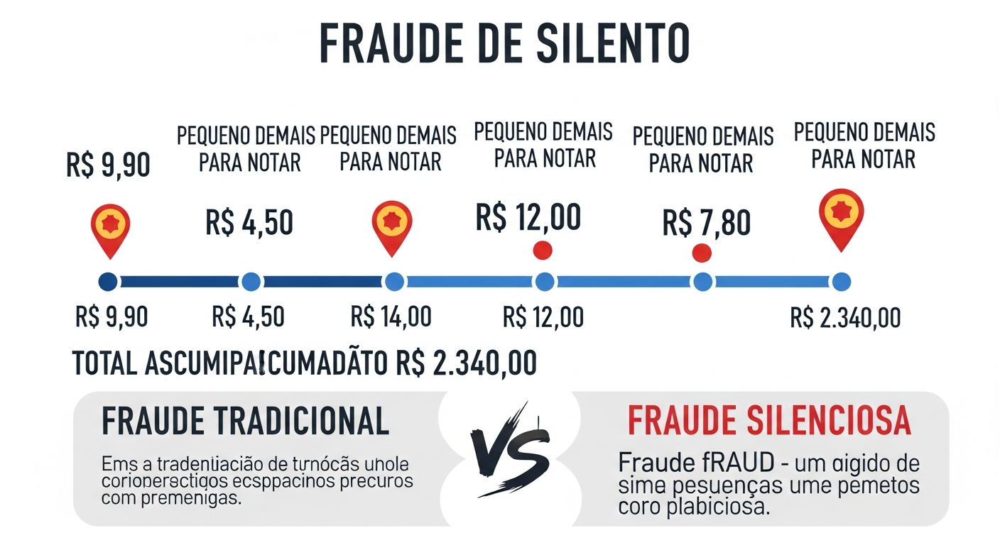

```
+==================================================================+
|               CASO: FRAUDE SILENCIOSA                             |
+==================================================================+
| DIFICULDADE: MUITO DIFICIL | SCORE: 28->75 | DECISAO: FRAUDE     |
+==================================================================+

CONTEXTO:
Fraudador com acesso a conta de empresa faz pequenos desvios 
ao longo de MESES, acumulando grande valor.

PADRAO MENSAL:
+------------------------------------------------------------------+
| Janeiro:   5 transacoes de R$ 180-220    Total: R$ 980           |
| Fevereiro: 6 transacoes de R$ 150-190    Total: R$ 1.020         |
| Marco:     5 transacoes de R$ 170-210    Total: R$ 920           |
| Abril:     7 transacoes de R$ 160-200    Total: R$ 1.260         |
| Maio:      6 transacoes de R$ 175-225    Total: R$ 1.180         |
| Junho:     5 transacoes de R$ 185-215    Total: R$ 1.000         |
| ...                                                               |
| TOTAL EM 12 MESES: R$ 14.200                                     |
+------------------------------------------------------------------+

POR QUE ERA DIFICIL DETECTAR:
+------------------------------------------------------------------+
| - Valores pequenos (abaixo do radar)                              |
| - Descricoes parecem legitimas ("Material escritorio")            |
| - Frequencia consistente (nao parece anomalo)                     |
| - Empresa tem muitas transacoes (se perde no volume)              |
| - Nenhuma transacao individual e suspeita                         |
+------------------------------------------------------------------+

COMO A IA DETECTOU:

  Analise de Destinatario ao Longo do Tempo
  +----------------------------------------------------------+
  | Todas as 65 transacoes suspeitas foram para o MESMO     |
  | CNPJ: Papelaria XYZ                                      |
  |                                                          |
  | Verificacao cruzada:                                     |
  | - Papelaria XYZ nao aparece em outras empresas clientes |
  | - CNPJ pertence ao cunhado do contador                   |
  | - Papelaria nao tem estoque compativel com compras       |
  +----------------------------------------------------------+
  
  Analise de Padrao de Round Numbers
  +----------------------------------------------------------+
  | Transacoes: R$ 180, 190, 200, 175, 185, 210, 220...      |
  | Fornecedores reais: R$ 187.45, 203.78, 156.32...         |
  |                                                          |
  | Valores "redondos" demais = provavel fabricacao          |
  +----------------------------------------------------------+
  
  Analise de Ausencia de Notas Fiscais
  +----------------------------------------------------------+
  | 65 compras em Papelaria XYZ                              |
  | Notas fiscais vinculadas: 0                              |
  |                                                          |
  | Conclusao: Compras fantasmas                             |
  +----------------------------------------------------------+

ACAO: Auditoria + Demissao por justa causa + Processo
```

---

# PARTE V - TECNICAS AVANCADAS

## Machine Learning na Pratica


### Como o Ensemble Funciona na Vida Real

```
+==================================================================+
|           ANATOMIA DE UMA DECISAO DE ML                           |
+==================================================================+

TRANSACAO RECEBIDA:
{
  "amount": 4500,
  "hour": 14,
  "device_id": "abc123",
  "recipient_cpf": "***",
  "location": "Sao Paulo"
}

PASSO 1: FEATURE ENGINEERING
+------------------------------------------------------------------+
| Transformamos dados brutos em features analisaveis:              |
|                                                                   |
| amount_normalized: 0.45 (comparado com historico)                |
| hour_risk: 0.1 (horario comercial)                               |
| device_trust: 0.95 (dispositivo conhecido)                       |
| recipient_risk: 0.60 (primeira vez para este CPF)                |
| velocity_1h: 0.15 (2 transacoes na ultima hora)                  |
| velocity_24h: 0.20 (5 transacoes em 24h)                         |
| location_risk: 0.05 (local habitual)                             |
| behavior_match: 0.85 (padrao consistente)                        |
|                                                                   |
| Total: 47 features extraidas                                      |
+------------------------------------------------------------------+

PASSO 2: RANDOM FOREST ANALISA
+------------------------------------------------------------------+
| 100 arvores de decisao votam:                                     |
|                                                                   |
| Arvore 1:  "Valor alto, mas dispositivo ok" -> NAO FRAUDE        |
| Arvore 2:  "Destinatario novo, cuidado" -> FRAUDE                |
| Arvore 3:  "Horario ok, local ok" -> NAO FRAUDE                  |
| ...                                                               |
| Arvore 100: "Comportamento consistente" -> NAO FRAUDE            |
|                                                                   |
| RESULTADO: 23 votos FRAUDE, 77 votos NAO FRAUDE                  |
| Probabilidade RF: 23%                                             |
+------------------------------------------------------------------+

PASSO 3: GRADIENT BOOSTING ANALISA
+------------------------------------------------------------------+
| 100 iteracoes de refinamento:                                     |
|                                                                   |
| Iteracao 1:  Erro 35% -> Ajusta pesos                            |
| Iteracao 2:  Erro 28% -> Ajusta pesos                            |
| Iteracao 3:  Erro 22% -> Ajusta pesos                            |
| ...                                                               |
| Iteracao 100: Erro 8%                                            |
|                                                                   |
| Foco especial em: recipient_risk (peso alto)                     |
| Probabilidade GB: 31%                                             |
+------------------------------------------------------------------+

PASSO 4: META-MODELO COMBINA
+------------------------------------------------------------------+
| Logistic Regression recebe:                                       |
| - RF: 23%                                                         |
| - GB: 31%                                                         |
| - Features originais                                              |
|                                                                   |
| Calculo: sigmoid(w1*23 + w2*31 + w3*features + bias)             |
| Resultado: 28.5%                                                  |
+------------------------------------------------------------------+

PASSO 5: CONVERSAO PARA SCORE
+------------------------------------------------------------------+
| Probabilidade: 28.5%                                              |
| Score (0-100): 28.5                                               |
|                                                                   |
| Thresholds:                                                       |
| - 0-30: APROVADO                                                  |
| - 30-70: SUSPEITA                                                 |
| - 70-100: FRAUDE                                                  |
|                                                                   |
| DECISAO FINAL: APROVADO (score 28.5 < 30)                        |
+------------------------------------------------------------------+
```

---

## Biometria Comportamental

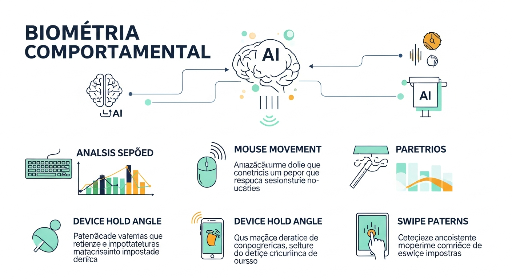

### O Que Analisamos Sem Voce Perceber

```
+==================================================================+
|           BIOMETRIA COMPORTAMENTAL - 15 FATORES                   |
+==================================================================+

1. VELOCIDADE DE DIGITACAO
+------------------------------------------------------------------+
| Voce: 42 palavras por minuto (consistente)                       |
| Fraudador: 68 palavras por minuto                                |
| Diferenca: 62% mais rapido = ALERTA                              |
+------------------------------------------------------------------+

2. PADRAO DE DIGITACAO
+------------------------------------------------------------------+
| Voce: Pausa longa antes de numeros                               |
| Voce: Erro frequente na tecla "7"                                |
| Fraudador: Sem pausas, sem erros                                 |
| Conclusao: Pessoa diferente                                       |
+------------------------------------------------------------------+

3. PRESSAO NA TELA
+------------------------------------------------------------------+
| Voce: Pressao media de 0.45 (toque suave)                        |
| Fraudador: Pressao de 0.72 (toque firme)                         |
| Diferenca: 60% mais forte = ALERTA                               |
+------------------------------------------------------------------+

4. ANGULO DO DISPOSITIVO
+------------------------------------------------------------------+
| Voce: Segura celular a 15 graus                                  |
| Fraudador: Segura a 45 graus                                     |
| Diferenca: Postura diferente = ALERTA                            |
+------------------------------------------------------------------+

5. VELOCIDADE DE SCROLLING
+------------------------------------------------------------------+
| Voce: 180 pixels/segundo (lento, lendo)                          |
| Fraudador: 450 pixels/segundo (rapido, procurando)               |
| Diferenca: 150% mais rapido = ALERTA                             |
+------------------------------------------------------------------+

6. PADROES DE NAVEGACAO
+------------------------------------------------------------------+
| Voce: Home -> Extrato -> PIX -> Confirma                         |
| Fraudador: Home -> Configuracoes -> Seguranca -> Home -> PIX     |
| Diferenca: Navegacao exploratioria = ALERTA                      |
+------------------------------------------------------------------+

7. TEMPO DE SESSAO
+------------------------------------------------------------------+
| Voce: 2-4 minutos por sessao                                     |
| Fraudador: 15-20 minutos (estudando a conta)                     |
| Diferenca: 5x mais longo = ALERTA                                |
+------------------------------------------------------------------+

8. HORARIOS DE ACESSO
+------------------------------------------------------------------+
| Voce: 08h, 12h, 19h (rotina)                                     |
| Fraudador: 03h, 04h, 05h (madrugada)                             |
| Diferenca: Horario totalmente diferente = ALERTA                 |
+------------------------------------------------------------------+

9. PAUSA ANTES DE CONFIRMAR
+------------------------------------------------------------------+
| Voce: 3.2 segundos em media (verificando)                        |
| Fraudador: 0.4 segundos (pressa)                                 |
| Diferenca: 8x mais rapido = ALERTA                               |
+------------------------------------------------------------------+

10. USO DE COPIAR/COLAR
+------------------------------------------------------------------+
| Voce: Digita manualmente                                          |
| Fraudador: Cola chave PIX (tinha preparado)                      |
| Diferenca: Comportamento atipico = ALERTA                        |
+------------------------------------------------------------------+

11. ORIENTACAO DA TELA
+------------------------------------------------------------------+
| Voce: Sempre vertical                                             |
| Fraudador: Rotaciona para horizontal                             |
| Diferenca: Uso diferente = ALERTA                                |
+------------------------------------------------------------------+

12. TELAS VISITADAS
+------------------------------------------------------------------+
| Voce: PIX, Extrato (2 telas)                                     |
| Fraudador: Todas as 15 telas do app                              |
| Diferenca: Exploracao sistematica = ALERTA                       |
+------------------------------------------------------------------+

13. RESPOSTA A NOTIFICACOES
+------------------------------------------------------------------+
| Voce: Ignora notificacoes de marketing                           |
| Fraudador: Clica em tudo (nervosismo)                            |
| Diferenca: Padrao diferente = ALERTA                             |
+------------------------------------------------------------------+

14. USO DE ATALHOS
+------------------------------------------------------------------+
| Voce: Usa atalho de PIX favoritos                                |
| Fraudador: Navega pelo caminho longo                             |
| Diferenca: Nao conhece seus atalhos = ALERTA                     |
+------------------------------------------------------------------+

15. MICROGESTOS
+------------------------------------------------------------------+
| Voce: Pequeno tremor natural nas maos                            |
| Fraudador: Movimentos mais estaveis                              |
| Diferenca: Biometria de movimento diferente = ALERTA             |
+------------------------------------------------------------------+

SCORE DE COMPORTAMENTO COMBINADO:
Se mais de 5 fatores estao diferentes: +20 pontos no score
Se mais de 10 fatores estao diferentes: +40 pontos no score
Se mais de 13 fatores estao diferentes: Provavelmente fraude
```

---

## Analise de Rede

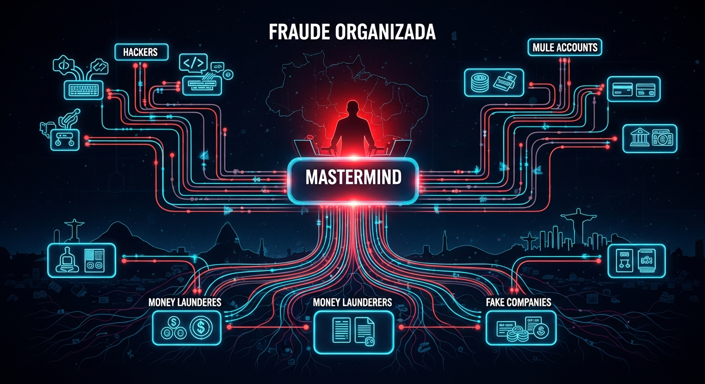

### Como Detectamos Redes de Fraudadores

```
+==================================================================+
|           ANALISE DE REDE - CONEXOES OCULTAS                      |
+==================================================================+

CENARIO: Parece haver varias fraudes isoladas, mas na verdade 
todas fazem parte da MESMA REDE CRIMINOSA.

VITIMAS (parecem nao ter relacao):
- Vitima A: Perdeu R$ 5.000 para conta X
- Vitima B: Perdeu R$ 3.200 para conta Y
- Vitima C: Perdeu R$ 8.100 para conta Z
- Vitima D: Perdeu R$ 2.800 para conta W

INVESTIGACAO TRADICIONAL: 4 casos separados

INVESTIGACAO COM IA:

  Nivel 1 - Conexao Direta
  +----------------------------------------------------------+
  | Conta X recebeu da Vitima A                              |
  | Conta Y recebeu da Vitima B                              |
  | Conta Z recebeu da Vitima C                              |
  | Conta W recebeu da Vitima D                              |
  |                                                          |
  | Nenhuma conexao aparente...                              |
  +----------------------------------------------------------+
  
  Nivel 2 - Rastro do Dinheiro
  +----------------------------------------------------------+
  | Conta X transferiu para -> Conta M (R$ 4.800)            |
  | Conta Y transferiu para -> Conta M (R$ 3.000)            |
  | Conta Z transferiu para -> Conta M (R$ 7.900)            |
  | Conta W transferiu para -> Conta M (R$ 2.600)            |
  |                                                          |
  | TODAS as contas enviaram para CONTA M!                   |
  +----------------------------------------------------------+
  
  Nivel 3 - Analise da Conta Centralizadora
  +----------------------------------------------------------+
  | Conta M (Centralizadora):                                |
  | - Criada ha 4 meses                                      |
  | - Recebeu R$ 287.000 de 73 contas diferentes             |
  | - Todas as contas remetentes sao laranjas                |
  | - Saque: 100% em especie em terminais diferentes         |
  +----------------------------------------------------------+
  
  Nivel 4 - Conexao de Dispositivos
  +----------------------------------------------------------+
  | Contas X, Y, Z, W foram criadas do MESMO celular         |
  | Celular ID: "abc-123-xyz"                                |
  |                                                          |
  | Este celular tambem acessou:                             |
  | - Conta M (centralizadora)                               |
  | - Outras 12 contas laranjas                              |
  +----------------------------------------------------------+

VISUALIZACAO DA REDE:

           [Vitima A]    [Vitima B]    [Vitima C]    [Vitima D]
               |             |             |             |
               v             v             v             v
           [Conta X]     [Conta Y]     [Conta Z]     [Conta W]
               \             |             |             /
                \            |             |            /
                 \           |             |           /
                  \          |             |          /
                   \         |             |         /
                    +--------+------+------+--------+
                                    |
                                    v
                              [CONTA M]
                           Centralizadora
                                    |
                                    v
                           [ORGANIZACAO]
                              CRIMINOSA

RESULTADO DA IA:
- 4 casos "separados" -> 1 rede organizada
- 73 vitimas identificadas no total
- R$ 287.000 em fraudes
- 1 organizacao criminosa mapeada
- Informacoes repassadas a Policia Federal
```

---

# PARTE VI - LABORATORIO PRATICO

## Exercicios de Classificacao

### Exercicio 1: Classifique o Cenario

```
+==================================================================+
|           EXERCICIO 1: MADRUGADA SUSPEITA                         |
+==================================================================+

DADOS:
- Cliente: Fernando, 45 anos, empresario
- Hora: 03:45
- Transacao: PIX de R$ 15.000 para PJ desconhecida
- Dispositivo: Celular de sempre
- Historico: Ja fez transacoes altas, mas nunca de madrugada
- Comportamento: Navegacao rapida, sem pausas

FATORES:
1. Horario de madrugada
2. Valor alto (mas compativel com historico)
3. Destinatario novo (PJ)
4. Dispositivo confiavel
5. Comportamento diferente

PERGUNTA: Qual deveria ser a decisao?
( ) APROVADO - Score < 30
( ) SUSPEITA - Score 30-70
( ) FRAUDE - Score > 70
```

<details>
<summary>VER RESPOSTA</summary>

**RESPOSTA: SUSPEITA (Score aproximado: 55)**

Justificativa:
- Horario de madrugada: +20 pontos
- Valor alto: +15 pontos (mas historico suporta)
- Destinatario PJ novo: +15 pontos
- Comportamento rapido: +10 pontos
- Dispositivo confiavel: -5 pontos

Score: ~55

**Acao correta:** Pausar transacao e ligar para cliente.

Se Fernando confirmar que esta fazendo pagamento de fornecedor 
internacional (fuso horario), liberar. Se nao atender ou negar, 
bloquear.
</details>

---

### Exercicio 2: Rede de Laranjas

```
+==================================================================+
|           EXERCICIO 2: IDENTIFIQUE A REDE                         |
+==================================================================+

DADOS DE 5 TRANSACOES DIFERENTES:

Transacao 1:
- De: Maria (cliente normal)
- Para: Conta A
- Valor: R$ 2.500
- Hora: 14:00

Transacao 2:
- De: Joao (cliente normal)
- Para: Conta B
- Valor: R$ 1.800
- Hora: 14:30

Transacao 3:
- De: Pedro (cliente normal)
- Para: Conta C
- Valor: R$ 3.200
- Hora: 15:00

Transacao 4:
- De: Ana (cliente normal)
- Para: Conta A
- Valor: R$ 2.100
- Hora: 15:30

Transacao 5:
- De: Carlos (cliente normal)
- Para: Conta B
- Valor: R$ 2.900
- Hora: 16:00

INFORMACOES ADICIONAIS:
- Contas A, B e C foram criadas na mesma semana
- Todas do mesmo banco
- Todas transferiram 95% do saldo para Conta D no mesmo dia

PERGUNTA: O que voce conclui?
```

<details>
<summary>VER RESPOSTA</summary>

**CONCLUSAO: REDE DE CONTAS LARANJA**

Analise:
1. 3 contas (A, B, C) criadas juntas = suspeito
2. Multiplos remetentes diferentes = golpe em andamento
3. 95% transferido para conta unica (D) = centralizadora
4. Mesmo padrao de valores (~R$ 2.000-3.500) = script automatizado

**Mapeamento da Rede:**
```
Maria  ---> Conta A --+
                      |
Ana    ---> Conta A --+---> Conta D (Boss)
                      |
Joao   ---> Conta B --+
                      |
Carlos ---> Conta B --+
                      |
Pedro  ---> Conta C --+
```

**Acao necessaria:**
1. Bloquear contas A, B, C, D
2. Investigar Conta D (organizador)
3. Alertar bancos das vitimas
4. Reportar ao BACEN e Policia
</details>

---

### Exercicio 3: Caso Complexo

```
+==================================================================+
|           EXERCICIO 3: O DILEMA                                   |
+==================================================================+

CENARIO:
Joana, 28 anos, esta de ferias em Portugal. Ela tenta fazer 
um PIX de R$ 8.000 para sua mae pagar o IPTU da casa.

DADOS:
- Localizacao: Lisboa, Portugal (IP confirmado)
- Dispositivo: iPhone 14 (mesmo de sempre)
- Hora: 10:00 (horario de Portugal = 06:00 Brasil)
- Historico: Ja fez PIX para mae antes
- Valor: Maior PIX da vida dela (antes max era R$ 3.000)
- Comportamento: Normal, com pausas de leitura

FATORES CONFLITANTES:
+ Dispositivo confiavel
+ Destinatario conhecido (mae)
+ Comportamento normal
- Localizacao internacional (primeira vez)
- Horario incomum (para horario brasileiro)
- Valor recorde

PERGUNTA: Como voce classificaria?
```

<details>
<summary>VER RESPOSTA</summary>

**RESPOSTA: SUSPEITA LEVE (Score aproximado: 38)**

Analise equilibrada:
- Localizacao internacional: +15 pontos
- Horario (6h Brasil): +8 pontos
- Valor recorde: +12 pontos
- Dispositivo conhecido: -10 pontos
- Destinatario mae: -7 pontos
- Comportamento normal: -5 pontos

Score: ~38

**Acao correta:** Verificacao simples por SMS

Mensagem: "Joana, voce esta fazendo um PIX de R$ 8.000 para 
[Mae] de Portugal. Confirma? Responda SIM ou NAO."

Se responder SIM do mesmo dispositivo = Aprovar
Se nao responder em 5 min = Manter pausado
Se responder NAO = Bloquear + Ligar

**Por que nao bloquear direto?**
Todos os fatores de risco tem explicacao plausivel:
- Ferias explicam Portugal
- Fuso horario explica horario
- IPTU explica valor maior
- Mae explica destinatario

O sistema deve ser cuidadoso, nao paranolco.
</details>

---

## Simulacao de Ataque

### Simulacao 1: Voce e o Fraudador

```
+==================================================================+
|           SIMULACAO: TENTE BURLAR O SISTEMA                       |
+==================================================================+

DESAFIO: Voce tem acesso a conta de uma vitima. 
Como faria para nao ser detectado?

DADOS DA VITIMA:
- Nome: Roberto
- Saldo: R$ 45.000
- Padrao de PIX: R$ 200-500
- Horario habitual: 09h-18h
- Dispositivo: Samsung S22
- Destinatarios frequentes: Esposa, Filho, Supermercado

SEU OBJETIVO: Transferir R$ 10.000 sem ser bloqueado

TENTATIVA 1: PIX direto de R$ 10.000
+------------------------------------------------------------------+
| Acao: PIX de R$ 10.000 para sua conta                            |
| Resultado: BLOQUEADO (Score 89)                                  |
| Motivo: Valor 20x acima da media + destinatario novo            |
+------------------------------------------------------------------+

TENTATIVA 2: Varios PIX pequenos rapidos
+------------------------------------------------------------------+
| Acao: 20 PIX de R$ 500 em 10 minutos                             |
| Resultado: BLOQUEADO no 5o PIX (Score 78)                        |
| Motivo: Velocidade anomala detectada                             |
+------------------------------------------------------------------+

TENTATIVA 3: PIX para esposa, depois ela transfere
+------------------------------------------------------------------+
| Acao: PIX de R$ 3.000 para esposa (normal)                       |
| Resultado: APROVADO inicialmente                                 |
| Problema: Esposa vai perceber e avisar Roberto                   |
| Status: FALHOU                                                   |
+------------------------------------------------------------------+

TENTATIVA 4: Aquecimento lento (semanas)
+------------------------------------------------------------------+
| Semana 1: PIX de R$ 300 para conta teste                         |
| Semana 2: PIX de R$ 400 para conta teste                         |
| Semana 3: PIX de R$ 600 para conta teste                         |
| Semana 4: PIX de R$ 1.000 para conta teste                       |
| ...                                                               |
| Resultado: DETECTADO na semana 3 (Score 52)                      |
| Motivo: Analise de rede identificou contas conectadas            |
+------------------------------------------------------------------+

CONCLUSAO: O sistema detecta TODAS as tentativas

Por que?
1. Valores altos: Detectados imediatamente
2. Valores rapidos: Detectados por velocidade
3. Valores graduais: Detectados por analise de rede
4. Usar contatos reais: Envolve terceiros que vao perceber

O SISTEMA E MULTICAMADAS - nao ha como burlar todas.
```

---

## Casos de Estudo

### Caso Real 1: Fraude de R$ 3 Milhoes (Detectada)

```
+==================================================================+
|           CASO REAL: OPERACAO CONTA LIMPA                         |
+==================================================================+

RESUMO:
Quadrilha tentou desviar R$ 3.2 milhoes de empresa de logistica 
atraves de boletos adulterados durante 6 meses.

METODO:
1. Hacker invadiu email do financeiro
2. Interceptou boletos de fornecedores reais
3. Alterou codigo de barras para conta laranja
4. Empresa pagava "fornecedores" normalmente

COMO FOI DETECTADO:

  Alerta 1 - Mes 2
  +----------------------------------------------------------+
  | Sistema detectou: Mesmo CNPJ de fornecedor, conta        |
  | bancaria diferente do historico                          |
  | Acao: Alerta para financeiro (ignorado)                  |
  +----------------------------------------------------------+
  
  Alerta 2 - Mes 4
  +----------------------------------------------------------+
  | Sistema detectou: 5 fornecedores diferentes, mesma       |
  | conta destino                                            |
  | Acao: Alerta escalado para gerencia                      |
  | Resultado: Investigacao iniciada                         |
  +----------------------------------------------------------+
  
  Alerta 3 - Mes 5
  +----------------------------------------------------------+
  | Sistema detectou: Padrao de boleto adulterado            |
  | - Codigo de barras nao bate com linha digitavel          |
  | - Banco do codigo diferente do banco declarado           |
  | Acao: Bloqueio automatico de todos os pagamentos         |
  +----------------------------------------------------------+

RESULTADO:
- R$ 890.000 ja desviados (antes da deteccao completa)
- R$ 2.310.000 bloqueados (fraude evitada)
- Quadrilha identificada e presa
- Empresa recuperou R$ 650.000

LICAO:
Se os alertas do Mes 2 tivessem sido levados a serio, 
toda a fraude teria sido evitada.
```

---

### Caso Real 2: SIM Swap em Massa

```
+==================================================================+
|           CASO REAL: OPERACAO CHIP FURADO                         |
+==================================================================+

RESUMO:
Funcionario de operadora de telefonia estava vendendo SIM Swaps 
para quadrilha de fraudadores. 847 vitimas em 8 meses.

COMO FUNCIONAVA:
1. Funcionario recebia R$ 200 por chip clonado
2. Passava dados para fraudador
3. Fraudador acessava banco (recebia SMS de verificacao)
4. Transferia todo o saldo via PIX

COMO FOI DETECTADO:

  Correlacao de Dados
  +----------------------------------------------------------+
  | Sistema detectou padrao:                                  |
  | - 847 casos de "dispositivo novo" + "transferencia alta" |
  | - 100% das vitimas eram da MESMA operadora               |
  | - 78% tinham troca de chip nas 24h anteriores            |
  | - Todas as transacoes entre 09h-18h (horario comercial)  |
  |                                                          |
  | Conclusao: Insider na operadora                          |
  +----------------------------------------------------------+
  
  Investigacao Cruzada
  +----------------------------------------------------------+
  | Bancos compartilharam dados (com autorizacao BACEN):     |
  | - Mesmo padrao em 4 bancos diferentes                    |
  | - Fraudadores sacavam em caixas da mesma regiao          |
  | - GPS dos saques: Raio de 5km em Campinas/SP             |
  +----------------------------------------------------------+

RESULTADO:
- Funcionario da operadora: Preso
- 5 fraudadores: Presos
- R$ 4.2 milhoes desviados
- R$ 2.8 milhoes recuperados
- Operadora: Multada em R$ 15 milhoes

LICAO:
Analise de rede entre instituicoes e crucial para detectar 
fraudes organizadas.
```

---

# APENDICE A: Glossario Completo

| Termo | Significado |
|-------|-------------|
| **Account Takeover** | Quando fraudador assume controle de conta legitima |
| **Biometria Comportamental** | Analise de como voce usa o dispositivo (digitacao, etc) |
| **Chargeback** | Contestacao de compra no cartao de credito |
| **Conta Laranja** | Conta usada para receber/movimentar dinheiro de fraude |
| **Deepfake** | Imagem ou video falso gerado por IA |
| **Ensemble** | Combinacao de varios modelos de ML |
| **Feature** | Caracteristica extraida dos dados para analise |
| **Gradient Boosting** | Algoritmo ML que aprende com erros |
| **Identidade Sintetica** | Identidade falsa criada com dados reais e falsos |
| **LGPD** | Lei Geral de Protecao de Dados |
| **Phishing** | Golpe que tenta roubar dados atraves de sites/emails falsos |
| **PIX** | Sistema de pagamento instantaneo brasileiro |
| **Random Forest** | Algoritmo ML baseado em arvores de decisao |
| **Score de Risco** | Numero de 0-100 indicando probabilidade de fraude |
| **SIM Swap** | Clonagem de chip de celular |
| **Slow Burn** | Fraude lenta, em pequenas quantidades |
| **Spear Phishing** | Phishing direcionado a pessoa especifica |
| **Stacking** | Tecnica de combinar modelos em camadas |
| **Threshold** | Limite para tomada de decisao |
| **Velocity** | Velocidade de transacoes em periodo de tempo |

---

# APENDICE B: Checklist do Analista

```
+==================================================================+
|           CHECKLIST PARA ANALISE MANUAL                           |
+==================================================================+

ANTES DE APROVAR TRANSACAO SUSPEITA:

[ ] Verifiquei o historico completo do cliente
[ ] Comparei com padrao de comportamento
[ ] Analisei o destinatario
[ ] Verifiquei se houve tentativas de senha
[ ] Confirmei dispositivo/localizacao
[ ] Liguei para cliente se necessario
[ ] Documentei minha decisao

SINAIS DE ALERTA CRITICOS (bloquear imediatamente):

[ ] Localizacao fisicamente impossivel
[ ] Multiplas transacoes em segundos
[ ] Dispositivo na blacklist
[ ] Conta destino marcada como laranja
[ ] Padrao identico a golpe conhecido
[ ] Tentativas de senha antes da transacao

PERGUNTAS PARA LIGACAO AO CLIENTE:

1. "O senhor(a) esta tentando fazer uma transacao agora?"
2. "Recebeu alguma ligacao do banco hoje?"
3. "Pode confirmar o valor e destinatario?"
4. "Esta sob algum tipo de pressao?"
5. "Conhece pessoalmente o destinatario?"
```

---

# CONCLUSAO

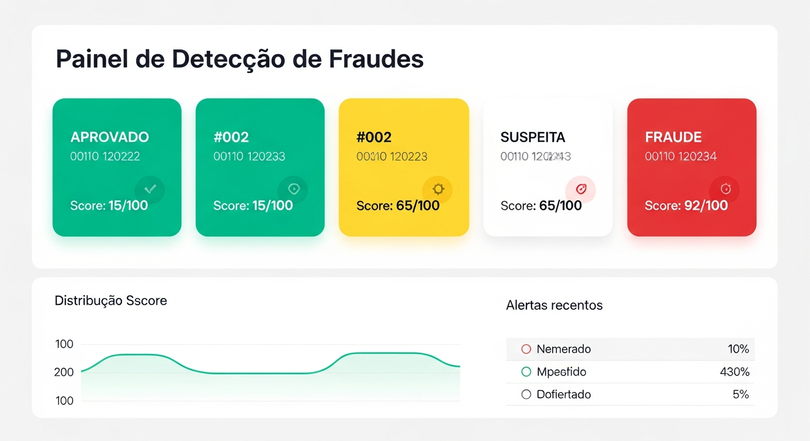

Voce completou a **Universidade de Fraudes Bancarias**!

## O Que Voce Aprendeu

```
+==================================================================+
|                    CERTIFICADO DE CONCLUSAO                       |
+==================================================================+
|                                                                   |
| [x] Evolucao historica das fraudes no Brasil                     |
| [x] Perfis de fraudadores (Amador, Profissional, Especialista)   |
| [x] Como funciona o sistema de deteccao com 3 modelos de IA      |
| [x] Os 7 fatores analisados em cada transacao                    |
| [x] Cenarios FACEIS de detectar (100% automatico)                |
| [x] Cenarios MEDIOS (requerem analise combinada)                 |
| [x] Cenarios DIFICEIS (so IA consegue ver)                       |
| [x] Biometria comportamental (15 fatores ocultos)                |
| [x] Analise de rede (conexoes entre contas)                      |
| [x] Tecnicas avancadas de fraudadores                            |
| [x] Como os fraudadores tentam burlar (e falham)                 |
| [x] Casos reais de fraudes detectadas                            |
|                                                                   |
+==================================================================+
```

## Mensagem Final

> A fraude evolui constantemente. Nossos sistemas tambem.
> 
> Cada transacao analisada, cada fraude detectada, cada padrao 
> identificado alimenta nosso aprendizado de maquina.
> 
> Voce, como analista, desenvolvedor ou gestor, e parte 
> fundamental dessa defesa. Use este conhecimento para 
> proteger o sistema financeiro brasileiro.

---

**Sankofa Enterprise Pro v12.0**  
*Universidade de Fraudes Bancarias*  
*Protegendo instituicoes financeiras com inteligencia artificial*

*Documento criado em 27 de Novembro de 2025*  
*Total: 30 imagens ilustrativas | 20+ cenarios detalhados | 6 exercicios praticos*
