# Use a Cabeca: Deteccao de Fraudes Bancarias

## Como o Sankofa Enterprise Pro Descobre Fraudes e Protege Seu Dinheiro

**Versao:** 1.0  
**Estilo:** Didatico e Visual (Head First)  
**Publico:** Analistas, desenvolvedores e curiosos

---

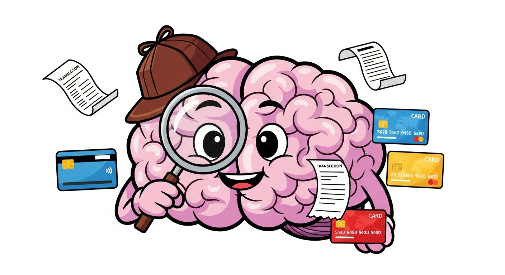

> **"Se voce consegue explicar para sua avo, entao voce realmente entende."**
> 
> Este documento foi criado para que QUALQUER pessoa entenda como um sistema de deteccao de fraudes funciona. Nao importa se voce e programador, analista de fraudes ou apenas curioso - ao final, voce sabera exatamente COMO e PORQUE uma transacao e classificada como APROVADA, SUSPEITA ou FRAUDE.

---

## Indice

1. [O Grande Problema: Fraudes Bancarias no Brasil](#capitulo-1-o-grande-problema)
2. [Conheca o Cerebro Anti-Fraude](#capitulo-2-conheca-o-cerebro-anti-fraude)
3. [A Jornada de uma Transacao](#capitulo-3-a-jornada-de-uma-transacao)
4. [Os 7 Fatores que Denunciam uma Fraude](#capitulo-4-os-7-fatores-que-denunciam-uma-fraude)
5. [Casos Reais: Fraudes do Dia a Dia](#capitulo-5-casos-reais-fraudes-do-dia-a-dia)
6. [APROVADO, SUSPEITA ou FRAUDE: A Decisao Final](#capitulo-6-a-decisao-final)
7. [Explicando para o Cliente (LGPD)](#capitulo-7-explicando-para-o-cliente)
8. [Exercicios Praticos](#capitulo-8-exercicios-praticos)

---

# Capitulo 1: O Grande Problema

## Fraudes Bancarias no Brasil - Numeros que Assustam

```
+------------------------------------------------------------------+
|                    BRASIL - FRAUDES EM 2024                       |
+------------------------------------------------------------------+
|                                                                   |
|   R$ 2.5 BILHOES        1.5 MILHAO          4.000               |
|   perdidos em fraudes   de tentativas/dia    fraudes/hora        |
|                                                                   |
+------------------------------------------------------------------+
```

### Por que isso acontece?

Imagine que voce e o gerente de seguranca de um banco. Todo dia, **milhoes de transacoes** passam pela sua mesa:

- Joao comprou cafe as 8h da manha
- Maria fez PIX para a mae as 10h
- Carlos sacou dinheiro no almoço
- **ALERTA**: Alguem esta tentando fazer 50 compras em 5 minutos!

**Pergunta:** Como voce sabe qual transacao e legitima e qual e fraude?

Voce NAO consegue analisar milhoes de transacoes manualmente. E por isso que precisamos de um **cerebro artificial** - um sistema inteligente que aprende padroes e detecta anomalias.

---

### O que voce vai aprender neste documento:

```
+-------------------------------------------------------------------------+
|                                                                         |
|   [ ] Como o sistema "pensa" ao analisar uma transacao                 |
|   [ ] Quais fatores indicam fraude (e por que)                         |
|   [ ] Casos reais de fraudes brasileiras (PIX, cartao, boleto)         |
|   [ ] Por que uma transacao e APROVADA, SUSPEITA ou FRAUDE             |
|   [ ] Como explicar a decisao para o cliente (Lei LGPD)                |
|                                                                         |
+-------------------------------------------------------------------------+
```

---

# Capitulo 2: Conheca o Cerebro Anti-Fraude

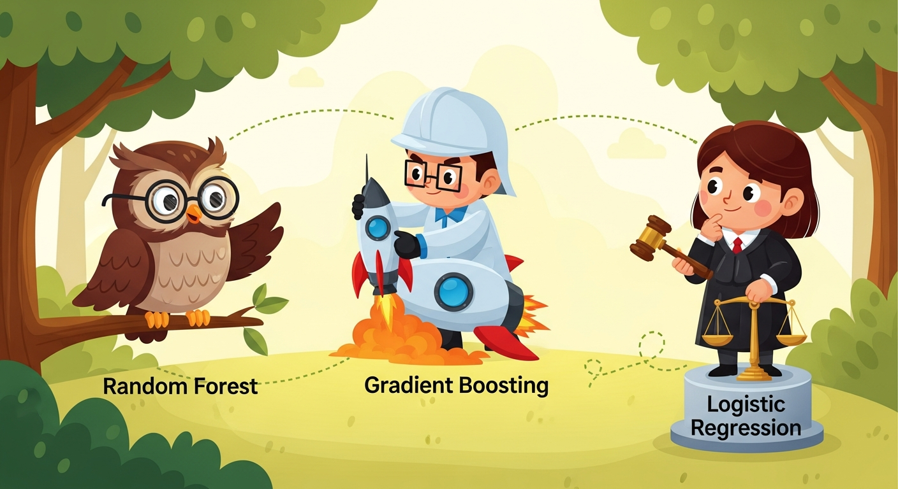

## O Time de Especialistas

O Sankofa Enterprise Pro nao usa apenas UM algoritmo - ele usa um **time de tres especialistas** que trabalham juntos. Vamos conhece-los:

---

### Especialista 1: Random Forest (A Floresta Sabia)

```
         ,@@@@@@@,
      @@@@@@@@@@@@@@
    @@@@@@@@@@@@@@@@@@
   @@@@@@@@ @@@ @@@@@@@
  @@@@@@@@   @   @@@@@@@    "Eu consulto 100 arvores de decisao.
  @@@@@@@    @    @@@@@@     Cada arvore vota: fraude ou nao?
  @@@@@@@   @@@   @@@@@@     A maioria vence!"
   @@@@@@@ @@@@@ @@@@@@@
    @@@@@@@@@@@@@@@@@@
      @@@@@@@@@@@@@@
         '@@@@@@@'
```

**Como funciona:** Imagine que voce tem 100 detetives. Cada um analisa a transacao de um angulo diferente. No final, eles votam. Se 80 detetives dizem "fraude", provavelmente e fraude!

**Pontos fortes:**
- Muito bom em identificar padroes complexos
- Dificil de enganar
- Funciona bem com muitos tipos de dados

---

### Especialista 2: Gradient Boosting (O Cientista Meticuloso)

```
    +--------+     +--------+     +--------+
    | Modelo |---->| Modelo |---->| Modelo |
    |   1    |     |   2    |     |   3    |
    +--------+     +--------+     +--------+
         |              |              |
         v              v              v
    [Erro: 30%]   [Erro: 15%]   [Erro: 5%]
    
    "Cada modelo aprende com os erros do anterior.
     Vou melhorando ate ficar quase perfeito!"
```

**Como funciona:** E como um estudante que refaz a prova varias vezes. Na primeira vez, errou 30%. Estudou os erros. Na segunda, errou 15%. Continuou estudando. Na terceira, errou so 5%!

**Pontos fortes:**
- Extremamente preciso
- Aprende com os proprios erros
- Excelente para detectar fraudes sutis

---

### Especialista 3: Logistic Regression (O Juiz Equilibrado)

```
                    FRAUDE
                       ^
                       |
    0.0 ----+----+----+----+----+---- 1.0
            |    |    |    |    |
            |    |    |  SUSPEITA
            |    |    |
            |    LEGITIMA
            |
         APROVADA
         
    "Eu calculo a PROBABILIDADE exata.
     75% de chance de fraude? Vou te dizer!"
```

**Como funciona:** Enquanto os outros especialistas dao opinioes, este calcula a probabilidade exata. Ele combina todas as evidencias e diz: "Ha 87.5% de chance de ser fraude."

**Pontos fortes:**
- Fornece probabilidades precisas
- Facil de explicar para o cliente
- Equilibra as opinioes dos outros dois

---

## Como os Tres Trabalham Juntos (Stacking Ensemble)

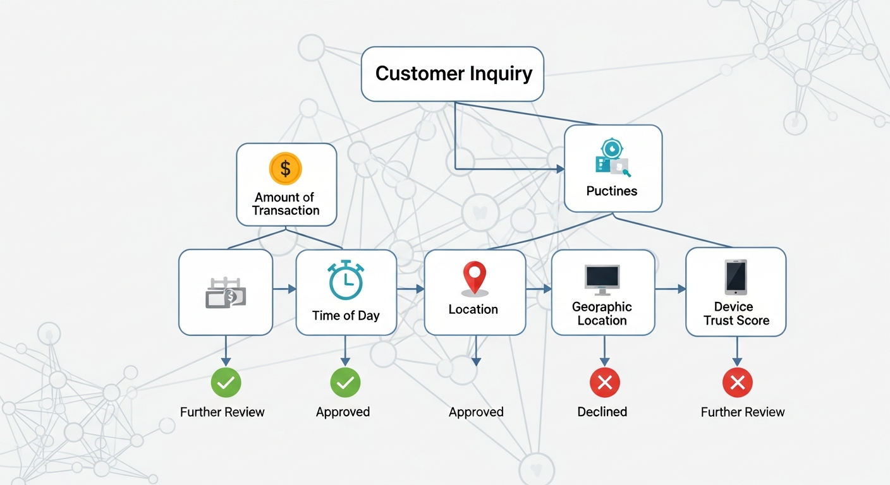

```
+-------------------+     +-------------------+
|   Random Forest   |     | Gradient Boosting |
|   (100 arvores)   |     |  (100 iteracoes)  |
+---------+---------+     +---------+---------+
          |                         |
          v                         v
      [Previsao 1]             [Previsao 2]
          |                         |
          +------------+------------+
                       |
                       v
              +--------+--------+
              |   Logistic      |
              |   Regression    |
              |   (Juiz Final)  |
              +--------+--------+
                       |
                       v
              +--------+--------+
              |  DECISAO FINAL  |
              | Score: 0 a 100  |
              +-----------------+
```

### Por que usar tres em vez de um?

**Analogia do Medico:**

Imagine que voce esta doente e quer um diagnostico preciso:

- **Opcao A:** Consultar apenas 1 medico
- **Opcao B:** Consultar 3 especialistas diferentes e combinar as opinioes

Qual opcao te da mais confianca? A opcao B, certo?

O mesmo vale para deteccao de fraudes. Cada modelo tem seus pontos fortes e fracos. Juntos, eles se complementam!

---

# Capitulo 3: A Jornada de uma Transacao


## Do Clique do Cliente ate a Decisao Final

Vamos acompanhar uma transacao real desde o momento em que o cliente clica em "Pagar" ate o sistema decidir se aprova ou bloqueia.

---

### Passo 1: A Transacao Chega

```
+------------------------------------------------------------------+
|                      TRANSACAO RECEBIDA                           |
+------------------------------------------------------------------+
|                                                                   |
|   Cliente: Maria Silva                                            |
|   CPF: ***.***.***-45 (mascarado por seguranca)                  |
|   Valor: R$ 3.500,00                                             |
|   Hora: 14:35                                                     |
|   Local: Sao Paulo, SP                                           |
|   Dispositivo: iPhone 14 (dispositivo conhecido)                 |
|   Tipo: PIX para pessoa fisica                                   |
|                                                                   |
+------------------------------------------------------------------+
```

**O que acontece:** O sistema recebe todos os dados da transacao em milissegundos.

---

### Passo 2: Extracao de Features (Caracteristicas)

O sistema transforma os dados brutos em **caracteristicas analisaveis**:

```
+------------------------------------------------------------------+
|                    FEATURES EXTRAIDAS                             |
+------------------------------------------------------------------+
|                                                                   |
|   amount_normalized: 0.35                                        |
|   (R$ 3.500 comparado com o historico de Maria)                  |
|                                                                   |
|   hour_risk: 0.1 (baixo)                                         |
|   (14h35 e horario comercial normal)                             |
|                                                                   |
|   location_risk: 0.05 (muito baixo)                              |
|   (Sao Paulo e onde Maria sempre opera)                          |
|                                                                   |
|   device_risk: 0.0                                               |
|   (iPhone 14 ja foi usado 47 vezes por Maria)                    |
|                                                                   |
|   velocity_score: 0.15                                           |
|   (Maria fez 2 transacoes hoje, normal para ela)                 |
|                                                                   |
|   is_new_recipient: 0.3                                          |
|   (Destinatario novo, mas nao e incomum)                         |
|                                                                   |
+------------------------------------------------------------------+
```

**Por que isso importa:** Numeros brutos nao dizem muito. R$ 3.500 e muito ou pouco? Depende! Para quem ganha R$ 3.000/mes, e muito. Para quem ganha R$ 50.000/mes, e pouco. Por isso, **normalizamos** os dados.

---

### Passo 3: Os Modelos Analisam

```
+---------------------+
|   Random Forest     |
|   Analise: 100      |
|   arvores votaram   |
|                     |
|   Resultado:        |
|   12 votos FRAUDE   |
|   88 votos OK       |
|                     |
|   => 12% suspeita   |
+---------------------+
         |
         v
+---------------------+
|  Gradient Boosting  |
|   Analise: 100      |
|   iteracoes         |
|                     |
|   Resultado:        |
|   Probabilidade:    |
|   8% de ser fraude  |
|                     |
|   => 8% suspeita    |
+---------------------+
         |
         v
+---------------------+
| Logistic Regression |
|   Combinacao final  |
|                     |
|   Inputs:           |
|   - RF: 12%         |
|   - GB: 8%          |
|   - Features        |
|                     |
|   => 10.2% final    |
+---------------------+
```

---

### Passo 4: Calculo do Score Final

```
+------------------------------------------------------------------+
|                     SCORE DE RISCO                                |
+------------------------------------------------------------------+
|                                                                   |
|   Score Bruto: 10.2%                                             |
|                                                                   |
|   Conversao para escala 0-100: 10.2                              |
|                                                                   |
|   +----+----+----+----+----+----+----+----+----+----+            |
|   0   10   20   30   40   50   60   70   80   90  100            |
|        ^                                                          |
|        |                                                          |
|      10.2                                                         |
|     (BAIXO)                                                       |
|                                                                   |
+------------------------------------------------------------------+
```

---

### Passo 5: Decisao Final

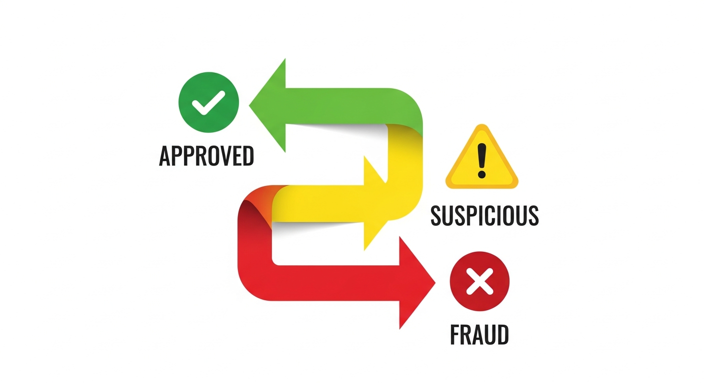

```
+------------------------------------------------------------------+
|                     REGRAS DE DECISAO                             |
+------------------------------------------------------------------+
|                                                                   |
|   Score < 30      =>  APROVADO (luz verde)                       |
|   Score 30-70     =>  SUSPEITA (luz amarela - revisao manual)    |
|   Score > 70      =>  FRAUDE (luz vermelha - bloqueio)           |
|                                                                   |
+------------------------------------------------------------------+
|                                                                   |
|   Transacao de Maria:                                            |
|   Score: 10.2                                                     |
|   Decisao: APROVADO                                              |
|   Tempo de processamento: 28ms                                   |
|                                                                   |
+------------------------------------------------------------------+
```

---

### Resumo Visual da Jornada

```
CLIENTE         SISTEMA           MODELOS          DECISAO
   |               |                 |                |
   | Clica "Pagar" |                 |                |
   |-------------->|                 |                |
   |               | Extrai features |                |
   |               |---------------->|                |
   |               |                 | RF analisa     |
   |               |                 | GB analisa     |
   |               |                 | LR combina     |
   |               |                 |--------------->|
   |               |                 |                | Score: 10.2
   |               |                 |                | APROVADO
   |               |<----------------------------------|
   |<--------------|                 |                |
   | "Transacao    |                 |                |
   |  Aprovada!"   |                 |                |
   |               |                 |                |
   
   Tempo total: 28 milissegundos (mais rapido que um piscar de olhos!)
```

---

# Capitulo 4: Os 7 Fatores que Denunciam uma Fraude

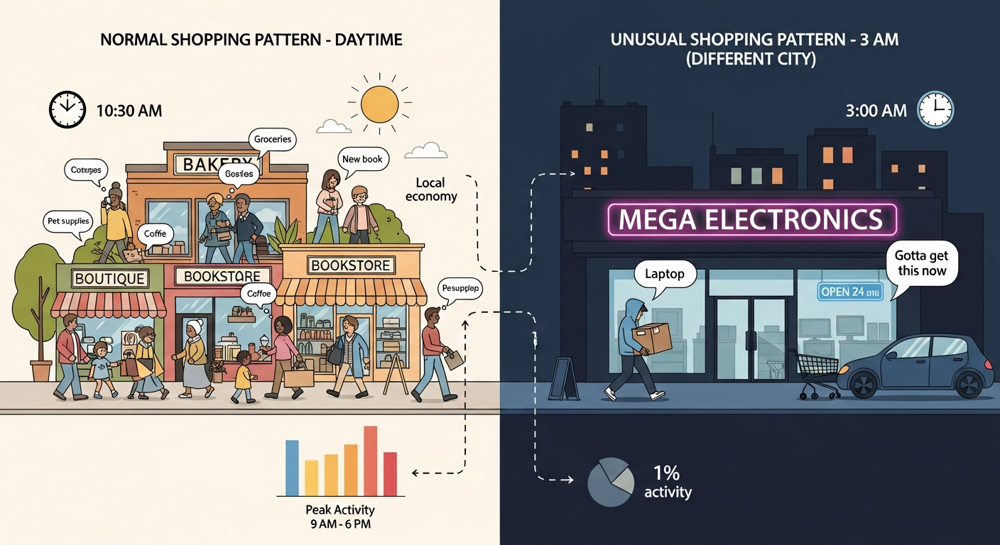

## Os Sinais que o Sistema Procura

Cada fator contribui para o score de risco. Vamos entender cada um:

---

### Fator 1: VALOR DA TRANSACAO (amount_normalized)

```
+------------------------------------------------------------------+
|                    ANALISE DE VALOR                               |
+------------------------------------------------------------------+

Historico do Cliente:
- Media mensal: R$ 2.000
- Maior transacao: R$ 5.000
- Transacoes tipicas: R$ 50 a R$ 500

CENARIOS:

+-------------+------------------+-------------------+
| Valor       | Comparacao       | Risco             |
+-------------+------------------+-------------------+
| R$ 150      | Normal           | BAIXO (0.1)       |
| R$ 2.500    | Acima da media   | MEDIO (0.4)       |
| R$ 15.000   | 7.5x a media!    | ALTO (0.85)       |
| R$ 50.000   | 25x a media!!    | MUITO ALTO (0.95) |
+-------------+------------------+-------------------+
```

**Por que importa:** Fraudadores geralmente querem maximizar o ganho. Uma transacao muito acima do padrao do cliente e um sinal de alerta.

**Historia Real:** Em 2023, um cliente do Banco X teve seu celular roubado. O fraudador tentou fazer um PIX de R$ 45.000 - quando o cliente nunca tinha feito transacoes acima de R$ 3.000. O sistema bloqueou imediatamente.

---

### Fator 2: HORARIO (hour_risk)

```
+------------------------------------------------------------------+
|                    ANALISE DE HORARIO                             |
+------------------------------------------------------------------+

              RISCO POR HORARIO
              
    ALTO  |         ****
          |        *    *
          |       *      *
    MEDIO |      *        *
          |     *          *
          |    *            *
    BAIXO |***              ****
          +------------------------
           0  3  6  9 12 15 18 21 24
                    HORA
                    
+-------------+-------------------+
| Horario     | Nivel de Risco    |
+-------------+-------------------+
| 06h - 22h   | BAIXO (0.1-0.2)   |
| 22h - 00h   | MEDIO (0.3-0.5)   |
| 00h - 04h   | ALTO (0.7-0.9)    |
| 04h - 06h   | MEDIO (0.4-0.6)   |
+-------------+-------------------+
```

**Por que importa:** A maioria das pessoas faz transacoes durante o dia. Transacoes as 3h da manha sao estatisticamente mais suspeitas.

**Historia Real:** Um golpista obteve acesso a conta de uma vitima e esperou ate as 3h da manha para fazer transferencias, pensando que a vitima estaria dormindo. O sistema detectou o horario anomalo e bloqueou.

---

### Fator 3: LOCALIZACAO (location_risk)

```
+------------------------------------------------------------------+
|                   ANALISE DE LOCALIZACAO                          |
+------------------------------------------------------------------+

Cliente mora em: Sao Paulo, SP
Historico de transacoes: 95% em SP, 5% em RJ (viagens)

CENARIOS:

+-------------------+------------------------+------------------+
| Local da Transacao| Analise                | Risco            |
+-------------------+------------------------+------------------+
| Sao Paulo, SP     | Local habitual         | BAIXO (0.05)     |
| Rio de Janeiro,RJ | Destino conhecido      | BAIXO (0.15)     |
| Manaus, AM        | Nunca esteve la        | MEDIO (0.45)     |
| Lagos, Nigeria    | Pais de alto risco     | ALTO (0.85)      |
+-------------------+------------------------+------------------+

IMPOSSIBILIDADE FISICA:

14:00 - Compra em Sao Paulo
14:30 - Compra em Miami, EUA   <-- IMPOSSIVEL! 
                                   Ninguem viaja 7.500km em 30 min!
                                   RISCO: 0.99 (FRAUDE CERTA)
```

**Por que importa:** Fraudadores frequentemente operam de locais diferentes da vitima. Viagens impossiveis sao prova definitiva de fraude.

---

### Fator 4: DISPOSITIVO (device_risk)

```
+------------------------------------------------------------------+
|                   ANALISE DE DISPOSITIVO                          |
+------------------------------------------------------------------+

Dispositivos conhecidos do cliente:
- iPhone 14 Pro (ID: abc123) - usado 234 vezes - CONFIAVEL
- MacBook Pro (ID: def456) - usado 89 vezes - CONFIAVEL

CENARIOS:

+----------------------+--------------------------+-----------------+
| Dispositivo          | Analise                  | Risco           |
+----------------------+--------------------------+-----------------+
| iPhone 14 (abc123)   | Dispositivo conhecido    | BAIXO (0.0)     |
| iPad novo            | Primeiro uso             | MEDIO (0.4)     |
| Android desconhecido | Nunca visto + marca diff | ALTO (0.7)      |
| Navegador anonimo    | TOR/VPN + novo           | MUITO ALTO (0.9)|
+----------------------+--------------------------+-----------------+
```

**Por que importa:** Seu celular e como sua impressao digital. Fraudadores usam dispositivos diferentes.

---

### Fator 5: VELOCIDADE (velocity_score)

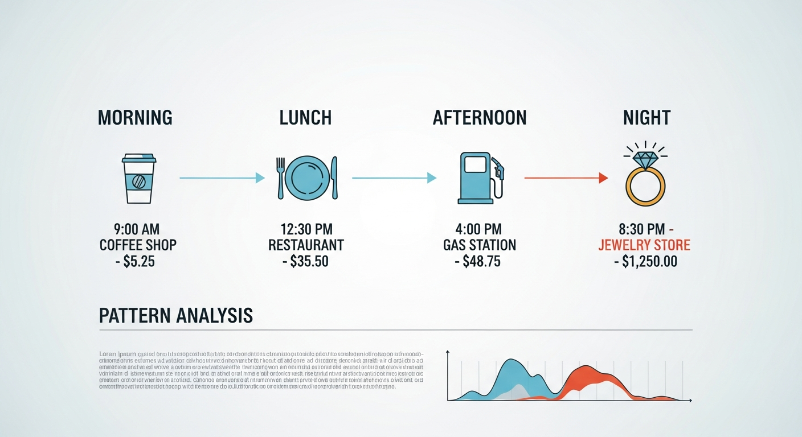

```
+------------------------------------------------------------------+
|                   ANALISE DE VELOCIDADE                           |
+------------------------------------------------------------------+

PADRAO NORMAL:
08:15 - Cafe (R$ 12)
12:30 - Almoco (R$ 45)
15:00 - Uber (R$ 28)
19:00 - Supermercado (R$ 180)

Total: 4 transacoes em 11 horas = 0.36 transacoes/hora
Risco de velocidade: BAIXO (0.1)

---

PADRAO SUSPEITO:
14:00:00 - Loja 1 (R$ 500)
14:00:45 - Loja 2 (R$ 800)
14:01:30 - Loja 3 (R$ 1.200)
14:02:15 - Loja 4 (R$ 900)
14:03:00 - Loja 5 (R$ 1.500)

Total: 5 transacoes em 3 minutos = 100 transacoes/hora!!!
Risco de velocidade: MUITO ALTO (0.95)
```

**Por que importa:** Fraudadores sabem que tem pouco tempo antes de serem descobertos, entao tentam fazer muitas transacoes rapidamente.

**Historia Real:** Em 2024, um cartao clonado foi usado para fazer 23 compras em 8 minutos em sites diferentes. O sistema bloqueou na 4a transacao.

---

### Fator 6: DESTINATARIO (recipient_risk)

```
+------------------------------------------------------------------+
|                  ANALISE DO DESTINATARIO                          |
+------------------------------------------------------------------+

CENARIOS:

+---------------------------+---------------------------+-----------+
| Destinatario              | Analise                   | Risco     |
+---------------------------+---------------------------+-----------+
| Mae do cliente            | Transferencias frequentes | 0.0       |
| Empresa de energia        | Pagamento recorrente      | 0.05      |
| Loja conhecida            | Compra ocasional          | 0.1       |
| Pessoa desconhecida       | Primeiro PIX para ela     | 0.4       |
| Conta nova (< 30 dias)    | Conta recem criada        | 0.7       |
| Conta com historico ruim  | Ja recebeu fraudes        | 0.9       |
+---------------------------+---------------------------+-----------+
```

**Por que importa:** Contas "laranjas" (usadas para receber dinheiro de fraudes) podem ser identificadas pelo historico.

---

### Fator 7: COMPORTAMENTO DO CLIENTE (behavior_score)

```
+------------------------------------------------------------------+
|                ANALISE DE COMPORTAMENTO                           |
+------------------------------------------------------------------+

CLIENTE NORMAL:
- Sempre faz login do mesmo celular
- Transacoes em horarios regulares
- Valores compativeis com renda
- Mesma regiao geografica
- Digita senha com velocidade consistente

COMPORTAMENTO SUSPEITO:
- Login de dispositivo novo
- Horario incomum (3h da manha)
- Valor muito acima do normal
- Localizacao diferente
- Multiplas tentativas de senha
- Mudou email/telefone recentemente

Cada anomalia adiciona pontos ao score de risco.
```

---

## Tabela Resumo dos Fatores

```
+------------------------------------------------------------------+
|                    PESO DE CADA FATOR                             |
+------------------------------------------------------------------+
|                                                                   |
|   Fator              | Peso no Score Final | Impacto Maximo      |
|   -------------------|---------------------|---------------------|
|   Valor (amount)     |        25%          |    +25 pontos       |
|   Horario (hour)     |        10%          |    +10 pontos       |
|   Localizacao        |        15%          |    +15 pontos       |
|   Dispositivo        |        20%          |    +20 pontos       |
|   Velocidade         |        15%          |    +15 pontos       |
|   Destinatario       |        10%          |    +10 pontos       |
|   Comportamento      |         5%          |     +5 pontos       |
|   -------------------|---------------------|---------------------|
|   TOTAL              |       100%          |   100 pontos        |
|                                                                   |
+------------------------------------------------------------------+
```

---

# Capitulo 5: Casos Reais - Fraudes do Dia a Dia

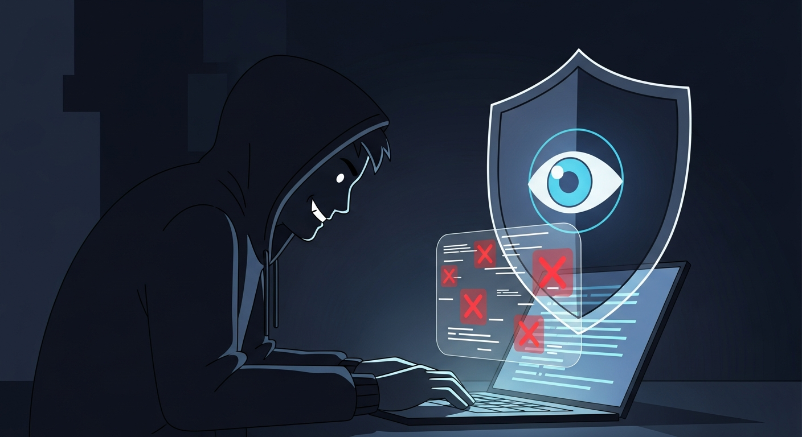

## Caso 1: O Golpe do PIX Falso

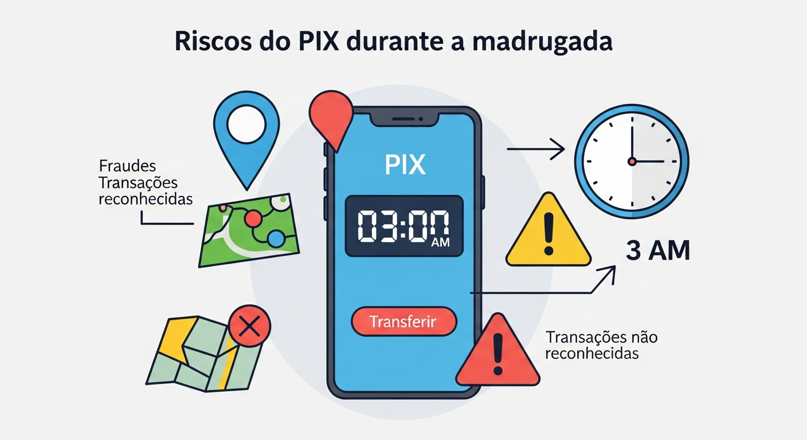

### A Historia

Dona Maria, 68 anos, recebe uma mensagem no WhatsApp:

```
+------------------------------------------------------------------+
|  WhatsApp                                           14:32        |
+------------------------------------------------------------------+
|                                                                   |
|  "Oi mae, troquei de numero. Salva ai!                           |
|   Preciso de uma ajuda urgente.                                  |
|   Pode me fazer um PIX de R$ 2.800?                              |
|   E pra pagar uma conta que vence hoje.                          |
|   Depois te devolvo.                                              |
|                                                                   |
|   Chave PIX: 11999887766"                                        |
|                                                                   |
+------------------------------------------------------------------+
```

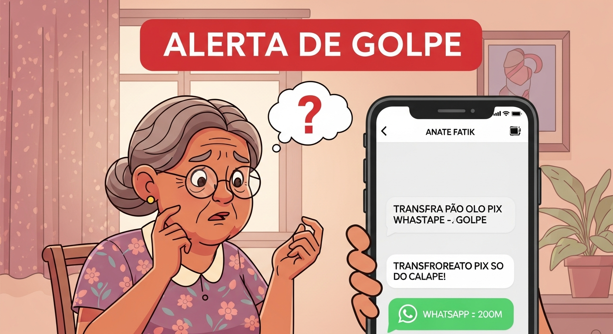

### O que Dona Maria fez

Preocupada com o "filho", Dona Maria abriu o app do banco e tentou fazer o PIX.

### O que o Sistema Detectou

```
+------------------------------------------------------------------+
|              ANALISE DA TRANSACAO DE DONA MARIA                   |
+------------------------------------------------------------------+
|                                                                   |
|   FATORES ANALISADOS:                                            |
|                                                                   |
|   1. VALOR: R$ 2.800                                             |
|      - Media de PIX de Dona Maria: R$ 200                        |
|      - Este valor e 14x maior que a media!                       |
|      - Risco: 0.75 (ALTO)                                        |
|                                                                   |
|   2. DESTINATARIO:                                               |
|      - Nunca transferiu para este CPF antes                      |
|      - Conta do destinatario criada ha 5 dias                    |
|      - Ja recebeu 47 PIX de diferentes pessoas hoje              |
|      - Risco: 0.90 (MUITO ALTO)                                  |
|                                                                   |
|   3. COMPORTAMENTO:                                              |
|      - Dona Maria costuma fazer PIX para: filho, neto, igreja    |
|      - Este destinatario e completamente novo                    |
|      - Risco: 0.60 (MEDIO-ALTO)                                  |
|                                                                   |
|   4. PADRAO DE GOLPE:                                            |
|      - Valor "redondo" (nao e conta exata)                       |
|      - Urgencia ("vence hoje")                                   |
|      - Destinatario novo                                         |
|      - Risco: 0.85 (ALTO)                                        |
|                                                                   |
+------------------------------------------------------------------+
|                                                                   |
|   SCORE FINAL: 82.5                                              |
|   DECISAO: FRAUDE - BLOQUEADO                                    |
|                                                                   |
|   Acao tomada:                                                   |
|   - Transacao bloqueada                                          |
|   - Alerta enviado para Dona Maria                               |
|   - Ligacao do banco em 30 segundos                              |
|                                                                   |
+------------------------------------------------------------------+
```

### O Texto de Explicacao (LGPD)

```
"Dona Maria, bloqueamos esta transacao porque:

1. O valor de R$ 2.800 e muito maior que suas transacoes normais
2. Voce nunca transferiu para esta pessoa antes
3. A conta de destino foi criada muito recentemente
4. O padrao se parece com um golpe conhecido

Por seguranca, um atendente vai ligar para confirmar se voce
realmente quer fazer esta transferencia."
```

### Final

O banco ligou para Dona Maria. Ela confirmou que recebeu a mensagem do "filho". O atendente pediu que ela ligasse para o numero antigo do filho. Resultado: era golpe! O filho real estava bem e nunca tinha mandado mensagem.

**Fraude evitada: R$ 2.800**

---

## Caso 2: O Cartao Clonado no Exterior

### A Historia

Carlos, empresario de 45 anos, teve seu cartao clonado em uma maquininha adulterada em um restaurante.

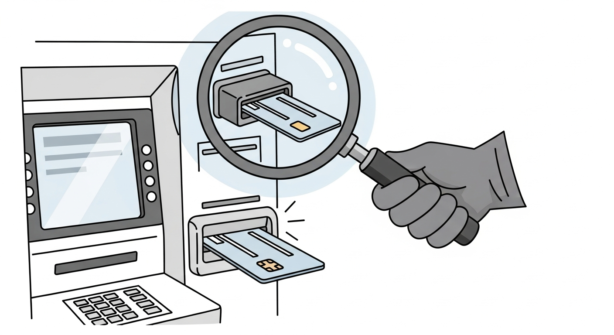

### O que Aconteceu

```
LINHA DO TEMPO:

12:30 - Carlos almoca em SP e paga R$ 89 (cartao fisico)
12:35 - Cartao e clonado pela maquininha adulterada

... Carlos continua seu dia normalmente ...

02:15 (madrugada) - Primeira tentativa de compra
02:16 - Segunda tentativa
02:17 - Terceira tentativa
02:18 - Quarta tentativa (BLOQUEADO!)
```

### O que o Sistema Detectou

```
+------------------------------------------------------------------+
|           ANALISE DAS TRANSACOES SUSPEITAS                        |
+------------------------------------------------------------------+

TRANSACAO 1 (02:15:22):
+------------------+----------------------+------------------------+
| Fator            | Valor                | Risco                  |
+------------------+----------------------+------------------------+
| Valor            | R$ 4.500             | 0.65 (compra alta)     |
| Horario          | 02:15                | 0.85 (madrugada)       |
| Local            | Miami, EUA           | 0.90 (Carlos em SP!)   |
| Tipo             | Eletronicos          | 0.70 (categoria risco) |
+------------------+----------------------+------------------------+
| SCORE            | 78.5                 | BLOQUEADA              |
+------------------+----------------------+------------------------+

TRANSACAO 2 (02:16:45) - 1 minuto depois:
+------------------+----------------------+------------------------+
| Fator            | Valor                | Risco Adicional        |
+------------------+----------------------+------------------------+
| Mesmo cartao     | Tentando de novo     | +10 pontos             |
| Valor diferente  | R$ 3.200             | Tentando valor menor   |
| Local            | Miami, EUA           | Impossivel estar la    |
+------------------+----------------------+------------------------+
| SCORE            | 88.5                 | BLOQUEADA              |
+------------------+----------------------+------------------------+

TRANSACAO 3 (02:17:30) - Mais 45 segundos:
+------------------+----------------------+------------------------+
| Tentativa        | 3a em 2 minutos      | Padrao de fraude       |
| Velocidade       | 3 trans/2min         | 0.95 (altissimo)       |
+------------------+----------------------+------------------------+
| SCORE            | 95.2                 | BLOQUEADA + ALERTA     |
+------------------+----------------------+------------------------+

TRANSACAO 4 (02:18:15):
+------------------+----------------------+------------------------+
| Status           | CARTAO BLOQUEADO     | Nao processada         |
+------------------+----------------------+------------------------+
```

### Analise de Impossibilidade Fisica

```
+------------------------------------------------------------------+
|              VERIFICACAO DE LOCALIZACAO                           |
+------------------------------------------------------------------+
|                                                                   |
|   Ultima transacao legitima:                                     |
|   - Local: Sao Paulo, SP, Brasil                                 |
|   - Hora: 12:30                                                  |
|                                                                   |
|   Transacao suspeita:                                            |
|   - Local: Miami, FL, EUA                                        |
|   - Hora: 02:15 (dia seguinte)                                   |
|                                                                   |
|   Tempo decorrido: 13 horas e 45 minutos                         |
|   Distancia: 7.500 km                                            |
|                                                                   |
|   Voo mais rapido SP -> Miami: 8 horas                           |
|   + Check-in + imigração + deslocamento: minimo 3 horas          |
|   = Tempo minimo necessario: 11 horas                            |
|                                                                   |
|   VEREDICTO: POSSIVEL, mas...                                    |
|                                                                   |
|   Outros fatores:                                                |
|   - Carlos nao tem historico de viagens para EUA                 |
|   - Nao houve compra de passagem aerea                           |
|   - Horario da compra: 02:15 (improvavel apos viagem longa)      |
|                                                                   |
|   CONCLUSAO: ALTAMENTE IMPROVAVEL = FRAUDE                       |
|                                                                   |
+------------------------------------------------------------------+
```

### Final

Carlos recebeu SMS e notificacao push:

```
"Bloqueamos 3 tentativas de compra suspeitas no seu cartao
final 4532. As compras eram em Miami/EUA mas voce esta em SP.
Seu cartao foi bloqueado por seguranca.
Ligue 0800-XXX-XXXX para mais informacoes."
```

Carlos ligou, confirmou que estava em SP, e recebeu um cartao novo em 2 dias.

**Fraude evitada: R$ 12.200**

---

## Caso 3: O Funcionario Fantasma

### A Historia

Uma empresa de medio porte tinha um sistema de pagamento de salarios. O contador tinha acesso ao sistema.

### O Golpe

```
O contador criou 3 "funcionarios fantasmas":
- Joao Silva (CPF ficticio)
- Maria Santos (CPF ficticio)  
- Pedro Oliveira (CPF ficticio)

Todo mes, transferia "salarios":
- Joao: R$ 4.500
- Maria: R$ 4.200
- Pedro: R$ 4.800

Total desviado por mes: R$ 13.500
Em 8 meses: R$ 108.000!
```

### O que o Sistema Detectou (apos implementacao)

```
+------------------------------------------------------------------+
|           ANALISE DE PADROES DE PAGAMENTO                         |
+------------------------------------------------------------------+

ALERTA: Anomalias detectadas em folha de pagamento

1. CONTAS RECEPTORAS:
   - 3 contas recebem APENAS desta empresa
   - Contas criadas no mesmo dia
   - Mesmo banco e agencia
   - Risco: 0.75

2. PADRAO DE TRANSFERENCIA:
   - Valores muito proximos (R$ 4.200 a R$ 4.800)
   - Sempre no mesmo dia do mes
   - IP de origem sempre o mesmo (computador do contador)
   - Risco: 0.80

3. VERIFICACAO CRUZADA:
   - CPFs nao constam em outros sistemas
   - Nenhuma movimentacao nas contas alem do "salario"
   - Contas sacam tudo no mesmo dia
   - Risco: 0.90

SCORE COMBINADO: 85.3
ACAO: Alerta para auditoria interna
```

### Como o Sistema Explica

```
"Detectamos um padrao incomum nas transferencias de folha:

- 3 funcionarios recebem apenas desta empresa
- As contas foram criadas no mesmo periodo
- Os valores sao muito similares entre si
- Todo o dinheiro e sacado no mesmo dia

Recomendamos auditoria dos CPFs: XXX.XXX.XXX-01, 
XXX.XXX.XXX-02, XXX.XXX.XXX-03"
```

**Fraude descoberta: R$ 108.000 + prisao do contador**

---

## Caso 4: O Boleto Adulterado

### A Historia

Empresa ABC recebe boleto de fornecedor por email. O boleto parece legitimo, mas o codigo de barras foi alterado.

### O Golpe

```
BOLETO ORIGINAL:
- Beneficiario: Fornecedor Legitimo LTDA
- CNPJ: 12.345.678/0001-90
- Valor: R$ 45.000,00
- Codigo: 23793.38128 60000.000003 00000.000402 1 84650000045000

BOLETO ADULTERADO (enviado por hacker):
- Beneficiario: Fornecedor Legitimo LTDA  <- MESMO NOME!
- CNPJ: 12.345.678/0001-90               <- MESMO CNPJ!
- Valor: R$ 45.000,00                    <- MESMO VALOR!
- Codigo: 23793.38128 60000.000003 00000.000402 1 84650000045000
                       ^
                       |
                       ALTERADO! (direciona para conta do fraudador)
```

### O que o Sistema Detectou

```
+------------------------------------------------------------------+
|              ANALISE DE BOLETO                                    |
+------------------------------------------------------------------+

VERIFICACAO 1: Codigo de Barras
- Banco emissor: Banco X
- Conta destino do codigo: 99.887-7
- CNPJ declarado: 12.345.678/0001-90

VERIFICACAO 2: Historico do CNPJ
- Conta usual para este CNPJ: 12.345-6
- Conta no boleto: 99.887-7
- INCONSISTENCIA DETECTADA!

VERIFICACAO 3: Conta Destino
- Conta 99.887-7 foi criada ha 15 dias
- Nunca recebeu pagamentos antes
- Titular: Pessoa Fisica (nao empresa)
- ALTO RISCO!

SCORE: 91.2
DECISAO: BLOQUEAR + ALERTA
```

### Explicacao para o Cliente

```
"Detectamos uma inconsistencia neste boleto:

O CNPJ do fornecedor e 12.345.678/0001-90, mas o codigo
de barras direciona para uma conta diferente da usual.

Historico:
- Pagamentos anteriores: conta 12.345-6
- Este boleto: conta 99.887-7 (conta nova, pessoa fisica)

Recomendamos confirmar com o fornecedor antes de pagar."
```

**Fraude evitada: R$ 45.000**

---

# Capitulo 6: APROVADO, SUSPEITA ou FRAUDE - A Decisao Final

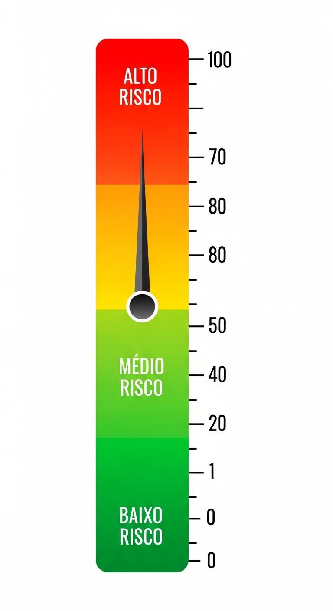

## Os Tres Vereditos

O sistema classifica cada transacao em uma de tres categorias:

```
+------------------------------------------------------------------+
|                    OS TRES VEREDITOS                              |
+------------------------------------------------------------------+

     SCORE: 0-30              SCORE: 30-70            SCORE: 70-100
     
    +----------+             +----------+             +----------+
    |          |             |          |             |          |
    | APROVADO |             | SUSPEITA |             |  FRAUDE  |
    |          |             |          |             |          |
    +----------+             +----------+             +----------+
         |                        |                        |
         v                        v                        v
    Transacao                Transacao vai           Transacao
    liberada                 para revisao            bloqueada
    automaticamente          manual                  automaticamente
```

---

## APROVADO (Score 0-30)

### O que significa

A transacao e considerada **segura** e liberada automaticamente, sem intervencao humana.

### Caracteristicas tipicas

```
+------------------------------------------------------------------+
|                    PERFIL DE TRANSACAO APROVADA                   |
+------------------------------------------------------------------+
|                                                                   |
|   [OK] Valor dentro do padrao do cliente                         |
|   [OK] Horario comercial normal                                  |
|   [OK] Localizacao conhecida                                     |
|   [OK] Dispositivo ja utilizado antes                            |
|   [OK] Destinatario conhecido ou estabelecido                    |
|   [OK] Velocidade de transacoes normal                           |
|   [OK] Comportamento consistente com historico                   |
|                                                                   |
+------------------------------------------------------------------+
```

### Exemplo Pratico

```
CLIENTE: Joao Pereira
TRANSACAO: Compra no supermercado

+------------------+----------------------+------------+
| Fator            | Valor                | Risco      |
+------------------+----------------------+------------+
| Valor            | R$ 287,45            | 0.05       |
| Horario          | 18:30                | 0.05       |
| Local            | Supermercado Bairro  | 0.02       |
| Dispositivo      | Cartao fisico usual  | 0.00       |
| Estabelecimento  | Compra la todo mes   | 0.00       |
| Velocidade       | 1a compra do dia     | 0.05       |
+------------------+----------------------+------------+
| SCORE TOTAL      |                      | 8.5        |
+------------------+----------------------+------------+

DECISAO: APROVADO
TEMPO: 15ms
ACAO: Transacao liberada automaticamente
```

### Por que foi aprovado (Explicacao LGPD)

```
"Transacao aprovada automaticamente porque:
- O valor esta dentro do seu padrao de compras
- Voce costuma comprar neste supermercado
- O horario e normal para suas compras
- Voce esta usando seu cartao fisico de sempre"
```

---

## SUSPEITA (Score 30-70)

### O que significa

A transacao tem **alguns sinais de alerta** mas nao e claramente fraudulenta. Vai para **revisao manual** por um analista.

### Caracteristicas tipicas

```
+------------------------------------------------------------------+
|                    PERFIL DE TRANSACAO SUSPEITA                   |
+------------------------------------------------------------------+
|                                                                   |
|   [?] Valor um pouco acima do normal                             |
|   [?] Horario fora do comum (mas nao madrugada)                  |
|   [?] Localizacao diferente (mas no mesmo estado)                |
|   [?] Dispositivo novo (mas nao anonimo)                         |
|   [?] Primeiro contato com destinatario                          |
|   [?] Algumas transacoes em sequencia                            |
|                                                                   |
|   Nenhum fator e ALTO sozinho, mas a combinacao gera duvida      |
|                                                                   |
+------------------------------------------------------------------+
```

### Exemplo Pratico

```
CLIENTE: Ana Costa
TRANSACAO: PIX para pessoa desconhecida

+------------------+----------------------+------------+
| Fator            | Valor                | Risco      |
+------------------+----------------------+------------+
| Valor            | R$ 3.500             | 0.45       |
| Horario          | 21:45                | 0.25       |
| Local            | App normal           | 0.05       |
| Dispositivo      | Celular de sempre    | 0.00       |
| Destinatario     | Primeira vez         | 0.50       |
| Velocidade       | 3a transacao hoje    | 0.20       |
+------------------+----------------------+------------+
| SCORE TOTAL      |                      | 48.3       |
+------------------+----------------------+------------+

DECISAO: SUSPEITA - REVISAO MANUAL
TEMPO: 22ms
ACAO: Enviado para fila de analistas
```

### O que acontece

```
+------------------------------------------------------------------+
|                    FLUXO DE REVISAO MANUAL                        |
+------------------------------------------------------------------+

1. Transacao entra na fila de revisao
   |
   v
2. Analista recebe alerta
   |
   v
3. Analista ve os fatores:
   - "Valor acima da media, mas nao absurdo"
   - "Destinatario novo, mas CPF limpo"
   - "Horario um pouco tarde, mas nao madrugada"
   |
   v
4. Analista pode:
   +---> APROVAR (se parecer legitimo)
   +---> BLOQUEAR (se parecer fraude)
   +---> LIGAR para cliente (para confirmar)
   |
   v
5. Decisao registrada para aprendizado do modelo
```

### Por que foi para revisao (Explicacao LGPD)

```
"Sua transacao esta em analise porque:
- O valor de R$ 3.500 esta acima da sua media
- E a primeira vez que voce transfere para esta pessoa
- O horario e um pouco fora do comum para voce

Um analista vai revisar em alguns minutos.
Se preferir, ligue 0800-XXX-XXXX para liberar mais rapido."
```

---

## FRAUDE (Score 70-100)

### O que significa

A transacao tem **multiplos sinais graves** de fraude e e bloqueada automaticamente. O cliente e notificado.

### Caracteristicas tipicas

```
+------------------------------------------------------------------+
|                    PERFIL DE TRANSACAO FRAUDULENTA                |
+------------------------------------------------------------------+
|                                                                   |
|   [X] Valor MUITO acima do normal (5x ou mais)                   |
|   [X] Horario de madrugada (1h-5h)                               |
|   [X] Localizacao impossivel ou de alto risco                    |
|   [X] Dispositivo novo + anonimo                                 |
|   [X] Destinatario com historico suspeito                        |
|   [X] Muitas transacoes em minutos                               |
|   [X] Padrao conhecido de golpe                                  |
|                                                                   |
|   MULTIPLOS fatores de ALTO risco combinados                     |
|                                                                   |
+------------------------------------------------------------------+
```

### Exemplo Pratico

```
CLIENTE: Roberto Lima
TRANSACAO: Tentativa de PIX as 3h da manha

+------------------+----------------------+------------+
| Fator            | Valor                | Risco      |
+------------------+----------------------+------------+
| Valor            | R$ 25.000            | 0.90       |
| Horario          | 03:15                | 0.85       |
| Local            | IP da Russia         | 0.95       |
| Dispositivo      | Nunca visto + VPN    | 0.90       |
| Destinatario     | Conta laranja        | 0.95       |
| Velocidade       | 5 tentativas em 4min | 0.95       |
| Tentativas senha | 3 erros antes        | 0.75       |
+------------------+----------------------+------------+
| SCORE TOTAL      |                      | 92.7       |
+------------------+----------------------+------------+

DECISAO: FRAUDE - BLOQUEADO
TEMPO: 8ms
ACAO: Bloqueio + Alerta + Ligacao automatica
```

### O que acontece

```
+------------------------------------------------------------------+
|                    FLUXO DE BLOQUEIO                              |
+------------------------------------------------------------------+

1. Transacao BLOQUEADA imediatamente (8ms)
   |
   v
2. Acoes simultaneas:
   +---> SMS enviado: "Bloqueamos transacao suspeita..."
   +---> Push notification no app
   +---> Email de seguranca
   +---> Ligacao automatica em 30 segundos
   |
   v
3. Conta pode ser:
   +---> Bloqueada temporariamente (se muitas tentativas)
   +---> Liberada apos confirmacao por telefone
   |
   v
4. Registro completo para:
   +---> Policia (se cliente confirmar fraude)
   +---> Banco Central (estatisticas)
   +---> Treinamento do modelo (aprendizado)
```

### Por que foi bloqueado (Explicacao LGPD)

```
"Bloqueamos esta transacao porque detectamos varios sinais de fraude:

1. O valor de R$ 25.000 e muito maior que seu padrao
2. A tentativa foi as 3h15 da manha
3. O acesso foi de um local incomum
4. O dispositivo nunca foi usado na sua conta
5. Houve 3 tentativas de senha errada antes

Por sua seguranca, sua conta esta temporariamente limitada.
Ligue 0800-XXX-XXXX para confirmar sua identidade e liberar."
```

---

## Tabela Comparativa dos Tres Vereditos

```
+------------------------------------------------------------------+
|              COMPARACAO DOS TRES VEREDITOS                        |
+------------------------------------------------------------------+
|                                                                   |
| Aspecto          | APROVADO    | SUSPEITA    | FRAUDE            |
| -----------------|-------------|-------------|-------------------|
| Score            | 0-30        | 30-70       | 70-100            |
| Tempo resposta   | < 30ms      | < 50ms      | < 20ms            |
| Acao             | Libera      | Fila manual | Bloqueia          |
| Intervencao      | Nenhuma     | Analista    | Automatica        |
| Notificacao      | Nenhuma     | Opcional    | Imediata          |
| % do total       | ~85%        | ~12%        | ~3%               |
|                                                                   |
+------------------------------------------------------------------+
```

---

## Diagrama de Decisao Completo

```
                         TRANSACAO RECEBIDA
                                |
                                v
                    +---------------------+
                    |  EXTRACAO FEATURES  |
                    |  (47 caracteristicas)|
                    +---------------------+
                                |
                                v
           +--------------------+--------------------+
           |                    |                    |
           v                    v                    v
   +---------------+    +---------------+    +---------------+
   | Random Forest |    | Grad Boosting |    |    Regras     |
   | (100 arvores) |    | (100 iter)    |    |   Negocio     |
   +---------------+    +---------------+    +---------------+
           |                    |                    |
           v                    v                    v
       [Score 1]            [Score 2]           [Flags]
           |                    |                    |
           +--------------------+--------------------+
                                |
                                v
                    +---------------------+
                    | LOGISTIC REGRESSION |
                    |   (Meta-modelo)     |
                    +---------------------+
                                |
                                v
                    +---------------------+
                    |   SCORE FINAL       |
                    |     (0-100)         |
                    +---------------------+
                                |
              +-----------------+-----------------+
              |                 |                 |
              v                 v                 v
         [0 - 30]          [30 - 70]         [70 - 100]
              |                 |                 |
              v                 v                 v
        +----------+      +----------+      +----------+
        | APROVADO |      | SUSPEITA |      |  FRAUDE  |
        +----------+      +----------+      +----------+
              |                 |                 |
              v                 v                 v
         Liberada         Revisao             Bloqueada
                          Manual
```

---

# Capitulo 7: Explicando para o Cliente (LGPD)

## O que e a LGPD e por que importa

A Lei Geral de Protecao de Dados (LGPD) exige que empresas **expliquem suas decisoes automatizadas** quando solicitado pelo cliente.

```
+------------------------------------------------------------------+
|                    ARTIGO 20 DA LGPD                              |
+------------------------------------------------------------------+
|                                                                   |
| "O titular dos dados tem direito a solicitar a revisao de        |
|  decisoes tomadas unicamente com base em tratamento              |
|  automatizado de dados pessoais..."                              |
|                                                                   |
| Traducao: Se o sistema bloqueou sua transacao, voce tem          |
|           direito de saber PORQUE.                               |
|                                                                   |
+------------------------------------------------------------------+
```

---

## Como o Sistema Explica

O Sankofa Enterprise Pro gera explicacoes automaticas em **tres niveis**:

### Nivel 1: Explicacao Simples (para o cliente)

```
"Bloqueamos esta transacao porque o valor de R$ 15.000 e muito 
maior que suas compras normais, e a tentativa foi feita as 3h 
da manha de um dispositivo que nunca usou antes."
```

### Nivel 2: Explicacao Detalhada (para o analista)

```
+------------------------------------------------------------------+
|              EXPLICACAO PARA ANALISTA                             |
+------------------------------------------------------------------+
|                                                                   |
| FATORES DE RISCO (por que bloqueamos):                           |
| +------------------------------------+-----------+------------+   |
| | Fator                              | Valor     | Impacto    |   |
| +------------------------------------+-----------+------------+   |
| | amount_normalized                  | 0.85      | +0.42      |   |
| | hour_risk                          | 0.90      | +0.28      |   |
| | is_new_device                      | 1.00      | +0.18      |   |
| +------------------------------------+-----------+------------+   |
|                                                                   |
| FATORES PROTETORES (o que reduziu o risco):                      |
| +------------------------------------+-----------+------------+   |
| | Fator                              | Valor     | Impacto    |   |
| +------------------------------------+-----------+------------+   |
| | device_fingerprint_trust           | 0.00      | -0.00      |   |
| | recipient_known                    | 0.00      | -0.00      |   |
| +------------------------------------+-----------+------------+   |
|                                                                   |
| NOTA: Fatores protetores zerados porque dispositivo novo         |
|       anulou qualquer protecao.                                  |
|                                                                   |
+------------------------------------------------------------------+
```

### Nivel 3: Explicacao Tecnica (para auditoria/juridico)

```json
{
  "transaction_id": "TXN-2024-11-27-00001",
  "decision": "BLOCKED",
  "risk_score": 87.5,
  "model_version": "v12.0",
  "timestamp": "2024-11-27T03:15:22Z",
  
  "explanation": {
    "primary_factors": [
      {
        "feature": "amount_normalized",
        "raw_value": 15000,
        "normalized_value": 0.85,
        "customer_baseline": 2000,
        "deviation": "7.5x above average",
        "contribution_to_score": 0.42
      },
      {
        "feature": "hour_of_day",
        "raw_value": 3,
        "risk_category": "high_risk_hour",
        "contribution_to_score": 0.28
      }
    ],
    
    "protective_factors": [],
    
    "rule_triggers": [
      "RULE_HIGH_VALUE_NEW_DEVICE",
      "RULE_UNUSUAL_HOUR"
    ],
    
    "lgpd_compliance": {
      "explanation_provided": true,
      "human_readable": true,
      "appeal_available": true,
      "data_retention_days": 365
    }
  }
}
```

---

## Fluxo de Explicacao

```
                    CLIENTE QUESTIONA DECISAO
                              |
                              v
               +-----------------------------+
               | "Por que minha transacao    |
               |  foi bloqueada?"            |
               +-----------------------------+
                              |
                              v
               +-----------------------------+
               |     SISTEMA BUSCA           |
               |   - Transaction ID          |
               |   - Fatores da decisao      |
               |   - Score e threshold       |
               +-----------------------------+
                              |
                              v
               +-----------------------------+
               |   GERA EXPLICACAO EM        |
               |   LINGUAGEM NATURAL         |
               +-----------------------------+
                              |
                              v
               +-----------------------------+
               | "Sua transacao foi bloqueada|
               |  porque: [razoes claras]"   |
               +-----------------------------+
                              |
                              v
               +-----------------------------+
               | OFERECE OPCOES:             |
               | - Confirmar por telefone    |
               | - Solicitar revisao humana  |
               | - Registrar reclamacao      |
               +-----------------------------+
```

---

# Capitulo 8: Exercicios Praticos

## Exercicio 1: Analise esta Transacao

```
DADOS:
- Cliente: Pedro Souza, 35 anos, contador
- Media de transacoes: R$ 500/mes
- Dispositivo usual: Samsung Galaxy S21
- Localizacao habitual: Belo Horizonte, MG

TRANSACAO:
- Valor: R$ 12.000
- Hora: 14:30
- Local: Sao Paulo, SP
- Dispositivo: iPhone 15 (novo)
- Destinatario: Joias Luxo LTDA (loja desconhecida)
```

**Perguntas:**
1. Quais fatores voce considera de RISCO?
2. Quais fatores sao PROTETORES?
3. Qual seria o veredito provavel (APROVADO/SUSPEITA/FRAUDE)?
4. Como voce explicaria a decisao para Pedro?

<details>
<summary>VER RESPOSTA</summary>

**1. Fatores de Risco:**
- Valor (R$ 12.000 = 24x a media) - ALTO RISCO
- Dispositivo novo (iPhone vs Samsung) - MEDIO RISCO
- Localizacao diferente (SP vs BH) - MEDIO RISCO
- Estabelecimento desconhecido - MEDIO RISCO

**2. Fatores Protetores:**
- Horario comercial (14:30) - BAIXO RISCO
- Nao e madrugada
- Transacao unica (nao velocidade alta)

**3. Veredito provavel: SUSPEITA (Score ~55)**
O valor extremamente alto levanta alerta, mas o horario normal e a falta de outros sinais graves sugerem revisao manual.

**4. Explicacao:**
"Pedro, sua compra de R$ 12.000 na loja Joias Luxo esta em analise porque:
- O valor e maior que seu padrao de compras
- Voce esta usando um dispositivo diferente do habitual
- A compra e em Sao Paulo, mas voce costuma operar de BH

Um analista vai revisar em alguns minutos, ou voce pode ligar para liberar."
</details>

---

## Exercicio 2: Monte o Score

Calcule o score de risco para esta transacao:

```
PESOS DOS FATORES:
- Valor: 25%
- Horario: 10%
- Localizacao: 15%
- Dispositivo: 20%
- Velocidade: 15%
- Destinatario: 10%
- Comportamento: 5%

TRANSACAO:
- Valor: 0.30 (dentro do normal)
- Horario: 0.80 (madrugada)
- Localizacao: 0.20 (mesmo estado)
- Dispositivo: 0.90 (novo e suspeito)
- Velocidade: 0.10 (transacao unica)
- Destinatario: 0.50 (desconhecido)
- Comportamento: 0.40 (algumas anomalias)
```

<details>
<summary>VER CALCULO</summary>

**Calculo:**
```
Score = (0.30 x 25) + (0.80 x 10) + (0.20 x 15) + 
        (0.90 x 20) + (0.10 x 15) + (0.50 x 10) + (0.40 x 5)

Score = 7.5 + 8.0 + 3.0 + 18.0 + 1.5 + 5.0 + 2.0

Score = 45.0
```

**Veredito: SUSPEITA** (entre 30 e 70)

O dispositivo novo e suspeito (peso 20%, risco 0.90 = 18 pontos) foi o maior contribuidor. O horario de madrugada tambem pesou.
</details>

---

## Exercicio 3: Identifique a Fraude

Qual destas transacoes e mais provavelmente uma FRAUDE?

**Transacao A:**
```
- Cliente faz PIX todo mes para a mae (R$ 500)
- Hoje fez PIX de R$ 800 para a mae
- Mesmo celular, mesmo horario
```

**Transacao B:**
```
- Cliente nunca fez compras internacionais
- As 4h da manha: compra de US$ 2.000 em site russo
- Dispositivo: navegador TOR
- 5 compras em 3 minutos
```

**Transacao C:**
```
- Cliente viajou para o RJ (postou no Instagram)
- Compra de R$ 300 em restaurante no RJ
- Mesmo cartao fisico
- Horario do almoco
```

<details>
<summary>VER RESPOSTA</summary>

**Transacao B e FRAUDE** (Score provavel: 95+)

Motivos:
- Horario de madrugada (4h) - ALTO RISCO
- Compra internacional sem historico - ALTO RISCO
- Navegador anonimo (TOR) - ALTISSIMO RISCO
- 5 compras em 3 minutos - ALTISSIMO RISCO
- Pais de alto risco (Russia) - ALTO RISCO

**Transacao A e APROVADA** (Score provavel: 15)
- Mesmo destinatario de sempre (mae)
- Valor similar ao padrao
- Mesmo dispositivo e horario

**Transacao C e APROVADA** (Score provavel: 20)
- A localizacao diferente (RJ) e explicada pela viagem
- Redes sociais confirmam presenca no RJ
- Valor e horario normais
</details>

---

## Exercicio 4: Escreva a Explicacao LGPD

Uma transacao foi bloqueada com estes dados:

```
Score: 78.5
Decisao: FRAUDE

Fatores:
- amount_normalized: 0.92 (impacto: +0.35)
- hour_risk: 0.75 (impacto: +0.22)
- is_new_device: 1.0 (impacto: +0.15)
- velocity_score: 0.60 (impacto: +0.10)
```

Escreva uma explicacao em linguagem simples para o cliente.

<details>
<summary>VER RESPOSTA SUGERIDA</summary>

```
"Bloqueamos esta transacao por seguranca. Detectamos os 
seguintes pontos de atencao:

1. O valor e muito maior que suas transacoes normais
2. A tentativa foi feita em horario incomum para voce
3. O dispositivo usado nunca acessou sua conta antes
4. Houve varias tentativas de transacao em pouco tempo

Se foi voce mesmo, ligue para 0800-XXX-XXXX para confirmar 
sua identidade e liberar a transacao.

Se NAO foi voce, sua conta esta protegida. Recomendamos 
trocar sua senha por seguranca."
```
</details>

---

# Glossario

| Termo | Significado |
|-------|-------------|
| **Score de Risco** | Numero de 0 a 100 que indica a probabilidade de fraude |
| **Feature** | Caracteristica extraida da transacao para analise |
| **Normalizacao** | Converter valores para escala comparavel (0 a 1) |
| **Ensemble** | Combinacao de varios modelos de ML |
| **Random Forest** | Modelo que usa "floresta" de arvores de decisao |
| **Gradient Boosting** | Modelo que aprende com erros anteriores |
| **Stacking** | Tecnica de combinar modelos em camadas |
| **Threshold** | Limite para classificacao (ex: 30 para suspeita) |
| **LGPD** | Lei Geral de Protecao de Dados do Brasil |
| **Conta Laranja** | Conta usada para receber dinheiro de fraudes |
| **Velocidade** | Quantidade de transacoes por unidade de tempo |
| **Fingerprint** | Identificacao unica de dispositivo |

---

# Conclusao

Voce agora entende **COMO** e **PORQUE** o Sankofa Enterprise Pro decide se uma transacao e APROVADA, SUSPEITA ou FRAUDE!

```
+------------------------------------------------------------------+
|                    O QUE VOCE APRENDEU                            |
+------------------------------------------------------------------+
|                                                                   |
| [x] Os 3 modelos de ML trabalham juntos (Stacking Ensemble)      |
| [x] Os 7 fatores que indicam fraude                              |
| [x] Como o score e calculado (0 a 100)                           |
| [x] Os tres vereditos e seus thresholds                          |
| [x] Casos reais de fraudes brasileiras                           |
| [x] Como explicar decisoes para o cliente (LGPD)                 |
|                                                                   |
+------------------------------------------------------------------+
```

**Lembre-se:** O sistema aprende continuamente. Cada transacao analisada ajuda a melhorar a deteccao futura. E voce, como analista ou desenvolvedor, e parte essencial desse processo!

---

**Sankofa Enterprise Pro v12.0**  
*Protegendo instituicoes financeiras com inteligencia artificial*

*Documento criado em 27 de Novembro de 2025*
